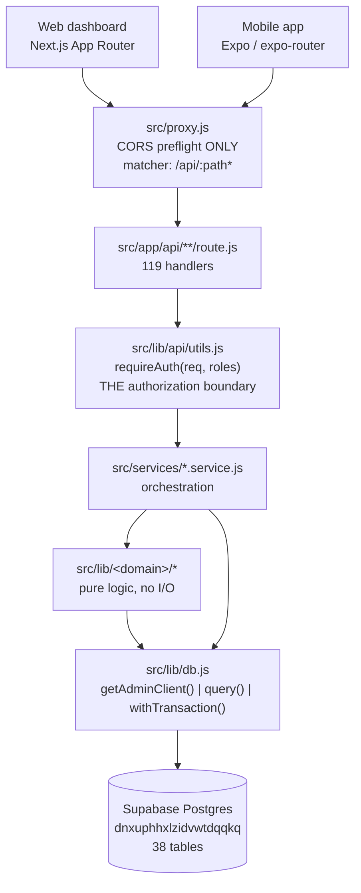

# Architecture

## Request path — CONFIRMED



## Layer responsibilities — CONFIRMED

| Layer | Path | Rule |
|---|---|---|
| Proxy | `src/proxy.js` | CORS only. **No auth here.** |
| Routes | `src/app/api/**/route.js` | Authorize, validate, delegate |
| Services | `src/services/*.service.js` | Orchestration + DB access |
| Domain | `src/lib/<domain>/*` | Pure, no I/O, unit-testable |
| Data | `src/lib/db.js` | The only place connections are made |

## Critical fact 1: there is no `middleware.js` — CONFIRMED

Next 16 renamed middleware to **`proxy.js`**, exporting `proxy()` not `middleware()`.

```js
// src/proxy.js — the entire auth-relevant content
export function proxy(request) {
  if (request.method === "OPTIONS") { /* CORS headers */ }
  return NextResponse.next();
}
export const config = { matcher: "/api/:path*" };
```

**It performs no authentication.** `SYSTEM.md` still references `src/middleware.js` in three places. This is exactly the trap `AGENTS.md` warns about: *"This is NOT the Next.js you know."*

See [[Framework Version Drift]].

## Critical fact 2: two `proxy.js` files, one dead — CONFIRMED

| File | Size | Status |
|---|---|---|
| `src/proxy.js` | 594 B | **Active** — CORS only |
| `proxy.js` (root) | 1989 B | **Dead** — `@supabase/ssr` + `supabase.auth.getUser()` → redirect to `/login` |

The root file implies Supabase Auth guards every route. It does not — auth is NextAuth against `employees.password_hash`. See [[BUG Root proxy.js Is Dead Code]].

## Critical fact 3: dual database access — CONFIRMED

`src/lib/db.js` exposes two paths, **both privileged**:

1. `getAdminClient()` — Supabase client with the **service role key** → bypasses RLS by design
2. `getPool()` / `query()` / `withTransaction()` — raw `pg` Pool as **database owner** → also bypasses RLS

Neither ever establishes an end-user Postgres identity. Therefore **RLS can never be the boundary**. Stated explicitly at `supabase/migrations/002_rls_policies.sql:1-12`.

See [[ADR-004 Dual Database Access]] · [[Why RLS Is Not A Boundary]].

### Why `withTransaction` exists — CONFIRMED

From the docstring at `src/lib/db.js:56-72`:

> `query()` checks a connection out per call, so two statements from it can land on different clients and cannot share a transaction. Anything that must be all-or-nothing needs this instead — notably reassigning a driver's vehicle, where the old pairing has to close and the new one open atomically or the `uq_dva_active_*` partial unique indexes reject the pair mid-flight.

A genuinely instructive comment. See [[Connection Pooling vs Transactions]].

## The `services/` naming collision — CONFIRMED

`src/services/` holds **two unrelated kinds of module** under one name:

| Kind | Example | What it is |
|---|---|---|
| Server domain service | `reservation-lifecycle.service.js` | Real orchestration, DB writes, transactions |
| Client fetch wrapper | `fuel.service.js` (33 lines) | Thin `apiFetch` calls from the browser |

INFERRED: a comprehension hazard. The folder name promises one thing and delivers two. Check the imports before assuming which kind you're reading.

## Pure core, imperative shell — CONFIRMED

`src/lib/<domain>/` modules are dependency-free and take injected `now` for determinism:

- `scheduling/` — `priority.js`, `conflicts.js`, 3 state machines, `calendar.js`
- `ai/` — `rule-engine.js`, `pair-scoring.js`, `predictive-maintenance.js`
- `uvvrp/` — `policy.js`
- `integration/` — `contracts.js`, `status-map.js`
- `vehicles/` — `odometer.js`

This is why 15 test files exist without a database. See [[Pure Core Imperative Shell]].

## Related

[[System Overview]] · [[Frontend]] · [[Backend]] · [[Authentication]] · [[Data Flow]] · [[Codebase Map]] · [[Technology Stack]]
