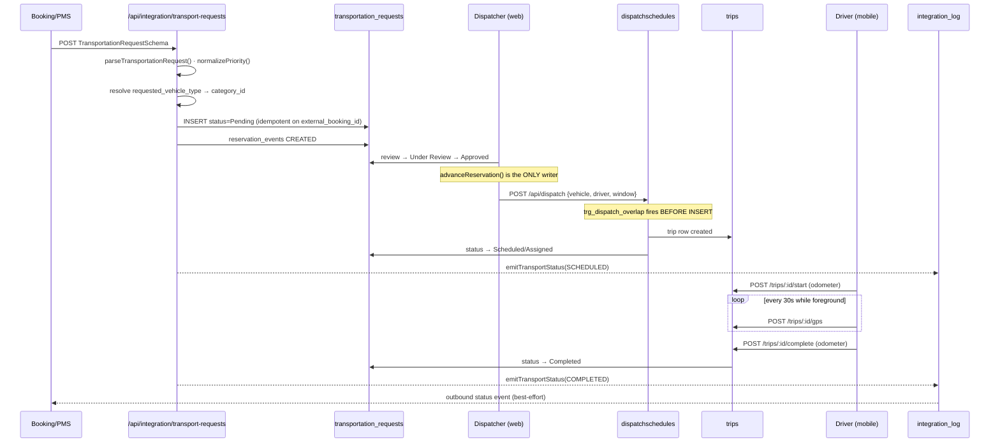
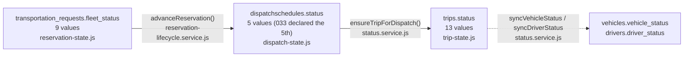

# Data Flow

The end-to-end path a single guest request takes. Each box names the **real file**.

## The main line — CONFIRMED

## Where each piece of state lives — CONFIRMED

| Stage | Table | Written by |
|---|---|---|
| Request | `transportation_requests` (15 rows) | integration routes, then `advanceReservation` |
| Audit trail of the request | `reservation_events` (69 rows) | `reservation-lifecycle.service.js` |
| Resource booking | `dispatchschedules` (2 rows) | `/api/dispatch` |
| Execution | `trips` (2 rows) | trip routes |
| Live position | `trips` GPS columns | mobile every 30 s |
| Driver↔vehicle pairing | `driver_vehicle_assignments` | `withTransaction` |
| Outbound record | `integration_log` (149 rows) | `emitTransportStatus` |
| Everything security-relevant | `audit_logs` (226 rows) | `writeAudit()` |

## Three status vocabularies move in parallel — CONFIRMED

A single request has **three** simultaneous statuses:

They are **not** the same machine. Each has its own writer, and the coupling is
explicit calls rather than triggers — this is the single most confusing thing in
the codebase.

> **Corrected 2026-08-11.** This diagram used to name
> `syncDispatchReservation()` in `src/lib/scheduling/sync.js` as the thing keeping
> the statuses in sync. **That file has never existed** — `git log --all` and
> `find` both return nothing for it. The two real sync helpers live in
> `src/services/status.service.js`, and `syncDispatchReservation` itself was
> deleted in Phase 3 item 11 because it keyed on `reservation_id`, which was
> always NULL. See [[Mistakes I Made]] for why a plausible-looking path went
> unchecked for so long.

See [[Reservation State Machine]] · [[Dispatch State Machine]] · [[Trip State Machine]].

## Where the flow breaks today — CONFIRMED

| Break | Effect |
|---|---|
| Outbound gateway is a mock that throws | nothing reaches Booking — [[System Boundaries]] |

That is the whole list as of 2026-08-11, and it is the only one on it because the
gateway needs a `BOOKING_GATEWAY` credential rather than a code change.
→ [[Environment Setup]]

**Closed since this note was written:**

| Was breaking | Closed by |
|---|---|
| `/api/trips/[id]/start` line 67 threw undefined `AuthError` | import added, Phase 1 — [[BUG AuthError Not Imported]] |
| `'Pending Reassignment'` accepted by the DB, rejected by `dispatch-state.js` | migration 033 + an explicit `INTERRUPT` set, Phase 2 — [[BUG Pending Reassignment Not In State Machine]] |
| Sync helpers keyed on `reservation_id`; live rows use `request_id`, so the branch never fired | the helper, its 5 call sites and the table were **deleted** in Phase 3, migration 036 — [[DEBT vehiclereservations vs transportation_requests]] |
| The two ingest doors wrote 13 vs 19 columns — a pulled request landed with no category, estimate, reservation number or timeline | one shared `ingestRequest()` in `src/lib/integration/ingest.js`, Phase 3 — [[DEBT Ingest Paths Diverge]] |

## Auth is a separate flow

Neither `proxy.js` nor any layout guards the API. **Each of the 113 route handlers calls `requireAuth()` itself.** See [[Authentication]].

## Related

[[Architecture]] · [[System Boundaries]] · [[Request Lifecycle]] · [[Where Is This]] · [[Reservations]] · [[Dispatch]] · [[Trips]]
