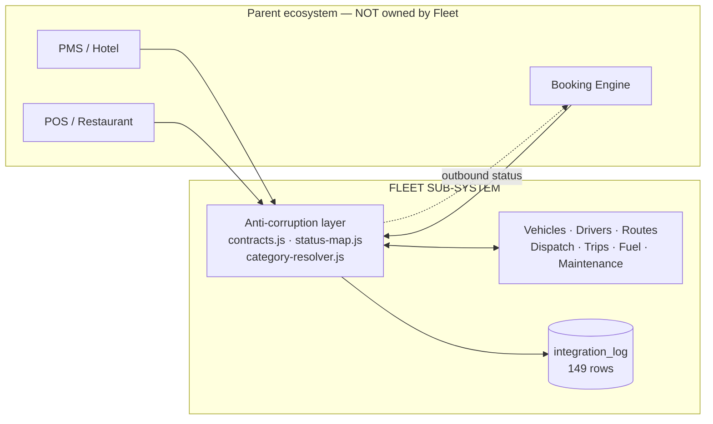

# System Boundaries

## Fleet is a sub-system — CONFIRMED

## Data ownership — CONFIRMED (`docs/architecture/sub-system-integration.md`)

| Domain | Owner | Fleet's action |
|---|---|---|
| Guests, rooms, bookings, billing | **Parent** | Reference by `external_booking_id` — never mutate |
| Vehicles, drivers, routes, trips, fuel, maintenance | **Fleet** | Full CRUD |

Fleet caches guest/booking fields **read-only**.

## The contract is code — CONFIRMED

`src/lib/integration/contracts.js` holds Zod schemas that *are* the API contract:

- `TransportationRequestSchema` — inbound
- `TransportStatusEventSchema` — outbound

From the file header:

> *"The mock gateway produces data validated against these; the real HTTP gateway will validate against the same schemas — so mock and production are guaranteed structurally identical."*

## Three translations at the boundary — CONFIRMED

### 1. Priority vocabulary
Booking says `"Normal"`; Fleet's `chk_transport_priority` only permits `Urgent/High/Medium/Low`. `normalizePriority()` translates, and:

> *"anything unrecognized degrades to Medium rather than throwing, so a vocabulary drift on Booking's side can never block ingest."*

**Availability chosen over strictness.** See [[ADR-002 Anti-Corruption Layer]].

### 2. Status vocabulary collapse
`status-map.js` maps Fleet's 9 internal states → 7 external ones:

| Fleet | External |
|---|---|
| Pending, Under Review | `RECEIVED` |
| Approved | `ACCEPTED` |
| Rejected | `REJECTED` |
| Scheduled, Assigned | `SCHEDULED` |
| In Progress | `IN_TRANSIT` |
| Completed | `COMPLETED` |
| Cancelled | `CANCELLED` |

> *"so we can evolve Fleet internals without breaking the Booking contract."*

Unknown statuses fall back to `RECEIVED` — a Fleet-internal string can never leak across the boundary.

### 3. Vehicle type resolution
`requested_vehicle_type` is **free text by design**:

> *"Booking does not know Fleet's category ids and must never send one, so the string is what crosses the boundary and Fleet resolves it to one of its own `vehiclecategories` at ingest. The raw string is then kept verbatim as the record of what was actually asked for, even when it resolves to nothing."*

Keeping the unresolved original is the mature choice — the request survives a failed lookup.

## Inbound: two paths that are NOT equivalent — CONFIRMED

| | PULL `/api/integration/pull` | PUSH `/api/integration/transport-requests` |
|---|---|---|
| Trigger | polls the gateway | webhook from Booking |
| Auth | — | service token **or** user session |
| Idempotency on `external_booking_id` | ❌ | ✅ returns 200 `idempotent: true` |
| Resolves `requested_category_id` | ❌ | ✅ |
| Assigns `reservation_number` | ❌ | ✅ |
| Writes `CREATED` timeline event | ❌ | ✅ |

**The same payload produces a different-quality row depending on entry path.** See [[DEBT Ingest Paths Diverge]].

## Outbound is best-effort — CONFIRMED

`emitTransportStatus()` writes an `integration_log` row as `pending`, calls the gateway, marks `processed` or `failed`. **A Booking failure never rolls back the Fleet transition.**

Correct for availability. It means `integration_log` (149 rows) is the reconciliation record of record.

## Current connectivity — CONFIRMED

`getBookingGateway()` returns a **mock** unless `BOOKING_GATEWAY=http`. `HttpBookingGateway` **throws `"not connected yet"`**. `BOOKING_GATEWAY` is absent from `.env`.

**Nothing real is on the other side of this boundary today.** The contract, translations, and audit trail are all built and ready.

## Related

[[Anti-Corruption Layer]] · [[ADR-002 Anti-Corruption Layer]] · [[Reservations]] · [[integration_log]] · [[Request Lifecycle]]
