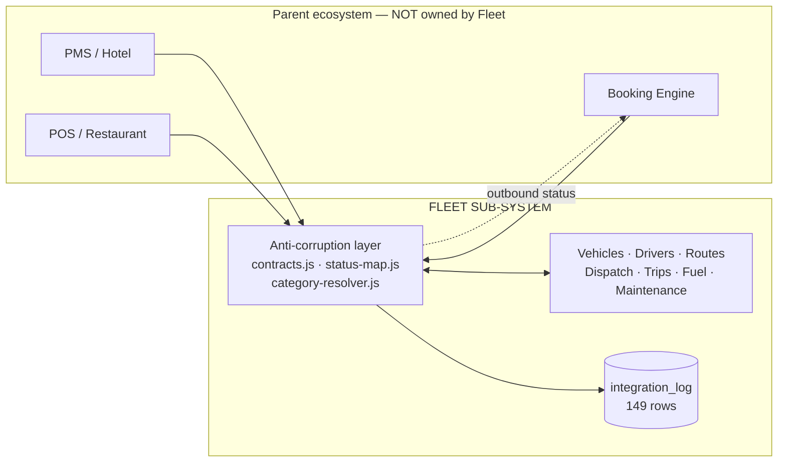

# System Boundaries

## Fleet is a sub-system — CONFIRMED

```mermaid
flowchart LR
    subgraph Parent["Parent ecosystem — NOT owned by Fleet"]
        PMS[PMS / Hotel]
        POS[POS / Restaurant]
        BE[Booking Engine]
    end
    subgraph Fleet["FLEET SUB-SYSTEM"]
        ACL["Anti-corruption layer<br/>contracts.js · status-map.js<br/>category-resolver.js"]
        Core["Vehicles · Drivers · Routes<br/>Dispatch · Trips · Fuel · Maintenance"]
        Log[(integration_log<br/>149 rows)]
    end
    PMS --> ACL
    POS --> ACL
    BE --> ACL
    ACL <--> Core
    ACL --> Log
    ACL -.outbound status.-> BE
```

## Data ownership — CONFIRMED (`docs/architecture/sub-system-integration.md`)

| Domain | Owner | Fleet's action |
|---|---|---|
| Guests, rooms, bookings, billing | **Parent** | Reference by `external_booking_id` — never mutate |
| Vehicles, drivers, routes, trips, fuel, maintenance | **Fleet** | Full CRUD |

Fleet caches guest/booking fields **read-only**.

## The contract is code — CONFIRMED

`src/lib/integration/contracts.js` holds Zod schemas that *are* the API contract:

- `TransportationRequestSchema` — inbound
- `TransportStatusEventSchema` — outbound

From the file header:

> *"The mock gateway produces data validated against these; the real HTTP gateway will validate against the same schemas — so mock and production are guaranteed structurally identical."*

## Three translations at the boundary — CONFIRMED

### 1. Priority vocabulary
Booking says `"Normal"`; Fleet's `chk_transport_priority` only permits `Urgent/High/Medium/Low`. `normalizePriority()` translates, and:

> *"anything unrecognized degrades to Medium rather than throwing, so a vocabulary drift on Booking's side can never block ingest."*

**Availability chosen over strictness.** See [[ADR-002 Anti-Corruption Layer]].

### 2. Status vocabulary collapse
`status-map.js` maps Fleet's 9 internal states → 7 external ones:

| Fleet | External |
|---|---|
| Pending, Under Review | `RECEIVED` |
| Approved | `ACCEPTED` |
| Rejected | `REJECTED` |
| Scheduled, Assigned | `SCHEDULED` |
| In Progress | `IN_TRANSIT` |
| Completed | `COMPLETED` |
| Cancelled | `CANCELLED` |

> *"so we can evolve Fleet internals without breaking the Booking contract."*

Unknown statuses fall back to `RECEIVED` — a Fleet-internal string can never leak across the boundary.

### 3. Vehicle type resolution
`requested_vehicle_type` is **free text by design**:

> *"Booking does not know Fleet's category ids and must never send one, so the string is what crosses the boundary and Fleet resolves it to one of its own `vehiclecategories` at ingest. The raw string is then kept verbatim as the record of what was actually asked for, even when it resolves to nothing."*

Keeping the unresolved original is the mature choice — the request survives a failed lookup.

## Inbound: two paths that are NOT equivalent — CONFIRMED

| | PULL `/api/integration/pull` | PUSH `/api/integration/transport-requests` |
|---|---|---|
| Trigger | polls the gateway | webhook from Booking |
| Auth | — | service token **or** user session |
| Idempotency on `external_booking_id` | ❌ | ✅ returns 200 `idempotent: true` |
| Resolves `requested_category_id` | ❌ | ✅ |
| Assigns `reservation_number` | ❌ | ✅ |
| Writes `CREATED` timeline event | ❌ | ✅ |

**The same payload produces a different-quality row depending on entry path.** See [[DEBT Ingest Paths Diverge]].

## Outbound is best-effort — CONFIRMED

`emitTransportStatus()` writes an `integration_log` row as `pending`, calls the gateway, marks `processed` or `failed`. **A Booking failure never rolls back the Fleet transition.**

Correct for availability. It means `integration_log` (149 rows) is the reconciliation record of record.

## Current connectivity — CONFIRMED

`getBookingGateway()` returns a **mock** unless `BOOKING_GATEWAY=http`. `HttpBookingGateway` **throws `"not connected yet"`**. `BOOKING_GATEWAY` is absent from `.env`.

**Nothing real is on the other side of this boundary today.** The contract, translations, and audit trail are all built and ready.

## Related

[[Anti-Corruption Layer]] · [[ADR-002 Anti-Corruption Layer]] · [[Reservations]] · [[integration_log]] · [[Request Lifecycle]]

## Supply delivery integration audit — 2026-10-07 (plan only)

The post-defense source audit found no cargo/shipment manifest or proof-of-delivery implementation in the checked-in source, mobile app, migrations or schema dump. The existing Booking contract is guest/passenger-shaped and the default Booking gateway is a mock; it is not an SCM adapter.

Recommended boundary: SCM owns approval, catalog, stock and inventory posting; FleetOps receives an approved immutable manifest snapshot, validates physical fit and availability, operates the dispatch/trip and records transport evidence; Receiving/SCM owns accepted quantities. Use a bounded shipment domain attached to the shared dispatch resource slot and trip, preserving passenger request and trip behavior. Arrival/GPS/trip completion never posts stock.

This was initially a repository-source audit; the later bounded implementation is documented below. External SCM/HR contracts remain unavailable. See docs/plans/supply-chain-fleet-integration-plan.md for evidence, options, schema/security gates, acceptance matrix and phased work.

Migration 148 adds the private `supply_dispatch_allocations` bridge and deferred database invariants for typed cargo dispatches. It requires a cargo dispatch to be paired with an allocation at commit and ties an assigned allocation to the current manifest revision, while keeping passenger request ownership separate. No application assignment route writes this relation; `POST /api/dispatch` continues to reject cargo. The migration does not add SCM connectivity, receipt authority or inventory writes.
## Supply delivery foundation follow-up - 2026-10-07

Implemented a bounded foundation in migration 144 and the `/supply-deliveries` page: private shipment and revision snapshots, a measured cargo profile, sandbox-only approved-request ingest, and deterministic load checks. SCM import requires the explicit sandbox flag, a `sandbox:` source identity, an admin session, and a non-production environment. No real SCM or HR contract was available.

The page does not create or reserve dispatches, create trips, or project cargo work to the driver app. Pickup/loading evidence, POD, receiver identity/quantities, SCM acknowledgement, and stock posting are not implemented. Trip completion and GPS remain separate from receipt. See [[supply_delivery_foundation]] and docs/plans/supply-chain-fleet-integration-plan.md for the exact limits and next P0 work.

## HR leave ownership boundary — target, 2026-10-07

The intended ownership is HR-managed leave lifecycle with a minimal read-only operational status projection in FleetOps. This is a user-directed target boundary; no HR leave contract, endpoint, credential, or connection is approved or present. FleetOps continues to use its existing local leave workflow until an HR-owned source or handoff is operational and a controlled cutover is accepted. Fleet-owned weekly driver work schedules are a separate domain unless changed by a later decision.

The pre-integration plan at `docs/plans/hr-leave-availability-readiness-plan.md` records the provisional boundary, open HR decisions, synthetic examples, and cutover gates. `src/services/driver-leave-availability.service.js` isolates the existing local leave read for scheduling consumers; it does not connect to HR or change availability behavior. No database or permission changes were made.

## Supply typed shared-dispatch groundwork - 2026-10-07

A read-only live query found 37 active dispatch rows (30 `Completed`, 7 `Scheduled`); all had a request ID. Migration 147 adds `dispatchschedules.service_type`, backfills request-linked legacy rows as `PASSENGER`, leaves historical requestless rows NULL, and defaults future rows to `PASSENGER`. The general `POST /api/dispatch` stamps passenger work and returns 409 for an explicit `SUPPLY_DELIVERY` request. The passenger request-assignment path also explicitly creates/updates passenger dispatches. No supply allocation or cargo dispatch path exists yet.

The complete source audit found two dispatch creation paths and confirmed that future cargo rows will share the existing overlap guard. The base `vehicles` row has passenger seating and license fields; verified cargo ratings are separate in `vehicle_cargo_profiles`. Fleet Utilization, Driver Performance and Trip Performance now exclude typed supply trips while retaining legacy NULL history. Pickup punctuality remains passenger-specific; fuel/cost/financial reports remain fleet-wide. Cargo KPIs and partitioning of remaining driver/mobile surfaces are required before any cargo dispatch is enabled. Migration 147 changed the classification of request-linked rows but inserted no dispatches or trips.

After contract validation, semantic rejections are stored in the inbox when the source event identity is unused. Parsed JSON that fails the Zod contract and event-ID, sequence, request or business conflicts that cannot occupy a unique inbox identity are stored in `supply_integration_attempts` with only a SHA-256 payload hash, sandbox-scoped identifiers, a fixed rejection code/status, employee ID and timestamp. Rejected bodies and invalid field values are not stored. Exact replays of inbox rejections return the saved conflict. Syntactically malformed JSON still receives a 400 response without an attempt row.

The load evaluator applies FleetOps' existing non-dispatchable vehicle status rule and requires a verifier, verification timestamp, reference and valid future expiry; missing or invalid verification data blocks the load check. A current `In Use` status remains time-dependent and does not by itself block a future load check; shared schedule availability is still not part of this evaluation.

Migration 145 adds admin-only sandbox site mapping. An admin maps each imported source organization/site ID to an active, non-retired Fleet location with a stored address and valid coordinates. The API does not geocode SCM text or infer a point. This only resolves location identity; it does not compute route distance/time or make a shipment assignable. `supply_site_mappings` is private, RLS-enabled, sandbox-constrained and revoked from `anon`/`authenticated`.

## Supply sandbox rejected-attempt ledger - 2026-10-07

Migration 146 adds private `supply_integration_attempts` so parsed events that fail Zod validation and conflicts that cannot occupy a unique inbox identity remain auditable. The importer stores a SHA-256 payload hash, sandbox-scoped identifiers when valid, a fixed rejection code/status, the authenticated employee and timestamp; rejected bodies and invalid field values are not stored. Syntactically malformed JSON remains a 400 without an attempt row. Schema-contract review confirms RLS enabled with no anon policy, and anon probing received HTTP 401 / SQLSTATE 42501. This improves sandbox-import auditability only; it does not create partner authentication or production SCM connectivity.

## Supply Deliveries current internal scope - 2026-10-07

The existing sandbox module provides admin-only synthetic event import, shipment listing, sandbox-site mapping to Fleet locations, cargo-profile editing, and measurement-only load-fit checks. There is no SCM/HR connection, cargo assignment writer, driver job projection, receipt workflow, or inventory writer. Future owner contracts gate those later capabilities; they are not prerequisites for maintaining the current internal sandbox module. Client state guards individual load-fit results against shipment/vehicle selection and source-query changes, fleet comparisons against shipment selection and source-query changes, and preserves cargo-profile drafts across refetches. Admin refresh reloads site mappings and Fleet locations alongside shipments and cargo profiles. Mapping coordinates are shown only when both values are present and geographically valid; an active mapping is shown unavailable if its Fleet location is inactive or lacks a usable address or coordinates. No dispatch/resource rule or database behavior changed in this pass.
