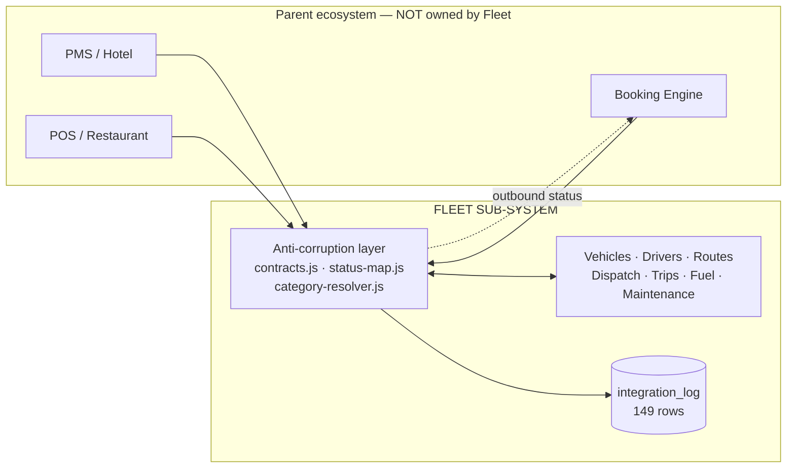

# System Boundaries

## Task 1 update snapshot validation — 2026-10-07

The shared envelope normalizer now validates v2 `update` requests using the same complete typed snapshot contract as `create`; it no longer discards corrections as `request: null`. Authenticated source and envelope request ID override nested identity claims. Passenger/cargo checks, normalized dates/priority, canonical code format and bounded review-only proposals apply. Partial patches are not accepted. This validates a message only: it does not store a revision or authorize a Fleet transition.

Both entry routes remain create-only. Valid updates/cancels still receive the existing unsupported-revision response (push 409; pull skipped/rejected with `SOURCE_REVISION_UNSUPPORTED`). Invalid updates now receive push 400; pull treats them as malformed items, increments skipped only, and continues. No request, dispatch, trip, endpoint or history changes. Cancel behavior is unchanged. Durable revision/event storage and committed-trip dispatcher review remain outstanding. **User decision, 2026-10-07:** hold a newer revision until missing earlier revisions arrive; do not silently skip them. Durable enforcement/reconciliation is not implemented yet.

Verification: contract RED observed 10 expected failures; route RED observed three expected failures after restoring the old normalizer; focused GREEN passed 10 files / 122 tests. Full suite passed 313 files / 3,739 tests; strict lint passed. No schema, live database, connector or deployment changes. Migration drafts 150/151/152 remain unapplied.

**Migration reconciliation checkpoint (2026-10-07):** Current unapplied passenger/cargo drafts are150/151/152, renamed from provisional144/145/146 after an authorized ledger check showed recorded supply history through149. Executable SQL is unchanged. Recorded-origin supply work uses a separate SCM sandbox shipment/inbox/allocation path; it is not a live PMS/POS adapter. Naming is reconciled, but broader shared dispatch/load/runtime and live-schema acceptance remain held. Earlier dated statements below keep their historical numbers. See [[FleetOps Migration Reconciliation 2026-10-07]].

## Fleet is a sub-system — CONFIRMED

```mermaid
flowchart LR
    subgraph Parent["Parent ecosystem — NOT owned by Fleet"]
        PMS[PMS / Hotel]
        POS[POS / Restaurant]
        BE[Booking Engine]
    end
    subgraph Fleet["FLEET SUB-SYSTEM"]
        ACL["Anti-corruption layer<br/>contracts.js · status-map.js<br/>category-resolver.js"]
        Core["Vehicles · Drivers · Routes<br/>Dispatch · Trips · Fuel · Maintenance"]
        Log[(integration_log<br/>149 rows)]
    end
    PMS --> ACL
    POS --> ACL
    BE --> ACL
    ACL <--> Core
    ACL --> Log
    ACL -.outbound status.-> BE
```

## Data ownership — CONFIRMED (`docs/architecture/sub-system-integration.md`)

| Domain | Owner | Fleet's action |
|---|---|---|
| Guests, rooms, bookings, billing | **Parent** | Reference by `external_booking_id` — never mutate |
| Vehicles, drivers, routes, trips, fuel, maintenance | **Fleet** | Full CRUD |

Fleet caches guest/booking fields **read-only**.

## The contract is code — CONFIRMED

`src/lib/integration/contracts.js` holds Zod schemas that *are* the API contract:

- `TransportationRequestSchema` — inbound
- `TransportStatusEventSchema` — outbound

From the file header:

> *"The mock gateway produces data validated against these; the real HTTP gateway will validate against the same schemas — so mock and production are guaranteed structurally identical."*

## Three translations at the boundary — CONFIRMED

### 1. Priority vocabulary
Booking says `"Normal"`; Fleet's `chk_transport_priority` only permits `Urgent/High/Medium/Low`. `normalizePriority()` translates, and:

> *"anything unrecognized degrades to Medium rather than throwing, so a vocabulary drift on Booking's side can never block ingest."*

**Availability chosen over strictness.** See [[ADR-002 Anti-Corruption Layer]].

### 2. Status vocabulary collapse
`status-map.js` maps Fleet's 9 internal states → 7 external ones:

| Fleet | External |
|---|---|
| Pending, Under Review | `RECEIVED` |
| Approved | `ACCEPTED` |
| Rejected | `REJECTED` |
| Scheduled, Assigned | `SCHEDULED` |
| In Progress | `IN_TRANSIT` |
| Completed | `COMPLETED` |
| Cancelled | `CANCELLED` |

> *"so we can evolve Fleet internals without breaking the Booking contract."*

Unknown statuses fall back to `RECEIVED` — a Fleet-internal string can never leak across the boundary.

### 3. Vehicle type resolution
`requested_vehicle_type` is **free text by design**:

> *"Booking does not know Fleet's category ids and must never send one, so the string is what crosses the boundary and Fleet resolves it to one of its own `vehiclecategories` at ingest. The raw string is then kept verbatim as the record of what was actually asked for, even when it resolves to nothing."*

Keeping the unresolved original is the mature choice — the request survives a failed lookup.

## Inbound: two paths that are NOT equivalent — CONFIRMED

| | PULL `/api/integration/pull` | PUSH `/api/integration/transport-requests` |
|---|---|---|
| Trigger | polls the gateway | webhook from Booking |
| Auth | — | service token **or** user session |
| Idempotency on `external_booking_id` | ❌ | ✅ returns 200 `idempotent: true` |
| Resolves `requested_category_id` | ❌ | ✅ |
| Assigns `reservation_number` | ❌ | ✅ |
| Writes `CREATED` timeline event | ❌ | ✅ |

**The same payload produces a different-quality row depending on entry path.** See [[DEBT Ingest Paths Diverge]].

## Outbound is best-effort — CONFIRMED

`emitTransportStatus()` writes an `integration_log` row as `pending`, calls the gateway, marks `processed` or `failed`. **A Booking failure never rolls back the Fleet transition.**

Correct for availability. It means `integration_log` (149 rows) is the reconciliation record of record.

## Current connectivity — CONFIRMED

`getBookingGateway()` returns a **mock** unless `BOOKING_GATEWAY=http`. `HttpBookingGateway` **throws `"not connected yet"`**. `BOOKING_GATEWAY` is absent from `.env`.

**Nothing real is on the other side of this boundary today.** The contract, translations, and audit trail are all built and ready.

## Prepared Task 1 source-identity slice (2026-10-05; migration NOT applied)

The webhook binds the incoming source to a distinct Authorization Bearer credential (`BOOKING_WEBHOOK_SECRET` → PMS, `POS_WEBHOOK_SECRET` → POS); a supplied `source_system` is ignored. Query-string service tokens no longer authenticate this POST. Staff session injection is PMS-only. `normalizeInboundEnvelope(raw, authenticatedSource)` supports PMS legacy v1 (maps `external_booking_id` without rewriting archived IDs) and v2 create (`contract_version: 2`, `external_request_id`, positive `external_revision: 1`, `event_id`, `event_kind: "create"`, `request`). Unsupported versions return 400; the push route rejects v2 revisions beyond first, updates, and cancels with 409 without modifying Fleet. Pull is distinct: recognized v2 `update`, `cancel`, and non-initial revision rows are classified `SOURCE_REVISION_UNSUPPORTED`, increment aggregate `skipped`/`rejected`/`rejectionCodes`, return HTTP 200, and do not block later rows. Other malformed envelopes are skipped-only. Update/cancel semantics and partner ACK behavior are not implemented.

Migration `144_transport_source_identity.sql` (provisional number; renumbered after another 143 was applied on main) is a **draft, unapplied**: backfills `external_request_id`, removes the global unique booking-ID constraint, and enforces **full** `(source_system, external_request_id)` uniqueness across active and soft-deleted rows. The identity is never reusable: ingest selects even tombstoned rows and returns HTTP 409 rather than pretending their replay succeeded, including when a tombstone wins the insert race. Ingest uses this unique key with `ON CONFLICT DO NOTHING` and selects the winner after a race. A v2 create stores a normalized-fields SHA-256 fingerprint; exact replays are idempotent, changed creates return 409, and a historical v1 row without a trustworthy fingerprint also returns 409 until reconciled rather than falsely ACKing it. V2 IDs remain opaque exact bytes, including surrounding whitespace. If PMS and POS secrets are configured identically, webhook auth fails closed. **Deploy migration before deploying this code**; no live schema or RLS verification was performed. Until migrated, new inserts reference a nonexistent column. Outbound mock status events include source, request, and stable-per-retry event ID in logged JSON; real source-routed gateways and partner ACK/retry behavior remain unimplemented. Legacy `external_booking_id` remains for downstream compatibility. Both doors use `ingestRequest`. Pull binds each non-mock row and v2 envelope to the gateway's trusted `sourceIdentity`; a missing identity is skipped fail-closed. Only the in-process mock may use fixture-declared source values. The configured HTTP adapter carries a trusted PMS identity but remains unconnected; a real POS pull still requires a separately authenticated POS adapter, and no PMS/POS connectivity exists.

## Prepared Task 2 typed request boundary (2026-10-05; NOT deployed)

V2 validates a canonical service code plus explicit Passenger/Cargo kind at the authenticated source boundary (PMS/POS actor still derives only from the Bearer credential). Legacy PMS v1 remains passenger transport with its missing-count default; POS v1 still rejects. A supplied numeric v1 `service_type_id` is resolved by ID without new catalog `status` or `deleted_at` filters, preserving legacy activity/deletion compatibility. A missing numeric ID rejects as `SERVICE_UNAVAILABLE` before estimation or insert, and a known row with an incompatible non-null `default_load_type` is still rejected. V2 rejects zero/missing passenger count, unknown/mismatched code, missing/nonrepresentable cargo weight, or missing description rather than inferring cargo from vehicle free text. Shared ingest resolves the active internal service ID and fingerprints all new fields; changed-weight replay conflicts rather than returning the original row, while an unchanged replay can still succeed after catalog retirement and a new request on an inactive service cannot. The provider estimate runs outside database locks; the final transaction then re-resolves `service_code` and each supplied location code with `FOR SHARE`, holds the resolved rows through request insertion, and inserts using those locked IDs. Only after a new insert succeeds does route-cache persistence use the precomputed estimate on that same transaction adapter; exact replay, validation or locked-revalidation failure, and conflicts with no inserted row do not write. Partial non-Manual route fields use `COALESCE` plus an atomic incomplete-row predicate, filling missing values without overwriting existing ones. Mock pull may present typed PMS/POS fixtures; non-mock pull binds rows to the adapter's trusted source identity and skips when missing. The current HTTP gateway has a PMS principal but is unconnected; it is not a POS adapter. Pull continues after expected source rejections and returns aggregate codes; infrastructure failures still abort, and rejection-only batches have console visibility, not a durable reconciliation ledger. No partner update/cancel semantics have been enabled. SQL drafts 144/145 and candidate 146 remain unapplied; all require concurrent Hotel/POS reconciliation and explicit approval before any apply. Cargo dispatch/mobile/vehicle capacity eligibility remain later steps; do not ship Task 2 intake alone into operations.

## Prepared Task 2 location-code/proposal boundary (2026-10-06; migration NOT applied)

The same v2 create may carry opaque Fleet location UUID codes and bounded partner address/coordinate proposals; the original sender pickup/drop-off labels remain unchanged. Only an active Fleet row selected by code becomes a request FK. Unknown code returns stable 422 `LOCATION_CODE_UNKNOWN`; inactive/retired code returns 409 `LOCATION_CODE_RETIRED`. Replay/tombstone/fingerprint checks precede lookup so replay is not invalidated by later retirement. Partner proposals are stored in dedicated request JSONB columns only, excluded from integration-log payloads and create/pull responses, and are projected by existing reservation-read GETs only. Proposal data is never copied to `locations` or used for routing. Task 3 now estimates only when both code-resolved IDs still identify active, non-retired Fleet rows with complete finite in-range coordinates; it may use a route estimate or TomTom only after that gate. Otherwise, estimates remain null and no route is read or created. Persisted v2 rows are detected by non-null `external_create_fingerprint`, and pre-insert v2 estimation explicitly requests strict mode. PMS v1 behavior is unchanged. Pull aggregates expected location-code rejections and continues the batch. Task 3 did not apply SQL; `npm run db:status` could not verify the live ledger because `.env.local` and `.env` are unavailable. Dispatcher mapping remains future work.

Review round 1/5 also corrected the live-trip-monitor reader: its request SELECT and estimate object now retain the fingerprint, canonical IDs, and proposal fields. Thus the persisted-v2 marker still selects strict estimation in live-trip monitoring, and missing IDs remain unknown rather than entering the v1 fallback. Focused monitor and resolver tests passed 51/51 after the targeted RED; touched ESLint and `git diff --check` passed. Migration 146 is unapplied and remains a pre-merge release hold; no live SQL was run.

## Task 5 — v2 location-intake boundary and release holds (2026-10-06)

The approved v2 create contract accepts opaque server-generated Fleet location UUID codes and bounded partner endpoint proposals while preserving the sender's original text labels. Only an active Fleet-managed location resolved by code can populate a request location FK; codes are immutable through APIs and unique across retired as well as active rows. V2 never matches endpoint names or creates a location from text.

Proposals persist in dedicated request JSONB fields for review only. They never create Fleet locations or directly provide route coordinates. They remain review-only until a future explicit human dispatcher mapping action links a request to an active Fleet location; routing can then use that canonical Fleet point, not the proposal. The mapping UI/action is not implemented. `canonical_registry` means provenance from an active Fleet-managed point with a complete finite in-range coordinate pair, not independent verification. An unlinked proposal is `pending_review`; other unresolved endpoints are `unknown`.

V2 estimates, mobile, geofence, feasibility/reposition, and recommendation paths are strict: they use only explicit request-linked active Fleet points, without name, gazetteer, dynamic hotel, seed, route endpoint, or proposal-coordinate fallback. Incomplete links/coordinates remain null/unknown. Legacy PMS v1 behavior remains compatible. V2 is create-only; source revision and update/cancel semantics are incomplete.

Release hold: candidate migration 146 remains unapplied, and migrations 144/145/146 must be reconciled with concurrent main Hotel/POS work before merge. Applying any migration requires explicit approval. No live schema/RLS verification is claimed, and this does not imply PMS/POS connectivity.

## Task 1 outbound routing and positive ACK checkpoint — 2026-10-07

`emitTransportStatus` and `reconcileFailedDeliveries` now select a gateway from the stored source identity. PMS uses `BOOKING_GATEWAY` / `BOOKING_API_URL` / `BOOKING_API_KEY`; POS uses separate `POS_GATEWAY` / `POS_API_URL` / `POS_API_KEY`. Each defaults independently to mock. Unknown sources or gateway modes fail closed without falling back to PMS. Source-bound mock adapters also reject events from another source. The no-argument pull gateway retains its existing mixed-source mock fixtures. HTTP adapters remain explicit unconnected stubs; this is not proof of PMS/POS delivery.

An outbound event must have a durable integration-log ID before sending. Only an explicit `delivered: true` acknowledgement can mark it processed. Negative/missing acknowledgements stay failed and retryable. A failed/ID-less insert prevents sending and the UI reports that it was not queued. Retry validates the stored payload and source, preserving the original event ID, request identity, status and occurrence time rather than rebuilding from the current request. Known historical `fleet` log rows with absent/PMS payload source route as PMS; missing or conflicting identity remains failed. Newly emitted legacy requests record PMS consistently in the log and payload. Archived source identifiers remain valid contract data but cannot be delivered until a source adapter is registered.

This closes a bounded outbound part of main-plan Task 1, not Task 1 or Release A as a whole. Durable inbound event deduplication, request revisions/updates/cancellations, committed-trip review and partner reconciliation remain outstanding. Existing retry endpoints are unchanged; no scheduler or connector was activated. New schema work requires the plan's migration-ledger numbering checkpoint, which is not authorized in this session. Migrations 144/145/146 remain unapplied and held for concurrent-main reconciliation. Verification: regression RED observed, then focused integration/pull/transition checks passed 12 files / 131 tests; final regression evidence is recorded in the implementation checkpoint note and SYSTEM.md.

## Related

[[Anti-Corruption Layer]] · [[ADR-002 Anti-Corruption Layer]] · [[Reservations]] · [[integration_log]] · [[Request Lifecycle]]

## Supply delivery integration audit — 2026-10-07 (plan only)

The post-defense source audit found no cargo/shipment manifest or proof-of-delivery implementation in the checked-in source, mobile app, migrations or schema dump. The existing Booking contract is guest/passenger-shaped and the default Booking gateway is a mock; it is not an SCM adapter.

Recommended boundary: SCM owns approval, catalog, stock and inventory posting; FleetOps receives an approved immutable manifest snapshot, validates physical fit and availability, operates the dispatch/trip and records transport evidence; Receiving/SCM owns accepted quantities. Use a bounded shipment domain attached to the shared dispatch resource slot and trip, preserving passenger request and trip behavior. Arrival/GPS/trip completion never posts stock.

This was initially a repository-source audit; the later bounded implementation is documented below. External SCM/HR contracts remain unavailable. See docs/plans/supply-chain-fleet-integration-plan.md for evidence, options, schema/security gates, acceptance matrix and phased work.

Migration 148 adds the private `supply_dispatch_allocations` bridge and deferred database invariants for typed cargo dispatches. It requires a cargo dispatch to be paired with an allocation at commit and ties an assigned allocation to the current manifest revision, while keeping passenger request ownership separate. No application assignment route writes this relation; `POST /api/dispatch` continues to reject cargo. The migration does not add SCM connectivity, receipt authority or inventory writes.
## Supply delivery foundation follow-up - 2026-10-07

Implemented a bounded foundation in migration 144 and the `/supply-deliveries` page: private shipment and revision snapshots, a measured cargo profile, sandbox-only approved-request ingest, and deterministic load checks. SCM import requires the explicit sandbox flag, a `sandbox:` source identity, an admin session, and a non-production environment. No real SCM or HR contract was available.

The page does not create or reserve dispatches, create trips, or project cargo work to the driver app. Pickup/loading evidence, POD, receiver identity/quantities, SCM acknowledgement, and stock posting are not implemented. Trip completion and GPS remain separate from receipt. See [[supply_delivery_foundation]] and docs/plans/supply-chain-fleet-integration-plan.md for the exact limits and next P0 work.

## HR leave ownership boundary — target, 2026-10-07

The intended ownership is HR-managed leave lifecycle with a minimal read-only operational status projection in FleetOps. This is a user-directed target boundary; no HR leave contract, endpoint, credential, or connection is approved or present. FleetOps continues to use its existing local leave workflow until an HR-owned source or handoff is operational and a controlled cutover is accepted. Fleet-owned weekly driver work schedules are a separate domain unless changed by a later decision.

The pre-integration plan at `docs/plans/hr-leave-availability-readiness-plan.md` records the provisional boundary, open HR decisions, synthetic examples, and cutover gates. `src/services/driver-leave-availability.service.js` isolates the existing local leave read for scheduling consumers; it does not connect to HR or change availability behavior. No database or permission changes were made.

## Supply typed shared-dispatch groundwork - 2026-10-07

A read-only live query found 37 active dispatch rows (30 `Completed`, 7 `Scheduled`); all had a request ID. Migration 147 adds `dispatchschedules.service_type`, backfills request-linked legacy rows as `PASSENGER`, leaves historical requestless rows NULL, and defaults future rows to `PASSENGER`. The general `POST /api/dispatch` stamps passenger work and returns 409 for an explicit `SUPPLY_DELIVERY` request. The passenger request-assignment path also explicitly creates/updates passenger dispatches. No supply allocation or cargo dispatch path exists yet.

The complete source audit found two dispatch creation paths and confirmed that future cargo rows will share the existing overlap guard. The base `vehicles` row has passenger seating and license fields; verified cargo ratings are separate in `vehicle_cargo_profiles`. Fleet Utilization, Driver Performance and Trip Performance now exclude typed supply trips while retaining legacy NULL history. Pickup punctuality remains passenger-specific; fuel/cost/financial reports remain fleet-wide. Cargo KPIs and partitioning of remaining driver/mobile surfaces are required before any cargo dispatch is enabled. Migration 147 changed the classification of request-linked rows but inserted no dispatches or trips.

After contract validation, semantic rejections are stored in the inbox when the source event identity is unused. Parsed JSON that fails the Zod contract and event-ID, sequence, request or business conflicts that cannot occupy a unique inbox identity are stored in `supply_integration_attempts` with only a SHA-256 payload hash, sandbox-scoped identifiers, a fixed rejection code/status, employee ID and timestamp. Rejected bodies and invalid field values are not stored. Exact replays of inbox rejections return the saved conflict. Syntactically malformed JSON still receives a 400 response without an attempt row.

The load evaluator applies FleetOps' existing non-dispatchable vehicle status rule and requires a verifier, verification timestamp, reference and valid future expiry; missing or invalid verification data blocks the load check. A current `In Use` status remains time-dependent and does not by itself block a future load check; shared schedule availability is still not part of this evaluation.

Migration 145 adds admin-only sandbox site mapping. An admin maps each imported source organization/site ID to an active, non-retired Fleet location with a stored address and valid coordinates. The API does not geocode SCM text or infer a point. This only resolves location identity; it does not compute route distance/time or make a shipment assignable. `supply_site_mappings` is private, RLS-enabled, sandbox-constrained and revoked from `anon`/`authenticated`.

## Supply sandbox rejected-attempt ledger - 2026-10-07

Migration 146 adds private `supply_integration_attempts` so parsed events that fail Zod validation and conflicts that cannot occupy a unique inbox identity remain auditable. The importer stores a SHA-256 payload hash, sandbox-scoped identifiers when valid, a fixed rejection code/status, the authenticated employee and timestamp; rejected bodies and invalid field values are not stored. Syntactically malformed JSON remains a 400 without an attempt row. Schema-contract review confirms RLS enabled with no anon policy, and anon probing received HTTP 401 / SQLSTATE 42501. This improves sandbox-import auditability only; it does not create partner authentication or production SCM connectivity.

## Supply Deliveries current internal scope - 2026-10-07

The existing sandbox module provides admin-only synthetic event import, shipment listing, sandbox-site mapping to Fleet locations, cargo-profile editing, and measurement-only load-fit checks. There is no SCM/HR connection, cargo assignment writer, driver job projection, receipt workflow, or inventory writer. Future owner contracts gate those later capabilities; they are not prerequisites for maintaining the current internal sandbox module. Client state guards individual load-fit results against shipment/vehicle selection and source-query changes, fleet comparisons against shipment selection and source-query changes, and preserves cargo-profile drafts across refetches. Admin refresh reloads site mappings and Fleet locations alongside shipments and cargo profiles. Mapping coordinates are shown only when both values are present and geographically valid; an active mapping is shown unavailable if its Fleet location is inactive or lacks a usable address or coordinates. No dispatch/resource rule or database behavior changed in this pass.
