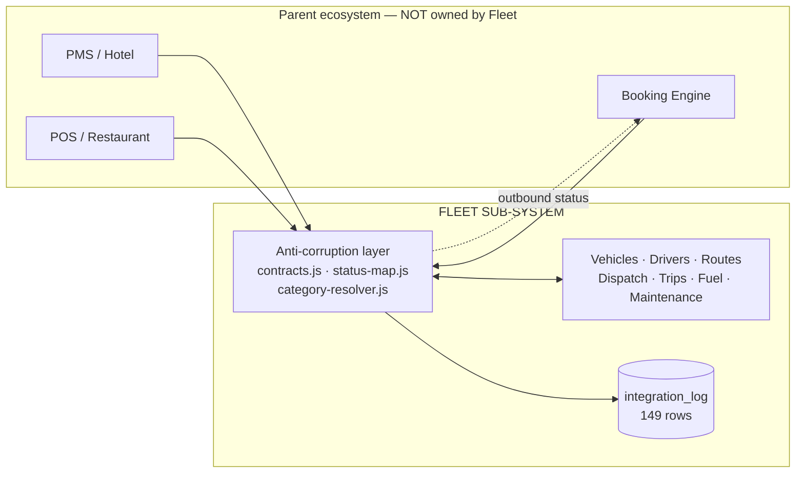

# System Boundaries

## Fleet is a sub-system — CONFIRMED

```mermaid
flowchart LR
    subgraph Parent["Parent ecosystem — NOT owned by Fleet"]
        PMS[PMS / Hotel]
        POS[POS / Restaurant]
        BE[Booking Engine]
    end
    subgraph Fleet["FLEET SUB-SYSTEM"]
        ACL["Anti-corruption layer<br/>contracts.js · status-map.js<br/>category-resolver.js"]
        Core["Vehicles · Drivers · Routes<br/>Dispatch · Trips · Fuel · Maintenance"]
        Log[(integration_log<br/>149 rows)]
    end
    PMS --> ACL
    POS --> ACL
    BE --> ACL
    ACL <--> Core
    ACL --> Log
    ACL -.outbound status.-> BE
```

## Data ownership — CONFIRMED (`docs/architecture/sub-system-integration.md`)

| Domain | Owner | Fleet's action |
|---|---|---|
| Guests, rooms, bookings, billing | **Parent** | Reference by `external_booking_id` — never mutate |
| Vehicles, drivers, routes, trips, fuel, maintenance | **Fleet** | Full CRUD |

Fleet caches guest/booking fields **read-only**.

## The contract is code — CONFIRMED

`src/lib/integration/contracts.js` holds Zod schemas that *are* the API contract:

- `TransportationRequestSchema` — inbound
- `TransportStatusEventSchema` — outbound

From the file header:

> *"The mock gateway produces data validated against these; the real HTTP gateway will validate against the same schemas — so mock and production are guaranteed structurally identical."*

## Three translations at the boundary — CONFIRMED

### 1. Priority vocabulary
Booking says `"Normal"`; Fleet's `chk_transport_priority` only permits `Urgent/High/Medium/Low`. `normalizePriority()` translates, and:

> *"anything unrecognized degrades to Medium rather than throwing, so a vocabulary drift on Booking's side can never block ingest."*

**Availability chosen over strictness.** See [[ADR-002 Anti-Corruption Layer]].

### 2. Status vocabulary collapse
`status-map.js` maps Fleet's 9 internal states → 7 external ones:

| Fleet | External |
|---|---|
| Pending, Under Review | `RECEIVED` |
| Approved | `ACCEPTED` |
| Rejected | `REJECTED` |
| Scheduled, Assigned | `SCHEDULED` |
| In Progress | `IN_TRANSIT` |
| Completed | `COMPLETED` |
| Cancelled | `CANCELLED` |

> *"so we can evolve Fleet internals without breaking the Booking contract."*

Unknown statuses fall back to `RECEIVED` — a Fleet-internal string can never leak across the boundary.

### 3. Vehicle type resolution
`requested_vehicle_type` is **free text by design**:

> *"Booking does not know Fleet's category ids and must never send one, so the string is what crosses the boundary and Fleet resolves it to one of its own `vehiclecategories` at ingest. The raw string is then kept verbatim as the record of what was actually asked for, even when it resolves to nothing."*

Keeping the unresolved original is the mature choice — the request survives a failed lookup.

## Inbound: two paths that are NOT equivalent — CONFIRMED

| | PULL `/api/integration/pull` | PUSH `/api/integration/transport-requests` |
|---|---|---|
| Trigger | polls the gateway | webhook from Booking |
| Auth | — | service token **or** user session |
| Idempotency on `external_booking_id` | ❌ | ✅ returns 200 `idempotent: true` |
| Resolves `requested_category_id` | ❌ | ✅ |
| Assigns `reservation_number` | ❌ | ✅ |
| Writes `CREATED` timeline event | ❌ | ✅ |

**The same payload produces a different-quality row depending on entry path.** See [[DEBT Ingest Paths Diverge]].

## Outbound is best-effort — CONFIRMED

`emitTransportStatus()` writes an `integration_log` row as `pending`, calls the gateway, marks `processed` or `failed`. **A Booking failure never rolls back the Fleet transition.**

Correct for availability. It means `integration_log` (149 rows) is the reconciliation record of record.

## Current connectivity — CONFIRMED

`getBookingGateway()` returns a **mock** unless `BOOKING_GATEWAY=http`. `HttpBookingGateway` **throws `"not connected yet"`**. `BOOKING_GATEWAY` is absent from `.env`.

**Nothing real is on the other side of this boundary today.** The contract, translations, and audit trail are all built and ready.

## Prepared Task 1 source-identity slice (2026-10-05; migration NOT applied)

The webhook binds the incoming source to a distinct Authorization Bearer credential (`BOOKING_WEBHOOK_SECRET` → PMS, `POS_WEBHOOK_SECRET` → POS); a supplied `source_system` is ignored. Query-string service tokens no longer authenticate this POST. Staff session injection is PMS-only. `normalizeInboundEnvelope(raw, authenticatedSource)` supports PMS legacy v1 (maps `external_booking_id` without rewriting archived IDs) and v2 create (`contract_version: 2`, `external_request_id`, positive `external_revision: 1`, `event_id`, `event_kind: "create"`, `request`). Unsupported versions return 400; the push route rejects v2 revisions beyond first, updates, and cancels with 409 without modifying Fleet. Pull is distinct: recognized v2 `update`, `cancel`, and non-initial revision rows are classified `SOURCE_REVISION_UNSUPPORTED`, increment aggregate `skipped`/`rejected`/`rejectionCodes`, return HTTP 200, and do not block later rows. Other malformed envelopes are skipped-only. Update/cancel semantics and partner ACK behavior are not implemented.

Migration `144_transport_source_identity.sql` (provisional number; renumbered after another 143 was applied on main) is a **draft, unapplied**: backfills `external_request_id`, removes the global unique booking-ID constraint, and enforces **full** `(source_system, external_request_id)` uniqueness across active and soft-deleted rows. The identity is never reusable: ingest selects even tombstoned rows and returns HTTP 409 rather than pretending their replay succeeded, including when a tombstone wins the insert race. Ingest uses this unique key with `ON CONFLICT DO NOTHING` and selects the winner after a race. A v2 create stores a normalized-fields SHA-256 fingerprint; exact replays are idempotent, changed creates return 409, and a historical v1 row without a trustworthy fingerprint also returns 409 until reconciled rather than falsely ACKing it. V2 IDs remain opaque exact bytes, including surrounding whitespace. If PMS and POS secrets are configured identically, webhook auth fails closed. **Deploy migration before deploying this code**; no live schema or RLS verification was performed. Until migrated, new inserts reference a nonexistent column. Outbound mock status events include source, request, and stable-per-retry event ID in logged JSON; real source-routed gateways and partner ACK/retry behavior remain unimplemented. Legacy `external_booking_id` remains for downstream compatibility. Both doors use `ingestRequest`. Pull binds each non-mock row and v2 envelope to the gateway's trusted `sourceIdentity`; a missing identity is skipped fail-closed. Only the in-process mock may use fixture-declared source values. The configured HTTP adapter carries a trusted PMS identity but remains unconnected; a real POS pull still requires a separately authenticated POS adapter, and no PMS/POS connectivity exists.

## Prepared Task 2 typed request boundary (2026-10-05; NOT deployed)

V2 validates a canonical service code plus explicit Passenger/Cargo kind at the authenticated source boundary (PMS/POS actor still derives only from the Bearer credential). Legacy PMS v1 remains passenger transport with its missing-count default; POS v1 still rejects. A supplied numeric v1 `service_type_id` is resolved by ID without new catalog `status` or `deleted_at` filters, preserving legacy activity/deletion compatibility. A missing numeric ID rejects as `SERVICE_UNAVAILABLE` before estimation or insert, and a known row with an incompatible non-null `default_load_type` is still rejected. V2 rejects zero/missing passenger count, unknown/mismatched code, missing/nonrepresentable cargo weight, or missing description rather than inferring cargo from vehicle free text. Shared ingest resolves the active internal service ID and fingerprints all new fields; changed-weight replay conflicts rather than returning the original row, while an unchanged replay can still succeed after catalog retirement and a new request on an inactive service cannot. After provider estimation, the final transaction re-resolves each supplied service/location code with `FOR SHARE` and inserts using those locked IDs; provider work is outside locks, which remain through the insert. Route-cache persistence uses the precomputed estimate on that same transaction adapter only after a new insert succeeds; exact replay, validation/lock failure, and no-insert conflicts do not write, and partial non-Manual route fields are filled without replacing existing values behind an atomic incomplete-row predicate. Mock pull may present typed PMS/POS fixtures; non-mock pull binds rows to the adapter's trusted source identity and skips when missing. The current HTTP gateway has a PMS principal but is unconnected; it is not a POS adapter. Pull continues after expected source rejections and returns aggregate codes; infrastructure failures still abort, and rejection-only batches have console visibility, not a durable reconciliation ledger. No partner update/cancel semantics have been enabled. SQL drafts 144/145 and candidate 146 remain unapplied; all require concurrent Hotel/POS reconciliation and explicit approval before any apply. Cargo dispatch/mobile/vehicle capacity eligibility remain later steps; do not ship Task 2 intake alone into operations.

## Prepared Task 2 location-code/proposal boundary (2026-10-06; migration NOT applied)

The same v2 create may carry opaque Fleet location UUID codes and bounded partner address/coordinate proposals; the original sender pickup/drop-off labels remain unchanged. Only an active Fleet row selected by code becomes a request FK. Unknown code returns stable 422 `LOCATION_CODE_UNKNOWN`; inactive/retired code returns 409 `LOCATION_CODE_RETIRED`. Replay/tombstone/fingerprint checks precede lookup so replay is not invalidated by later retirement. Partner proposals are stored in dedicated request JSONB columns only, excluded from integration-log payloads and create/pull responses, and are projected by existing reservation-read GETs only. Proposal data is never copied to `locations` or used for routing. Task 3 now estimates only when both code-resolved IDs still identify active, non-retired Fleet rows with complete finite in-range coordinates; it may use a route estimate or TomTom only after that gate. Otherwise, estimates remain null and no route is read or created. Persisted v2 rows are detected by non-null `external_create_fingerprint`, and pre-insert v2 estimation explicitly requests strict mode. PMS v1 behavior is unchanged. Pull aggregates expected location-code rejections and continues the batch. Task 3 did not apply SQL; `npm run db:status` could not verify the live ledger because `.env.local` and `.env` are unavailable. Dispatcher mapping remains future work.

Review round 1/5 also corrected the live-trip-monitor reader: its request SELECT and estimate object now retain the fingerprint, canonical IDs, and proposal fields. Thus the persisted-v2 marker still selects strict estimation in live-trip monitoring, and missing IDs remain unknown rather than entering the v1 fallback. Focused monitor and resolver tests passed 51/51 after the targeted RED; touched ESLint and `git diff --check` passed. Migration 146 is unapplied and remains a pre-merge release hold; no live SQL was run.

## Task 5 — v2 location-intake boundary and release holds (2026-10-06)

The approved v2 create contract accepts opaque server-generated Fleet location UUID codes and bounded partner endpoint proposals while preserving the sender's original text labels. Only an active Fleet-managed location resolved by code can populate a request location FK; codes are immutable through APIs and unique across retired as well as active rows. V2 never matches endpoint names or creates a location from text.

Proposals persist in dedicated request JSONB fields for review only. They never create Fleet locations or directly provide route coordinates. They remain review-only until a future explicit human dispatcher mapping action links a request to an active Fleet location; routing can then use that canonical Fleet point, not the proposal. The mapping UI/action is not implemented. `canonical_registry` means provenance from an active Fleet-managed point with a complete finite in-range coordinate pair, not independent verification. An unlinked proposal is `pending_review`; other unresolved endpoints are `unknown`.

V2 estimates, mobile, geofence, feasibility/reposition, and recommendation paths are strict: they use only explicit request-linked active Fleet points, without name, gazetteer, dynamic hotel, seed, route endpoint, or proposal-coordinate fallback. Incomplete links/coordinates remain null/unknown. Legacy PMS v1 behavior remains compatible. V2 is create-only; source revision and update/cancel semantics are incomplete.

Release hold: candidate migration 146 remains unapplied, and migrations 144/145/146 must be reconciled with concurrent main Hotel/POS work before merge. Applying any migration requires explicit approval. No live schema/RLS verification is claimed, and this does not imply PMS/POS connectivity.

## Related

[[Anti-Corruption Layer]] · [[ADR-002 Anti-Corruption Layer]] · [[Reservations]] · [[integration_log]] · [[Request Lifecycle]]
