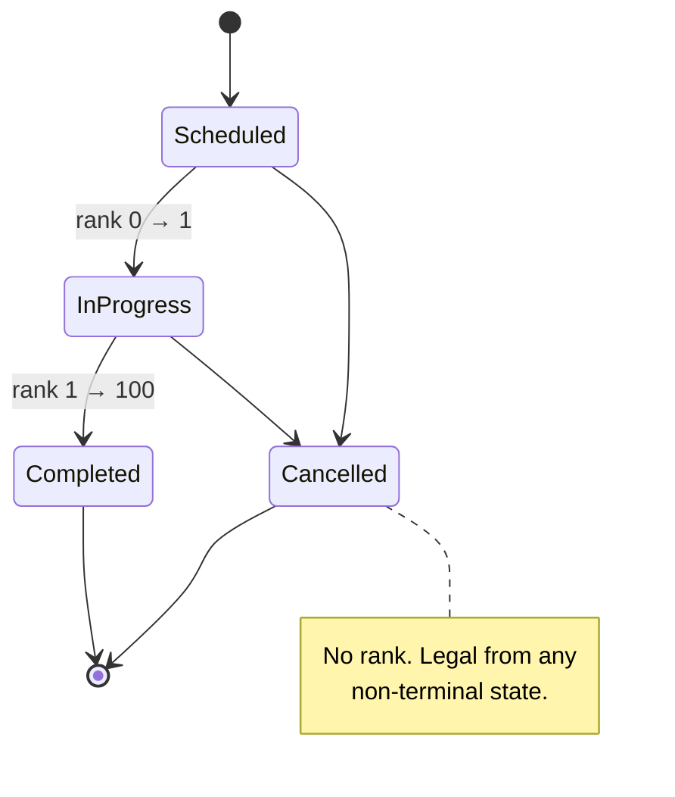

# Dispatch State Machine

(Historically rank-based like the old [[Trip State Machine]], before that grew into an adjacency map). The dispatch machine uses a rank-based ladder with an **explicit terminal set** and a special case for cancellation.

## The code — CONFIRMED

```js
const RANK = { Scheduled: 0, "In Progress": 1, Completed: 100 };
const TERMINAL = new Set(["Completed", "Cancelled"]);

export function isValidDispatchStatus(status) {
  return status === "Cancelled" || RANK[status] !== undefined;
}
```

Three ranks, four accepted statuses. `Cancelled` has **no rank** — it's legal from anywhere, which a monotonic ranking cannot express, so it's handled outside the ranking entirely. That's the right call: cancellation is not a step forward in a workflow.

## Diagram



`TERMINAL` closes the gap a rank alone leaves: without it, `Completed → Completed` would pass the monotonic test.

## The drift — CONFIRMED

The live constraint and the code disagree:

| Source | Accepted statuses | Count |
|---|---|---|
| `chk_dispatch_status` on the **live DB** | Scheduled, In Progress, Completed, Cancelled, **Pending Reassignment** | 5 |
| `012_dispatch_status_check.sql` | Scheduled, In Progress, Completed, Cancelled | 4 |
| `isValidDispatchStatus()` | Scheduled, In Progress, Completed, Cancelled | 4 |

The database will store `'Pending Reassignment'`; the application rejects it as invalid. No migration in the repo creates the 5-value version — it was applied out of band.

**This is why the rule is: check `pg_constraint`, not the migration file.** A migration file records an intention that was true when written. → [[BUG Pending Reassignment Not In State Machine]] · [[DEBT Schema Drift From Migrations]]

## The other guard on this table

Status validity is one of two protections on `dispatchschedules`. The other is `trg_dispatch_overlap`, which prevents the same vehicle or driver being booked into overlapping windows. Different concern, different mechanism. → [[TOCTOU And Advisory Locks]] · [[ADR-006 Dual Double-Booking Guard]]

## Live data — CONFIRMED

`dispatchschedules` has **2 rows**. → [[dispatchschedules]]

## The cheapest useful test in the codebase

Read `chk_dispatch_status` from `information_schema` and assert it matches `RANK` + `Cancelled`. That single test catches exactly the drift above, and would have caught it the day it happened. → [[Testing]]

## Related

[[Dispatch]] · [[State Machines]] · [[Trip State Machine]] · [[Reservation State Machine]] · [[dispatchschedules]] · [[BUG Pending Reassignment Not In State Machine]]
