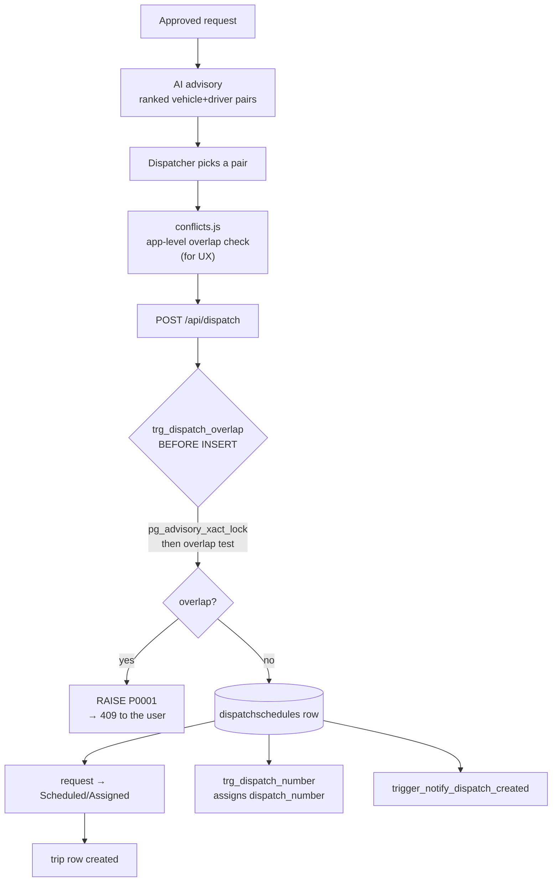

# Feature: Dispatch

## What it does

Turns an approved request into a **committed booking of resources**: this vehicle, this driver, this window.

## Why it exists

This is the point where the system makes a promise it can't take back. Two dispatchers acting at the same moment must not book the same van, and a vehicle with expired registration or a number-coding restriction must not go out. Everything here is about making that promise safely.

## How it works

## The two-guard design — the thing to understand

| Guard | Where | Purpose |
|---|---|---|
| `src/lib/scheduling/conflicts.js` | Application | **UX** — show the conflict before the user submits |
| `trg_dispatch_overlap` | Database trigger | **Correctness** — nothing gets through, ever |

The app check is racy by nature (check-then-act across HTTP requests). The trigger takes `pg_advisory_xact_lock` **before** testing, so concurrent inserts serialise. Both are correct for their job; neither replaces the other. → [[ADR-006 Dual Double-Booking Guard]] · [[TOCTOU And Advisory Locks]]

## Files involved

| File | Role |
|---|---|
| `src/app/api/dispatch/route.js` | The endpoint |
| `src/lib/scheduling/conflicts.js` | Pure overlap detection |
| `src/lib/scheduling/dispatch-state.js` | RANK-based state machine |
| `src/services/status.service.js` | Status propagation + `ensureTripForDispatch()` |
| `src/lib/ai/pair-scoring.js` | Advisory ranking → [[AI Advisory]] |
| `src/lib/uvvrp/policy.js` | Number-coding check → [[UVVRP Number Coding]] |
| `supabase/migrations/023_dispatch_overlap_guard.sql` | The real guard |

## Database tables used

[[dispatchschedules]] (2) · [[transportation_requests]] · [[trips]] · [[driver_vehicle_assignments]] · `vehicles` · `drivers`

## Edge cases

- **Concurrent identical dispatch** → second one gets `P0001` → 409. Correct.
- **Missing `scheduled_arrival`** → `COALESCE` treats it as a zero-length window; back-to-back bookings at the same instant do **not** conflict (half-open interval).
- **`'Pending Reassignment'`** → the DB accepts it, the state machine rejects it: dead-end row. → [[BUG Pending Reassignment Not In State Machine]]
- **Cancelled dispatch overlapping a live one** → allowed, and that's why a trigger was used instead of `EXCLUDE USING gist`.

## Reassigning a dispatch — CONFIRMED 2026-08-15

`PUT /api/dispatch/[id]` (edit page + `dispatch-edit-dialog.jsx`) now enforces the same
**designated-driver rule** as the create path and the reservation assign gate
(`validatePairAvailability` in `recommendation.service.js`): a driver may only be put
in a car they are the custodian of, or that a substitute explicitly covers for the
departure date. A direct API caller gets the same 409 the UI gets.

The reassign dialog now offers **both** kinds of pair:
- **Custodial pairs** (017) — vehicle + its normal driver, offered while that driver is on duty.
- **Substitute pairs** (032) — the same vehicles driven by the driver scheduled to cover the
  departure date, offered **only** when the custodian is not on duty (mirroring
  `resolveVehiclePairing`: a substitute stands in only while the custodian cannot drive).

The substitute offer is date-scoped to `scheduled_departure`, so a vehicle whose custodian
is away but has no coverage for that date stays withheld — a dispatcher records a substitute
schedule first, then reassigns.

### Continuity surface — CONFIRMED 2026-08-23

- The **dispatch detail page** (`/dispatch/[id]`) now has its own permission-gated
  (`dispatch:update`) **Reassign** button wired to `DispatchEditDialog mode:"assign"`,
  mirroring the board. Back button pushes `/dispatch` instead of `router.back()`, and the
  cancel dialog reuses the board's exact consequence wording ("the originating request keeps
  its own status — reassign or re-dispatch it from the queue").
- The dialog always offers the dispatch's **current pair** as an explicit option (badged
  "Current") even when availability/pairing filters would exclude it — the server
  re-validates the effective state on PATCH.
- A blocked reassignment is no longer toast-only: the dialog renders the error inline
  (`ConflictBlock` when a 409 body carries `conflicts[]`, a plain alert for the endpoint's
  usual string-only errors), and the board pins structured findings in a dismissible alert
  above the lanes (`lastReassignConflicts`). Note `PUT /api/dispatch/[id]` currently returns
  plain `{ error }` strings — no `conflicts[]` — so in practice the inline-alert branch runs.

## Schedule & leave now gate availability — CONFIRMED 2026-08-15

When a pickup window is given, a driver is additionally **blocked by their weekly
schedule and approved leave** (migration 049): approved leave covering the date,
no schedule row for that `day_of_week` (fail-closed), rest day, window outside
shift hours, or half-open break overlap → driver is not offered. The vehicle
follows its **effective driver** for the date (custodian, or the substitute the
schedule names via `ctx.pairings`) — a vehicle is withheld if that driver is
schedule-blocked. `conflicts.js` surfaces the same result as a
`DRIVER_UNAVAILABLE` finding before the user submits. The dispatch calendar
probe renders approved leave per-day and `work_schedules` on the calendar.

### Calendar UI refresh — 2026-08-23

The dispatch calendar page was redesigned (visual + interaction only; data
pipeline, overlap detection and lane math untouched): double-bezel control bar
with pill segmented controls, jump-to-date popover, keyboard shortcuts
(`←/→` step, `T` today, `D/W/M` views), always-visible conflict stat pill,
auto-scroll to the current hour, sticky day/lane headers inside per-view scroll
viewports, off-hours/weekend shading, event accent spines with Urgent/VIP dots
(`vip` passthrough added to `dispatchToEvent`), "+N more" jumps to Day view.
Motion is transform/opacity-only with reduced-motion fallbacks.
→ [[Driver Management]]

## Availability is decided by the window, not the status label — CONFIRMED 2026-08-15

`GET /api/vehicles/available` and `GET /api/drivers` (when `pickup_at`/`return_at` are given)
decide availability by **time-window overlap + license + coding/registration/insurance + the
designated-driver pairing + schedule/leave**, not by the coarse `vehicle_status` / `driver_status` labels.
A vehicle currently `In Use` (out on a trip now) is offered for a later window where it is
free; a driver labeled `On Trip` but free in the window is offered too. `Reserved` / `In Use`
are slot flags, so a windowed search includes them and the NOT EXISTS overlap answers the real
question.

Only true disqualifiers stay hard-blocked:

- Vehicle: `Under Maintenance` / `Decommissioned` / `Registration Expired`, expired
  registration/insurance, UVVRP number-coding, or no cleared driver (custodian `Suspended` /
  `On Leave` / `Off Duty` with no substitute for the date).
- Driver: `Suspended` / `On Leave` / `Off Duty` (ineligible to drive, `UNAVAILABLE_STATUSES`
  in `pair-scoring.js`), expired license, or an active window conflict.

Changes that made this consistent: `vehicles/available/route.js` includes `In Use` when a
window is given; `dispatch-edit-dialog.jsx` no longer fetches drivers
with `status: "Available"` but filters out `Suspended` / `On Leave` / `Off Duty` client-side
(their data is still window/license/pairing-checked by the endpoint). The `ai-assign-dialog`
manual override was removed 2026-08-18 — it now embeds the shared `AiRecommendationPanel`,
which renders the engine's eligible pair directly. This mirrors the AI engine, which already
ranked the whole roster and answered availability by schedule overlap.

## Resource Availability is pair-first — CONFIRMED 2026-09-04

`/dispatch/availability` previously showed separate Drivers | Vehicles status
tabs — point-in-time labels with no window, so `5 Available vehicles +
5 Available drivers` read as 5 dispatchable when the pairing rule might allow 2.
The page is pairs-only (`[ Dispatchable Pairs ]` tabs removed 2026-09-04 —
separate status lists re-proved misleading, so they were cut instead of kept
as secondary; individual lookups live on the Fleet/Driver pages), answering
"which actual vehicle + driver pairs can dispatch in this
window?"

- **Window is always explicit, never blank.** Default is the full day
  (`00:00 → 23:59 today`), labeled `Showing dispatchability for today (Sep 4)`
  — no times. The exact pickup/return picker sits behind an optional
  `Set exact window` toggle. "Available" without a time context was the
  original misleading state.
- **Same hard rules, no new eligibility.** `GET /api/dispatch/availability-pairs`
  reports hard eligibility per vehicle (capacity, operational status, travel
  docs/coding, custodial pairing via `resolveVehiclePairing`) plus every
  overlapping dispatch as `clashes[]` data — never a verdict. Classification
  happens board-side. Read-only; no migration.
- **Today mode = overview, exact-window mode = authoritative check.** Today:
  `Clear Schedule Today` (hard-ok, 0 trips) / `Has Trips Today` (hard-ok, 1+
  trips, upcoming-first sort, full trip chips) / `Blocked` (hard blocker wins
  over trips, always). Exact window: `Ready` / `Blocked`, overlap legitimately
  blocks. "Clear Schedule Today" wording + helper text keep it from reading as
  a dispatch guarantee.
- **Blocked cards carry trips as secondary, collapsed context.** `Blocked ·
  Needs Attention` badge + `
` warning (`N scheduled trips today — may
  be affected`, never "requires reassignment") expanding to per-trip chips, so
  a dispatcher sees affected trips (e.g. maintenance + 6 PM dispatch) without
  card clutter. Hard reason + primary action stay primary.
- **Blocked reasons are mandatory + actionable.** Each blocked pair carries the
  engine's reason string plus `action { label, href }`: no substitute →
  `/fleet/assignments?vehicle=X`; maintenance / docs / coding → respective
  record. Leave/schedule blocks have no override. Overlap in exact-mode links
  to `/dispatch`.
- **Individual tabs removed, not demoted.** Kept-as-secondary still presented
  status lists as an answer to "what can I dispatch?" — cut entirely.
  Registration/insurance and leave detail live on the Fleet/Driver pages.
- **Long lists paginated at 8/page** (Has-trips + Blocked). Page resets on
  window/filter change.
- **Request prefill via query params** (`request_number, passengers, category,
  requested_capacity, pickup_at, return_at`): shows which pairs fulfill one
  request in its window; `requested_capacity|passengers` becomes `min_capacity`.
  Header badge/description switch per mode (Today Overview vs exact window).
  Source: `src/app/api/dispatch/availability-pairs/route.js`,
  `src/components/dispatch/pair-availability-board.jsx`.

## What I learned

The half-open interval (`<` and `>`, not `<=`/`>=`) is the difference between "back-to-back bookings work" and "you can never schedule two trips in a row." One character each way. → [[Half Open Intervals]]

## Open questions

- Is `'Pending Reassignment'` a real product state? → [[BUG Pending Reassignment Not In State Machine]]
- With only 2 rows, has concurrent dispatch ever actually been tested? **TODO:** write a two-connection race test against the trigger.

## Related

[[Dispatch State Machine]] · [[Trips]] · [[AI Advisory]] · [[UVVRP Number Coding]] · [[Feature Index]]
