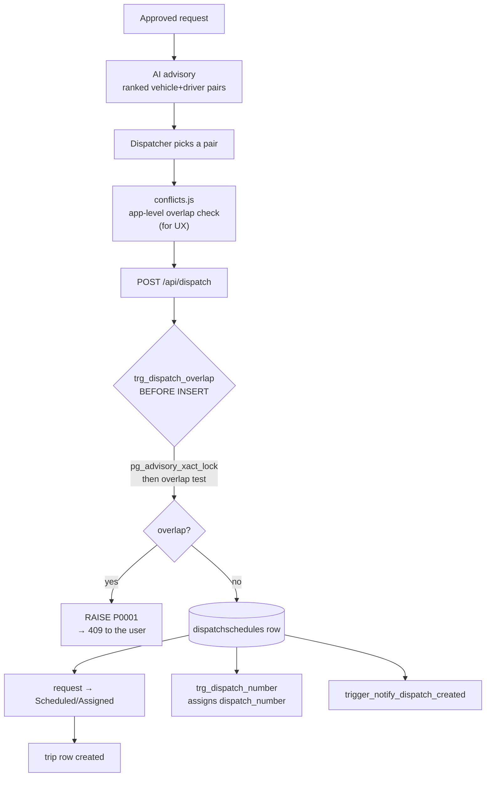

# Feature: Dispatch

## What it does

Turns an approved request into a **committed booking of resources**: this vehicle, this driver, this window.

## Why it exists

This is the point where the system makes a promise it can't take back. Two dispatchers acting at the same moment must not book the same van, and a vehicle with expired registration or a number-coding restriction must not go out. Everything here is about making that promise safely.

## How it works

## The two-guard design — the thing to understand

| Guard | Where | Purpose |
|---|---|---|
| `src/lib/scheduling/conflicts.js` | Application | **UX** — show the conflict before the user submits |
| `trg_dispatch_overlap` | Database trigger | **Correctness** — nothing gets through, ever |

The app check is racy by nature (check-then-act across HTTP requests). The trigger takes `pg_advisory_xact_lock` **before** testing, so concurrent inserts serialise. Both are correct for their job; neither replaces the other. → [[ADR-006 Dual Double-Booking Guard]] · [[TOCTOU And Advisory Locks]]

## Files involved

| File | Role |
|---|---|
| `src/app/api/dispatch/route.js` | The endpoint |
| `src/lib/scheduling/conflicts.js` | Pure overlap detection |
| `src/lib/scheduling/dispatch-state.js` | RANK-based state machine |
| `src/services/status.service.js` | Status propagation + `ensureTripForDispatch()` |
| `src/lib/ai/pair-scoring.js` | Advisory ranking → [[AI Advisory]] |
| `src/lib/uvvrp/policy.js` | Number-coding check → [[UVVRP Number Coding]] |
| `supabase/migrations/023_dispatch_overlap_guard.sql` | The real guard |

## Database tables used

[[dispatchschedules]] (2) · [[transportation_requests]] · [[trips]] · [[driver_vehicle_assignments]] · `vehicles` · `drivers`

## Edge cases

- **Concurrent identical dispatch** → second one gets `P0001` → 409. Correct.
- **Missing `scheduled_arrival`** → `COALESCE` treats it as a zero-length window; back-to-back bookings at the same instant do **not** conflict (half-open interval).
- **`'Pending Reassignment'`** → the DB accepts it, the state machine rejects it: dead-end row. → [[BUG Pending Reassignment Not In State Machine]]
- **Cancelled dispatch overlapping a live one** → allowed, and that's why a trigger was used instead of `EXCLUDE USING gist`.

## What I learned

The half-open interval (`<` and `>`, not `<=`/`>=`) is the difference between "back-to-back bookings work" and "you can never schedule two trips in a row." One character each way. → [[Half Open Intervals]]

## Open questions

- Is `'Pending Reassignment'` a real product state? → [[BUG Pending Reassignment Not In State Machine]]
- With only 2 rows, has concurrent dispatch ever actually been tested? **TODO:** write a two-connection race test against the trigger.

## Related

[[Dispatch State Machine]] · [[Trips]] · [[AI Advisory]] · [[UVVRP Number Coding]] · [[Feature Index]]
