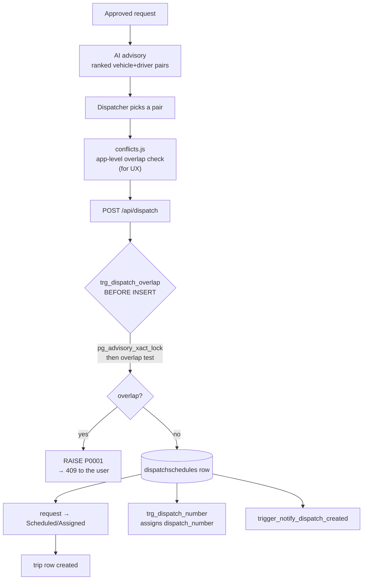

# Feature: Dispatch

## Task 5 verification follow-up — mock isolation (2026-10-06)

The order-dependent Dispatch Radar failure came from a prior test queuing a one-time `driverBlockReason` result while asserting the mock was not called; `vi.clearAllMocks()` cleared calls but left that result queued. The test `beforeEach` now resets only `driverBlockReason` and restores its default `null` return. Test-only isolation fix; runtime behavior is unchanged. Verification: Dispatch Radar 26/26; combined Task 4 reader suites 5 files, 86/86; touched ESLint passed. That 311-file / 3,661-test result is the pre-fix baseline; the coordinator's post-fix full-suite run passed 311 files and 3,686/3,686 tests.

## Final-review v2 estimate propagation — 2026-10-06

Dispatch recommendation preparation now uses strict resolver distance, duration, and source for persisted v2 requests exactly, including nulls, rather than falling back to stored request fields. Dispatch candidate service-end calculation likewise does not substitute a persisted v2 duration when its strict estimate is unknown; legacy v1 duration fallback remains. Current-pair feasibility reads v2 endpoints from explicit active request-linked Fleet rows and never text-resolves the partner labels.

Verification after the correction wave: the four focused reader suites passed 69/69 and touched-source ESLint passed. This is post-fix focused evidence only; the coordinator's post-fix full-suite run passed 311 files / 3,686 tests.

## Dispatch Radar v2 recommendation endpoints — review round 1/5 (2026-10-06)

The dispatch radar now resolves current-request and persisted-commitment route endpoints for v2 only from the explicit request location IDs. A point is usable only when the joined Fleet row matches that ID, is active and non-retired, and has a complete finite in-range coordinate pair. Missing, retired, mismatched, or invalid endpoints remain unknown; partner text is not sent through route/name resolution. Proposal presence contributes only the `pending_review` provenance label and proposal coordinates are never route inputs. The commitment query carries the fingerprint, both IDs, proposal-presence flags, and both linked Fleet rows. V1 and tentative legacy commitments retain their existing text fallback.

Verified: dispatch-radar RED against unchanged production (9 failed, 17 passed after adding invalid-coordinate and persisted-link cases), then 26/26 focused tests; the combined five Task 4 reader suites passed 86/86; touched ESLint and `git diff --check` passed. Evidence is mocked/static; no live database behavior is claimed.

Task 5 boundary: `canonical_registry` is provenance from an active Fleet-managed point with complete finite in-range coordinates, not independent verification. Partner proposals remain durable review-only request JSONB; they neither create a location nor supply recommendation/routing coordinates. A future human mapping action is required to associate a proposal with an active Fleet location, and the dispatcher mapping UI/action is not implemented. V2 recommendation legs remain null/unknown without a usable explicit request link; migration 146 remains unapplied and is subject to the shared 144/145/146 release hold.

## Duty clock is Manila-explicit, not server-local — 2026-10-02

`localDayOfWeek` / `localTimeOfDay` (`src/lib/scheduling/driver-schedule.js`) read the pickup instant with the server's local getters. Dev machines sit in GMT+8 so nothing looked wrong; a UTC runner reads a 5 PM Manila pickup as 9 AM and the noon break as 4 AM, silently moving shift containment, break overlap, weekday lookup and leave-day derivation by up to 8 hours. Both helpers now read Asia/Manila through Intl, `hasLeaveConflict` derives the pickup's Manila calendar day explicitly, and `day-eligibility.js` builds its day bounds as Manila-midnight instants. `driver-schedule.test.js` constructs Manila instants (`+08:00`) instead of server-local Dates and pins the RS-UZYD instant (07:09Z reads 15:09 Friday). Verified under both the local zone and `TZ=UTC`. `toCalendarDay` is deliberately untouched: pg `date` columns arrive as local-midnight Dates and its local-component read is correct for them. Residual: the noon break and 6 AM/10 PM edges still need the live test setup described in [[AI Advisory]].

## Temporal recommendation start revalidation - 2026-09-15

The reservation-backed trip-start route revalidates the committed driver/vehicle against current schedule, leave, maintenance, capacity, pairing and route/readiness evidence after the existing ownership, inspection and start-window gates. Its own dispatch/trip is excluded from conflicts. Fresh, accurate GPS must belong to that trip and pair; the start commit locks and rechecks the source revision and expiry before a compare-and-set status update. Changes require dispatcher review; no automatic reassignment occurs. Core tests and read-only live SQL passed; live operational/browser acceptance remains pending. See [[Temporal Dispatch Recommendation Implementation Plan]].

## What it does

Turns an approved request into a **committed booking of resources**: this vehicle, this driver, this window.

## License eligibility — 2026-09-27

The availability board and assignment-time `validatePairAvailability` use the same
license rule. Student Permits, missing or malformed details, unsupported types/classes,
expired licenses, absent staff review, missing vehicle class, and driver/vehicle class
mismatches block the pair with a reason. The expiry date remains eligible through the end of
its date in Asia/Manila. `vehicles.required_license_class` is explicitly selected from the
registration; it is not inferred from service category or passenger capacity. Existing
vehicles/drivers fail closed until reviewed. `override_reason` and manual review cannot bypass
license blockers. Custodial-pair and substitute-schedule writes use the same eligibility rule;
bounded substitute coverage cannot continue past the recorded expiry. The trip-start endpoint
runs a fresh check as well. Existing assignments remain and display their license reason until
staff corrects them. → [[Driver Management]] · [[Trips]]

**Default surface is `/dispatch/calendar` (2026-09-23):** the status-lane board at `/dispatch` is gone — the page now `redirect`s to the calendar. Sidebar, command palette, dashboard cards, detail back-links and availability deep-links all target `/dispatch/calendar`. `NAV_ROLES["/dispatch"]` remains as the **prefix gate** for the whole `/dispatch/*` subtree; removing it would open `/dispatch/calendar` and `/dispatch/[id]` to any authenticated role.

## Why it exists

This is the point where the system makes a promise it can't take back. Two dispatchers acting at the same moment must not book the same van, and a vehicle with expired registration or a number-coding restriction must not go out. Everything here is about making that promise safely.

## How it works

```mermaid
flowchart TD
    A[Approved request] --> B["AI advisory<br/>ranked vehicle+driver pairs"]
    B --> C["Dispatcher picks a pair"]
    C --> D["conflicts.js<br/>app-level overlap check<br/>(for UX)"]
    D --> E["POST /api/dispatch"]
    E --> F{"trg_dispatch_overlap<br/>BEFORE INSERT"}
    F -->|"pg_advisory_xact_lock<br/>then overlap test"| G{overlap?}
    G -->|yes| H["RAISE P0001<br/>→ 409 to the user"]
    G -->|no| I[("dispatchschedules row")]
    I --> J["request → Scheduled/Assigned"]
    J --> K["trip row created"]
    I --> L["trg_dispatch_number<br/>assigns dispatch_number"]
    I --> M["trigger_notify_dispatch_created"]
```

## The two-guard design — the thing to understand

| Guard | Where | Purpose |
|---|---|---|
| `src/lib/scheduling/conflicts.js` | Application | **UX** — show the conflict before the user submits |
| `trg_dispatch_overlap` | Database trigger | **Correctness** — nothing gets through, ever |

The app check is racy by nature (check-then-act across HTTP requests). The trigger takes `pg_advisory_xact_lock` **before** testing, so concurrent inserts serialise. Both are correct for their job; neither replaces the other. → [[ADR-006 Dual Double-Booking Guard]] · [[TOCTOU And Advisory Locks]]

## Files involved

| File | Role |
|---|---|
| `src/app/api/dispatch/route.js` | The endpoint |
| `src/lib/scheduling/conflicts.js` | Pure overlap detection |
| `src/lib/scheduling/dispatch-state.js` | RANK-based state machine |
| `src/services/status.service.js` | Status propagation + `ensureTripForDispatch()` |
| `src/lib/ai/pair-scoring.js` | Advisory ranking → [[AI Advisory]] |
| `src/lib/uvvrp/policy.js` | Number-coding check → [[UVVRP Number Coding]] |
| `supabase/migrations/023_dispatch_overlap_guard.sql` | The real guard |

## Database tables used

[[dispatchschedules]] (2) · [[transportation_requests]] · [[trips]] · [[driver_vehicle_assignments]] · `vehicles` · `drivers`

## Edge cases

- **Concurrent identical dispatch** → second one gets `P0001` → 409. Correct.
- **Missing `scheduled_arrival`** → `COALESCE` treats it as a zero-length window; back-to-back bookings at the same instant do **not** conflict (half-open interval).
- **`'Pending Reassignment'`** → first-class dispatch state (incident abort / leave); reassign or cancel from the queue pill. → [[BUG Pending Reassignment Not In State Machine]]
- **Cancelled dispatch overlapping a live one** → allowed, and that's why a trigger was used instead of `EXCLUDE USING gist`.

## Reassigning a dispatch — CONFIRMED 2026-08-15

`PUT /api/dispatch/[id]` (edit page + `dispatch-edit-dialog.jsx`) now enforces the same
**designated-driver rule** as the create path and the reservation assign gate
(`validatePairAvailability` in `recommendation.service.js`): a driver may only be put
in a car they are the custodian of, or that a substitute explicitly covers for the
departure date. A direct API caller gets the same 409 the UI gets.

The reassign dialog now offers **both** kinds of pair:
- **Custodial pairs** (017) — vehicle + its normal driver, offered while that driver is on duty.
- **Substitute pairs** (032) — the same vehicles driven by the driver scheduled to cover the
  departure date, offered **only** when the custodian is not on duty (mirroring
  `resolveVehiclePairing`: a substitute stands in only while the custodian cannot drive).

The substitute offer is date-scoped to `scheduled_departure`, so a vehicle whose custodian
is away but has no coverage for that date stays withheld — a dispatcher records a substitute
schedule first, then reassigns.

### Continuity surface — CONFIRMED 2026-08-23

- The **dispatch detail page** (`/dispatch/[id]`) now has its own permission-gated
  (`dispatch:update`) **Reassign** button wired to `DispatchEditDialog mode:"assign"`,
  mirroring the board. Back button pushes `/dispatch` instead of `router.back()`, and the
  cancel dialog reuses the board's exact consequence wording ("the originating request keeps
  its own status — reassign or re-dispatch it from the queue").
- The dialog always offers the dispatch's **current pair** as an explicit option (badged
  "Current") even when availability/pairing filters would exclude it — the server
  re-validates the effective state on PATCH.
- A blocked reassignment is no longer toast-only: the dialog renders the error inline
  (`ConflictBlock` when a 409 body carries `conflicts[]`, a plain alert for the endpoint's
  usual string-only errors), and the board pins structured findings in a dismissible alert
  above the lanes (`lastReassignConflicts`). Note `PUT /api/dispatch/[id]` currently returns
  plain `{ error }` strings — no `conflicts[]` — so in practice the inline-alert branch runs.

## Schedule & leave now gate availability — CONFIRMED 2026-08-15

When a pickup window is given, a driver is additionally **blocked by their weekly
schedule and approved leave** (migration 049): approved leave covering the date,
no schedule row for that `day_of_week` (fail-closed), rest day, window outside
shift hours, or half-open break overlap → driver is not offered. The vehicle
follows its **effective driver** for the date (custodian, or the substitute the
schedule names via `ctx.pairings`) — a vehicle is withheld if that driver is
schedule-blocked. `conflicts.js` surfaces the same result as a
`DRIVER_UNAVAILABLE` finding before the user submits. The dispatch calendar
probe renders approved leave per-day and `work_schedules` on the calendar.

### Calendar UI refresh — 2026-08-23

The dispatch calendar page was redesigned (visual + interaction only; data
pipeline, overlap detection and lane math untouched): double-bezel control bar
with pill segmented controls, jump-to-date popover, keyboard shortcuts
(`←/→` step, `T` today, `D/W/M` views), always-visible conflict stat pill,
auto-scroll to the current hour, sticky day/lane headers inside per-view scroll
viewports, off-hours/weekend shading, event accent spines with Urgent/VIP dots
(`vip` passthrough added to `dispatchToEvent`), "+N more" jumps to Day view.
Motion is transform/opacity-only with reduced-motion fallbacks.
→ [[Driver Management]]

### Calendar exception-first pass — 2026-09-23

Because the calendar is now the default dispatch surface (and the landing spot
for incident-requeued trips), it was audited against the dispatcher's real
question — *"what needs me right now?"* — and reworked exception-first so every
problem state speaks the same language in five places at once: event card, KPI,
banner, filter chip, legend.

- **`Pending Reassignment` is first-class.** `DISPATCH_TONE` had no entry, so
  interrupted trips fell through to `secondary` — **gray, identical to
  Cancelled** — and the card's status pill had no case. It now tones `danger`,
  renders a rose "Reassign" pill (comfortable + compact; compact prefers it
  over the amber Unassigned badge), and a new `isPendingReassignment(event)`
  helper (`lib/scheduling/calendar.js`) is the single predicate the page, grid
  and drawer share. `dispatchToEvent` also carries `requestId` for deep-links.
  Pinned by `calendar.test.js` (every `DISPATCH_STATUS` maps to an explicit
  tone; Pending Reassignment must be `danger`, never Cancelled's `secondary`).
- **KPI row is exception-first (7 → 6 cards):** Needs attention (composite:
  distinct conflicted + unassigned + reassignment events — replaces the
  conflicts-only count) → Reassignment → Unassigned → In progress (toggles the
  `In Progress` **status pill**) → Total trips (resets both filters) →
  available drivers. The old Upcoming card was dropped (Scheduled is
  now one status-pill tap away); the Available-vehicles card was removed
  same-day on request (Available drivers remains).
- **Dead `statusFilter` state given a control.** It was only ever reset, never
  set — a Status pill row (Any / Scheduled / In progress / Completed /
  Cancelled / **Reassignment** in solid danger) now drives it, next to an
  expanded type-chip row: Needs attention, Needs Assignment, Reassignment,
  Conflicts, VIP, Starting soon, Bookings, Maintenance, Leave & Rest.
- **One "Action required" banner** replaces "Needs assignment": unassigned
  **and** Pending-Reassignment dispatches (a reassignment can keep both ids —
  `departure-alerts.js` — so the old unassigned-only filter missed it), sorted
  reassignment-first, per-row reason copy, count badge, "View all" → the
  attention filter.
- **Group by: Driver | Vehicle.** `LANE.VEHICLE` existed in `LaneGrid` but no
  control ever set it — Day pill and `D` hard-coded `LANE.DRIVER`. Day view now
  has a lane-grouping pill switch; switching back to Day preserves the current
  lane choice instead of resetting. **Removed later the same day (user):** the
  Available-vehicles KPI card and the Vehicle button (and the Group-lanes-by
  pill once only Driver remained) were deleted; day view is driver lanes only.
- **Shareable URL.** The surface writes `?view= &lane= &filter= &status= `
  back on change (defaults stay bare) alongside the existing `?date=`, and
  reads them all on load — a dispatcher can share "week" or "vehicle lanes +
  reassignment" links; refresh keeps state.
- **Legend always visible** (was `hidden xl:flex` — vanished on laptops) with
  Unassigned + Reassignment entries. **Search now includes the reservation #.**
- **Lane grid:** per-lane conflict-count badge (rose) in the resource header
  and a Sort: Name | Busy first toggle (busiest lanes, then unavailable, on
  top). **Month grid:** per-day amber gap badge (unassigned + reassignment)
  beside the existing conflict count. **Drawer:** opens a cluster on the same
  VIP/Urgent `primaryEvent` the card highlights (was chronological `[0]`), a
  rose reassignment callout, "View reservation" (`/reservations/{request_id}`)
  and an "Assign resources" primary label when the trip is unassigned or
  awaiting reassignment. **Header queue link** badges the window's
  reassignment count and targets `/reservations/queue?filter=reassignment`
  when > 0 (mirrors the dashboard links).

Verified: `lint:ci` 0 warnings, `test:run` 191 files / 2296 tests (new
`calendar.test.js` 3/3), production build green (204 pages). Live browser
acceptance pending. → [[UI UX Audit - Web]] · [[ADR-013 Calendar Is The Dispatch Surface]]

## Availability is decided by the window, not the status label — CONFIRMED 2026-08-15

`GET /api/vehicles/available` and `GET /api/drivers` (when `pickup_at`/`return_at` are given)
decide availability by **time-window overlap + license + coding/registration/insurance + the
designated-driver pairing + schedule/leave**, not by the coarse `vehicle_status` / `driver_status` labels.
A vehicle currently `In Use` (out on a trip now) is offered for a later window where it is
free; a driver labeled `On Trip` but free in the window is offered too. `Reserved` / `In Use`
are slot flags, so a windowed search includes them and the NOT EXISTS overlap answers the real
question.

Only true disqualifiers stay hard-blocked:

- Vehicle: `Under Maintenance` / `Decommissioned` / `Registration Expired`, expired
  registration/insurance, UVVRP number-coding, or no cleared driver (custodian `Suspended` /
  `On Leave` / `Off Duty` with no substitute for the date).
- Driver: `Suspended` / `On Leave` / `Off Duty` (ineligible to drive, `UNAVAILABLE_STATUSES`
  in `pair-scoring.js`), expired license, or an active window conflict.

Changes that made this consistent: `vehicles/available/route.js` includes `In Use` when a
window is given; `dispatch-edit-dialog.jsx` no longer fetches drivers
with `status: "Available"` but filters out `Suspended` / `On Leave` / `Off Duty` client-side
(their data is still window/license/pairing-checked by the endpoint). The `ai-assign-dialog`
manual override was removed 2026-08-18 — it now embeds the shared `AiRecommendationPanel`,
which renders the engine's eligible pair directly. This mirrors the AI engine, which already
ranked the whole roster and answered availability by schedule overlap.

## Resource Availability is pair-first — CONFIRMED 2026-09-04

`/dispatch/availability` previously showed separate Drivers | Vehicles status
tabs — point-in-time labels with no window, so `5 Available vehicles +
5 Available drivers` read as 5 dispatchable when the pairing rule might allow 2.
The page is pairs-only (`[ Dispatchable Pairs ]` tabs removed 2026-09-04 —
separate status lists re-proved misleading, so they were cut instead of kept
as secondary; individual lookups live on the Fleet/Driver pages), answering
"which actual vehicle + driver pairs can dispatch in this
window?"

- **Window is always explicit, never blank.** Default is the full day
  (`00:00 → 23:59 today`), labeled `Showing dispatchability for today (Sep 4)`
  — no times. The exact pickup/return picker sits behind an optional
  `Set exact window` toggle. "Available" without a time context was the
  original misleading state.
- **Same hard rules, no new eligibility.** `GET /api/dispatch/availability-pairs`
  reports hard eligibility per vehicle (capacity, operational status, travel
  docs/coding, custodial pairing via `resolveVehiclePairing`) plus every
  overlapping dispatch as `clashes[]` data — never a verdict. Classification
  happens board-side. Read-only; no migration.
- **Today mode is day-scoped, exact mode is authoritative — CONFIRMED 2026-09-04.**
  The full-day default window could never fit inside a shift, so shift
  containment + schedule load always zeroed the board. Today-mode (`mode=today`)
  now answers "valid working day?" only: approved leave, schedule-exists
  (fail-closed), rest day — via new pure `driverDayEligibility`
  (`src/lib/scheduling/day-eligibility.js`), with the shift span returned as
  `duty_window` for display ("Duty: 6:00 AM–10:00 PM"). `driver-schedule.js`
  has zero edits; `pair-scoring.js` gained opt-in `dayScope` (default false —
  assign, recommendation, and dashboard callers byte-identical). Exact mode
  (`mode=exact`, the default for unknown callers) keeps load + containment +
  overlap strictness untouched. Timed leave touching the day blocks the
  overview (no silent partial availability).
- **Today mode = overview, exact-window mode = authoritative check.** Today:
  `Clear Schedule Today` (hard-ok, 0 trips) / `Has Trips Today` (hard-ok, 1+
  trips, upcoming-first sort, full trip chips) / `Blocked` (hard blocker wins
  over trips, always). Exact window: `Ready` / `Blocked`, overlap legitimately
  blocks. "Clear Schedule Today" wording + helper text keep it from reading as
  a dispatch guarantee.
- **Blocked cards carry trips as secondary, collapsed context.** `Blocked ·
  Needs Attention` badge + `
` warning (`N scheduled trips today — may
  be affected`, never "requires reassignment") expanding to per-trip chips, so
  a dispatcher sees affected trips (e.g. maintenance + 6 PM dispatch) without
  card clutter. Hard reason + primary action stay primary.
- **Blocked reasons are mandatory + actionable.** Each blocked pair carries the
  engine's reason string plus `action { label, href }`: no substitute →
  `/fleet/assignments?vehicle=X`; maintenance / docs / coding → respective
  record. Leave/schedule blocks have no override. Overlap in exact-mode links
  to `/dispatch`.
- **Individual tabs removed, not demoted.** Kept-as-secondary still presented
  status lists as an answer to "what can I dispatch?" — cut entirely.
  Registration/insurance and leave detail live on the Fleet/Driver pages.
- **Long lists paginated at 8/page** (Has-trips + Blocked). Page resets on
  window/filter change.
- **Request prefill via query params** (`request_number, passengers, category,
  requested_capacity, pickup_at, return_at`): shows which pairs fulfill one
  request in its window; `requested_capacity|passengers` becomes `min_capacity`.
  Header badge/description switch per mode (Today Overview vs exact window).
  Source: `src/app/api/dispatch/availability-pairs/route.js`,
  `src/components/dispatch/pair-availability-board.jsx`.

## What I learned

The half-open interval (`<` and `>`, not `<=`/`>=`) is the difference between "back-to-back bookings work" and "you can never schedule two trips in a row." One character each way. → [[Half Open Intervals]]

## Open questions

- Is `'Pending Reassignment'` a real product state? → [[BUG Pending Reassignment Not In State Machine]]
- With only 2 rows, has concurrent dispatch ever actually been tested? **TODO:** write a two-connection race test against the trigger.

## PR 5 queue planning (2026-09-14)

Analysis overlays tentative trips on persisted commitments for both resources, including travel beyond midnight. Confirm one root proposal through the existing assignment endpoint, then reanalyze; dependent proposals cannot be committed first. Signed choices and revisions are checked before lifecycle work and inside the assignment transaction. See [[PR 5 AI Dispatch Copilot]] for safety, bounds and verification (1,173 tests/build passed; browser/live concurrency acceptance pending).

## Advisory de-gating + scheduled materiality — 2026-09-15

- **Fuel is out of the dispatch conversation.** `vehicleRisks()` still records fuel findings (engine data intact, scoring untouched), but the new `isFuelNoise()` predicate (`src/lib/dispatch/decision.js`) filters fuel text from decision reasons, copilot bullets, assign API `warnings`/`acknowledged_findings`, and the AI rationale prompt. Advisories no longer force `REVIEW_REQUIRED` either — only hard blocks, missing evidence, `TIGHT`, and maintenance forecasts gate confirmation now.
- **Scheduled pairs warn only when something is actually affected.** `evaluateRouteFeasibility` takes `deadheadRequired` (default `true`, so existing callers are unchanged): the radar passes `false` for SCHEDULED pairs with no preceding commitment and no live origin, judging them on the knowable static legs — no adjacent trips + known trip length → `SAFE` ("No adjacent trips constrain this assignment"), no warning, no reason required. The generic *"Scheduled planning…"* override is deleted; remaining UNKNOWNs name the leg (`Unverified turnaround before dispatch #N`, `Departing from trip #M…`) via the new `unknownLegs[]` return.
- Verified: `route-feasibility.test.js` (new `deadheadRequired:false` matrix + `unknownLegs`), `dispatch-radar.test.js` (scheduled-no-neighbors → SAFE/VERIFIED; unroutable-next → named UNKNOWN), updated `decision.test.js` + `queue-workspace.test.js`. Full suite 130 files / 1273 tests pass, ESLint clean, production build green.
- **Uncommitted-tree sweep 2026-09-15:** no merge markers; fixed 2 lint errors (`copilot-conversation.test.js` children-prop, `dispatch-evidence.test.js` use-before-define); deleted dead `getAvailableVehiclesForReservation` (zero callers) and stray `debug.log`; all new services/routes verified wired (no orphans); no duplicate verdict logic (`dispatch-plan.service` reuses the shared engine).

## The assign gate's ETA is server-derived — 2026-09-17

The §4.8.3 travel+buffer gate at assign time used to be fed by the request body.
`POST /api/integration/transport-requests/[id]/assign` read `body.travel` and
built the ETA from it, which meant a caller who simply **omitted** `travel` skipped
the gate, and one who sent a **low** `etaMinutes` cleared it. Neither left a trace,
while the sanctioned `force: true` path demands a written `override_reason` and
writes it to the timeline. Found by the security assessment (SEC-DISP-004, HIGH).

- **The ETA is now derived server-side**, in `src/lib/scheduling/travel-signals.js`:
  the previous commitment's **drop-off** to this request's **pickup**, through
  `tomtomEtaMinutes`, falling back to a straight-line `etaFromDistanceKm`, else
  UNKNOWN. The previous commitment's endpoint is the right origin — that is where
  the resource actually finishes and starts travelling from — and unlike
  last-known GPS it is always present when the gate matters.
- **A caller-supplied estimate is a cross-check only.** Divergence past
  `TRAVEL_ETA_DIVERGENCE_MIN` (15 min) raises a `TRAVEL_ETA_DIVERGENCE` WARNING
  naming both numbers, surfaced on the success payload as `advisories`. It is
  never the value the gate enforces. The legitimate manual-estimate capability
  survives; its authority does not.
- **Three outcomes, not two.** `TRAVEL_BUFFER_UNVERIFIED` (WARNING) fires when a
  prior commitment exists but no ETA could be computed — visible, non-blocking.
  The no-prior-commitment fail-open is **unchanged and still tested**: the gate
  never fabricates a conflict from absent data. What changed is that "we could not
  check" no longer looks identical to "we checked and it is fine".
- The assign route's 409 filter reads `severity === "blocking"`, so both new
  types inform the dispatcher without blocking. Both have `CONFLICT_LABEL`
  entries, or the queue chips and dispatch board would render a raw key.
- Verified: `conflicts-travel.test.js` (rewritten to assert the new contract),
  `dispatch-business-logic.security.test.js` (forged low ETA, omitted `travel`,
  divergence, within-tolerance, uncomputable route). Reverting the three touched
  files to `HEAD` produces 8 failures — the fail-before half of the acceptance
  rule.

## Dispatch Copilot audit remediation — 2026-09-30

Eight-item remediation from the Dispatch Copilot audit (deterministic ranking vs LLM narration vs dispatcher confirmation). Full suite **3343/3343 in 267 files** green after the change.

- **Queue vs detail assign contract.** `PUT .../[id]/assign` accepts `assignment_source: 'queue' | 'detail'`. Queue origin without `plan_token` is now 409 `PLAN_TOKEN_REQUIRED`; detail is an explicitly labelled single-request path with full pair revalidation and `assignment_source` in timeline metadata. Queue UI sends `queue` + token; detail sends `detail` (`transport.service.js`, `ai-recommendation-panel.jsx`).
- **H8 driver-performance alignment.** `driverReadiness()` no longer scores guest rating or years of experience — informational display only. Completed Trips never adds points (would fight workload fairness); punctuality reserved as a future late tie-breaker after feasibility, never overriding eligibility.
- **2026-09-30: dead rating signals removed.** `scoreDispatchDrivers` (`rule-engine.js`) dropped the +25/+15 guest-rating and driving-score blocks (`customer_rating` / `smooth_driving_score` have no writer UI); the prep query now supplies 90-day `punct_measured/on_time/late/rate` and the scorer applies a ±3 punctuality tie-breaker (≥95% +3, ≥85% +1, <70% −3, min 5 measured). Pair-engine evidence reads punctuality with zero points — H8 unchanged.
- **No fake confidence.** `scoreFleetPair` returns `rank_score` (deterministic rank key) and `confidence: null` (deprecated); the rationale prompt feeds verified evidence basis instead of `Pair score X/100`.
- **Eligible vs blocked contract.** Payload carries `eligibleCandidates[]` / `blockedCandidates[]` (radar splits post-`INFEASIBLE` filter); `candidates[]` retained for compatibility only.
- **Legacy quarantine.** Top-level `vehicle.recommended` / `driver.recommended` flagged `_deprecated_legacy_ranking` — never a commit source; decision is `pair.*` only. Shared `daysUntil` single-owned by `pair-scoring.js`.
- **Wording.** Copilot never sounds like the assigner (`Confirm assignment`, `Evidence Ready`, `Recommended option` / `Alternate option`, `Schedule fit`, `preparation time`, `This option passed a fresh check. Dispatcher confirmation is required.`); user-facing name standardized to Dispatch Copilot.

## Related

[[Dispatch State Machine]] · [[Trips]] · [[AI Advisory]] · [[UVVRP Number Coding]] · [[Feature Index]]

## PR 4.5 ? Context-aware dispatch (2026-09-13, implemented)

All assignment paths now share candidate context and route-feasibility revalidation, including independent next commitments for driver and vehicle. Hard conflicts cannot be forced; reviewable uncertainty requires an explicit reason where applicable. Future On Leave/Off Duty status can be superseded only by loaded, valid work-window and leave evidence. A short transaction rechecks an evidence hash before writing. Request assignment and its dispatch are committed together, and resolved service arrival is persisted. Current implementation serializes brief operational writes for the small fleet; provider calls stay outside the transaction.

Verification and remaining device acceptance: [[PR 4.5 Context-Aware Dispatch Radar Implementation Plan#Implementation record ? 2026-09-13]]. Full suite: 1,140 passing tests; later focused checks: 37 passing tests; web build, Android export, route-auth audit and migration/query verification passed.

## Dispatch stand-down vs request cancellation — 2026-10-01 (implemented)

The cancel dialog on `/dispatch/[id]` promised *"the originating request keeps its own status — reassign or re-dispatch it from the queue"*, and the code did the opposite: `setDispatchStatus()` explicitly called `advanceReservation(... Cancelled)`. Live evidence on 2026-10-01: **4 requests were `Cancelled` solely because someone had stood a dispatch down**, and the two acts were indistinguishable afterwards.

### The rule now enforced

| Act | Endpoint | Dispatch | Open trips | The guest's request |
|---|---|---|---|---|
| **Request cancellation** | `PUT /api/integration/transport-requests/[id]/cancel` | Cancelled (incl. `Pending Reassignment`) | Cancelled | **Cancelled** — plus `vehicle_id`/`driver_id` cleared |
| **Dispatch stand-down** | `PUT /api/dispatch/[id]/cancel` | Cancelled | Cancelled | **Released to `Scheduled`** — pair cleared, assignable again, guest still has transport |

A `Completed` trip is history and stays `Completed` on either path. A request that already reached a terminal state is left alone, but its dispatch still stands down (that is the shape of the four live rows above).

### One transaction, then the outbound notice

`cancelDispatch()` in `src/services/transition.service.js` replaced the previous best-effort sequence, which could commit the dispatch flip and then silently fail the request transition — a half-cancelled chain:

1. `SELECT … FROM dispatchschedules WHERE dispatch_id = $1 FOR UPDATE`, and `canTransitionDispatch` is re-checked **on the locked row**, closing a TOCTOU between the route's read and its write.
2. Open trips stand down (`trip_status NOT IN ('Completed','Cancelled')`).
3. The dispatch flips to `Cancelled` with `cancel_reason`.
4. The request is read `FOR UPDATE`; if it is not terminal it is **released** through the single writer — `advanceReservation({ toStatus: "Scheduled", db: tx, notifyBooking: false, patch: { vehicle_id: null, driver_id: null, status_reason } })` — which writes the status, the timeline event and the derived-priority recompute **on the transaction's own connection**.
5. A refused release throws, rolling the whole chain back.
6. After `COMMIT`: derived vehicle/driver sync (best-effort, self-heals) and the Booking outbound notice. Nothing external runs while a pooled connection is held, and no failure there can unwind the cancellation.

### Two pieces of plumbing this needed

- **`advanceReservation({ db })`** (`src/services/reservation-lifecycle.service.js`): an optional open transaction, used for the `loadRequest` read and every `UPDATE`, so a caller's transaction really contains the status write. `recomputeDerivedPriority()` gained the same optional connection — on the *pooled* connection its `UPDATE transportation_requests` would block on the row lock the transition already holds and deadlock until `statement_timeout`.
- **`Assigned → Scheduled`** in the reservation adjacency (see [[Reservation State Machine]]): the release hop for the pre-start case. Without it the release is impossible, which is *why* the old code cancelled the request instead.

### Timeline vocabulary

A new event type, `RESERVATION_EVENT.DISPATCH_RELEASED` (`"dispatch_released"`), from_status `Assigned`, to_status `Scheduled`. Deliberately distinct from `INCIDENT_REQUEUED` (an `In Progress` abort caused by an incident) and from `CANCELLED`. `reservation_events.event_type` is a free `varchar(50)` with no CHECK, so no migration was needed — confirmed against the live catalog, not the migration files. `src/components/reservations/reservation-timeline.jsx` renders it as *"Dispatch cancelled — request released"*.

### Copy and verification

The dialog now states the real outcome ("The guest's request is NOT cancelled — it is released back to Scheduled and stays in the queue so you can assign a replacement pair"), the Cancel button is still only offered for `Scheduled`/`In Progress` dispatches (the state machine refuses a terminal one), and the success toast says *"Dispatch stood down — the request is back in the queue for reassignment"*.

`src/services/transition.service.test.js` (11 tests) drives the real `advanceReservation` against a fake transaction and pins: released-to-`Scheduled` (never `Cancelled`), pair cleared, dispatch flip and trip cancellation inside the same transaction, `Completed` trips untouched, terminal requests left alone but the dispatch still cancelled, a refused release aborting the chain (no audit, no outbound), Booking notified only after commit, and the audit carrying both statuses. `scripts/verify-cancel-cascade.mjs` was updated to the corrected rule for both directions (it needs a running dev server to execute).
