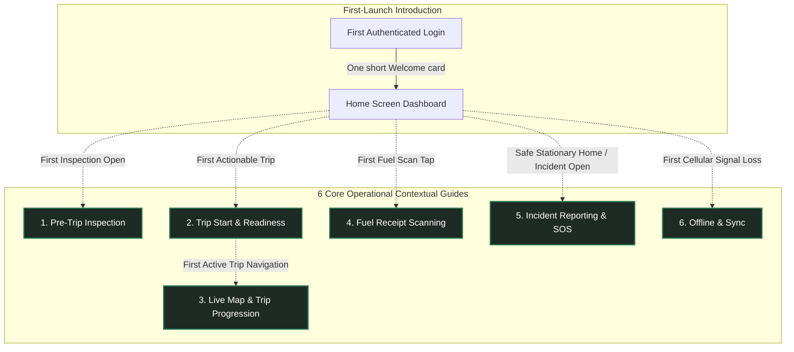
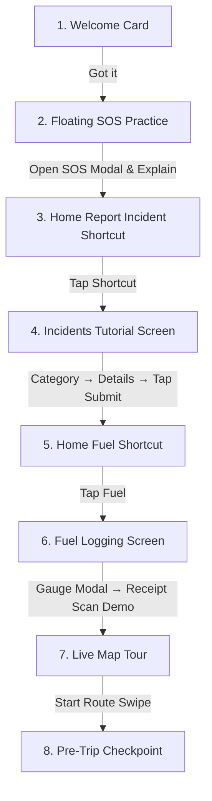

# Feature: Driver In-App Guidance & Contextual Coach Marks

## 1. Product Philosophy

> **"Guidance when needed, not guidance everywhere."**  
> **"Teach the difficult decision or workflow, not the button the driver already understands."**

The FleetOps In-App Guide consists of **6 Core Operational Contextual Guides** plus **1 lightweight First-Launch Introduction**. 

There is:
- **NO** Driver Academy
- **NO** training center or simulated courses
- **NO** training missions
- **NO** cheetah or character mascots
- **NO** gamification, badges, or points
- **NO** certification or completion percentage

The subsystem exists solely to provide lightweight, just-in-time contextual guidance directly over **REAL production UI** at the exact moment a high-stakes workflow first becomes actionable:



---

## 2. First-Launch Introduction

The Welcome card is **NOT** one of the six operational guides. It is a one-time introductory greeting designed to set expectations without impeding the driver.

* **Screen**: `mobile/app/(app)/(tabs)/index.js` (Home Dashboard)
* **Trigger**: First authenticated launch after login and permissions (`fleetops.guide.welcome.v1`).
* **Format**: One compact, calm centered card. **No multi-screen product tour. No Home walkthrough.**
* **Copy**:
  > *"Welcome to FleetOps! We'll guide you through important actions as you use the app. Tips will appear only when they're relevant."*
* **Action**: `[ Got it ]`
* **Rule**: Tapping `[ Got it ]` immediately dismisses the card and returns the driver to the normal Home screen. The dashboard remains completely clean and unencumbered.

---

## 3. Six Core Operational Guides

The **only** six operational areas that receive contextual guidance are:

### 3.1 Pre-Trip Inspection (HIGH Priority)
* **Screen**: `mobile/app/(app)/inspection.js`
* **Trigger**: First time the driver enters a real pre-trip inspection (`fleetops.guide.pretrip.v1`).
* **Operational Scope**: Teach the decision workflow, **not** all seven checklist items individually.
* **Flow**:
  $$\text{PASS / FAIL} \longrightarrow \text{if FAIL} \longrightarrow \text{Remarks required} \longrightarrow \text{All 7 answered} \longrightarrow \text{Complete Inspection}$$
* **Step Details & Interactivity**:
  1. **PASS / FAIL (`inspection.pass_fail`)**:
     - *Interaction*: `passthrough`. The driver taps the **actual** production `PASS` or `FAIL` button through the spotlight cutout.
     - *Copy*: *"Work down the list and choose PASS for each item that is safe, or FAIL for one you find a problem with. Marking FAIL asks you to describe the issue, so dispatch knows what needs attention."*
     - *Why the copy names the FAIL consequence* (2026-09-22): the requirement it describes (a FAIL needs a description) is enforced at submit time, so a driver who learns it only from the Remarks tooltip learns it *after* marking the first FAIL. The step that teaches "how to answer" is this one.
     - *Interaction-Driven Progression*:
       - If driver taps real **PASS**: explanation completes.
       - If driver naturally taps real **FAIL** on item 1 or any subsequent item: existing inspection state changes $\rightarrow$ real Remarks `<TextInput>` mounts $\rightarrow$ measured $\rightarrow$ spotlight transitions to or triggers Remarks (`pretrip_remarks`).
     - *Strict Rule*: Never force FAIL for tutorial purposes.
  2. **Required Remarks (`inspection.remarks`)**:
     - *Interaction*: `passthrough`. The driver can type directly into the real Remarks field.
     - *Copy*: *"Failed checks require a short description so dispatch knows what needs attention."*
     - *Trigger*: Fires whenever any item is marked FAIL if `pretrip_remarks` is not yet completed.
     - *Action*: `[ Got it ]`.
  3. **Complete Inspection (`inspection.complete`)**:
     - *Interaction*: `passthrough` — **changed from `blocked` 2026-09-22.** The copy instructs "Tap here", and `blocked` makes the cutout swallow that exact tap: the only way through was the tooltip's own `[ Got it ]` first, so the instruction was untrue and the real button cost two taps. `blocked` is reserved for actions that must not fire by accident (SOS, Start Trip, the trip-progression swipe); this is a plain submit, and on the tour path it writes nothing (`handleSubmit` opens the completion modal and returns when `isTour`). See §3.7.6.
     - *Copy*: *"Tap here once all 7 items are checked. You must complete the inspection before you can start the trip."*
     - *Action*: `[ Got it ]`.
     - *Safety Rule*: Never require the driver to submit the inspection to finish the guide — the guide completes on the tap, and the tap runs the real handler.

---

### 3.2 Trip Start & Readiness (HIGHEST Priority)
* **Screen**: `mobile/app/(app)/trip/[id].js`
* **Trigger**: First time the driver's first assigned trip becomes genuinely actionable (`fleetops.guide.trip_readiness.v1`).
* **Flow**:
  $$\text{Readiness Window} \longrightarrow \text{Pre-Trip Requirement} \longrightarrow \text{Start Trip / Continue to Map}$$
* **Step Details & Interactivity**:
  1. **Readiness Window (`trip.readiness`)**:
     - *Interaction*: `observe`.
     - *Copy*: *"This shows when your trip can begin. FleetOps will not let the trip start before the allowed readiness window."*
     - *Action*: `[ Next → ]`.
  2. **Pre-Trip Dependency (`trip.pretrip_requirement`)**:
     - *Interaction*: `observe`.
     - *Copy*: *"Complete the required vehicle inspection before departure. The start button unlocks once safety is confirmed."*
     - *Action*: `[ Next → ]`.
  3. **Primary Action (`trip.primary_action`)**:
     - *Interaction*: `blocked`. Protected action.
     - *Dynamic Copy*: Derived from real trip state:
       - If active trip (`isContinue === true`): *"Once the trip is active, Continue to Map only returns you to the live trip and navigation."*
       - If pre-departure: *"Start Trip begins the trip when readiness and inspection requirements are satisfied."*
     - *Action*: `[ Got it ]`.
     - *Safety Rules*: The guide must **never** start a trip, accept a trip, mutate trip status, bypass readiness, or bypass inspection.

---

### 3.3 Live Map & Trip Progression (HIGH Priority)
* **Screen**: `mobile/app/(app)/(tabs)/map.js`
* **Trigger**: First time opening Live Map during the first real active trip (`fleetops.guide.live_trip.v1`).
* **Safety Lock**: Never trigger while vehicle is moving (`isDriving === true`).
* **Flow**:
  $$\text{Current Mission} \longrightarrow \text{Telemetry \& GPS Health} \longrightarrow \text{Trip Progression Control}$$
* **Step Details & Interactivity**:
  1. **Current Mission (`map.current_target`)**:
     - *Interaction*: `observe`.
     - *Copy*: *"This shows your current trip target and next service point. Use it to confirm whether you're heading to Pickup or Drop-off."*
     - *Action*: `[ Next → ]`.
  2. **Live Telemetry (`map.telemetry`)**:
     - *Interaction*: `observe`.
     - *Copy*: *"Live route, ETA, and distance are calculated continuously. Telemetry is automatically shared with dispatch."*
     - *Action*: `[ Next → ]`.
  3. **Trip Progression Swipe (`map.trip_progression`)**:
     - *Interaction*: `blocked`. Protected action.
     - *Copy*: *"Slide this control when you reach your waypoint or complete a leg to advance the trip status."*
     - *Action*: `[ Got it ]`.
     - *Rules*: Do **not** highlight the entire map. Do **not** measure WebView route geometry; target only stable React Native UI components. Never require swiping a real status control. Never fabricate GPS, ETA, route, or trip status.

### 3.3.1 First Map Tour (implemented 2026-09-20)

The first intentional Map exploration has its own milestone: `map_intro`, version 1, route `/map`, stored through the existing driver-scoped key `fleetops.guide.map_intro.v1_{driverId}`. It is triggered only from the actual `Map` tab press in `CurvedPillTabBar`; Map screen focus or programmatic navigation does not start it.

The tour uses four new exact targets:

1. `map.standby_status` — the existing standby Live Tracking / Waiting for assignment header.
2. `map.controls` — the existing recenter / Layers / locate control group.
3. `map.layers` — the existing Layers control, with no automatic coverage change.
4. `map.trip_practice` — the local-only practice surface.

The practice surface uses five local stages: Start Route, Arrived at Pickup, Picked Up Guest, Arrived at Destination, and Dropped Off Guest. Each stage requires a right swipe, resets on an early release, shows a restrained success state, and advances only after the local gesture succeeds. It never calls trip, dispatch, reservation, GPS, geofence, odometer, incident, or notification APIs. `Finish Tour` is the only normal completion action that writes `map_intro` completion.

The existing `live_trip` milestone and its `map.current_target`, `map.telemetry`, and `map.trip_progression` targets remain unchanged. A map-specific pending/active gate prevents the real-trip guide from pre-empting the first Map tour; after completion or skip, the existing active-trip trigger may retry. The first Map walkthrough is a UI-only exception to the motion gate so a Map tap can show the tutorial immediately; the Driving Safety Lock remains unchanged for the other milestones.

If the first Map-tab tap lands while a trip is already active, `map_intro` still has priority over `live_trip`. The active route sheet supplies the existing status header and map-control targets; the Layers explanation uses a read-only tutorial preview because the active-trip branch does not render the standby radar Layers control. No production action or trip state is changed.

### 3.3.2 Map first-visit reliability hardening (source, 2026-09-21)

The first Map tour now mounts its stable React Native targets while GPS is still resolving, so the initial spotlight is not hidden behind the normal GPS loader. A fresh location request remains bounded and falls back to a recent cached fix before the existing watcher starts. The own-vehicle marker keeps the bundled PNG when available and retains the original small radar-dot fallback when the asset is unavailable.

After Reset In-App Tips, an intentional Map-tab tap may dismiss the reset-triggered Home Welcome card and claim `map_intro`; the Welcome scrim stays pass-through for navigation while its own card remains actionable. This is a Map-specific handoff and does not reorder or change any other tooltip. The previous downloaded APK is not treated as verification of this source correction; it was verified instead on the Metro dev-client path (2026-09-21), so no EAS rebuild was needed.

### 3.3.3 Presentation gate: the spotlight was refused for being on screen (source, 2026-09-21)

Section 3.3.2 hardened the *trigger*: the milestone is claimed from the Map tab, and the Home Welcome card hands off. That was necessary but not sufficient, and reading the presentation gate is what showed why four rounds of green suites changed nothing on the device.

A guide presents only when `activeTargetLayout !== null`, and every way of failing that gate was a bare `return null`. So "the trigger never fired" and "the target never measured" produced identical device behaviour, and nothing distinguished them: the coach-mark suite reads source text rather than rendering. The trigger side was re-verified as sound — `mapIntroPendingRef` is set synchronously before `map_intro`'s storage read and re-checked after `triggerMilestone`'s own read (`:391`), so neither async claim can pre-empt the other, and the registration token bookkeeping already ignores a stale instance's measurements.

**Root cause (device run, `__DEV__` warning).** The gate refused a target that was entirely visible:

```
[coachmarks] spotlight not presenting — target above the safe viewport
  { milestone: "map_intro", pathname: "/map", targetId: "map.standby_status",
    detail: { y: 16, height: 49.78, minSafeY: 79.11 } }
```

`map.standby_status` occupied `16 → 65.78` — fully on screen, and the intended target of step 0. The gate demanded its bottom edge clear `minSafeY = insets.top + 40` (`insets.top` = 39.11 in the provider). The slack was simply wrong for a top-anchored target: the header declares `top: insets.top + 16`, so its settled box is `insets.top + 16 .. insets.top + 66` and clears that bar by only 26px. The refusal happened because the target's own insets had not settled when it measured (`16 = 0 + 16`) while the provider's already had — so the same declaration produced two different coordinate systems in one frame. Testing against a margin made presentation depend on that race.

Two source changes:

- **The gate tests the window, not a margin.** Rejection is now whole-box against the window edges (`y + height <= 0`, `y >= SCREEN_HEIGHT`), which is what the gate's own comment already claimed it did — "rejected only when the box is ENTIRELY outside the safe viewport… a partially visible target must still present". The `insets.top + 40` / `SCREEN_HEIGHT - insets.bottom - 80` slack is gone, and the reason strings now say *entirely above/below the window*. Presentation no longer depends on inset-settling order.
- **The gate reports its reason.** In `__DEV__` only and deduped by signature, a `console.warn` names which rejection fired (never registered / zero-size / other route / entirely above or below the window) with the milestone, target and bounds. The latch clears when the spotlight presents. This is what produced the line above; without it the failure was invisible from both the device and the suite.

Two supporting changes, neither of which was the cause:

- **Bounded self-retry in `CoachMarkTarget`**, entered **only from the invalid branches** — a zero-dimension measurement, or a re-measure still at `ry <= 0` — at a 150 ms interval against a 4 s deadline, reset per step. The earlier hypothesis that this was the root cause was **wrong**: the device log showed a perfectly valid measurement being refused. It is kept because it hardens the same class the device did exhibit (a target measuring before its layout settles), and because an unsettled `ry <= 0` was previously *published* rather than retried. A correctly-measured target is never re-measured, which matters because the ScrollView auto-scroll path is gated on `isPartiallyHidden`: re-entering it would re-fire `scrollTo` and stack its 320 ms settle timers.
- **`mapIntroAwaitingTap` is unreachable** (see `Bugs.md`): its only writer runs when the active milestone is `map_intro`, but both call sites are mutually exclusive with that branch, so the guards reading it are inert. Recorded, not changed.

**Status: gate fix applied and device-confirmed 2026-09-21.** The suite that would cover this cannot render components, so confirmation had to come from a device run on the Metro path (`npm run dev` at the root plus `npm start -- --dev-client --lan` in `mobile`), which needed no APK rebuild. The spotlight presents.

### 3.3.4 The spotlight landed off the element (source, 2026-09-21)

Section 3.3.3 made the spotlight present. It then appeared on every step — and in the wrong place, **uniformly**, on all of them. A uniform offset is a coordinate-space mismatch, not a per-target measurement error, and this one is structural rather than a slip in the geometry arithmetic.

`CoachMarkTarget` registers bounds from `measureInWindow`, which reports **window** coordinates. `CoachMarkOverlay` draws its scrim and its cutout with `StyleSheet.absoluteFill` inside the *provider's* container (`CoachMarkProvider.jsx:713`). Those are the same space only while that container sits exactly at the window origin — and it need not: the container also holds `<ConnectivityBanner />` as a layout-participating sibling above the navigator (`app/(app)/_layout.js:78`), so a visible banner, or any parent padding, inset or transform, moves every cutout by the same amount. That is precisely the observed signature, which is why the fix is in the overlay's frame of reference rather than in any individual target's numbers.

`CoachMarkOverlay` now measures its own container's window origin and subtracts it from the target bounds before geometry is computed (`containerRef` / `containerOrigin`, re-measured on a `Dimensions` change). The subtraction is a **no-op at the window origin**, so a case that already lines up cannot regress — the fix is correct by construction rather than by tuning a constant.

**Status: applied to source and device-confirmed 2026-09-21.** A second `__DEV__` diagnostic prints the container origin beside the bounds it was subtracted from, deduped per geometry change; on-device confirmation is that the highlight now aligns, so the subtraction accounted for the offset and the registered bounds were sound.

---

### 3.4 Fuel Receipt Scanning (HIGH Priority)
* **Screen**: `mobile/app/(app)/fuel-report.js`
* **Trigger**: First time entering fuel report / receipt scanning (`fleetops.guide.fuel_scan_capture.v1` and `fleetops.guide.fuel_scan_verify.v1`).
* **Real Lifecycle Flow**:
  $$\text{Capture Gauge} \longrightarrow \text{Request Fuel} \longrightarrow \text{Coordinator Approval} \longrightarrow \text{Open Scanner} \longrightarrow \text{Capture Receipt} \longrightarrow \text{Real OCR Extraction} \longrightarrow \text{Spotlight Verification Fields} \longrightarrow \text{Save Entry}$$
* **Coordinator approval is a step of its own** (added 2026-09-22). The runtime flow is longer than the scan alone: between submitting the request and scanning the receipt the coordinator approves a volume against the vehicle's tank and route, and the `fuel.approval` box appears. The tour now stops there rather than announcing the approval on the scan step, where it named a figure the driver had not yet seen.
* **One user action = one advance.** Every fuel step is `passthrough`, so `notifyInteraction` already advances the step inside the provider. Four sites also called `nextStep?.()` explicitly, which moved **two** steps per action and raced the tour past the receipt and extracted-data tooltips — the reason those two were reported missing. The explicit calls are gone; the sole remaining advance is the provider's own. The gauge notification likewise fires when the gauge modal **completes**, not on the press that opens it, so "Request fuel" no longer appears over the modal in the background.
* **Step Details & Interactivity**:
  1. **Stage A: Framing (`fuel.viewfinder`)**:
     - *Interaction*: `observe`.
     - *Copy*: *"Place the full receipt inside the frame. Ensure good lighting and avoid glare or folds so AI can read the text."*
     - *Action*: `[ Got it ]`.
     - *Rule*: Never trigger camera shutter automatically.
  2. **Stage B: Verification (`fuel.verify`)**:
     - *Trigger*: Mounts **only** after real OCR extraction succeeds with valid extracted data (`!scanning && receiptScanData && Object.keys(receiptScanData).length > 0`) and review fields render.
     - *Interaction*: `passthrough`. Driver can review and edit real volume and total cost fields.
     - *Copy*: *"Always check the extracted liters and total amount before submitting. Correct any values that were read incorrectly."*
     - *Action*: `[ Got it ]`.
     - *Submit Fuel*: `blocked`. Protected action.
     - *Error Handling*: If extraction fails, times out, or returns empty data, do **not** show verification as though OCR succeeded.

---

### 3.5 Incident Reporting & SOS (HIGH Priority)
* **Surfaces**: Floating SOS Medallion (`DriverSos.js`) and `mobile/app/(app)/incidents.js`.
* **Flow**:
  $$\text{Emergency SOS Explanation} \quad \big| \quad \text{Incident Banner} \longrightarrow \text{Incident Category Selection}$$
* **Step Details & Interactivity**:
  1. **Floating Emergency SOS (`incident.sos`)**:
     - *Trigger*: Safe, stationary context only (`pathname === "/"`, `!isDriving`, 2s stationary delay). Never triggers merely because `DriverSos` mounts.
     - *Presentation*: `floating_bubble`. Replaces the default 340dp centered screen card with a compact tactile floating bubble docked directly beside the floating SOS medallion (`arrowPosition="right"` pointing into the button when SOS is on the right side of the screen; dynamically docks to the right or above/below if dragged elsewhere).
     - *Highlight Contour*: Cutout hole is framed with a luminous 2dp circular accent contour ring matching `holeRadius` (`opacity: pulseAnim`), pulsing once upon arrival and settling at `0.65` opacity to maintain a focused glowing highlight directly around the SOS button.
     - *Interaction*: `blocked` for production SOS (`Got it`), `passthrough` for `tour_sos` (`Tap SOS`), allowing physical taps to open emergency action sheet simulation.
     - *Copy*: *"Use SOS only for real emergencies (accidents, medical threats, or breakdowns). Your location is immediately shared with the fleet team."* (Production) / *"Tap the floating SOS button to practice opening emergency actions. Don't worry, this is only a simulation."* (Tour).
     - *Action*: `[ Got it ]` / `[ Tap SOS ]`.
     - *CRITICAL EMERGENCY OVERRIDE*: A real emergency **always** overrides tutorial behavior. If the driver activates SOS, the coach mark immediately dismisses and stands aside to give the real emergency flow 100% priority.
  2. **Incident Dispatch Alert (`incident.banner`)**:
     - *Screen*: `incidents.js`.
     - *Interaction*: `observe`.
     - *Copy*: *"Submitting an incident immediately alerts the fleet coordinator. Emergency assistance will be deployed if requested."*
     - *Action*: `[ Next → ]`.
  3. **Incident Category Grid (`incident.category`)**:
     - *Screen*: `incidents.js`.
     - *Target*: `<View style={styles.typeGrid}>`.
     - *Interaction*: `passthrough`. Driver may tap the actual category card.
     - *Copy*: *"Choose the category that best describes the situation so dispatch knows what equipment or assistance to send."*
     - *Interaction-Driven Progression*: Selecting a category advances/completes the guide.
     - *Submit Incident*: `blocked`. Protected action. Never create test incidents or submit emergency data automatically.

---

### 3.6 Offline & Sync (MEDIUM-HIGH Priority)
* **Format**: Contextual explanation, **not** a multi-step tutorial.
* **Trigger**: Fires only when a **real** offline condition occurs (`connectivity.status === "offline"`).
* **Target**: Real `ConnectivityBanner` (`offline.banner`).
* **Interaction**: `observe`.
* **Copy**:
  > *"Offline Mode: You can continue viewing saved trip information. Any updates you make will be saved locally and automatically synced when you're back online."*
* **Truthful Vocabulary Rules**:
  The explanation must strictly align with real offline state behavior:
  - **CACHED**: Data previously downloaded and available locally.
  - **NEVER SYNCED**: Data that has never been downloaded and therefore cannot be displayed.
  - **SAVED FOR SYNC**: A local update queued in outbox waiting for connection.
  - **SERVER CONFIRMED**: An update successfully written to backend database.
  - **Strict Rule**: Never claim all information remains available offline.

---

### 3.7 Interactive Guided Onboarding Walkthrough & Simulation

The FleetOps mobile driver experience incorporates a seamless, multi-screen interactive simulation that chains critical driver workflows together into an engaging, hands-on onboarding sequence:



#### 3.7.1 Duplicate SOS Tooltip Elimination
* **Root Cause**: On Home, completing `tour_sos` previously reset `activeMilestone` to `null` before triggering `tour_incident`. A secondary 2-second stationary timer inside `DriverSos.js` detected `!activeMilestone` while `"sos"` remained uncompleted in storage, causing the SOS tooltip to present a second time on the exact same button.
* **Resolution**:
  1. `CoachMarkProvider` now automatically marks `"sos"` as completed in storage (`setCoachMarkCompleted("sos", 1, driverId)`) whenever `tour_sos` completes or is skipped.
  2. `triggerMilestone("sos")` strictly verifies that `tour_sos` is not already done before presenting.
  3. `DriverSos.js` incorporates a cancellation flag on its stationary presentation timer.

#### 3.7.2 Spotlight Cutout Coordinate Alignment
> **SUPERSEDED — see "Cutout Space & the Origin Correction (2026-09-22, third report)" below.** The root cause recorded here is wrong in its conclusion: the origin subtraction was not the defect, it was the *missing* piece, and it was reinstated as `toContainerSpace`. The hole is drawn as an absolutely-positioned child of the overlay container, so it must be translated into that container's local space — a full status bar of offset (39.11dp on this device) otherwise. Kept as written because the diagnostic path it records is still how the alignments were reasoned about; the numbers to trust are in the later section.

* **Root Cause**: `CoachMarkTarget` measures element bounds in window coordinates via `measureInWindow`. `CoachMarkOverlay` is positioned with `StyleSheet.absoluteFill` over the root container. Subtracting `containerOrigin.y` (~39.11dp status bar height on Android) caused the spotlight cutout hole to shift upward away from the actual target icon (displacing the quick action highlight into the vehicle card).
* **Resolution**:
  - `originX` and `originY` are clamped at read time (`Math.max(0, containerOrigin)`).
  - Target window coordinates are mapped directly to the fullscreen overlay's window coordinate space (`spotX = Math.max(0, rawX - pad)`, `spotY = Math.max(0, rawY - pad)`), guaranteeing pixel-accurate spotlight framing across Android and iOS.

#### 3.7.3 In-Screen Interactive Incident Tutorial (`/incidents?tour=1`)
* **Guided Sequence**:
  1. `tour.incident.category` (`incident.category`): Highlights category grid. Driver taps any category (e.g. Breakdown) $\rightarrow$ auto-populates simulated description (*"Flat tire on right rear wheel, vehicle safely parked on shoulder"*) and requests assistance (*"Tow Truck"*).
  2. `tour.incident.details` (`incident.details`): Highlights description and assistance options. Driver taps `[ Next → ]`.
  3. `tour.incident.submit` (`incident.submit`): Highlights "Send Emergency Report" CTA button. Driver physically taps submit $\rightarrow$ intercepted in tour mode (zero `api.post` network mutation).
  4. Displays simulated dispatch alert modal:
     - Title: *"Emergency Report Sent (Tutorial Mode)"*
     - Body: *"Fleet dispatch has received your vehicle information and live GPS coordinates. In a real emergency, assistance is deployed immediately."*
     - Action: `[ Next: Fuel Logging → ]` $\rightarrow$ navigates to `/(app)/(tabs)?tour_step=fuel`.

#### 3.7.4 Fuel Screen Hard Gate Bypass & Simulator (`/fuel-report?tour=1`)
* **Hard Gate Bypass**: In tutorial mode (`tour=1`), all prerequisite operational requirements are bypassed:
  - `!hasAssignedVehicle`: Displays fallback vehicle (*"Civic18S (Tour Vehicle) • XYZ 5678"*).
  - `loadingRequests`: Ignored; vehicle check card is immediately mounted.
  - `!canLogFuel` & Pending/Approved status: Bypassed; "Capture gauge with camera" button is always rendered and spotlighted (`fuel.gauge_entry`).
* **Guided Sequence** (`tour_fuel_flow`, 6 steps — the approval step added 2026-09-22):
  1. `tour.fuel.gauge_entry` (`fuel.gauge_entry`) — *"Capture Gauge"*, `passthrough`.
  2. `tour.fuel.request_button` (`fuel.request_button`) — *"Request Fuel"*, `passthrough`.
  3. `tour.fuel.approval` (`fuel.approval`) — *"3. Vehicle Fuel Check"*, `observe`. Explains that the request goes to the coordinator, who approves a volume against the vehicle's tank and route — here 35.50 L. `observe` because the driver's next act is the receipt; the tooltip explains, it does not ask for a tap on anything.
  4. `tour.fuel.scan_entry` (`fuel.scan_entry`) — *"Scan Receipt"*, `passthrough`.
  5. `tour.fuel.verify` (`fuel.verify`) — *"Verify Extracted Data"*, `passthrough`. States the extracted values **can be corrected** when the scan got one wrong, not merely reviewed.
  6. `tour.fuel.submit_button` (`fuel.submit_button`) — *"Save Entry"*, `passthrough`.
* **Interactive Gauge Simulator (`FuelGaugeTutorialModal`)**:
  - Features graphic dashboard fuel gauge with 75% needle, centering reticle, shutter flash animation, and simulated AI extraction.
  - Concludes with simulated dispatch pre-approval (₱2,500 limit).
  - Fires `fuel.gauge_entry` on completion only — see §3.4.
* **Receipt Scanning Demo**:
  - Displays simulated OCR extraction card (Volume 35.50L, Total ₱2,350.00, Shell #1042).
  - Action button: `[ Next: Live Map & Trip Navigation Tour → ]` navigates to `/(app)/(tabs)/map`.

#### 3.7.5 Live Map with Pre-Trip Checkpoint (`/map`)
* On the first "START ROUTE" swipe during the Live Map trip practice sandbox, an interactive Pre-Trip Safety Checkpoint expands, requiring the driver to confirm safety before proceeding with the route waypoints.
* **The checkpoint is a real gate** (2026-09-22): the prompt offers `[ Open Inspection Screen → ]` and nothing else. It previously also offered `[ Quick Pass (Tutorial Only) ]`, which skipped the inspection the checkpoint exists to require — a tour that bypasses the safety step it is teaching. The `[ Quick Pass All ]` control **inside** the checklist is untouched and remains the way to answer all seven items quickly.
* **Returning from the inspection does not cost a second swipe.** Passing the pre-trip lands back on the Map tab with `?pretrip=passed`; the practice card seeds its stage from that parameter, so the START ROUTE stage the inspection just satisfied is already complete and the driver continues at the next stage. Without it the driver was asked to perform the swipe twice.
* **One control for finishing, not two.** "All five practice stages completed!" is shown by the card, but the *action* belongs to the `map.practice.complete` tooltip's `[ Finish Tour ]` button alone. The card's own `[ Finish Tour ✓ ]` was a duplicate of the same action on the same screen, and it is removed. `map.practice.complete` carries no `requiresInteraction`, so the tooltip's button advances ungated.
* **Parking: the Map tour survives the trip into the inspection screen** (2026-09-22). See §3.7.6 — this is what lets the pre-trip tooltips run at all.

#### 3.7.6 Parking a guide across a navigation (2026-09-22)

**Symptom.** Every pre-trip tooltip was missing from the tour. Not broken, not mis-measured — **never shown**: `pretrip`, `pretrip_remarks` and `pretrip_complete` all exist in `lib/coach-marks.js` and were each silently dropped.

**Root cause — one milestone per screen, enforced as one milestone per *app*.** `CoachMarkProvider`'s trigger guard refused every milestone except `map_intro` while `map_intro` was active. Tapping `[ Open Inspection Screen → ]` pushes the inspection screen but leaves `map_intro` **active** at its start-swipe step, so the incoming `pretrip` was refused. The guard was right in intent: the rule is that a guide the driver is *looking at* keeps the screen. It was wrong in scope, because `map_intro` was no longer on screen at all — the pathname had left `/map`.

**The rule, restated.** A guide whose route no longer matches the pathname is not on screen. It offers nothing to dismiss, so holding the screen through it strands every later guide on the screen the driver is actually on.

**Parking.** Such a guide is *parked*: `parkedMilestoneRef` holds `{ key, stepIndex, context }` and the active key is cleared. When the pathname returns to that milestone's route, the parked guide resumes **at the step it was parked on**. Two exits already existed and neither fits:

| Exit | Why not |
|---|---|
| **Completion** | A step the driver has not read must not be burned permanently. |
| **`abandonActiveMilestone`** | For `map_intro` it sets `mapIntroAwaitingTap`, which demands a fresh Map-tab tap and **restarts at step 0** — walking into the inspection screen and back would have thrown away the four practice stages already completed. |

**What still holds.** A guide whose route *does* match keeps the screen — one guide per screen, unchanged. The async Map-tab reservation (`mapIntroPendingRef`) still wins: nothing is active while that storage read is in flight, so there is nothing to park and the trigger is simply refused. A parked slot whose route has not returned keeps its occupant through unrelated navigations; it is released only by reaching its own route, or by a claim of the same key (which restarts at step 0, so resuming the parked one later would replay a step the driver already passed).

**Paths that consume a parked Map tour.** Two, and both are ordinary: the inspection's success modal pushes back to `/(app)/(tabs)/map?tour=1&pretrip=passed` (the resume effect, keyed on the pathname, because the driver returns through a button in *another* screen — there is no call site to hang it off), or the driver taps the Map tab itself (`triggerMapIntroFromTab` reads the slot instead of restarting at step 0).

**Verification.** Source-text tests in `mobile/lib/coach-marks.test.js` assert the parked slot exists, that parking is neither completion nor abandonment (`releaseActiveIfOffRoute` contains neither `setCoachMarkCompleted` nor `mapIntroAwaitingTap`), that a same-route guide is still refused, and that the resume keeps its bail-outs **ahead** of the destructive release so a bail cannot drop the guide holding the screen. Full suite: **2178 pass** across 184 files; touched-file ESLint clean under `--max-warnings 0`. **Nothing here has run on a device** — the resume timing is reasoned from the effects' order, not observed.

#### 3.7.7 Incident autofill in the tour: why the plain shortcut does not fill anything

The Report Incident screen autofills a fabricated description (*"Flat tire on right rear wheel…"*), assistance (*"Tow Truck"*), severity and an Unsplash photo — **only when `isTour`**, which requires `?tour=1`. That parameter is added by `components/home/DriverHomeCards.jsx` alone, and only while `activeMilestone === 'tour_incident'`. The plain Home **Report Incident** shortcut (`app/(app)/(tabs)/index.js`) routes without it, so it opens the real screen with no autofill and the production `incident` milestone.

**This is deliberate and stays.** The autofill writes invented safety-critical content; a driver filing a real incident report must never find a description and a stock photo already in the form. Changing it would be a safety regression, not a fix.

#### 3.7.8 The overlay presents once per guide, not once per step (2026-09-22)

A driver reported the tooltip and its highlight *glitching* between steps — and they were right, in the literal sense: the overlay was **unmounting and remounting on every single transition**. `shouldShowOverlay` required the current target's layout, while the provider's freshness gate rejects any registration not stamped with the current presentation generation, and a step change bumps that generation. So the layout was null for a window after every step, and each of these followed from the fresh mount:

- the tooltip and the dim **blinked** — `overlayFade` and `tooltipOpacity` are per-mount animation values, so both restarted from 0;
- the hole was drawn **39.11dp too high and then corrected**, because a fresh mount means an unmeasured container and §3.7.2's origin correction cannot be applied to a `{0,0,0,0}` box;
- the **centred card flashed** — the first-render gate added in the fourth report painted it whenever the container was unmeasured, which after a transition is every step;
- the container was **re-measured per step**, carrying its 350ms settle recheck along.

The overlay now mounts for the whole guide. `shouldShowOverlay` is `activeMilestone && isCurrentRouteValid`, and a **held rect** carries the cutout across the handoff: when the current step's layout is stale or missing, `heldTargetLayout` returns the previous step's registration (`activeMilestone.steps[currentStepIndex - 1]`, route-checked, non-degenerate only), so the ring stays put and then *tweens* to the new target when the real measurement lands. The container is measured once per mount, and a guide's first cutout **snaps** into place instead of sliding in from a stale value. Implementation notes — including why the held rect is derived from `targets` rather than stored in a ref or state, and the three outcomes the presentation gate now has — are in `Capstone/04 - Architecture/Mobile Architecture.md`.

**Quick Pass All now leaves one item failed.** The tutorial's fast-path button answered all seven items PASS, and notified with a hard-coded `status: "PASS"` — which takes the provider's *complete* branch and triggers no remarks — while bypassing `setStatus`, the only path that fires `pretrip_remarks`. Pressing it therefore dismissed the pass/fail tooltip and showed nothing else. It now answers six PASS and leaves **Tires** FAIL with a seeded description (`mobile/lib/inspection-tour.js`), routed through the production `setStatus(id, "FAIL")` path, so the remarks tooltip fires exactly as it would from a manual tap. The description is not decoration: `handleSubmit` refuses a FAIL without remarks, so a bare FAIL would have made the tour's own submit button a dead end. The completion modal's header, its "7 of 7 Passed" line and its "Safe for Route Departure" badge now derive from the real counts and read "1 flagged for dispatch" when an item failed. The control remains `isTour`-guarded, so production inspections are unaffected.

---

## 4. Interaction Model

Every coach-mark step explicitly defines one of three interaction behaviors:

| Mode | Cutout PointerEvents | Overlay Behavior | Use Cases |
|---|---|---|---|
| **`passthrough`** | `none` | Spotlight cutout is completely unblocked. Underlying React Native component receives real native touches. | Inspection PASS / FAIL, Remarks TextInput, Incident category selection, Fuel verification editable inputs. |
| **`observe`** | `auto` | Target is highlighted; tutorial does not require interaction. Tapping `[ Next → ]` or `[ Got it ]` advances. | Readiness Window, Pre-Trip requirement status, Current Mission, Telemetry, ConnectivityBanner. |
| **`blocked`** | `auto` | Cutout intercepts touches to protect against accidental execution. Advanced solely via `[ Got it ]`. | Emergency SOS, Start Trip CTA, Trip Progression Swipe, Submit Incident, Submit Fuel. |

**Complete Inspection left this row on 2026-09-22.** It was listed as a protected action, but its own copy says "Tap here" — so blocking the cutout made the instruction untrue and cost the real button an extra tap (dismiss the tooltip first). Blocking is for actions that must not execute by accident; a submit whose tour path writes nothing is not one of those. See §3.1 and §3.7.6.

### Interaction-Driven Progression

For safe interactive steps, guidance advances naturally from real state changes rather than forcing artificial `Next` clicks:

```
PASS / FAIL Spotlight
        ↓
Driver taps real FAIL button (real setStatus executes)
        ↓
CoachMarkProvider observes state change via notifyInteraction()
        ↓
Remarks TextInput mounts in screen layout
        ↓
CoachMarkTarget measures real Remarks input
        ↓
Spotlight smoothly transitions to Remarks field
```

> [!IMPORTANT]
> `CoachMarkProvider` **never** mutates production state directly. The driver performs the real action, the screen updates its own state, and the coach mark merely observes.

The first Map tour uses the same `passthrough` mechanism for its practice spotlight, plus an opt-in `requiresInteraction` guard. Its tooltip CTA cannot advance a practice stage by tap alone; only the local right-swipe callback can move the tutorial forward.

---

## 5. Spotlight & Target Architecture

### Core Rule: ONE COACH MARK = ONE EXACT COMPONENT TARGET

The spotlight area must be derived from the actual rendered target component via `measureInWindow()`, never:
- a parent screen
- a ScrollView
- a card container
- an arbitrary coordinate box

```javascript
// CoachMarkTarget wraps ONLY the exact component
<CoachMarkTarget id="incident.category" scrollRef={scrollRef}>
  <View style={styles.typeGrid}>
    {/* Category cards */}
  </View>
</CoachMarkTarget>
```

### Spotlight Geometry & Dual-System Architecture
- **Component-Local Contour vs. Global Scrim Cutout**: The system separates visual focus into two distinct mechanisms:
  1. **Component-Local Focus Ring**: Rendered directly by `CoachMarkTarget` inside the target component's own layout tree (`pointerEvents="none"`). It remains physically attached to the component ($top = -padding, left = -padding, right = -padding, bottom = -padding$) and follows local view transforms naturally.
  2. **Global Scrim Cutout & Tooltip**: Rendered by `CoachMarkOverlay` based on absolute screen coordinates measured via `measureInWindow()`. It requires a fresh active-generation measurement, route validation, focus validation, safe viewport bounds, and layout settlement.
- **Freshness Invariant**: *"The local contour is component-anchored. The global cutout and tooltip are shown only after a fresh measurement for the active presentation."*
- **Presentation Generation Contract (`activePresentationId`)**: Every milestone trigger and step transition increments an internal generation counter in `CoachMarkProvider`. Target registrations carry this generation ID. `activeTargetLayout` strictly rejects any measurement whose `presentationId !== activePresentationId`. The overlay remains suppressed until a fresh measurement arrives, preventing stale mount coordinates or displaced pre-drag rectangles from ever misdirecting the spotlight (e.g. exposing the "More" tile instead of the SOS button).
- **Draggable & Transformed Target Hardening (`measureRevision`)**: Transformed or draggable elements such as the floating SOS button (`DriverSos.js`) distinguish temporary gesture transforms from committed resting positions. `DriverSos` enforces `positionReady` (preventing auto-presentation before `AsyncStorage` offset hydration completes) and bumps a `layoutRevision` counter when hydration finishes and when spring snapping settles. Passing `measureRevision` to `CoachMarkTarget` triggers an immediate authoritative re-measurement after native interactions settle.
- **Exact Bounds & Breathing Room**:
  $$x = \text{target}.x - \text{padding}, \quad y = \text{target}.y - \text{padding}, \quad w = \text{target}.w + 2\cdot\text{padding}, \quad h = \text{target}.h + 2\cdot\text{padding}$$
  Padding is 4–8dp breathing room ($8\text{dp}$ default, $4\text{dp}$ for tight buttons). Corner radius is derived from target (`radius + padding`), typically $12\text{--}16\text{dp}$ or $R = \text{size}/2$ for circular medallions.
- **Shape-Responsive Cutout**: The hole is **not fixed as a rectangle**. Its corner radius is resolved from the target's declared radius and scaled by the padding —
  $$R_{hole} = \min(\text{radius} + \text{padding},\ \min(w_{hole}, h_{hole})/2)$$
  which is the same rule the local contour uses, so contour and hole stay concentric instead of drifting apart. A control that declares $\text{radius} = \text{size}/2$ is stating that it is round: its hole becomes a true circle rather than a rounded square, a pill becomes a stadium, and a card stays a rounded rectangle. A radius that did *not* grow with the padding would flatten a circle the moment the hole exceeded the target, which is why the rule is `radius + padding` and not a tuned constant — for a fully-rounded target the two are algebraically identical.
  The scrim is painted by a **single** view whose content box *is* the hole: only its thick border paints (`borderWidth` = the larger screen dimension, so it reaches every edge), and that border's inner edge keeps `borderRadius`, making the hole's shape exact. It cannot also block touches, because its bounds include the hole itself and it would swallow `passthrough` steps — so the four rectangles remain as **transparent** touch blockers with their geometry unchanged. One paint rather than four matters because the scrim is semi-transparent ($0.76$ dark / $0.65$ light): overlapping scrim views composite twice and leave a visible seam, which is what rules out the usual corner-patch approach.
  Pure logic lives in `lib/spotlight-geometry.js`; `lib/spotlight-geometry.test.js` asserts circle, stadium, card, zero-padding, edge clipping and the stadium clamp.
- **Dual-Ring Contour**: Crisp primary forest-green inner border (`borderWidth: 2`, `borderColor: colors.primary`, subtle shadow) paired with an outer diffused aura ring (`borderWidth: 1.5`, `borderColor: rgba(74, 222, 128, 0.28)` in dark / `rgba(40, 84, 72, 0.20)` in light) creating a luminous, clean spotlight contour that renders reliably on both iOS and Android.
- **Arrival Pulse**: One restrained pulse (`0.25 -> 0.90 -> 0.45`) using cubic ease-out (`Easing.out(Easing.cubic)`) on arrival. **No continuous pulsing loop.**
- **Reduced Motion**: Respects `AccessibilityInfo.isReduceMotionEnabled()`.

### Tactile Tooltip Card Architecture
- **Claymorphic Elevation**: Molded card with specular top sheen (`borderTopColor: rgba(255, 255, 255, 0.95)` light / `rgba(255, 255, 255, 0.14)` dark), bottom shading, and soft ambient drop shadow.
- **Harmonized Arrow**: Tooltip pointer triangle dynamically shares the exact background color of the card (`#FFFFFF` in light mode, `#17221D` in dark mode), eliminating edge color dissonance.
- **Segmented Step Progress**: Multi-step guides feature an interactive segmented dot-and-pill track (`1 / N`) showing current position and remaining steps at a glance.
- **Tactile CTAs**: Primary action buttons feature 40dp height, 12dp radius, subtle top edge highlight (`borderTopColor: rgba(255, 255, 255, 0.28)`), and spring-scale press feedback (`scale: 0.97`).
- **Welcome Badge**: First-launch introduction features an authoritative compass tile (`compass-outline`), establishing an executive, polished tone with zero cartoonish mascots.

### Modal-less 4-Scrim Blocking Architecture

To ensure genuine touch passthrough without native window interception, `CoachMarkOverlay` eliminates React Native `<Modal>`. The overlay renders as an absolute fill container (`pointerEvents="box-none"`) with a single shaped scrim painting over four touch-blocking regions:

```
         TOP BLOCKER (pointerEvents="auto", transparent)
LEFT     TARGET HOLE (shaped: circle | stadium | rounded rect)   RIGHT
BLOCKER  ------------------------------------------------------   BLOCKER
         BOTTOM BLOCKER (pointerEvents="auto", transparent)
```

- Outside regions: fully dimmed and touch-blocked. The dim is painted by one shaped scrim view; the four rectangles beneath it are transparent and exist only to block touches.
- Target hole: uncovered, shaped to the target, and interactive for `passthrough`.
- Accepted trade-off: the slivers inside the rectangular blocker region but outside a rounded hole are dimmed yet still touch-transparent — about $0.215r^2$ per corner, roughly $31\text{dp}^2$ at $r = 12$, well under a touch target.

### Provider Context Partition (re-render isolation)

`CoachMarkProvider` publishes the guide through **three** contexts rather than one, partitioned by **how often each field changes** rather than by what it is about. The reason is mechanical: a context value is compared by identity, and the value was a plain object literal, so it was new on every provider render — which meant every consumer re-rendered for *any* provider render at all: a route change, a window resize, a keyboard event, or one target settling.

| Context | Fields | Moves when |
|---|---|---|
| `CoachMarkActionsContext` | `triggerMilestone`, `triggerMapIntroFromTab`, `registerTarget`, `unregisterTarget`, `notifyInteraction`, `nextStep`, `prevStep`, `skip`, `dismiss`, `dismissCoachMark`, `resetTips` | a route change or a driving-lock flip |
| `CoachMarkStatusContext` | `activeMilestone`, `mapIntroPending`, `mapIntroAwaitingTap`, `isDriving` | milestone transitions |
| `CoachMarkStateContext` | `currentStepIndex`, `currentStep`, `stepContext`, `activeTargetLayout`, `activePresentationId`, `currentRoute` | step transitions and settling re-measures |

Consumers subscribe to the narrowest group they actually need — `useCoachMarkActions()`, `useCoachMarkStatus()`, `useCoachMarkState()`. `useCoachMarks()` still returns all three merged for anything needing more than one group, so it remains the safe default. Six of the eleven consumers — the tab bar, the trip screen, the checklist, incidents, Home and Help — need only callbacks and are now **never re-rendered by tutorial activity**.

- **The three step-dependent callbacks are delegated.** `nextStep`, `prevStep` and `notifyInteraction` close over the current step, so their identity changed on every step transition; published raw they would re-create the actions value each time and drag every actions-only consumer back into re-rendering. The actions context carries stable delegates that read the latest definition from a ref written at commit. That changes nothing about what the callback does — they are only ever reached from an event handler, so a call always runs the definition from the render on screen — and it keeps the actions identity still across steps.
- **`triggerMilestone` is deliberately *not* delegated.** It closes over `isDriving`, and several screens trigger it from an effect whose only other dependencies are their own local state (`inspection.js`, `incidents.js`, `fuel-report.js`). That identity change is what re-runs those effects the moment the driving lock releases, so a guide suppressed while moving appears once parked. Freezing it would strand those triggers until something unrelated changed. `registerTarget` is left raw for the same shape of reason — it carries the route — and costs nothing, because `CoachMarkTarget` lists `pathname` as a dependency of its own measurement callback anyway.
- **The heaviest screens are the point.** Pre-Trip Inspection (a seven-item checklist) and Incidents subscribe to actions alone; Fuel Report's viewfinder, the SOS FAB and the connectivity banner subscribe to actions + status and never to the volatile step context. `lib/coach-marks.test.js` pins this as a deliberate tripwire: a change that needs the volatile context on one of those screens fails the suite, so the performance consequence is looked at rather than discovered on a device.

### ScrollView Support & Stale Measurement Prevention
1. **Window-Edge Check & Active-Target Gating**: Targets inside ScrollViews are checked against the window edges — a box is refused only when it lies entirely above (`y + height \le 0`) or entirely below (`y \ge SCREEN\_HEIGHT`) the window, so a partially visible target still presents. Auto-scrolling via `scrollRef.current.scrollTo()` is strictly gated to `isCurrentActiveTarget === true` so inactive targets never scroll the viewport prematurely while earlier steps are active.
2. **Auto-Scroll & Layout-Relative Measuring**: Uses `containerRef.current.measureLayout(scrollRef.current, ...)` when available to compute the exact ScrollView offset, scrolls smoothly, and waits $320\text{ms}$ for scroll animation to settle before committing final coordinates.
3. **Android Transition & Window Settlement**: Guard against early $y \le 0$ measurement returns on Android during screen transition by deferring to `requestAnimationFrame` and `InteractionManager.runAfterInteractions()`.
4. **Active Step Re-Measurement & Settling Ticks**: When a step activates or transitions (`currentStepIndex` changes), `CoachMarkTarget` fires an immediate measurement, an interaction-settled measurement, and staggered settling ticks ($80\text{ms}, 240\text{ms}, 480\text{ms}$) to guarantee dynamic async content changes (e.g. vehicle assignment loading) immediately update the spotlight coordinates. The shaped scrim, its four transparent touch blockers, and the cutout are all driven by **animated** bounds interpolated over $240\text{ms}$, so a re-measure while a mark is open *moves* the spotlight instead of snapping it. The corner radius is a plain value by comparison, so it snaps rather than tweening when a step changes a target's shape.
5. **Route Stamping**: All registrations store `route: pathname`. If a target belongs to a different route, `activeTargetLayout` returns `null`.
6. **Zero-Size AND Off-Screen Suppression**: If `width <= 0` or `height <= 0`, the coach mark does **not** display. A target measured entirely outside the window — wholly above (`y + height \le 0`) or wholly below (`y \ge SCREEN\_HEIGHT`) — is rejected too: positive bounds are not enough, because a card scrolled out of view measures positively and the overlay would dim the whole screen with the cutout framing nothing. Only a box **entirely** outside is rejected; a partially visible target still presents, since auto-scroll is gated on `isCurrentActiveTarget` (independent of overlay visibility), so it scrolls in, re-registers at its settled position, and the mark appears then.
7. **Unregister on Unmount, Scoped to the Registering Instance**: Every registration carries the token of the instance that made it. `unregisterTarget(targetId, token)` deletes only its own, so an unmount cannot remove a registration another live instance still holds. This matters because a target id may legitimately be live more than once — `inspection.remarks` mounts once per **failed** checklist item, so two FAILs register the same id twice. The newest live registration wins; when it unmounts, the survivor is promoted rather than the id going dark. A `__DEV__` warning fires when two live mounts register one id with conflicting bounds, since the spotlight would jump between them; it names both instances (a dev-only module counter, because the ownership token is a `Symbol` and logs as `Symbol(coach-mark-target)`), their routes, and the live-instance count under the id, and appends the registering stack — the bounds alone cannot say whether the second registration came from a mount effect, a settle timer, or a native measure callback that had already outlived its screen.
8. **Focus-Scoped, Mount-Guarded Registration**: An instance may only register while the driver can actually see its screen. `CoachMarkTarget` reads `useIsFocused()`: a blurred instance does not measure, and losing focus **drops** its registration outright, because a blurred instance's bounds describe a screen the driver has left. This is what closed the paired conflicting registrations for `incident.category` — a covered stack screen, a background tab, and a route expo-router mounted ahead of time for `router.prefetch` (a PRELOAD is rendered by the native stack as an inactive `Screen`) all stay **mounted**, so every one of them was free to publish bounds for a screen nobody was looking at, and since the provider keeps the newest registration the spotlight followed whichever measured last. The gate is a filter on *every* producer at once rather than a fix aimed at one of them. Focus is re-checked at each registration rather than only where the work was scheduled, because the work outlives the render that scheduled it: `measureInWindow` is a native round trip and the $320\text{ms}$ scroll-settle timer is a timer. `canRegister()` — mounted **and** focused, mirrored into refs by `useLayoutEffect` so the values are correct at commit — guards every async measure callback, and the settle timer is cleared on unmount so it cannot fire after the unregister that would have cleaned it up. Regaining focus re-registers on its own: `isFocused` sits in `measureAndRegister`'s dependencies, so its identity change re-runs the measurement effects.

---

## 6. Persistence & Versioning

Every coach mark is stored independently in `AsyncStorage` and strictly isolated by `driverId`:

```javascript
// Storage key format: fleetops.guide.<key>.v<version>_<driverId>
export function getCoachMarkStorageKey(key, version = 1, driverId = null) {
  const base = `fleetops.guide.${key}.v${version}`;
  return driverId ? `${base}_${driverId}` : base;
}
```

### Version Keys Table

| Scope | Key | Storage Key | Version |
|---|---|---|---|
| **Introduction** | `welcome` | `fleetops.guide.welcome.v1_{driverId}` | 1 |
| **First Map Tour** | `map_intro` | `fleetops.guide.map_intro.v1_{driverId}` | 1 |
| **Guide 1** | `pretrip` | `fleetops.guide.pretrip.v1_{driverId}` | 1 |
| | `pretrip_remarks` | `fleetops.guide.pretrip_remarks.v1_{driverId}` | 1 |
| | `pretrip_complete` | `fleetops.guide.pretrip_complete.v1_{driverId}` | 1 |
| **Guide 2** | `trip_readiness` | `fleetops.guide.trip_readiness.v1_{driverId}` | 1 |
| **Guide 3** | `live_trip` | `fleetops.guide.live_trip.v1_{driverId}` | 1 |
| **Guide 4** | `fuel_scan_capture` | `fleetops.guide.fuel_scan_capture.v1_{driverId}` | 1 |
| | `fuel_scan_verify` | `fleetops.guide.fuel_scan_verify.v1_{driverId}` | 1 |
| **Guide 5** | `sos` | `fleetops.guide.sos.v1_{driverId}` | 1 |
| | `incident` | `fleetops.guide.incident.v1_{driverId}` | 1 |
| **Guide 6** | `offline` | `fleetops.guide.offline.v1_{driverId}` | 1 |

---

## 7. Safety Rules

1. **Driving Safety Lock**:
   When vehicle velocity $> 10 \text{ km/h}$ or moving transit is detected, all non-critical coach marks are suppressed until the vehicle is stationary.

   **How it is actually decided** — derived in `mobile/lib/motion-state.js`, fed by the single GPS poster in `mobile/lib/tracking.js`:

   - **Motion source**: the `coords.speed` that the 30 s poster already reads on every fix. `LocationObjectCoords.speed` is **metres per second**, so the $10\ \text{km/h}$ policy threshold is $10 / 3.6 = 2.78\ \text{m/s}$ — comparing against a bare `10` would move the gate to $36\ \text{km/h}$. No second GPS stream, no extra battery cost, and evidence is published on every fix regardless of whether the post succeeds or which branch (trip / responder / standby) it takes.
   - **Sticky hold of 2 minutes**: once motion is seen, the lock holds for 2 minutes after the last *moving* fix. A stationary fix does **not** release it early. Positions arrive every ~30 s, so a latest-fix-only check would un-suppress the guide at a red light, in a traffic queue, in a tunnel, or through any GPS dropout — precisely when the driver is still driving.
   - **Fail open on unknown**: no location permission, tracking disabled in Settings, or no fix yet all read as *stationary*, so the guide still works on a device that never grants location. The lock engages only on positive evidence, and a null speed neither starts nor ends a hold.
   - **Read from the hook, never a prop**: `CoachMarkProvider` calls `useIsDriving()`. Suppression has two halves — a trigger is refused while moving, **and** a mark already on screen is dismissed the moment motion begins. A dimmed scrim left over the map as the driver pulls away is the real hazard, not merely the next mark appearing.
   - **Abandoned, not completed**: a mark taken away by the lock is not written to `AsyncStorage`. A tip the driver never got to read returns once the vehicle is stationary; it is not burned unseen.
   - **Re-checked after every await**: opening a mark reads storage asynchronously, so the lock is consulted again afterwards with a current reading — a gate that only checks before an await can be passed by a vehicle that starts moving during it.
2. **Real Emergency Priority**:
   If an actual emergency interaction occurs, the real SOS action always takes priority and any active coach mark immediately stands aside.
3. **Protected Action Guarantee**:
   SOS, Start Trip, Complete Inspection, Submit Incident, Submit Fuel, and Trip Progression swipe controls must **never** become tutorial-required actions.
4. **No Production State Mutations**:
   Guides explain workflows; they never submit data, mutate trips, or create mock records.
5. **One Guide at a Time**:
   A trigger is refused while a guide is **on screen**, so two guides can never fight over the same moment. The race this removes: Home mounts and shows the Welcome card, then ~2 s later the SOS tip replaced it — so the greeting was never read *and* never marked complete, appearing only on a second launch. The same race let `pretrip_complete` cut off an open `pretrip_remarks`.

   The guard is scoped to what is actually on screen, not merely to "a guide is active". A guide left behind by navigation — or one whose target never registered — is hidden, and blocking on it would strand the driver: an invisible guide offers nothing to dismiss, so every later guide would be refused. Either way the superseded guide is left **incomplete**, so it returns the next time its trigger fires.

   **Collision Recovery**: Both `DriverSos.js` and `ConnectivityBanner.jsx` watch `activeMilestone` in their trigger effects to re-evaluate when a blocking guide (such as `welcome`) is dismissed, ensuring stationary SOS tips and offline mode explanations are not dropped during initial app launches.
   **Route Normalization**: `DriverSos.js` checks `isRouteMatch(pathname, "/")` rather than strict equality, ensuring root route variants (`/index`, `/(tabs)`, `/(app)/(tabs)`) trigger the stationary timer reliably.
   **Target Bounds for Floating Elements**: Floating action buttons (`DriverSos.js`) provide explicit dimensions and layout styles (`sosWrapper` 64×64dp) directly to `CoachMarkTarget` (rendered via `Animated.View`), ensuring `measureInWindow` receives positive dimensions and registers exact coordinates without container collapse.
   **Tab Focus Re-evaluation**: `index.js` triggers `welcome` via `useFocusEffect` rather than a one-time mount effect, ensuring returning to Home after tapping "Reset In-App Tips" in Profile immediately presents the Welcome card.

---

## 8. Replay / Reset In-App Tips

Drivers can review contextual guidance at any time:
- Located in **Profile $\rightarrow$ Help & Support $\rightarrow$ Reset In-App Tips**.
- Invokes `resetAllCoachMarks(driverId)`, clearing all `fleetops.guide.*_<driverId>` keys in `AsyncStorage`.
- Does **not** touch user credentials, auth tokens, device permissions, or trip caches.
- Tips naturally re-appear when the driver enters each operational workflow again.

---

## 9. Verification & Acceptance Criteria

- [x] **Exactly 6 Operational Guide Domains**: Pre-Trip, Trip Readiness, Live Map, Fuel Scan, Incident/SOS, Offline.
- [x] **Lightweight First-Launch Welcome**: Separate 1-card introduction on first login; zero Home walkthrough.
- [x] **Zero Driver Academy / Mascots**: No training courses, missions, cheetah mascot, gamification, badges, or completion percentages.
- [x] **One Coach Mark = One Exact Target**: Spotlights wrap smallest meaningful controls via `measureInWindow()`, never entire screens or parent cards.
- [x] **Real 4-Scrim Passthrough Interactivity**: Modal-less absolute fill with 4 blocking regions; unblocked cutout for passthrough controls (PASS/FAIL, Remarks, Category, Fuel fields).
- [x] **Protected Action Guarantee**: Critical actions (SOS, Start Trip, Complete Inspection, Swipe Progression) use `interaction: "blocked"` and advance via `[ Got it ]` without accidental execution.
- [x] **Emergency SOS Priority**: Real SOS immediately overrides and dismisses any active tutorial state.
- [x] **State-Driven Progression**: State changes on real controls advance guidance via `notifyInteraction()` without mutating production state from the guide system.
- [x] **ScrollView Safe Viewport**: Auto-scrolls parent ScrollViews to offscreen targets and settles layout before measuring. Every scrollable target is given the `scrollRef` it needs: `inspection.*`, `incident.category`, `trip.readiness`, `trip.pretrip_requirement`, and `fuel.verify`. Targets outside a ScrollView (`trip.primary_action`, `fuel.viewfinder`, `map.*`, `incident.sos`, `offline.banner`) are fixed chrome and are on screen whenever they render.
- [x] **Stale Target Rejection**: Target registrations stamped with `route: pathname`; cross-route, zero-sized, **or entirely off-screen** targets suppress overlay presentation.
- [x] **Focus-Scoped Registration**: Only a focused instance registers — a covered stack screen, a background tab, or a `router.prefetch` PRELOAD cannot publish bounds. Blur drops the registration; focus re-registers. Async measure callbacks and the $320\text{ms}$ settle timer re-check mount + focus, and the timer is cleared on unmount.
- [x] **Truthful Offline Copy**: Distinguishes Cached, Never Synced, Saved for Sync, and Server Confirmed.
- [x] **Driving Safety Lock**: Guidance suppressed above $10\ \text{km/h}$ — sticky for 2 minutes, failing open on unknown motion, and dismissing (abandoning, not completing) a mark already on screen when motion begins.
- [x] **One Guide at a Time**: A trigger cannot pre-empt a guide that is on screen; the superseded guide stays incomplete and returns later.
- [x] **Per-Driver Persistence**: Isolated per `driverId` and survives app cold starts.
- [x] **Fresh-Measurement Presentation Generation Gate**: An overlay may never render from a target rectangle measured before current step activation. `activeTargetLayout` enforces `presentationId === activePresentationId`, keeping the overlay suppressed until a fresh measurement lands; the rejection is reported in `__DEV__` alongside the other gate reasons.
- [x] **Transformed Target Settlement & Hardening**: Draggable floating SOS button distinguishes temporary drag transform from settled layout. Auto-presentation is gated on `positionReady === true` (after `AsyncStorage` hydration), and drag/spring settlement increments `layoutRevision` passed via `measureRevision` to `CoachMarkTarget`.
- [x] **Dual-System Documentation Parity**: Documentation clearly separates the component-anchored local contour from the global scrim cutout and tooltip.
- [x] **Shape-Responsive Spotlight Hole**: The cutout follows the target's declared shape instead of always being a rectangle — a circle for round controls (`map.layers`, the `DriverSos` FAB), a stadium for pills, a rounded rectangle for cards. The radius rule is extracted to `lib/spotlight-geometry.js` with `lib/spotlight-geometry.test.js`, which is the first coach-mark *behaviour* this suite can assert rather than string-match. **Not yet device-confirmed**: shape is the one property the suite cannot observe, so the `[coachmarks] spotlight geometry` line now reports `holeRadius` and `circular` for a device run to settle.
- [x] **Context Partition & Re-render Isolation**: The guide is published through three contexts split by change frequency (actions / status / state) instead of one un-memoized value object, so a step transition or a settling re-measure no longer re-renders consumers that only call into the guide. The six actions-only consumers are never re-rendered by tutorial activity; the checklist and incidents screen are pinned to that contract by `lib/coach-marks.test.js`. **Not yet measured**: this is a structural fix reasoned from the code, not a profiler result — no render counter has been run on a device.
- [x] **Automated Test Coverage**: `mobile/lib/motion-state.test.js` (11 tests), `mobile/lib/spotlight-geometry.test.js` (11 tests), `mobile/lib/coach-marks.test.js` (83 tests), and `mobile/lib/map-intro.test.js` (5 tests) cover the motion arithmetic, Map-intro stages, storage, intentional-tab wiring, provider race guard, target ownership, off-screen rejection, freshness semantics (stale-generation rejection, fresh-generation acceptance, step-transition invalidation, route-change/blur invalidation, SOS layout revision updates), spotlight shape resolution, the context partition, tutorial render isolation, and — since 2026-09-21 — the non-Map retry guards, the trip no-window fallback target, the scan-card sequencing, and the wake-up-only subscription discipline. Verified 2026-09-21 with 27 files / 255 tests passing across `mobile/lib/` and touched-file ESLint at `--max-warnings 0`.
- [ ] **Physical Android Device Verification**: Real-device verification matrix (floating SOS button spotlight alignment $\le 2\text{--}4\text{dp}$, no exposure of "More" tile, saved offset restoration, and driving safety lock) remains mandatory before declaring complete.

### Map first-install trigger simplification — 2026-09-21

For `map_intro` only, the eligibility rule is now intentionally simple:
`Map tab clicked` and `map_intro` is not completed for the current driver. The
tutorial does not wait for location permission, a GPS fix, or motion state;
GPS remains responsible for the car marker and live tracking. Other guidance
milestones remain unchanged. Focused coach-mark/Map-intro tests passed **60/60**;
no APK rebuild was run.

### Remaining-tooltip retry hardening — 2026-09-21

Fresh-install analysis showed refused triggers were silently lost on four
non-Map milestones (a trigger fired once while another guide owned the slot
and never retried), plus a wedged step and a camera race. Fixes, all
trigger/target-side — provider, overlay, milestone copy, storage keys,
versions, and the Driving Safety Lock are unchanged:

- `pretrip_complete` (`inspection.js`): guarded `!activeMilestone` + dep, so answering all 7 items while `pretrip`/`remarks` is open retries after it dismisses.
- `trip_readiness` (`trip/[id].js`): same retry guard; and the no-start-window fallback now renders stacked `trip.readiness` + `trip.pretrip_requirement` targets with honest generic copy (previously step 2 had no target and the milestone wedged with no Next button).
- `fuel_scan_intro` (`fuel-report.js`): same retry guard (no new import — `activeMilestone` was already in scope).
- Scan-card tap (`fuel-report.js`): `onPress` is now `async` and awaits intro completion before `openReceiptCamera("scan")`, so the capture trigger fires first-try instead of relying on its re-fire backstop.
- `incident` (`incidents.js`): same retry guard inside the existing `runAfterInteractions` wrapper.
- Verify-only (already correct): `welcome`, `sos`, `offline`, `fuel_scan_capture`, `fuel_scan_verify`.

Perf discipline preserved (same wake-up-only behavior as the live-map
tooltips): every new subscription is status-context only; `inspection.js`,
`trip/[id].js`, `fuel-report.js`, and `incidents.js` are pinned off the
volatile step-driven context by `lib/coach-marks.test.js`, and only `map.js`
plus `CoachMarkTarget.jsx` read step state. Guarded effects run at most twice
per trigger — no loops, no polling, no new timers.

Verification: `mobile/lib` suite 27 files / 252 tests green (coach-marks 83),
touched-file ESLint `--max-warnings 0` clean, whole-branch review approved.
Device walkthrough on the Metro dev-client path (Reset In-App Tips → welcome
→ inspection → trip ±window → fuel → camera → OCR → incidents → SOS →
offline, zero `[coachmarks] spotlight not presenting` lines, no production
mutation) remains with the driver-device owner; no EAS rebuild was run.

### Scrim revert + container-origin stabilization — 2026-09-21 (evening)

The device walkthrough exposed two presentation defects in one screen:

1. **Inverted spotlight.** The shape-responsive change (`c6aff39`) painted the dim with a single hole-sized view carrying a ~1200dp border. React Native draws borders *inside* the view bounds, so on device the border filled the target box itself dark and left the surroundings undimmed — the target got the shadow instead of the highlight, with the local contour visibly separated from the dark box. Fix: the dim is painted by four edge-to-edge `scrimBg` rectangles again (top/bottom/left/right around the animated hole — no seams, and they double as the touch blockers). Accepted trade-off: the hole is square again; round controls keep their round local contour as the shape cue. A truly round hole needs a native mask (`react-native-svg`) plus its own rebuild — recorded as a separate future task, with an in-code guard comment forbidding the border trick's return without a device run.
2. **Jumping/overlapping cutout (~39dp).** The device log showed `origin` oscillating `0 ↔ −39.11` (= −status-bar height) on the same target: the overlay measured its container mid route-slide and kept the transient origin until rotation. Fix: origins are rounded, re-measured on every step change, and re-checked once 350ms after mount so a mid-transition read self-corrects. Follow-up (`80d2721`): the clamp moved to **read time** (`originX/originY`) because the adoption-time clamp still rendered stale Fast-Refresh-preserved state wrong — the user's post-fix log still showed `−39.11`, and Metro had only Hot-Reloaded `(1 module)`. Full app reload (dev menu → Reload, not Fast Refresh) is required for overlay-geometry fixes to take effect; the geometry log now prints both `origin` (effective, clamped) and `rawOrigin` so the next run distinguishes a stale bundle from a live mis-measure at a glance.

The `stale presentation` warnings in the same log are the freshness gate working as designed (step change bumps the generation; a target measured against the old one is rejected, then re-measures and presents) — not a defect. Verification after the fix: `mobile/lib` 27 files / 255 tests green (coach-marks 86), touched-file ESLint clean. Visual confirmation (surroundings dim, hole clear, no jump between steps) needs one Metro reload on the device.

## First-install map tutorial implementation — 2026-09-20

- Implemented the first intentional Map-tab tour as a separate `map_intro` milestone. Home `welcome`, the existing `live_trip` guide, and all non-Map tooltip definitions remain separate.
- Added the exact standby header/control/layers targets and the local-only five-stage swipe practice. The production `SwipeButton` and trip API branches were not reused for tutorial callbacks.
- Kept the practice card off the normal Map render path: it mounts only during `map_intro` practice, is memoized against GPS-driven parent renders, and uses native-driver thumb animations.
- Preserved per-driver AsyncStorage, Reset In-App Tips, route-scoped target measurement, reduced-motion handling, accessibility activation, and the Driving Safety Lock for non-Map milestones.
- Verification: mobile library suite passed 25/25 files and 201/201 tests; touched mobile ESLint passed with zero warnings; Android Expo export bundled 1,387 modules with `--no-bytecode`. The normal Hermes bytecode export remains environment-blocked by `hermesc.exe` permission denied on this Windows workspace.

### Map marker recovery after first-install APK (2026-09-20)

- Root cause: the Map screen awaited a fresh highest-accuracy GPS fix before setting `driverLocation` or starting `watchPositionAsync`; on Android, a delayed or failed first request left the own-vehicle marker absent.
- Fix: `mobile/app/(app)/(tabs)/map.js` now times out the fresh request after 8 seconds, falls back to a recent `getLastKnownPositionAsync` fix (5-minute age / 1 km accuracy), seeds the existing fix ref, and then keeps the existing live watcher, heading, and odometer paths unchanged.
- The change is isolated to Map location initialization. No coach-mark definition, provider, target, reset behavior, other tooltip, fake radar data, or production trip callback changed.
- Verification: touched-file ESLint passed; coach-mark and Map-intro tests passed 56/56; Android export bundled 1,387 modules; final EAS preview build `2dea7830-a960-4fd4-8e5c-4f11168ce7dd` finished successfully. Final APK: https://expo.dev/artifacts/eas/9CcUWryae0tYqy6s0SgRvNDB5QCI2liNFy_HZp5PjvY.apk

### End-to-End Interactive Onboarding Tour & Workflow Simulation — 2026-09-21

Implemented the complete, sequential, interactive driver onboarding tour linking all key operational modules in a guided walkthrough:

1. **Home Welcome**: Driver is greeted by the initial Welcome card on first launch or after Reset In-App Tips. Tapping "Start Interactive Guide →" initiates the chained onboarding flow.
2. **Emergency SOS Practice**:
   - Spotlight directs driver to tap the floating SOS medallion (`incident.sos`).
   - Tapping opens the SOS bottom sheet.
   - Interactive tutorial guide box directly inside the modal explains the critical operational differences:
     - **Call 911**: Immediate voice emergency connection for life-threatening events.
     - **Share Location**: Silent live GPS broadcast directly to fleet dispatch.
   - Tapping either action during simulation displays a safe tutorial alert rather than placing real calls or dispatching live sirens.
   - Driver taps *"Understood — Next: Report Incident →"* or Cancel to dismiss the sheet and advance.
3. **Incident Reporting Simulation**:
   - Spotlight points to the *"Report Incident"* quick action on Home (`home.shortcut_incident`).
   - Navigates to `/incidents?tour=1` in simulation mode.
   - Spotlight highlights incident categories (`incident.category`).
   - Selecting a category displays a clear dispatch alert simulation banner (*"Category selected! In production, this immediately notifies the fleet coordinator with your vehicle info and GPS. No real incident was created."*).
   - The selection is **required**: the step is gated (`requiresInteraction`), so it does not advance to *"2. Confirm Details"* until a category has actually been tapped. See "Required Category Tap & Fuel→Map Handoff" below.
   - Real form submission is guarded; driver taps *"Next: Fuel Logging →"*.
4. **Fuel Logging & Scanning Simulation**:
   - Navigates to `/fuel-report?tour=1`.
   - Spotlight points to *"Capture gauge with camera"* (`fuel.gauge_entry`).
   - Tapping opens the dedicated `FuelGaugeTutorialModal`:
     - Displays sample dashboard fuel gauge graphic with needle at ~75%.
     - Shows an animated centering reticle with guidance to keep the gauge level and centered.
     - Driver taps *"Capture Gauge"*, triggering realistic camera shutter flash animation.
     - Simulated AI analyzes photo: *"Fuel Reading: 75% Full"*.
     - Shows simulated dispatch pre-approval notice (*"Fuel Request Pre-Approved by Dispatch (₱2,500 limit)"*).
   - Transitions to Receipt Scan simulation displaying OCR extraction of Volume (35.50 L) and Total Cost (₱2,350.00).
   - Driver taps *"Next: Live Map & Trip Navigation Tour →"*.
5. **Live Map & Pre-Trip Inspection Checkpoint Insertion**:
   - Navigates to `/map` and begins `map_intro`.
   - Guides through Standby status (`map.standby_status`), Map controls (`map.controls`), and Layers (`map.layers`).
   - Trip practice begins with Stage 0: *"START ROUTE"* swipe.
   - **Pre-Trip Checkpoint**: Right after swiping START ROUTE, an interactive Pre-Trip Safety Checkpoint card expands (*"Safety inspection required before departure"*).
   - Driver confirms Tires & Brakes, Lights & Signals, and Fluid Levels.
   - Displays green confirmation badge (*"Vehicle Safety Confirmed"*), unlocking the remaining progression stages:
     - Stage 1: Arrived at Pickup
     - Stage 2: Picked Up Guest
     - Stage 3: Arrived at Destination
     - Stage 4: Dropped Off Guest
   - Finish Tour dialog marks the entire onboarding sequence complete.

### Spotlight Cutout Alignment & End-to-End Simulation Refinement — 2026-09-22

1. **Spotlight Cutout Accuracy ("Lumalagpas" Overshoot Fix)**:
   - Root Cause: In `CoachMarkOverlay.jsx`, `rawY = (targetLayout?.y ?? 0) - originY` subtracted `originY` (~39.11dp, Android status bar). Because `targetLayout.y` was already reported in window/screen coordinates and the root overlay sits at the top of the window, subtracting `originY` shifted the cutout hole upward by ~40dp, erroneously overshooting into the vehicle card above target controls.
   - Fix: Removed `originY` subtraction (`rawY = targetLayout?.y ?? 0`), perfectly aligning the dark scrim cutout with the measured element boundaries across all Android screen densities.
2. **Focus Ring De-duplication ("Na-double" Ring Fix)**:
   - Root Cause: `CoachMarkTarget` rendered an internal 2px green focus ring with an outer aura layer, while `CoachMarkOverlay` simultaneously rendered a 2px accent outline directly over the cutout hole. Slight timing or sub-pixel coordinate shifts made them appear as double, disconnected borders.
   - Fix: Removed the redundant local focus ring from `CoachMarkTarget.jsx`. The overlay's cutout accent ring is now the single authoritative highlight boundary that never detaches from the hole.
3. **Incident Reporting Photo Evidence Step & Duplicate Milestone Suppression**:
   - Added Step 3 (`tour.incident.photos`, target: `incident.photos`) to `TOUR_INCIDENT_CATEGORY`, renumbering submit to Step 4.
   - Pre-fills sample photo evidence upon category selection in tour mode.
   - Milestone suppression: `CoachMarkProvider` now checks `tour_incident_category` and `tour_fuel_flow` completion before triggering the standard production milestones (`incident`, `fuel_scan_intro`, `fuel_scan_capture`, `fuel_scan_verify`), eliminating duplicate, re-triggering tooltips.
4. **End-to-End Interactive Fuel Flow (`tour_fuel_flow`)**:
   - Replaced static demo card with complete, multi-step simulation:
     - **Step 1 (`tour.fuel.gauge_entry`)**: Spotlight on "Capture gauge with camera". Tapping opens `FuelGaugeTutorialModal` with alignment reticle, gauge graphic, shutter flash, and AI extraction of 75% fuel reading.
     - **Step 2 (`tour.fuel.request_button`)**: Spotlight on "Request fuel" button with pre-filled 75% reading and photo proof. Tapping simulates coordinator pre-approval (35.50 L limit) without backend mutation.
     - **Step 3 (`tour.fuel.scan_entry`)**: Renders the green "Approved: 35.50 L" status box and spotlights "Scan receipt". Tapping opens `ReceiptScanTutorialModal` featuring a realistic Shell receipt, guidance tips, alignment brackets, in-camera coaching tooltip on the shutter button, shutter flash, and laser OCR scan.
     - **Step 4 (`tour.fuel.verify`)**: Populates extracted details (35.50 L, ₱2,350.00, Shell Station #1042, Diesel, photo attachment) and spotlights Volume/Cost verification fields.
     - **Step 5 (`tour.fuel.submit_button`)**: Spotlight points to "Save Fuel Entry". Tapping verifies and opens the completion modal.
     - **Completion Modal**: Displays "Fuel Log Completed!" modal with CTA `[ Next: Live Map & Trip Navigation Tour → ]` which reserves the Live Map tour (`triggerMapIntroFromTab`) and navigates to `/(app)/(tabs)/map`. It deliberately does **not** push `/inspection`: the pre-trip checkpoint is reached only by the START ROUTE swipe inside the Map tour (§3.7.4), and going straight to inspection skipped both the swipe and the checkpoint.
5. **Real Pre-Trip Vehicle Inspection Screen Reuse (`/inspection?tour=1`)**:
   - Instead of a duplicate modal with synthetic categories, the tutorial reuses the production 7-item checklist screen (`mobile/app/(app)/inspection.js`).
   - Guided by production milestones (`pretrip` for Pass/Fail, `pretrip_complete` for submit).
   - Provides a "Quick Pass All (Tutorial Mode)" button for fast progression. It answers six of the seven items PASS and deliberately leaves **Tires** FAIL, with a short description seeded ("Low tire pressure on the front left — needs air before departure."). Both halves are required: without a FAIL the `pretrip_remarks` tooltip never fires, and without the description the tour's own submit button is refused ("Remarks Required"). See §3.7.8.
   - Guarded submission: When `isTour === true`, `handleSubmit` bypasses `api.post` and displays a completion modal (`[ Next: Live Map Tour → ]`), routing to `/(app)/(tabs)/map?tour=1&pretrip=passed`.
6. **Live Map Practice Progression & Step 8/9 Stuck Bug Resolution**:
   - Root Cause: In `MapIntroPractice.jsx`, stage advancement callbacks omitted `success: true` (`{ stage: "start", pretrip: "passed" }`). Because `CoachMarkProvider.jsx` enforces `if (data?.success !== true) return;` on required interaction steps, the first swipe never satisfied Step 3 (`map.practice.start`). Subsequent swipes were off-by-one, halting on Step 7 (8 of 9: "8/9") instead of reaching Step 8 (9 of 9: "Finish Tour").
   - Fix: Ensured all stage callbacks pass `{ success: true, stage: stage.key }`. Swiping all 5 stages cleanly advances through all steps up to Step 9/9 (`map.practice.complete` - "You're ready. Finish Tour"), where the driver taps "Finish Tour" to complete the onboarding guide.
   - Clean prompt modal: If a driver swipes START before passing pre-trip check, a dedicated modal prompts them to open the inspection screen or quick-pass.

### Spotlight Geometry & Tooltip Placement (2026-09-22, device-log driven)

A device log (`[coachmarks] spotlight geometry`) was captured across the fuel, map, and control steps to settle why the cutout reads as overshooting. It changed the diagnosis in three places, so the fixes follow the log rather than a source reading.

1. **~~The container origin is NOT a coordinate correction — the removal was right.~~ REFUTED 2026-09-22 (third report): the origin IS the coordinate correction.** This read `rawOrigin` as `{x: 0, y: 0}` "at rest" and concluded that subtracting it would double-correct. Both halves were wrong. The zeros are the container's **unmeasured initial state**, not a resting value, and the measured origin is `{x: 0, y: −39.11}`. Because the hole is drawn as a `position: absolute` child of that container, its box has to be expressed in the container's LOCAL space, which differs from the measured space by exactly that origin — so the subtraction was the fix, and deleting it is what left every cutout a status bar too high. Reverted; see **Cutout Space & the Origin Correction** below.

2. **~~The origin is instead a settle signal.~~ REVERTED 2026-09-22 — the second log proved this was inverted.** A second device log showed `container` as `{height: 0, width: 0, x: 0, y: 0}` on the frames the geometry was actually built from, and `{height: 853, width: 384, x: 0, y: −39}` on the frames the gate called "mid-transition". The zeros are the container's **initial, unmeasured** state, not a settled one — so the gate was `true` on unmeasured frames and `false` on real ones, exactly backwards. Worse, it fed `containerHeight = 0` into the inset conversion, which produced `offset = windowHeight` and therefore **zeroed every inset** (`insets.applied {top: 0, bottom: 0}`) precisely where the tooltip is placed — clamping tooltips to the raw screen edges. And the premise was wrong on its own terms: for a root-mounted container the origin is never 0 (`y: −39` is a real measurement), so a gate on a zero origin can never fire correctly. The gate is deleted (`const activeLayout = targetLayout;`) and the conversion is guarded with `containerBox.height > 0 ? containerBox.height : SCREEN_HEIGHT`. **Do not reintroduce an origin gate without a device run proving the origin is stable and zero.** The mid-transition measurement it was aimed at is real — `map.trip_practice` reported **496.00dp** for a **292.98dp** element — but it is still unexplained, and this was not a way to detect it.

3. **`useSafeAreaInsets()` and `measureInWindow` are different spaces, and they were used as one.** The provider is mounted above the navigators, so it reads **window**-space insets; every target box it is handed is **root-view** space. Two independent log derivations put the difference at exactly `insets.top` (39.11): `map.js:1114` declares `top: insets.top + 16` (55.11) but measures **16**, and `styles.mapIntroPractice { bottom: 104 }` puts the container's bottom edge at 710.4, implying a screen height of **814.4** against a window of 853.33. The hole was **not** unaffected — this note claimed it was, and the third report refuted that; see **Cutout Space & the Origin Correction** below. The `safeTop` / `safeBottom` clamps on the tooltip were wrong by that difference, which is where the tooltip was placed. `normalizeInsetsToMeasuredSpace` subtracts a container/window offset from the insets, so an inset survives only to the extent the container spans that part of the window — though note the offset it derives from the HEIGHT difference (0.33) is not the container's origin difference (39.11), and that function is deliberately left as-is for now.

4. **The arrow saturated at a hard-coded `280`.** `arrowOffset` was allowed up to `tooltipWidth − 24` (316) and then clamped to `280` in `CoachMarkTooltip`, so the arrow could not be drawn right of card-x 289. On `map.controls` (measured `x: 320 w: 48` → centre 344, screen 384) that is a **~35dp miss**; a centred target (`fuel.request_button`, centre 192) landed correctly at ~190, which is why it survived. Worse, the overlay computed the card width as `Math.min(screenWidth * 0.9, 340)` with a raw 340 while the card lays out at `min(90%, moderateScale(340))` — 356.8 at 412dp — so the two disagreed by ~8dp on top of that. Both are fixed by `resolveTooltipCardWidth` / `resolveTooltipCardLeft` / `resolveArrowOffset`, which bound the arrow by the card's own width. Residual error on `map.controls` is now ~5dp, within the arrow's own 9dp half-width.

5. **Symmetric edge padding and whole-dp edges.** The overlay placed the hole with `Math.max(0, x − pad)` and sized it `width + 2 * pad` independently, so a target nearer than `pad` to a screen edge got its padding on one side only — the ring sat off-centre from the control. `resolveSpotlightRect` reduces each axis' padding to what the screen allows, on both sides at once, so a flush target gets zero padding rather than 8dp of lopsided slack. It also snaps the hole's **edges** (not origin and size separately, which lets 1dp of drift open between them), because real boxes arrive as `49.77777099609375` and the four abutting translucent scrim rectangles anti-alias independently at a fractional boundary.

6. **The tooltip card's height is measured, not budgeted.** Placement assumed 180/190/200dp while the card is content-driven and no `Text` opts out of font scaling, so at a large system font scale the card outgrew its budget and the clamp pushed it over the hole it describes. `CoachMarkTooltip` now reports its height via `onMeasure` and the standard card places against that. The compact floating bubble still uses a 180dp budget — it is short and single-purpose, so it is left as a design value rather than a measured one.

7. **The `circular` diagnostic was a bad test and is fixed.** `holeRadius >= min(spotW, spotH) / 2` is true for *any* fully-rounded rectangle, so it labelled `map.controls`' 64×180 stadium "circular". It now reads `spotW === spotH && holeRadius >= spotW / 2`.

**Still outstanding — the actual shape defect.** The dim is four rectangles leaving a rectangular hole while the ring is rounded, so the corners outside the arc stay undimmed: `map.layers` is a true circle in a square hole, with ~21% of the hole lit around it. **This is now the only shape cue**, because `CoachMarkTarget`'s local contour was removed on 2026-09-22 to fix the doubled-ring artifact. Painting the dim as one shaped view was already tried and reverted; the fix is a single `react-native-svg` even-odd `<Path>`, which needs a native dependency plus a dev-client rebuild — and it cannot be verified from source, so it is deliberately not landed here. Note it also forces **dropping the 240ms hole tween**: `Animated` cannot interpolate an SVG `d` string, and `react-native-reanimated` is not a dependency. Since the tooltip is already positioned from the final values, snapping the hole removes that desync rather than creating one.

**Also outstanding — tour config, from the same log.** `tour_fuel` declares `route: "/"` but carries steps targeting `/fuel-report` ids; the log shows it still on `home.shortcut_fuel` while `pathname` is `/fuel-report`, so the milestone stalls and every later step presents nothing. Separately `fuel.scan_entry` and `fuel.verify` only render in fuel-report modes not yet reached, so they log "target never registered". This is content, not geometry, and ships independently.

**Verification**: `mobile/lib/spotlight-geometry.test.js` gained 11 tests (25 → 36) covering symmetric edge padding, whole-dp edges, the radius following the padding actually applied, the shared card width at 384/412dp, the arrow staying inside the card, and the inset normalization against the log's own numbers. Mobile library suite **292 tests** pass; touched-file ESLint is clean; full suite 2152 pass with one 5s timeout in `src/security-assessment/schema-contract.security.test.js` that passes in 243ms alone (a load flake under the 184-file parallel run, unrelated to these files). **No device run has been done since these changes** — items 1–7 are reasoned from the log and covered by unit tests where the logic is pure, but the visual result of the arrow, the inset conversion, and the placement clamps is unverified on hardware, and the shape defect in the outstanding item is unchanged.

### Required Category Tap & Fuel→Map Handoff (2026-09-22, second device log)

Two sequencing defects reported from a device run, both in the walkthrough's own flow rather than in the spotlight.

1. **The incident category must be tapped before the step advances.** `tour.incident.category` ("1. Select Category") carried `interaction: "passthrough"` with no gate, so its own action button advanced the card to "2. Confirm Details" whether or not the driver had chosen anything — the classification the screen exists to teach was skippable by pressing the button. It now sets `requiresInteraction: true`, which is the same shape the Map practice swipes already use: the button states the required action and does nothing until the driver performs it. The tap satisfies the gate — `notifyInteraction("incident.category", <categoryId>)` sets `interactionSatisfiedRef` before calling `nextStep`, because a gate that only guarded the advance would otherwise refuse the very tap it is waiting for. A notification carrying no category id does not count. `canSkip: true` is retained deliberately: the gate makes the action button inert, so Skip is the driver's way out and removing it would trap them on a step only a tap can leave.

   Scoped to the tutorial milestone only. The production `incident` milestone's category step is **not** gated: it is the milestone's last step, so there is no "next step" to hold back, and its `canSkip: false` would leave a driver who does not want to classify anything with no dismissal path at all.

2. **The fuel tour hands off to the Live Map tour, not straight to the pre-trip screen.** The completion modal's CTA read `[ Next: Pre-Trip Inspection → ]` and pushed `/(app)/inspection?tour=1`, which skipped the Map tour and the START ROUTE swipe with it — landing the driver in the pre-trip checklist the swipe is supposed to introduce. §3.7.4 specifies this action as `[ Next: Live Map & Trip Navigation Tour → ]` navigating to `/(app)/(tabs)/map`; the code had drifted from the spec. It now reads that way and calls `triggerMapIntroFromTab({ source: "fuel-tour-complete" })` before navigating. `triggerMapIntroFromTab` is the sanctioned entry for the first Map tour — deliberately separate from the generic trigger so programmatic navigation alone cannot start it — and it sets `mapIntroPendingRef` synchronously, which is what holds the live-trip trigger off while its storage read resolves. The `triggerMapIntroFromTab` binding had been destructured in `fuel-report.js` and never called, so this is the handoff that was intended.

   The pre-trip guide itself needs no change: `inspection.js` triggering `pretrip` on mount is correct once the screen is only reachable through the swipe. `MapIntroPractice` opens its "Pre-Trip Inspection Required" modal from the stage-0 `handleStageSuccess`, so the checkpoint already follows the START ROUTE swipe rather than preceding it.

**RESOLVED 2026-09-22 — see below.** The residual "medj off / sobrang mataas" was not residual at all: it was a full status bar of error (39.11dp) on every step, from a defect that the two earlier reports had each explained in a way that pointed away from it. **No device run has been done since these changes.**

### Cutout Space & the Origin Correction (2026-09-22, third report)

**Symptom.** "Hindi pa rin accurate yung highlight, sobrang off, masyadong mataas" — the cutout sitting consistently *above* the control it frames, on every step, by roughly the height of the status bar.

**Root cause — the hole was drawn in the wrong coordinate space.** `measureInWindow` reports every view in ONE space, so a target box and the overlay container's own box are directly comparable. Comparable is not interchangeable: the hole is rendered as a `position: absolute` child of the overlay's container, so it is laid out in that container's **local** space, whose origin is the container's own top-left — measured `{x: 0, y: −39.11}`, not `{0, 0}`. Feeding a *measured* `y` into a *local* `y` therefore draws the hole 39.11dp above its target. That is the whole bug.

**Why five rounds of fixes missed it.** The correction had been deleted on 2026-09-22 on the reasoning that the container measures **853**dp tall against a window of **853.33** — "so the two ARE one space". Equal *heights* say nothing about the *origin*. Those two numbers agree here only because this device's status bar (39.11) happens to nearly equal the difference between the root view's height and the window's; the origins differ by a full status bar. Every earlier fix reasoned carefully about the *target's box* while the error lived in the *space that box was drawn into*, and the log's `rawOrigin: {0,0}` readings that justified the deletion were unmeasured initial values, not resting ones.

**The fix.** `toContainerSpace` (`mobile/lib/spotlight-geometry.js`) subtracts the container's measured origin from a target box. It is a no-op on any device where the container does sit at the measured origin, and returns the box untouched while the container is unmeasured, so it is safe on both. The tooltip's placement bounds moved with it — `VIEW_W` / `VIEW_H` are the container's box, not the window's — because leaving them was the same 39.11dp offset walking back into the clamps after being taken out of the hole.

**A second defect this also closes.** `resolveSpotlightRect` reduces an axis' padding by `Math.min(pad, targetY, …)`. In measured space a target near the top of the screen has a **negative** `y`, so that clamp collapsed the padding to 0 and rounded the hole's top edge to a negative value — *above* the viewport. Container-local `y` is ≥ 0 by construction, so the top-of-screen case is now symmetric like every other edge.

**Dead code removed.** `CoachMarkOverlay.jsx` carried a module-level `const { width: SCREEN_WIDTH, height: SCREEN_HEIGHT } = Dimensions.get("window")` that the component's own `useWindowDimensions` values shadowed and nothing read.

**The log now proves the translation in one run.** `[coachmarks] spotlight geometry` prints `containerOrigin`, `measuredWindow` (the raw box) and `measuredLocal` (the converted one) side by side. Expected: `measuredLocal.y − measuredWindow.y === −containerOrigin.y` (39.11), and `spotlight.y === measuredLocal.y − pad`. If `spotlight.y` still sits a status bar above `measuredWindow.y`, read `containerOrigin.y` first.

**Verification**: `mobile/lib/spotlight-geometry.test.js` gained 9 tests (36 → 45) for `isMeasuredBox` and `toContainerSpace`, including the device's real `{x: 0, y: −39.11, width: 384, height: 853}` container, the no-op case at the origin, and the unmeasured case. `coach-marks.test.js`'s source-text test was rewritten to assert the conversion is present **and** that no origin gate returns, and extended for the first-render gate: it asserts the `geometryReady` condition, the gate on the centered branch, and that `ref={containerRef}` appears **exactly twice** — the count that makes the gate able to open at all. Geometry + coach-mark suites **139 pass**; full suite **2166 pass** across 184 files; touched-file ESLint clean. **Nothing here has run on a device**, so the corrected offset is verified only against the container box the log already reported.

**First-render alignment (2026-09-22, third report — the "unang render hindi maayos, tapos maalign" slide).** With the origin correction in place the cutout *was* correct once measured, but the measurement does not exist on the first paint, so the first frame(s) drew it uncorrected — 39.11dp high — and the 240ms `Animated` tween then slid it into place. The overlay is now gated on **both** measurements:

```js
const geometryReady = Boolean(targetLayout) && isMeasuredBox(containerBox);
if (!geometryReady) { /* centered card over full scrim */ }
```

> **Superseded 2026-09-22 (sixth report).** This shape no longer exists: presenting nothing while a measurement is pending meant the overlay unmounted on every step, and that was the glitch this gate was mistaken for a fix of. The gate now draws **scrim only** (`pointerEvents="none"`) in that window and falls back to the centred card only after `GEOMETRY_HOLD_MS`, and the attachment count below is now **three** branches, not two. See §3.7.8 and the sixth-report section at the end of this file. The reasoning in this paragraph — that the card's first painted frame must already be aligned, and that every branch rendering while the container is unmeasured must carry the ref — still holds and still governs.

The cutout's first appearance is therefore already aligned rather than correct-then-sliding. Two consequences are load-bearing:

1. **`containerRef` must be attached in the centered branch too, not only the target branch.** It previously existed only on the target branch, so the measurement that would open the gate could never run — the gate would have held the overlay on the centered card forever. It now appears exactly twice (**three times as of the sixth report** — see the note above), and a test asserts that count so a refactor cannot silently reintroduce the deadlock.
2. **That single attachment was also a latent first-step bug.** On the first step of a milestone the measurement effect found a null ref and returned *before* scheduling its 350ms recheck, so step 1 of every milestone ran with no origin correction while later steps had one. That is part of why a milestone's first cutout looked worse than the rest.

A step with no target at all (the Welcome card) takes this branch, and so does an unmeasured container. That matches the established behavior for "the target measurement never arrived", which already shows the centered card rather than a hole — so the container is treated the same way, instead of being given a fallback timer that would re-draw the uncorrected hole. The centered card keeps `Back` / `Next` / `Skip` live, so a stuck gate is navigable rather than a dead end.

The normal case costs nothing: the container is measured on mount (one frame) while the target measurement runs the provider's retry ladder, so the gate usually opens on the frame the target lands — no additional centered-card frames.

**Still outstanding:**
- **The inset model is unresolved and deliberately untouched.** `normalizeInsetsToMeasuredSpace` still derives its offset from the container/window HEIGHT difference (0.33dp here) rather than the container's origin (39.11dp). It is near-harmless as it stands, and guessing its direction wrong would pin every tooltip to a screen edge — so it needs a device run reporting `insets.window` beside `container.y`, not another source reading.
- **The shape defect is unchanged** (four rectangles, rectangular hole, rounded ring) — still the dominant cue for a round control. Needs `react-native-svg` + a dev-client rebuild; see the note above.
- **`CoachMarkTarget`'s `y <= 0` guard is now suspect for the same reason.** It treats `y <= 0 && insets.top > 0` as an unsettled Android measurement and retries to a 4s deadline, but a legitimately top-anchored target measures a *negative* `y` in this space. Such a target can loop without ever registering — a candidate cause for any step still logging "target never registered" (`fuel.scan_entry`, `fuel.verify`). Not changed here: it guards a real cold-start case and cannot be validated without hardware.

**Safety & Quality Guarantees**:
- **Zero Real Mutations**: Under no circumstances are mock incidents posted to the database, inspections submitted, 911 calls placed, or trip records altered during the tutorial.
- **Driving Safety Lock**: Vehicle motion $> 10\text{ km/h}$ instantly suppresses and abandons all active guide overlays.
- **Strict Context Partitioning**: `incidents.js`, `fuel-report.js`, and `inspection.js` adhere to the wake-up-only context contract (reading `useCoachMarkStatus` and `useCoachMarkActions` only, never `useCoachMarkState`).
- **Verification**: All 27 mobile library test files (259 tests) pass cleanly; modified files pass ESLint with 0 warnings.

### The Overlay Mounted Once Per Step, Not Once Per Guide — 2026-09-22 (sixth report)

**Symptom.** "parang nag gliglitch yung mga tooltip tas highlight" — the tooltip and its highlight glitching on every step transition.

**Root cause — the overlay unmounted on every step change.** `shouldShowOverlay` required `activeTargetLayout !== null`. The `spotlight` memo's freshness gate rejects any registration not stamped with the **current** presentation generation, and a step change bumps that generation — so for a window after every transition the layout was null and the overlay unmounted. Note this is the same gate the third and fourth reports built; nothing in it was wrong. What was wrong was treating "no fresh measurement yet" as "do not present at all", when the correct answer is "keep presenting what you had while the new measurement lands".

Four artifacts came out of the fresh mount, and together they are the glitch:

1. `overlayFade` and `tooltipOpacity` are per-mount animation values, so a remount restarted both from 0 — the tooltip and the dim **blinked**.
2. `containerBox` returned to `{0,0,0,0}`, and `toContainerSpace` cannot apply the origin correction to an unmeasured box, so the hole was drawn **39.11dp too high** and the correction arrived a frame later inside the fade-out/tween/fade-in pair. The third report's correction was therefore never wrong — it was being discarded and re-derived on every step.
3. The fourth report's first-render gate painted the **centred card** whenever the container was unmeasured, which after a transition is every step — so the card hopped from the centre to the target.
4. The container's measurement effect was keyed on `step?.targetId`, so each transition re-measured, re-adopted a possibly transient origin, and rescheduled the 350ms settle recheck.

**Fix.** `shouldShowOverlay` is now `Boolean(activeMilestone && isCurrentRouteValid)`; `heldTargetLayout`, a pure memo, falls back to the previous step's registration so the ring holds its position and then tweens to the new target (what the 240ms tween was always for); the container is measured once per mount; and a guide's first cutout snaps rather than sliding in from a stale animation value. Full reasoning, and why the held rect is derived from `targets` instead of stored in a ref or state, is in §3.7.8 and `Capstone/04 - Architecture/Mobile Architecture.md`.

**The presentation gate now reads three ways, and the third closes a dead end.** A step with no target (the Welcome card) presents centred *immediately* — a success case, not a missing measurement. A target step whose geometry is not ready draws the **scrim only, `pointerEvents="none"`**, so the card's first painted frame is already aligned. If geometry never arrives within `GEOMETRY_HOLD_MS` (600) the centred card returns — without which a target that never measures would leave a dimmed screen with **nothing to tap**, where the old behavior dimmed nothing. The timeout keys on the **step id** that expired, not a boolean, so it cannot leak into the next step and needs no reset `setState`.

**`ref={containerRef}` is now on three branches, and the test asserts that count.** The fourth report's reasoning generalises: every branch that can render while the container is unmeasured must carry the ref, or the measurement that opens the gate can never run. That count is the guard against reintroducing the deadlock the fourth report fixed.

**The diagnostic distinguishes a hold from a refusal.** While a held rect is presented the spotlight *is* presenting, so `spotlight not presenting` would be untrue — but dropping the warning would silence the case it exists for. It now emits `spotlight holding the previous step — <reason>` instead, so a target that never registers (which holds indefinitely) still surfaces rather than looking like a healthy handoff.

**Quick Pass All now leaves one item failed.** It previously answered all seven PASS and notified `status: "PASS"`, taking the provider's *complete* branch and bypassing `setStatus` — the only path that triggers `pretrip_remarks` — so it dismissed the pass/fail tooltip and showed nothing else. It now answers six PASS, leaves **Tires** FAIL per `mobile/lib/inspection-tour.js`, and routes that item through the production `setStatus(id, "FAIL")` path. The seeded description is required, not cosmetic: `handleSubmit` refuses a FAIL without remarks, so a bare FAIL would have made the tour's own submit button a dead end. The completion modal's counts and badge now derive from the real results rather than asserting a clean sheet.

**Verification**: `mobile/lib/inspection-tour.test.js` (8 tests) for the single-FAIL rule, the seeded remark and input immutability; `coach-marks.test.js` gained assertions for the new gate shape, the held-rect fallback and its route/step guards, the absent per-step container dependency, the milestone-first snap, the three `containerRef` attachments, the holding-vs-blocked messages, and that `inspection.js` routes the failure through `setStatus`. Coach-mark suite **111 pass**; `mobile/lib` **322 pass**; full suite **2191 pass across 185 files**; touched-file ESLint clean under `--max-warnings 0`. **Nothing here has run on a device** — the handoff is a timing behavior and the held rect is a visual claim, so a device run watching a step transition remains the real acceptance test.
