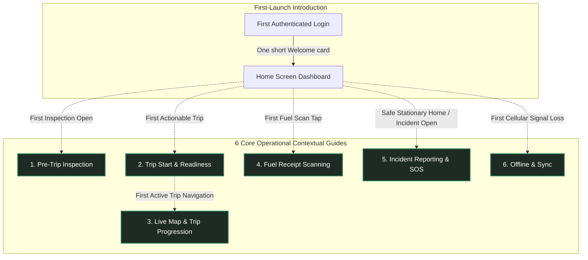

# Feature: Driver In-App Guidance & Contextual Coach Marks

## 1. Product Philosophy

> **"Guidance when needed, not guidance everywhere."**  
> **"Teach the difficult decision or workflow, not the button the driver already understands."**

The FleetOps In-App Guide consists of **6 Core Operational Contextual Guides** plus **1 lightweight First-Launch Introduction**. 

There is:
- **NO** Driver Academy
- **NO** training center or simulated courses
- **NO** training missions
- **NO** cheetah or character mascots
- **NO** gamification, badges, or points
- **NO** certification or completion percentage

The subsystem exists solely to provide lightweight, just-in-time contextual guidance directly over **REAL production UI** at the exact moment a high-stakes workflow first becomes actionable:



---

## 2. First-Launch Introduction

The Welcome card is **NOT** one of the six operational guides. It is a one-time introductory greeting designed to set expectations without impeding the driver.

* **Screen**: `mobile/app/(app)/(tabs)/index.js` (Home Dashboard)
* **Trigger**: First authenticated launch after login and permissions (`fleetops.guide.welcome.v1`).
* **Format**: One compact, calm centered card. **No multi-screen product tour. No Home walkthrough.**
* **Copy**:
  > *"Welcome to FleetOps! We'll guide you through important actions as you use the app. Tips will appear only when they're relevant."*
* **Action**: `[ Got it ]`
* **Rule**: Tapping `[ Got it ]` immediately dismisses the card and returns the driver to the normal Home screen. The dashboard remains completely clean and unencumbered.

---

## 3. Six Core Operational Guides

The **only** six operational areas that receive contextual guidance are:

### 3.1 Pre-Trip Inspection (HIGH Priority)
* **Screen**: `mobile/app/(app)/inspection.js`
* **Trigger**: First time the driver enters a real pre-trip inspection (`fleetops.guide.pretrip.v1`).
* **Operational Scope**: Teach the decision workflow, **not** all seven checklist items individually.
* **Flow**:
  $$\text{PASS / FAIL} \longrightarrow \text{if FAIL} \longrightarrow \text{Remarks required} \longrightarrow \text{All 7 answered} \longrightarrow \text{Complete Inspection}$$
* **Step Details & Interactivity**:
  1. **PASS / FAIL (`inspection.pass_fail`)**:
     - *Interaction*: `passthrough`. The driver taps the **actual** production `PASS` or `FAIL` button through the spotlight cutout.
     - *Copy*: *"Inspect each item carefully. Choose PASS when the item is safe, or FAIL when you find a problem."*
     - *Interaction-Driven Progression*:
       - If driver taps real **PASS**: explanation completes.
       - If driver naturally taps real **FAIL** on item 1 or any subsequent item: existing inspection state changes $\rightarrow$ real Remarks `<TextInput>` mounts $\rightarrow$ measured $\rightarrow$ spotlight transitions to or triggers Remarks (`pretrip_remarks`).
     - *Strict Rule*: Never force FAIL for tutorial purposes.
  2. **Required Remarks (`inspection.remarks`)**:
     - *Interaction*: `passthrough`. The driver can type directly into the real Remarks field.
     - *Copy*: *"Failed checks require a short description so dispatch knows what needs attention."*
     - *Trigger*: Fires whenever any item is marked FAIL if `pretrip_remarks` is not yet completed.
     - *Action*: `[ Got it ]`.
  3. **Complete Inspection (`inspection.complete`)**:
     - *Interaction*: `blocked`. Protected action.
     - *Copy*: *"Tap here once all 7 items are checked. You must complete the inspection before you can start the trip."*
     - *Action*: `[ Got it ]`.
     - *Safety Rule*: Never require the driver to submit the inspection to finish the guide.

---

### 3.2 Trip Start & Readiness (HIGHEST Priority)
* **Screen**: `mobile/app/(app)/trip/[id].js`
* **Trigger**: First time the driver's first assigned trip becomes genuinely actionable (`fleetops.guide.trip_readiness.v1`).
* **Flow**:
  $$\text{Readiness Window} \longrightarrow \text{Pre-Trip Requirement} \longrightarrow \text{Start Trip / Continue to Map}$$
* **Step Details & Interactivity**:
  1. **Readiness Window (`trip.readiness`)**:
     - *Interaction*: `observe`.
     - *Copy*: *"This shows when your trip can begin. FleetOps will not let the trip start before the allowed readiness window."*
     - *Action*: `[ Next → ]`.
  2. **Pre-Trip Dependency (`trip.pretrip_requirement`)**:
     - *Interaction*: `observe`.
     - *Copy*: *"Complete the required vehicle inspection before departure. The start button unlocks once safety is confirmed."*
     - *Action*: `[ Next → ]`.
  3. **Primary Action (`trip.primary_action`)**:
     - *Interaction*: `blocked`. Protected action.
     - *Dynamic Copy*: Derived from real trip state:
       - If active trip (`isContinue === true`): *"Once the trip is active, Continue to Map only returns you to the live trip and navigation."*
       - If pre-departure: *"Start Trip begins the trip when readiness and inspection requirements are satisfied."*
     - *Action*: `[ Got it ]`.
     - *Safety Rules*: The guide must **never** start a trip, accept a trip, mutate trip status, bypass readiness, or bypass inspection.

---

### 3.3 Live Map & Trip Progression (HIGH Priority)
* **Screen**: `mobile/app/(app)/(tabs)/map.js`
* **Trigger**: First time opening Live Map during the first real active trip (`fleetops.guide.live_trip.v1`).
* **Safety Lock**: Never trigger while vehicle is moving (`isDriving === true`).
* **Flow**:
  $$\text{Current Mission} \longrightarrow \text{Telemetry \& GPS Health} \longrightarrow \text{Trip Progression Control}$$
* **Step Details & Interactivity**:
  1. **Current Mission (`map.current_target`)**:
     - *Interaction*: `observe`.
     - *Copy*: *"This shows your current trip target and next service point. Use it to confirm whether you're heading to Pickup or Drop-off."*
     - *Action*: `[ Next → ]`.
  2. **Live Telemetry (`map.telemetry`)**:
     - *Interaction*: `observe`.
     - *Copy*: *"Live route, ETA, and distance are calculated continuously. Telemetry is automatically shared with dispatch."*
     - *Action*: `[ Next → ]`.
  3. **Trip Progression Swipe (`map.trip_progression`)**:
     - *Interaction*: `blocked`. Protected action.
     - *Copy*: *"Slide this control when you reach your waypoint or complete a leg to advance the trip status."*
     - *Action*: `[ Got it ]`.
     - *Rules*: Do **not** highlight the entire map. Do **not** measure WebView route geometry; target only stable React Native UI components. Never require swiping a real status control. Never fabricate GPS, ETA, route, or trip status.

---

### 3.4 Fuel Receipt Scanning (HIGH Priority)
* **Screen**: `mobile/app/(app)/fuel-report.js`
* **Trigger**: First time entering fuel report / receipt scanning (`fleetops.guide.fuel_scan_capture.v1` and `fleetops.guide.fuel_scan_verify.v1`).
* **Real Lifecycle Flow**:
  $$\text{Open Scanner} \longrightarrow \text{Spotlight Frame} \longrightarrow \text{Capture Receipt} \longrightarrow \text{Real OCR Extraction} \longrightarrow \text{Spotlight Verification Fields}$$
* **Step Details & Interactivity**:
  1. **Stage A: Framing (`fuel.viewfinder`)**:
     - *Interaction*: `observe`.
     - *Copy*: *"Place the full receipt inside the frame. Ensure good lighting and avoid glare or folds so AI can read the text."*
     - *Action*: `[ Got it ]`.
     - *Rule*: Never trigger camera shutter automatically.
  2. **Stage B: Verification (`fuel.verify`)**:
     - *Trigger*: Mounts **only** after real OCR extraction succeeds with valid extracted data (`!scanning && receiptScanData && Object.keys(receiptScanData).length > 0`) and review fields render.
     - *Interaction*: `passthrough`. Driver can review and edit real volume and total cost fields.
     - *Copy*: *"Always check the extracted liters and total amount before submitting. Correct any values that were read incorrectly."*
     - *Action*: `[ Got it ]`.
     - *Submit Fuel*: `blocked`. Protected action.
     - *Error Handling*: If extraction fails, times out, or returns empty data, do **not** show verification as though OCR succeeded.

---

### 3.5 Incident Reporting & SOS (HIGH Priority)
* **Surfaces**: Floating SOS Medallion (`DriverSos.js`) and `mobile/app/(app)/incidents.js`.
* **Flow**:
  $$\text{Emergency SOS Explanation} \quad \big| \quad \text{Incident Banner} \longrightarrow \text{Incident Category Selection}$$
* **Step Details & Interactivity**:
  1. **Floating Emergency SOS (`incident.sos`)**:
     - *Trigger*: Safe, stationary context only (`pathname === "/"`, `!isDriving`, 2s stationary delay). Never triggers merely because `DriverSos` mounts.
     - *Interaction*: `blocked`. Protected action.
     - *Copy*: *"Use SOS only for real emergencies (accidents, medical threats, or breakdowns). Your location is immediately shared with the fleet team."*
     - *Action*: `[ Got it ]`.
     - *CRITICAL EMERGENCY OVERRIDE*: A real emergency **always** overrides tutorial behavior. If the driver activates SOS, the coach mark immediately dismisses and stands aside to give the real emergency flow 100% priority.
  2. **Incident Dispatch Alert (`incident.banner`)**:
     - *Screen*: `incidents.js`.
     - *Interaction*: `observe`.
     - *Copy*: *"Submitting an incident immediately alerts the fleet coordinator. Emergency assistance will be deployed if requested."*
     - *Action*: `[ Next → ]`.
  3. **Incident Category Grid (`incident.category`)**:
     - *Screen*: `incidents.js`.
     - *Target*: `<View style={styles.typeGrid}>`.
     - *Interaction*: `passthrough`. Driver may tap the actual category card.
     - *Copy*: *"Choose the category that best describes the situation so dispatch knows what equipment or assistance to send."*
     - *Interaction-Driven Progression*: Selecting a category advances/completes the guide.
     - *Submit Incident*: `blocked`. Protected action. Never create test incidents or submit emergency data automatically.

---

### 3.6 Offline & Sync (MEDIUM-HIGH Priority)
* **Format**: Contextual explanation, **not** a multi-step tutorial.
* **Trigger**: Fires only when a **real** offline condition occurs (`connectivity.status === "offline"`).
* **Target**: Real `ConnectivityBanner` (`offline.banner`).
* **Interaction**: `observe`.
* **Copy**:
  > *"Offline Mode: You can continue viewing saved trip information. Any updates you make will be saved locally and automatically synced when you're back online."*
* **Truthful Vocabulary Rules**:
  The explanation must strictly align with real offline state behavior:
  - **CACHED**: Data previously downloaded and available locally.
  - **NEVER SYNCED**: Data that has never been downloaded and therefore cannot be displayed.
  - **SAVED FOR SYNC**: A local update queued in outbox waiting for connection.
  - **SERVER CONFIRMED**: An update successfully written to backend database.
  - **Strict Rule**: Never claim all information remains available offline.

---

## 4. Interaction Model

Every coach-mark step explicitly defines one of three interaction behaviors:

| Mode | Cutout PointerEvents | Overlay Behavior | Use Cases |
|---|---|---|---|
| **`passthrough`** | `none` | Spotlight cutout is completely unblocked. Underlying React Native component receives real native touches. | Inspection PASS / FAIL, Remarks TextInput, Incident category selection, Fuel verification editable inputs. |
| **`observe`** | `auto` | Target is highlighted; tutorial does not require interaction. Tapping `[ Next → ]` or `[ Got it ]` advances. | Readiness Window, Pre-Trip requirement status, Current Mission, Telemetry, ConnectivityBanner. |
| **`blocked`** | `auto` | Cutout intercepts touches to protect against accidental execution. Advanced solely via `[ Got it ]`. | Emergency SOS, Start Trip CTA, Complete Inspection CTA, Trip Progression Swipe, Submit Incident, Submit Fuel. |

### Interaction-Driven Progression

For safe interactive steps, guidance advances naturally from real state changes rather than forcing artificial `Next` clicks:

```
PASS / FAIL Spotlight
        ↓
Driver taps real FAIL button (real setStatus executes)
        ↓
CoachMarkProvider observes state change via notifyInteraction()
        ↓
Remarks TextInput mounts in screen layout
        ↓
CoachMarkTarget measures real Remarks input
        ↓
Spotlight smoothly transitions to Remarks field
```

> [!IMPORTANT]
> `CoachMarkProvider` **never** mutates production state directly. The driver performs the real action, the screen updates its own state, and the coach mark merely observes.

---

## 5. Spotlight & Target Architecture

### Core Rule: ONE COACH MARK = ONE EXACT COMPONENT TARGET

The spotlight area must be derived from the actual rendered target component via `measureInWindow()`, never:
- a parent screen
- a ScrollView
- a card container
- an arbitrary coordinate box

```javascript
// CoachMarkTarget wraps ONLY the exact component
<CoachMarkTarget id="incident.category" scrollRef={scrollRef}>
  <View style={styles.typeGrid}>
    {/* Category cards */}
  </View>
</CoachMarkTarget>
```

### Spotlight Geometry & Component-Anchored Highlighting
- **Component-Anchored Focus Ring**: Rather than drawing detached, floating decorative borders on a fullscreen root overlay (which can drift or miss the component during transforms, scroll animations, or layout shifts), the visual focus highlight is rendered **directly by `CoachMarkTarget` around its targeted child component**.
- **Fixed Relative Position**: Because the focus ring is rendered inside the target's own container, its position is physically locked to the component itself ($top = -padding, left = -padding, right = -padding, bottom = -padding$). It CANNOT miss the target, even if the component is translated, dragged, animated, or scrolled.
- **Full Interactivity Preserved**: The component-anchored focus ring uses `pointerEvents="none"`, allowing all native taps, gestures, and inputs to pass directly through to the underlying production component.
- **Exact Bounds & Breathing Room**:
  $$x = \text{target}.x - \text{padding}, \quad y = \text{target}.y - \text{padding}, \quad w = \text{target}.w + 2\cdot\text{padding}, \quad h = \text{target}.h + 2\cdot\text{padding}$$
  Padding is 4–8dp breathing room ($8\text{dp}$ default, $4\text{dp}$ for tight buttons). Corner radius is derived from target (`radius + padding`), typically $12\text{--}16\text{dp}$ or $R = \text{size}/2$ for circular medallions.
- **Dual-Ring Contour**: Crisp primary forest-green inner border (`borderWidth: 2`, `borderColor: colors.primary`, subtle shadow) paired with an outer diffused aura ring (`borderWidth: 1.5`, `borderColor: rgba(74, 222, 128, 0.28)` in dark / `rgba(40, 84, 72, 0.20)` in light) creating a luminous, clean spotlight contour that renders reliably on both iOS and Android.
- **Arrival Pulse**: One restrained pulse (`0.25 -> 0.90 -> 0.45`) using cubic ease-out (`Easing.out(Easing.cubic)`) on arrival. **No continuous pulsing loop.**
- **Reduced Motion**: Respects `AccessibilityInfo.isReduceMotionEnabled()`.

### Tactile Tooltip Card Architecture
- **Claymorphic Elevation**: Molded card with specular top sheen (`borderTopColor: rgba(255, 255, 255, 0.95)` light / `rgba(255, 255, 255, 0.14)` dark), bottom shading, and soft ambient drop shadow.
- **Harmonized Arrow**: Tooltip pointer triangle dynamically shares the exact background color of the card (`#FFFFFF` in light mode, `#17221D` in dark mode), eliminating edge color dissonance.
- **Segmented Step Progress**: Multi-step guides feature an interactive segmented dot-and-pill track (`1 / N`) showing current position and remaining steps at a glance.
- **Tactile CTAs**: Primary action buttons feature 40dp height, 12dp radius, subtle top edge highlight (`borderTopColor: rgba(255, 255, 255, 0.28)`), and spring-scale press feedback (`scale: 0.97`).
- **Welcome Badge**: First-launch introduction features an authoritative compass tile (`compass-outline`), establishing an executive, polished tone with zero cartoonish mascots.

### Modal-less 4-Scrim Blocking Architecture

To ensure genuine touch passthrough without native window interception, `CoachMarkOverlay` eliminates React Native `<Modal>`. The overlay renders as an absolute fill container (`pointerEvents="box-none"`) composed of four blocking regions:

```
         TOP BLOCKER (pointerEvents="auto")
LEFT     TARGET HOLE (passthrough: "none" | blocked: "auto")   RIGHT
BLOCKER  --------------------------------------------------   BLOCKER
         BOTTOM BLOCKER (pointerEvents="auto")
```

- Outside regions: 100% dimmed and touch-blocked.
- Target hole: Uncovered and interactive for `passthrough`.

### ScrollView Support & Stale Measurement Prevention
1. **Safe Viewport Check & Active-Target Gating**: Targets inside ScrollViews are checked against the safe visible viewport (`insets.top + 40` to `SCREEN_HEIGHT - insets.bottom - 80`). Auto-scrolling via `scrollRef.current.scrollTo()` is strictly gated to `isCurrentActiveTarget === true` so inactive targets never scroll the viewport prematurely while earlier steps are active.
2. **Auto-Scroll & Layout-Relative Measuring**: Uses `containerRef.current.measureLayout(scrollRef.current, ...)` when available to compute the exact ScrollView offset, scrolls smoothly, and waits $320\text{ms}$ for scroll animation to settle before committing final coordinates.
3. **Android Transition & Window Settlement**: Guard against early $y \le 0$ measurement returns on Android during screen transition by deferring to `requestAnimationFrame` and `InteractionManager.runAfterInteractions()`.
4. **Active Step Re-Measurement & Settling Ticks**: When a step activates or transitions (`currentStepIndex` changes), `CoachMarkTarget` fires an immediate measurement, an interaction-settled measurement, and staggered settling ticks ($80\text{ms}, 240\text{ms}, 480\text{ms}$) to guarantee dynamic async content changes (e.g. vehicle assignment loading) immediately update the spotlight coordinates. The four scrim rectangles and the cutout are driven by **animated** bounds interpolated over $240\text{ms}$, so a re-measure while a mark is open *moves* the spotlight instead of snapping it.
5. **Route Stamping**: All registrations store `route: pathname`. If a target belongs to a different route, `activeTargetLayout` returns `null`.
6. **Zero-Size AND Off-Screen Suppression**: If `width <= 0` or `height <= 0`, the coach mark does **not** display. A target measured entirely outside the safe viewport — above `insets.top + 40`, or beginning below `SCREEN_HEIGHT - insets.bottom - 80` — is rejected too: positive bounds are not enough, because a card scrolled out of view measures positively and the overlay would dim the whole screen with the cutout framing nothing. Only a box **entirely** outside is rejected; a partially visible target still presents, since auto-scroll is gated on `isCurrentActiveTarget` (independent of overlay visibility), so it scrolls in, re-registers at its settled position, and the mark appears then.
7. **Unregister on Unmount, Scoped to the Registering Instance**: Every registration carries the token of the instance that made it. `unregisterTarget(targetId, token)` deletes only its own, so an unmount cannot remove a registration another live instance still holds. This matters because a target id may legitimately be live more than once — `inspection.remarks` mounts once per **failed** checklist item, so two FAILs register the same id twice. The newest live registration wins; when it unmounts, the survivor is promoted rather than the id going dark. A `__DEV__` warning fires when two live mounts register one id with conflicting bounds, since the spotlight would jump between them; it names both instances (a dev-only module counter, because the ownership token is a `Symbol` and logs as `Symbol(coach-mark-target)`), their routes, and the live-instance count under the id, and appends the registering stack — the bounds alone cannot say whether the second registration came from a mount effect, a settle timer, or a native measure callback that had already outlived its screen.
8. **Focus-Scoped, Mount-Guarded Registration**: An instance may only register while the driver can actually see its screen. `CoachMarkTarget` reads `useIsFocused()`: a blurred instance does not measure, and losing focus **drops** its registration outright, because a blurred instance's bounds describe a screen the driver has left. This is what closed the paired conflicting registrations for `incident.category` — a covered stack screen, a background tab, and a route expo-router mounted ahead of time for `router.prefetch` (a PRELOAD is rendered by the native stack as an inactive `Screen`) all stay **mounted**, so every one of them was free to publish bounds for a screen nobody was looking at, and since the provider keeps the newest registration the spotlight followed whichever measured last. The gate is a filter on *every* producer at once rather than a fix aimed at one of them. Focus is re-checked at each registration rather than only where the work was scheduled, because the work outlives the render that scheduled it: `measureInWindow` is a native round trip and the $320\text{ms}$ scroll-settle timer is a timer. `canRegister()` — mounted **and** focused, mirrored into refs by `useLayoutEffect` so the values are correct at commit — guards every async measure callback, and the settle timer is cleared on unmount so it cannot fire after the unregister that would have cleaned it up. Regaining focus re-registers on its own: `isFocused` sits in `measureAndRegister`'s dependencies, so its identity change re-runs the measurement effects.

---

## 6. Persistence & Versioning

Every coach mark is stored independently in `AsyncStorage` and strictly isolated by `driverId`:

```javascript
// Storage key format: fleetops.guide.<key>.v<version>_<driverId>
export function getCoachMarkStorageKey(key, version = 1, driverId = null) {
  const base = `fleetops.guide.${key}.v${version}`;
  return driverId ? `${base}_${driverId}` : base;
}
```

### Version Keys Table

| Scope | Key | Storage Key | Version |
|---|---|---|---|
| **Introduction** | `welcome` | `fleetops.guide.welcome.v1_{driverId}` | 1 |
| **Guide 1** | `pretrip` | `fleetops.guide.pretrip.v1_{driverId}` | 1 |
| | `pretrip_remarks` | `fleetops.guide.pretrip_remarks.v1_{driverId}` | 1 |
| | `pretrip_complete` | `fleetops.guide.pretrip_complete.v1_{driverId}` | 1 |
| **Guide 2** | `trip_readiness` | `fleetops.guide.trip_readiness.v1_{driverId}` | 1 |
| **Guide 3** | `live_trip` | `fleetops.guide.live_trip.v1_{driverId}` | 1 |
| **Guide 4** | `fuel_scan_capture` | `fleetops.guide.fuel_scan_capture.v1_{driverId}` | 1 |
| | `fuel_scan_verify` | `fleetops.guide.fuel_scan_verify.v1_{driverId}` | 1 |
| **Guide 5** | `sos` | `fleetops.guide.sos.v1_{driverId}` | 1 |
| | `incident` | `fleetops.guide.incident.v1_{driverId}` | 1 |
| **Guide 6** | `offline` | `fleetops.guide.offline.v1_{driverId}` | 1 |

---

## 7. Safety Rules

1. **Driving Safety Lock**:
   When vehicle velocity $> 10 \text{ km/h}$ or moving transit is detected, all non-critical coach marks are suppressed until the vehicle is stationary.

   **How it is actually decided** — derived in `mobile/lib/motion-state.js`, fed by the single GPS poster in `mobile/lib/tracking.js`:

   - **Motion source**: the `coords.speed` that the 30 s poster already reads on every fix. `LocationObjectCoords.speed` is **metres per second**, so the $10\ \text{km/h}$ policy threshold is $10 / 3.6 = 2.78\ \text{m/s}$ — comparing against a bare `10` would move the gate to $36\ \text{km/h}$. No second GPS stream, no extra battery cost, and evidence is published on every fix regardless of whether the post succeeds or which branch (trip / responder / standby) it takes.
   - **Sticky hold of 2 minutes**: once motion is seen, the lock holds for 2 minutes after the last *moving* fix. A stationary fix does **not** release it early. Positions arrive every ~30 s, so a latest-fix-only check would un-suppress the guide at a red light, in a traffic queue, in a tunnel, or through any GPS dropout — precisely when the driver is still driving.
   - **Fail open on unknown**: no location permission, tracking disabled in Settings, or no fix yet all read as *stationary*, so the guide still works on a device that never grants location. The lock engages only on positive evidence, and a null speed neither starts nor ends a hold.
   - **Read from the hook, never a prop**: `CoachMarkProvider` calls `useIsDriving()`. Suppression has two halves — a trigger is refused while moving, **and** a mark already on screen is dismissed the moment motion begins. A dimmed scrim left over the map as the driver pulls away is the real hazard, not merely the next mark appearing.
   - **Abandoned, not completed**: a mark taken away by the lock is not written to `AsyncStorage`. A tip the driver never got to read returns once the vehicle is stationary; it is not burned unseen.
   - **Re-checked after every await**: opening a mark reads storage asynchronously, so the lock is consulted again afterwards with a current reading — a gate that only checks before an await can be passed by a vehicle that starts moving during it.
2. **Real Emergency Priority**:
   If an actual emergency interaction occurs, the real SOS action always takes priority and any active coach mark immediately stands aside.
3. **Protected Action Guarantee**:
   SOS, Start Trip, Complete Inspection, Submit Incident, Submit Fuel, and Trip Progression swipe controls must **never** become tutorial-required actions.
4. **No Production State Mutations**:
   Guides explain workflows; they never submit data, mutate trips, or create mock records.
5. **One Guide at a Time**:
   A trigger is refused while a guide is **on screen**, so two guides can never fight over the same moment. The race this removes: Home mounts and shows the Welcome card, then ~2 s later the SOS tip replaced it — so the greeting was never read *and* never marked complete, appearing only on a second launch. The same race let `pretrip_complete` cut off an open `pretrip_remarks`.

   The guard is scoped to what is actually on screen, not merely to "a guide is active". A guide left behind by navigation — or one whose target never registered — is hidden, and blocking on it would strand the driver: an invisible guide offers nothing to dismiss, so every later guide would be refused. Either way the superseded guide is left **incomplete**, so it returns the next time its trigger fires.

   **Collision Recovery**: Both `DriverSos.js` and `ConnectivityBanner.jsx` watch `activeMilestone` in their trigger effects to re-evaluate when a blocking guide (such as `welcome`) is dismissed, ensuring stationary SOS tips and offline mode explanations are not dropped during initial app launches.
   **Route Normalization**: `DriverSos.js` checks `isRouteMatch(pathname, "/")` rather than strict equality, ensuring root route variants (`/index`, `/(tabs)`, `/(app)/(tabs)`) trigger the stationary timer reliably.
   **Target Bounds for Floating Elements**: Floating action buttons (`DriverSos.js`) provide explicit dimensions and layout styles (`sosWrapper` 64×64dp) directly to `CoachMarkTarget` (rendered via `Animated.View`), ensuring `measureInWindow` receives positive dimensions and registers exact coordinates without container collapse.
   **Tab Focus Re-evaluation**: `index.js` triggers `welcome` via `useFocusEffect` rather than a one-time mount effect, ensuring returning to Home after tapping "Reset In-App Tips" in Profile immediately presents the Welcome card.

---

## 8. Replay / Reset In-App Tips

Drivers can review contextual guidance at any time:
- Located in **Profile $\rightarrow$ Help & Support $\rightarrow$ Reset In-App Tips**.
- Invokes `resetAllCoachMarks(driverId)`, clearing all `fleetops.guide.*_<driverId>` keys in `AsyncStorage`.
- Does **not** touch user credentials, auth tokens, device permissions, or trip caches.
- Tips naturally re-appear when the driver enters each operational workflow again.

---

## 9. Verification & Acceptance Criteria

- [x] **Exactly 6 Operational Guide Domains**: Pre-Trip, Trip Readiness, Live Map, Fuel Scan, Incident/SOS, Offline.
- [x] **Lightweight First-Launch Welcome**: Separate 1-card introduction on first login; zero Home walkthrough.
- [x] **Zero Driver Academy / Mascots**: No training courses, missions, cheetah mascot, gamification, badges, or completion percentages.
- [x] **One Coach Mark = One Exact Target**: Spotlights wrap smallest meaningful controls via `measureInWindow()`, never entire screens or parent cards.
- [x] **Real 4-Scrim Passthrough Interactivity**: Modal-less absolute fill with 4 blocking regions; unblocked cutout for passthrough controls (PASS/FAIL, Remarks, Category, Fuel fields).
- [x] **Protected Action Guarantee**: Critical actions (SOS, Start Trip, Complete Inspection, Swipe Progression) use `interaction: "blocked"` and advance via `[ Got it ]` without accidental execution.
- [x] **Emergency SOS Priority**: Real SOS immediately overrides and dismisses any active tutorial state.
- [x] **State-Driven Progression**: State changes on real controls advance guidance via `notifyInteraction()` without mutating production state from the guide system.
- [x] **ScrollView Safe Viewport**: Auto-scrolls parent ScrollViews to offscreen targets and settles layout before measuring. Every scrollable target is given the `scrollRef` it needs: `inspection.*`, `incident.category`, `trip.readiness`, `trip.pretrip_requirement`, and `fuel.verify`. Targets outside a ScrollView (`trip.primary_action`, `fuel.viewfinder`, `map.*`, `incident.sos`, `offline.banner`) are fixed chrome and are on screen whenever they render.
- [x] **Stale Target Rejection**: Target registrations stamped with `route: pathname`; cross-route, zero-sized, **or entirely off-screen** targets suppress overlay presentation.
- [x] **Focus-Scoped Registration**: Only a focused instance registers — a covered stack screen, a background tab, or a `router.prefetch` PRELOAD cannot publish bounds. Blur drops the registration; focus re-registers. Async measure callbacks and the $320\text{ms}$ settle timer re-check mount + focus, and the timer is cleared on unmount.
- [x] **Truthful Offline Copy**: Distinguishes Cached, Never Synced, Saved for Sync, and Server Confirmed.
- [x] **Driving Safety Lock**: Guidance suppressed above $10\ \text{km/h}$ — sticky for 2 minutes, failing open on unknown motion, and dismissing (abandoning, not completing) a mark already on screen when motion begins.
- [x] **One Guide at a Time**: A trigger cannot pre-empt a guide that is on screen; the superseded guide stays incomplete and returns later.
- [x] **Per-Driver Persistence**: Isolated per `driverId` and survives app cold starts.
- [x] **Automated Test Coverage**: `mobile/lib/motion-state.test.js` (11 tests) covers the motion arithmetic and hold window; `mobile/lib/coach-marks.test.js` (44 tests) covers the definitions, storage, and provider wiring for the safety lock, the one-guide-at-a-time guard, target ownership, and off-screen rejection. Verified 2026-09-19 with 190/190 passing tests across `mobile/lib/`.
