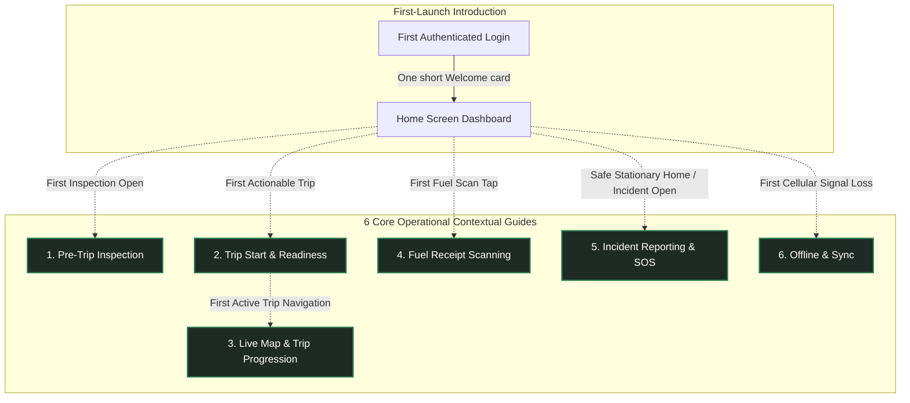

# Feature: Driver In-App Guidance & Contextual Coach Marks

## 1. Product Philosophy

> **"Guidance when needed, not guidance everywhere."**  
> **"Teach the difficult decision or workflow, not the button the driver already understands."**

The FleetOps In-App Guide consists of **6 Core Operational Contextual Guides** plus **1 lightweight First-Launch Introduction**. 

There is:
- **NO** Driver Academy
- **NO** training center or simulated courses
- **NO** training missions
- **NO** cheetah or character mascots
- **NO** gamification, badges, or points
- **NO** certification or completion percentage

The subsystem exists solely to provide lightweight, just-in-time contextual guidance directly over **REAL production UI** at the exact moment a high-stakes workflow first becomes actionable:



---

## 2. First-Launch Introduction

The Welcome card is **NOT** one of the six operational guides. It is a one-time introductory greeting designed to set expectations without impeding the driver.

* **Screen**: `mobile/app/(app)/(tabs)/index.js` (Home Dashboard)
* **Trigger**: First authenticated launch after login and permissions (`fleetops.guide.welcome.v1`).
* **Format**: One compact, calm centered card. **No multi-screen product tour. No Home walkthrough.**
* **Copy**:
  > *"Welcome to FleetOps! We'll guide you through important actions as you use the app. Tips will appear only when they're relevant."*
* **Action**: `[ Got it ]`
* **Rule**: Tapping `[ Got it ]` immediately dismisses the card and returns the driver to the normal Home screen. The dashboard remains completely clean and unencumbered.

---

## 3. Six Core Operational Guides

The **only** six operational areas that receive contextual guidance are:

### 3.1 Pre-Trip Inspection (HIGH Priority)
* **Screen**: `mobile/app/(app)/inspection.js`
* **Trigger**: First time the driver enters a real pre-trip inspection (`fleetops.guide.pretrip.v1`).
* **Operational Scope**: Teach the decision workflow, **not** all seven checklist items individually.
* **Flow**:
  $$\text{PASS / FAIL} \longrightarrow \text{if FAIL} \longrightarrow \text{Remarks required} \longrightarrow \text{All 7 answered} \longrightarrow \text{Complete Inspection}$$
* **Step Details & Interactivity**:
  1. **PASS / FAIL (`inspection.pass_fail`)**:
     - *Interaction*: `passthrough`. The driver taps the **actual** production `PASS` or `FAIL` button through the spotlight cutout.
     - *Copy*: *"Inspect each item carefully. Choose PASS when the item is safe, or FAIL when you find a problem."*
     - *Interaction-Driven Progression*:
       - If driver taps real **PASS**: explanation completes.
       - If driver naturally taps real **FAIL** on item 1 or any subsequent item: existing inspection state changes $\rightarrow$ real Remarks `<TextInput>` mounts $\rightarrow$ measured $\rightarrow$ spotlight transitions to or triggers Remarks (`pretrip_remarks`).
     - *Strict Rule*: Never force FAIL for tutorial purposes.
  2. **Required Remarks (`inspection.remarks`)**:
     - *Interaction*: `passthrough`. The driver can type directly into the real Remarks field.
     - *Copy*: *"Failed checks require a short description so dispatch knows what needs attention."*
     - *Trigger*: Fires whenever any item is marked FAIL if `pretrip_remarks` is not yet completed.
     - *Action*: `[ Got it ]`.
  3. **Complete Inspection (`inspection.complete`)**:
     - *Interaction*: `blocked`. Protected action.
     - *Copy*: *"Tap here once all 7 items are checked. You must complete the inspection before you can start the trip."*
     - *Action*: `[ Got it ]`.
     - *Safety Rule*: Never require the driver to submit the inspection to finish the guide.

---

### 3.2 Trip Start & Readiness (HIGHEST Priority)
* **Screen**: `mobile/app/(app)/trip/[id].js`
* **Trigger**: First time the driver's first assigned trip becomes genuinely actionable (`fleetops.guide.trip_readiness.v1`).
* **Flow**:
  $$\text{Readiness Window} \longrightarrow \text{Pre-Trip Requirement} \longrightarrow \text{Start Trip / Continue to Map}$$
* **Step Details & Interactivity**:
  1. **Readiness Window (`trip.readiness`)**:
     - *Interaction*: `observe`.
     - *Copy*: *"This shows when your trip can begin. FleetOps will not let the trip start before the allowed readiness window."*
     - *Action*: `[ Next → ]`.
  2. **Pre-Trip Dependency (`trip.pretrip_requirement`)**:
     - *Interaction*: `observe`.
     - *Copy*: *"Complete the required vehicle inspection before departure. The start button unlocks once safety is confirmed."*
     - *Action*: `[ Next → ]`.
  3. **Primary Action (`trip.primary_action`)**:
     - *Interaction*: `blocked`. Protected action.
     - *Dynamic Copy*: Derived from real trip state:
       - If active trip (`isContinue === true`): *"Once the trip is active, Continue to Map only returns you to the live trip and navigation."*
       - If pre-departure: *"Start Trip begins the trip when readiness and inspection requirements are satisfied."*
     - *Action*: `[ Got it ]`.
     - *Safety Rules*: The guide must **never** start a trip, accept a trip, mutate trip status, bypass readiness, or bypass inspection.

---

### 3.3 Live Map & Trip Progression (HIGH Priority)
* **Screen**: `mobile/app/(app)/(tabs)/map.js`
* **Trigger**: First time opening Live Map during the first real active trip (`fleetops.guide.live_trip.v1`).
* **Safety Lock**: Never trigger while vehicle is moving (`isDriving === true`).
* **Flow**:
  $$\text{Current Mission} \longrightarrow \text{Telemetry \& GPS Health} \longrightarrow \text{Trip Progression Control}$$
* **Step Details & Interactivity**:
  1. **Current Mission (`map.current_target`)**:
     - *Interaction*: `observe`.
     - *Copy*: *"This shows your current trip target and next service point. Use it to confirm whether you're heading to Pickup or Drop-off."*
     - *Action*: `[ Next → ]`.
  2. **Live Telemetry (`map.telemetry`)**:
     - *Interaction*: `observe`.
     - *Copy*: *"Live route, ETA, and distance are calculated continuously. Telemetry is automatically shared with dispatch."*
     - *Action*: `[ Next → ]`.
  3. **Trip Progression Swipe (`map.trip_progression`)**:
     - *Interaction*: `blocked`. Protected action.
     - *Copy*: *"Slide this control when you reach your waypoint or complete a leg to advance the trip status."*
     - *Action*: `[ Got it ]`.
     - *Rules*: Do **not** highlight the entire map. Do **not** measure WebView route geometry; target only stable React Native UI components. Never require swiping a real status control. Never fabricate GPS, ETA, route, or trip status.

### 3.3.1 First Map Tour (implemented 2026-09-20)

The first intentional Map exploration has its own milestone: `map_intro`, version 1, route `/map`, stored through the existing driver-scoped key `fleetops.guide.map_intro.v1_{driverId}`. It is triggered only from the actual `Map` tab press in `CurvedPillTabBar`; Map screen focus or programmatic navigation does not start it.

The tour uses four new exact targets:

1. `map.standby_status` — the existing standby Live Tracking / Waiting for assignment header.
2. `map.controls` — the existing recenter / Layers / locate control group.
3. `map.layers` — the existing Layers control, with no automatic coverage change.
4. `map.trip_practice` — the local-only practice surface.

The practice surface uses five local stages: Start Route, Arrived at Pickup, Picked Up Guest, Arrived at Destination, and Dropped Off Guest. Each stage requires a right swipe, resets on an early release, shows a restrained success state, and advances only after the local gesture succeeds. It never calls trip, dispatch, reservation, GPS, geofence, odometer, incident, or notification APIs. `Finish Tour` is the only normal completion action that writes `map_intro` completion.

The existing `live_trip` milestone and its `map.current_target`, `map.telemetry`, and `map.trip_progression` targets remain unchanged. A map-specific pending/active gate prevents the real-trip guide from pre-empting the first Map tour; after completion or skip, the existing active-trip trigger may retry. The first Map walkthrough is a UI-only exception to the motion gate so a Map tap can show the tutorial immediately; the Driving Safety Lock remains unchanged for the other milestones.

If the first Map-tab tap lands while a trip is already active, `map_intro` still has priority over `live_trip`. The active route sheet supplies the existing status header and map-control targets; the Layers explanation uses a read-only tutorial preview because the active-trip branch does not render the standby radar Layers control. No production action or trip state is changed.

### 3.3.2 Map first-visit reliability hardening (source, 2026-09-21)

The first Map tour now mounts its stable React Native targets while GPS is still resolving, so the initial spotlight is not hidden behind the normal GPS loader. A fresh location request remains bounded and falls back to a recent cached fix before the existing watcher starts. The own-vehicle marker keeps the bundled PNG when available and retains the original small radar-dot fallback when the asset is unavailable.

After Reset In-App Tips, an intentional Map-tab tap may dismiss the reset-triggered Home Welcome card and claim `map_intro`; the Welcome scrim stays pass-through for navigation while its own card remains actionable. This is a Map-specific handoff and does not reorder or change any other tooltip. The previous downloaded APK is not treated as verification of this source correction; it was verified instead on the Metro dev-client path (2026-09-21), so no EAS rebuild was needed.

### 3.3.3 Presentation gate: the spotlight was refused for being on screen (source, 2026-09-21)

Section 3.3.2 hardened the *trigger*: the milestone is claimed from the Map tab, and the Home Welcome card hands off. That was necessary but not sufficient, and reading the presentation gate is what showed why four rounds of green suites changed nothing on the device.

A guide presents only when `activeTargetLayout !== null`, and every way of failing that gate was a bare `return null`. So "the trigger never fired" and "the target never measured" produced identical device behaviour, and nothing distinguished them: the coach-mark suite reads source text rather than rendering. The trigger side was re-verified as sound — `mapIntroPendingRef` is set synchronously before `map_intro`'s storage read and re-checked after `triggerMilestone`'s own read (`:391`), so neither async claim can pre-empt the other, and the registration token bookkeeping already ignores a stale instance's measurements.

**Root cause (device run, `__DEV__` warning).** The gate refused a target that was entirely visible:

```
[coachmarks] spotlight not presenting — target above the safe viewport
  { milestone: "map_intro", pathname: "/map", targetId: "map.standby_status",
    detail: { y: 16, height: 49.78, minSafeY: 79.11 } }
```

`map.standby_status` occupied `16 → 65.78` — fully on screen, and the intended target of step 0. The gate demanded its bottom edge clear `minSafeY = insets.top + 40` (`insets.top` = 39.11 in the provider). The slack was simply wrong for a top-anchored target: the header declares `top: insets.top + 16`, so its settled box is `insets.top + 16 .. insets.top + 66` and clears that bar by only 26px. The refusal happened because the target's own insets had not settled when it measured (`16 = 0 + 16`) while the provider's already had — so the same declaration produced two different coordinate systems in one frame. Testing against a margin made presentation depend on that race.

Two source changes:

- **The gate tests the window, not a margin.** Rejection is now whole-box against the window edges (`y + height <= 0`, `y >= SCREEN_HEIGHT`), which is what the gate's own comment already claimed it did — "rejected only when the box is ENTIRELY outside the safe viewport… a partially visible target must still present". The `insets.top + 40` / `SCREEN_HEIGHT - insets.bottom - 80` slack is gone, and the reason strings now say *entirely above/below the window*. Presentation no longer depends on inset-settling order.
- **The gate reports its reason.** In `__DEV__` only and deduped by signature, a `console.warn` names which rejection fired (never registered / zero-size / other route / entirely above or below the window) with the milestone, target and bounds. The latch clears when the spotlight presents. This is what produced the line above; without it the failure was invisible from both the device and the suite.

Two supporting changes, neither of which was the cause:

- **Bounded self-retry in `CoachMarkTarget`**, entered **only from the invalid branches** — a zero-dimension measurement, or a re-measure still at `ry <= 0` — at a 150 ms interval against a 4 s deadline, reset per step. The earlier hypothesis that this was the root cause was **wrong**: the device log showed a perfectly valid measurement being refused. It is kept because it hardens the same class the device did exhibit (a target measuring before its layout settles), and because an unsettled `ry <= 0` was previously *published* rather than retried. A correctly-measured target is never re-measured, which matters because the ScrollView auto-scroll path is gated on `isPartiallyHidden`: re-entering it would re-fire `scrollTo` and stack its 320 ms settle timers.
- **`mapIntroAwaitingTap` is unreachable** (see `Bugs.md`): its only writer runs when the active milestone is `map_intro`, but both call sites are mutually exclusive with that branch, so the guards reading it are inert. Recorded, not changed.

**Status: gate fix applied and device-confirmed 2026-09-21.** The suite that would cover this cannot render components, so confirmation had to come from a device run on the Metro path (`npm run dev` at the root plus `npm start -- --dev-client --lan` in `mobile`), which needed no APK rebuild. The spotlight presents.

### 3.3.4 The spotlight landed off the element (source, 2026-09-21)

Section 3.3.3 made the spotlight present. It then appeared on every step — and in the wrong place, **uniformly**, on all of them. A uniform offset is a coordinate-space mismatch, not a per-target measurement error, and this one is structural rather than a slip in the geometry arithmetic.

`CoachMarkTarget` registers bounds from `measureInWindow`, which reports **window** coordinates. `CoachMarkOverlay` draws its scrim and its cutout with `StyleSheet.absoluteFill` inside the *provider's* container (`CoachMarkProvider.jsx:713`). Those are the same space only while that container sits exactly at the window origin — and it need not: the container also holds `<ConnectivityBanner />` as a layout-participating sibling above the navigator (`app/(app)/_layout.js:78`), so a visible banner, or any parent padding, inset or transform, moves every cutout by the same amount. That is precisely the observed signature, which is why the fix is in the overlay's frame of reference rather than in any individual target's numbers.

`CoachMarkOverlay` now measures its own container's window origin and subtracts it from the target bounds before geometry is computed (`containerRef` / `containerOrigin`, re-measured on a `Dimensions` change). The subtraction is a **no-op at the window origin**, so a case that already lines up cannot regress — the fix is correct by construction rather than by tuning a constant.

**Status: applied to source and device-confirmed 2026-09-21.** A second `__DEV__` diagnostic prints the container origin beside the bounds it was subtracted from, deduped per geometry change; on-device confirmation is that the highlight now aligns, so the subtraction accounted for the offset and the registered bounds were sound.

---

### 3.4 Fuel Receipt Scanning (HIGH Priority)
* **Screen**: `mobile/app/(app)/fuel-report.js`
* **Trigger**: First time entering fuel report / receipt scanning (`fleetops.guide.fuel_scan_capture.v1` and `fleetops.guide.fuel_scan_verify.v1`).
* **Real Lifecycle Flow**:
  $$\text{Open Scanner} \longrightarrow \text{Spotlight Frame} \longrightarrow \text{Capture Receipt} \longrightarrow \text{Real OCR Extraction} \longrightarrow \text{Spotlight Verification Fields}$$
* **Step Details & Interactivity**:
  1. **Stage A: Framing (`fuel.viewfinder`)**:
     - *Interaction*: `observe`.
     - *Copy*: *"Place the full receipt inside the frame. Ensure good lighting and avoid glare or folds so AI can read the text."*
     - *Action*: `[ Got it ]`.
     - *Rule*: Never trigger camera shutter automatically.
  2. **Stage B: Verification (`fuel.verify`)**:
     - *Trigger*: Mounts **only** after real OCR extraction succeeds with valid extracted data (`!scanning && receiptScanData && Object.keys(receiptScanData).length > 0`) and review fields render.
     - *Interaction*: `passthrough`. Driver can review and edit real volume and total cost fields.
     - *Copy*: *"Always check the extracted liters and total amount before submitting. Correct any values that were read incorrectly."*
     - *Action*: `[ Got it ]`.
     - *Submit Fuel*: `blocked`. Protected action.
     - *Error Handling*: If extraction fails, times out, or returns empty data, do **not** show verification as though OCR succeeded.

---

### 3.5 Incident Reporting & SOS (HIGH Priority)
* **Surfaces**: Floating SOS Medallion (`DriverSos.js`) and `mobile/app/(app)/incidents.js`.
* **Flow**:
  $$\text{Emergency SOS Explanation} \quad \big| \quad \text{Incident Banner} \longrightarrow \text{Incident Category Selection}$$
* **Step Details & Interactivity**:
  1. **Floating Emergency SOS (`incident.sos`)**:
     - *Trigger*: Safe, stationary context only (`pathname === "/"`, `!isDriving`, 2s stationary delay). Never triggers merely because `DriverSos` mounts.
     - *Interaction*: `blocked`. Protected action.
     - *Copy*: *"Use SOS only for real emergencies (accidents, medical threats, or breakdowns). Your location is immediately shared with the fleet team."*
     - *Action*: `[ Got it ]`.
     - *CRITICAL EMERGENCY OVERRIDE*: A real emergency **always** overrides tutorial behavior. If the driver activates SOS, the coach mark immediately dismisses and stands aside to give the real emergency flow 100% priority.
  2. **Incident Dispatch Alert (`incident.banner`)**:
     - *Screen*: `incidents.js`.
     - *Interaction*: `observe`.
     - *Copy*: *"Submitting an incident immediately alerts the fleet coordinator. Emergency assistance will be deployed if requested."*
     - *Action*: `[ Next → ]`.
  3. **Incident Category Grid (`incident.category`)**:
     - *Screen*: `incidents.js`.
     - *Target*: `<View style={styles.typeGrid}>`.
     - *Interaction*: `passthrough`. Driver may tap the actual category card.
     - *Copy*: *"Choose the category that best describes the situation so dispatch knows what equipment or assistance to send."*
     - *Interaction-Driven Progression*: Selecting a category advances/completes the guide.
     - *Submit Incident*: `blocked`. Protected action. Never create test incidents or submit emergency data automatically.

---

### 3.6 Offline & Sync (MEDIUM-HIGH Priority)
* **Format**: Contextual explanation, **not** a multi-step tutorial.
* **Trigger**: Fires only when a **real** offline condition occurs (`connectivity.status === "offline"`).
* **Target**: Real `ConnectivityBanner` (`offline.banner`).
* **Interaction**: `observe`.
* **Copy**:
  > *"Offline Mode: You can continue viewing saved trip information. Any updates you make will be saved locally and automatically synced when you're back online."*
* **Truthful Vocabulary Rules**:
  The explanation must strictly align with real offline state behavior:
  - **CACHED**: Data previously downloaded and available locally.
  - **NEVER SYNCED**: Data that has never been downloaded and therefore cannot be displayed.
  - **SAVED FOR SYNC**: A local update queued in outbox waiting for connection.
  - **SERVER CONFIRMED**: An update successfully written to backend database.
  - **Strict Rule**: Never claim all information remains available offline.

---

## 4. Interaction Model

Every coach-mark step explicitly defines one of three interaction behaviors:

| Mode | Cutout PointerEvents | Overlay Behavior | Use Cases |
|---|---|---|---|
| **`passthrough`** | `none` | Spotlight cutout is completely unblocked. Underlying React Native component receives real native touches. | Inspection PASS / FAIL, Remarks TextInput, Incident category selection, Fuel verification editable inputs. |
| **`observe`** | `auto` | Target is highlighted; tutorial does not require interaction. Tapping `[ Next → ]` or `[ Got it ]` advances. | Readiness Window, Pre-Trip requirement status, Current Mission, Telemetry, ConnectivityBanner. |
| **`blocked`** | `auto` | Cutout intercepts touches to protect against accidental execution. Advanced solely via `[ Got it ]`. | Emergency SOS, Start Trip CTA, Complete Inspection CTA, Trip Progression Swipe, Submit Incident, Submit Fuel. |

### Interaction-Driven Progression

For safe interactive steps, guidance advances naturally from real state changes rather than forcing artificial `Next` clicks:

```
PASS / FAIL Spotlight
        ↓
Driver taps real FAIL button (real setStatus executes)
        ↓
CoachMarkProvider observes state change via notifyInteraction()
        ↓
Remarks TextInput mounts in screen layout
        ↓
CoachMarkTarget measures real Remarks input
        ↓
Spotlight smoothly transitions to Remarks field
```

> [!IMPORTANT]
> `CoachMarkProvider` **never** mutates production state directly. The driver performs the real action, the screen updates its own state, and the coach mark merely observes.

The first Map tour uses the same `passthrough` mechanism for its practice spotlight, plus an opt-in `requiresInteraction` guard. Its tooltip CTA cannot advance a practice stage by tap alone; only the local right-swipe callback can move the tutorial forward.

---

## 5. Spotlight & Target Architecture

### Core Rule: ONE COACH MARK = ONE EXACT COMPONENT TARGET

The spotlight area must be derived from the actual rendered target component via `measureInWindow()`, never:
- a parent screen
- a ScrollView
- a card container
- an arbitrary coordinate box

```javascript
// CoachMarkTarget wraps ONLY the exact component
<CoachMarkTarget id="incident.category" scrollRef={scrollRef}>
  <View style={styles.typeGrid}>
    {/* Category cards */}
  </View>
</CoachMarkTarget>
```

### Spotlight Geometry & Dual-System Architecture
- **Component-Local Contour vs. Global Scrim Cutout**: The system separates visual focus into two distinct mechanisms:
  1. **Component-Local Focus Ring**: Rendered directly by `CoachMarkTarget` inside the target component's own layout tree (`pointerEvents="none"`). It remains physically attached to the component ($top = -padding, left = -padding, right = -padding, bottom = -padding$) and follows local view transforms naturally.
  2. **Global Scrim Cutout & Tooltip**: Rendered by `CoachMarkOverlay` based on absolute screen coordinates measured via `measureInWindow()`. It requires a fresh active-generation measurement, route validation, focus validation, safe viewport bounds, and layout settlement.
- **Freshness Invariant**: *"The local contour is component-anchored. The global cutout and tooltip are shown only after a fresh measurement for the active presentation."*
- **Presentation Generation Contract (`activePresentationId`)**: Every milestone trigger and step transition increments an internal generation counter in `CoachMarkProvider`. Target registrations carry this generation ID. `activeTargetLayout` strictly rejects any measurement whose `presentationId !== activePresentationId`. The overlay remains suppressed until a fresh measurement arrives, preventing stale mount coordinates or displaced pre-drag rectangles from ever misdirecting the spotlight (e.g. exposing the "More" tile instead of the SOS button).
- **Draggable & Transformed Target Hardening (`measureRevision`)**: Transformed or draggable elements such as the floating SOS button (`DriverSos.js`) distinguish temporary gesture transforms from committed resting positions. `DriverSos` enforces `positionReady` (preventing auto-presentation before `AsyncStorage` offset hydration completes) and bumps a `layoutRevision` counter when hydration finishes and when spring snapping settles. Passing `measureRevision` to `CoachMarkTarget` triggers an immediate authoritative re-measurement after native interactions settle.
- **Exact Bounds & Breathing Room**:
  $$x = \text{target}.x - \text{padding}, \quad y = \text{target}.y - \text{padding}, \quad w = \text{target}.w + 2\cdot\text{padding}, \quad h = \text{target}.h + 2\cdot\text{padding}$$
  Padding is 4–8dp breathing room ($8\text{dp}$ default, $4\text{dp}$ for tight buttons). Corner radius is derived from target (`radius + padding`), typically $12\text{--}16\text{dp}$ or $R = \text{size}/2$ for circular medallions.
- **Shape-Responsive Cutout**: The hole is **not fixed as a rectangle**. Its corner radius is resolved from the target's declared radius and scaled by the padding —
  $$R_{hole} = \min(\text{radius} + \text{padding},\ \min(w_{hole}, h_{hole})/2)$$
  which is the same rule the local contour uses, so contour and hole stay concentric instead of drifting apart. A control that declares $\text{radius} = \text{size}/2$ is stating that it is round: its hole becomes a true circle rather than a rounded square, a pill becomes a stadium, and a card stays a rounded rectangle. A radius that did *not* grow with the padding would flatten a circle the moment the hole exceeded the target, which is why the rule is `radius + padding` and not a tuned constant — for a fully-rounded target the two are algebraically identical.
  The scrim is painted by a **single** view whose content box *is* the hole: only its thick border paints (`borderWidth` = the larger screen dimension, so it reaches every edge), and that border's inner edge keeps `borderRadius`, making the hole's shape exact. It cannot also block touches, because its bounds include the hole itself and it would swallow `passthrough` steps — so the four rectangles remain as **transparent** touch blockers with their geometry unchanged. One paint rather than four matters because the scrim is semi-transparent ($0.76$ dark / $0.65$ light): overlapping scrim views composite twice and leave a visible seam, which is what rules out the usual corner-patch approach.
  Pure logic lives in `lib/spotlight-geometry.js`; `lib/spotlight-geometry.test.js` asserts circle, stadium, card, zero-padding, edge clipping and the stadium clamp.
- **Dual-Ring Contour**: Crisp primary forest-green inner border (`borderWidth: 2`, `borderColor: colors.primary`, subtle shadow) paired with an outer diffused aura ring (`borderWidth: 1.5`, `borderColor: rgba(74, 222, 128, 0.28)` in dark / `rgba(40, 84, 72, 0.20)` in light) creating a luminous, clean spotlight contour that renders reliably on both iOS and Android.
- **Arrival Pulse**: One restrained pulse (`0.25 -> 0.90 -> 0.45`) using cubic ease-out (`Easing.out(Easing.cubic)`) on arrival. **No continuous pulsing loop.**
- **Reduced Motion**: Respects `AccessibilityInfo.isReduceMotionEnabled()`.

### Tactile Tooltip Card Architecture
- **Claymorphic Elevation**: Molded card with specular top sheen (`borderTopColor: rgba(255, 255, 255, 0.95)` light / `rgba(255, 255, 255, 0.14)` dark), bottom shading, and soft ambient drop shadow.
- **Harmonized Arrow**: Tooltip pointer triangle dynamically shares the exact background color of the card (`#FFFFFF` in light mode, `#17221D` in dark mode), eliminating edge color dissonance.
- **Segmented Step Progress**: Multi-step guides feature an interactive segmented dot-and-pill track (`1 / N`) showing current position and remaining steps at a glance.
- **Tactile CTAs**: Primary action buttons feature 40dp height, 12dp radius, subtle top edge highlight (`borderTopColor: rgba(255, 255, 255, 0.28)`), and spring-scale press feedback (`scale: 0.97`).
- **Welcome Badge**: First-launch introduction features an authoritative compass tile (`compass-outline`), establishing an executive, polished tone with zero cartoonish mascots.

### Modal-less 4-Scrim Blocking Architecture

To ensure genuine touch passthrough without native window interception, `CoachMarkOverlay` eliminates React Native `<Modal>`. The overlay renders as an absolute fill container (`pointerEvents="box-none"`) with a single shaped scrim painting over four touch-blocking regions:

```
         TOP BLOCKER (pointerEvents="auto", transparent)
LEFT     TARGET HOLE (shaped: circle | stadium | rounded rect)   RIGHT
BLOCKER  ------------------------------------------------------   BLOCKER
         BOTTOM BLOCKER (pointerEvents="auto", transparent)
```

- Outside regions: fully dimmed and touch-blocked. The dim is painted by one shaped scrim view; the four rectangles beneath it are transparent and exist only to block touches.
- Target hole: uncovered, shaped to the target, and interactive for `passthrough`.
- Accepted trade-off: the slivers inside the rectangular blocker region but outside a rounded hole are dimmed yet still touch-transparent — about $0.215r^2$ per corner, roughly $31\text{dp}^2$ at $r = 12$, well under a touch target.

### Provider Context Partition (re-render isolation)

`CoachMarkProvider` publishes the guide through **three** contexts rather than one, partitioned by **how often each field changes** rather than by what it is about. The reason is mechanical: a context value is compared by identity, and the value was a plain object literal, so it was new on every provider render — which meant every consumer re-rendered for *any* provider render at all: a route change, a window resize, a keyboard event, or one target settling.

| Context | Fields | Moves when |
|---|---|---|
| `CoachMarkActionsContext` | `triggerMilestone`, `triggerMapIntroFromTab`, `registerTarget`, `unregisterTarget`, `notifyInteraction`, `nextStep`, `prevStep`, `skip`, `dismiss`, `dismissCoachMark`, `resetTips` | a route change or a driving-lock flip |
| `CoachMarkStatusContext` | `activeMilestone`, `mapIntroPending`, `mapIntroAwaitingTap`, `isDriving` | milestone transitions |
| `CoachMarkStateContext` | `currentStepIndex`, `currentStep`, `stepContext`, `activeTargetLayout`, `activePresentationId`, `currentRoute` | step transitions and settling re-measures |

Consumers subscribe to the narrowest group they actually need — `useCoachMarkActions()`, `useCoachMarkStatus()`, `useCoachMarkState()`. `useCoachMarks()` still returns all three merged for anything needing more than one group, so it remains the safe default. Six of the eleven consumers — the tab bar, the trip screen, the checklist, incidents, Home and Help — need only callbacks and are now **never re-rendered by tutorial activity**.

- **The three step-dependent callbacks are delegated.** `nextStep`, `prevStep` and `notifyInteraction` close over the current step, so their identity changed on every step transition; published raw they would re-create the actions value each time and drag every actions-only consumer back into re-rendering. The actions context carries stable delegates that read the latest definition from a ref written at commit. That changes nothing about what the callback does — they are only ever reached from an event handler, so a call always runs the definition from the render on screen — and it keeps the actions identity still across steps.
- **`triggerMilestone` is deliberately *not* delegated.** It closes over `isDriving`, and several screens trigger it from an effect whose only other dependencies are their own local state (`inspection.js`, `incidents.js`, `fuel-report.js`). That identity change is what re-runs those effects the moment the driving lock releases, so a guide suppressed while moving appears once parked. Freezing it would strand those triggers until something unrelated changed. `registerTarget` is left raw for the same shape of reason — it carries the route — and costs nothing, because `CoachMarkTarget` lists `pathname` as a dependency of its own measurement callback anyway.
- **The heaviest screens are the point.** Pre-Trip Inspection (a seven-item checklist) and Incidents subscribe to actions alone; Fuel Report's viewfinder, the SOS FAB and the connectivity banner subscribe to actions + status and never to the volatile step context. `lib/coach-marks.test.js` pins this as a deliberate tripwire: a change that needs the volatile context on one of those screens fails the suite, so the performance consequence is looked at rather than discovered on a device.

### ScrollView Support & Stale Measurement Prevention
1. **Window-Edge Check & Active-Target Gating**: Targets inside ScrollViews are checked against the window edges — a box is refused only when it lies entirely above (`y + height \le 0`) or entirely below (`y \ge SCREEN\_HEIGHT`) the window, so a partially visible target still presents. Auto-scrolling via `scrollRef.current.scrollTo()` is strictly gated to `isCurrentActiveTarget === true` so inactive targets never scroll the viewport prematurely while earlier steps are active.
2. **Auto-Scroll & Layout-Relative Measuring**: Uses `containerRef.current.measureLayout(scrollRef.current, ...)` when available to compute the exact ScrollView offset, scrolls smoothly, and waits $320\text{ms}$ for scroll animation to settle before committing final coordinates.
3. **Android Transition & Window Settlement**: Guard against early $y \le 0$ measurement returns on Android during screen transition by deferring to `requestAnimationFrame` and `InteractionManager.runAfterInteractions()`.
4. **Active Step Re-Measurement & Settling Ticks**: When a step activates or transitions (`currentStepIndex` changes), `CoachMarkTarget` fires an immediate measurement, an interaction-settled measurement, and staggered settling ticks ($80\text{ms}, 240\text{ms}, 480\text{ms}$) to guarantee dynamic async content changes (e.g. vehicle assignment loading) immediately update the spotlight coordinates. The shaped scrim, its four transparent touch blockers, and the cutout are all driven by **animated** bounds interpolated over $240\text{ms}$, so a re-measure while a mark is open *moves* the spotlight instead of snapping it. The corner radius is a plain value by comparison, so it snaps rather than tweening when a step changes a target's shape.
5. **Route Stamping**: All registrations store `route: pathname`. If a target belongs to a different route, `activeTargetLayout` returns `null`.
6. **Zero-Size AND Off-Screen Suppression**: If `width <= 0` or `height <= 0`, the coach mark does **not** display. A target measured entirely outside the window — wholly above (`y + height \le 0`) or wholly below (`y \ge SCREEN\_HEIGHT`) — is rejected too: positive bounds are not enough, because a card scrolled out of view measures positively and the overlay would dim the whole screen with the cutout framing nothing. Only a box **entirely** outside is rejected; a partially visible target still presents, since auto-scroll is gated on `isCurrentActiveTarget` (independent of overlay visibility), so it scrolls in, re-registers at its settled position, and the mark appears then.
7. **Unregister on Unmount, Scoped to the Registering Instance**: Every registration carries the token of the instance that made it. `unregisterTarget(targetId, token)` deletes only its own, so an unmount cannot remove a registration another live instance still holds. This matters because a target id may legitimately be live more than once — `inspection.remarks` mounts once per **failed** checklist item, so two FAILs register the same id twice. The newest live registration wins; when it unmounts, the survivor is promoted rather than the id going dark. A `__DEV__` warning fires when two live mounts register one id with conflicting bounds, since the spotlight would jump between them; it names both instances (a dev-only module counter, because the ownership token is a `Symbol` and logs as `Symbol(coach-mark-target)`), their routes, and the live-instance count under the id, and appends the registering stack — the bounds alone cannot say whether the second registration came from a mount effect, a settle timer, or a native measure callback that had already outlived its screen.
8. **Focus-Scoped, Mount-Guarded Registration**: An instance may only register while the driver can actually see its screen. `CoachMarkTarget` reads `useIsFocused()`: a blurred instance does not measure, and losing focus **drops** its registration outright, because a blurred instance's bounds describe a screen the driver has left. This is what closed the paired conflicting registrations for `incident.category` — a covered stack screen, a background tab, and a route expo-router mounted ahead of time for `router.prefetch` (a PRELOAD is rendered by the native stack as an inactive `Screen`) all stay **mounted**, so every one of them was free to publish bounds for a screen nobody was looking at, and since the provider keeps the newest registration the spotlight followed whichever measured last. The gate is a filter on *every* producer at once rather than a fix aimed at one of them. Focus is re-checked at each registration rather than only where the work was scheduled, because the work outlives the render that scheduled it: `measureInWindow` is a native round trip and the $320\text{ms}$ scroll-settle timer is a timer. `canRegister()` — mounted **and** focused, mirrored into refs by `useLayoutEffect` so the values are correct at commit — guards every async measure callback, and the settle timer is cleared on unmount so it cannot fire after the unregister that would have cleaned it up. Regaining focus re-registers on its own: `isFocused` sits in `measureAndRegister`'s dependencies, so its identity change re-runs the measurement effects.

---

## 6. Persistence & Versioning

Every coach mark is stored independently in `AsyncStorage` and strictly isolated by `driverId`:

```javascript
// Storage key format: fleetops.guide.<key>.v<version>_<driverId>
export function getCoachMarkStorageKey(key, version = 1, driverId = null) {
  const base = `fleetops.guide.${key}.v${version}`;
  return driverId ? `${base}_${driverId}` : base;
}
```

### Version Keys Table

| Scope | Key | Storage Key | Version |
|---|---|---|---|
| **Introduction** | `welcome` | `fleetops.guide.welcome.v1_{driverId}` | 1 |
| **First Map Tour** | `map_intro` | `fleetops.guide.map_intro.v1_{driverId}` | 1 |
| **Guide 1** | `pretrip` | `fleetops.guide.pretrip.v1_{driverId}` | 1 |
| | `pretrip_remarks` | `fleetops.guide.pretrip_remarks.v1_{driverId}` | 1 |
| | `pretrip_complete` | `fleetops.guide.pretrip_complete.v1_{driverId}` | 1 |
| **Guide 2** | `trip_readiness` | `fleetops.guide.trip_readiness.v1_{driverId}` | 1 |
| **Guide 3** | `live_trip` | `fleetops.guide.live_trip.v1_{driverId}` | 1 |
| **Guide 4** | `fuel_scan_capture` | `fleetops.guide.fuel_scan_capture.v1_{driverId}` | 1 |
| | `fuel_scan_verify` | `fleetops.guide.fuel_scan_verify.v1_{driverId}` | 1 |
| **Guide 5** | `sos` | `fleetops.guide.sos.v1_{driverId}` | 1 |
| | `incident` | `fleetops.guide.incident.v1_{driverId}` | 1 |
| **Guide 6** | `offline` | `fleetops.guide.offline.v1_{driverId}` | 1 |

---

## 7. Safety Rules

1. **Driving Safety Lock**:
   When vehicle velocity $> 10 \text{ km/h}$ or moving transit is detected, all non-critical coach marks are suppressed until the vehicle is stationary.

   **How it is actually decided** — derived in `mobile/lib/motion-state.js`, fed by the single GPS poster in `mobile/lib/tracking.js`:

   - **Motion source**: the `coords.speed` that the 30 s poster already reads on every fix. `LocationObjectCoords.speed` is **metres per second**, so the $10\ \text{km/h}$ policy threshold is $10 / 3.6 = 2.78\ \text{m/s}$ — comparing against a bare `10` would move the gate to $36\ \text{km/h}$. No second GPS stream, no extra battery cost, and evidence is published on every fix regardless of whether the post succeeds or which branch (trip / responder / standby) it takes.
   - **Sticky hold of 2 minutes**: once motion is seen, the lock holds for 2 minutes after the last *moving* fix. A stationary fix does **not** release it early. Positions arrive every ~30 s, so a latest-fix-only check would un-suppress the guide at a red light, in a traffic queue, in a tunnel, or through any GPS dropout — precisely when the driver is still driving.
   - **Fail open on unknown**: no location permission, tracking disabled in Settings, or no fix yet all read as *stationary*, so the guide still works on a device that never grants location. The lock engages only on positive evidence, and a null speed neither starts nor ends a hold.
   - **Read from the hook, never a prop**: `CoachMarkProvider` calls `useIsDriving()`. Suppression has two halves — a trigger is refused while moving, **and** a mark already on screen is dismissed the moment motion begins. A dimmed scrim left over the map as the driver pulls away is the real hazard, not merely the next mark appearing.
   - **Abandoned, not completed**: a mark taken away by the lock is not written to `AsyncStorage`. A tip the driver never got to read returns once the vehicle is stationary; it is not burned unseen.
   - **Re-checked after every await**: opening a mark reads storage asynchronously, so the lock is consulted again afterwards with a current reading — a gate that only checks before an await can be passed by a vehicle that starts moving during it.
2. **Real Emergency Priority**:
   If an actual emergency interaction occurs, the real SOS action always takes priority and any active coach mark immediately stands aside.
3. **Protected Action Guarantee**:
   SOS, Start Trip, Complete Inspection, Submit Incident, Submit Fuel, and Trip Progression swipe controls must **never** become tutorial-required actions.
4. **No Production State Mutations**:
   Guides explain workflows; they never submit data, mutate trips, or create mock records.
5. **One Guide at a Time**:
   A trigger is refused while a guide is **on screen**, so two guides can never fight over the same moment. The race this removes: Home mounts and shows the Welcome card, then ~2 s later the SOS tip replaced it — so the greeting was never read *and* never marked complete, appearing only on a second launch. The same race let `pretrip_complete` cut off an open `pretrip_remarks`.

   The guard is scoped to what is actually on screen, not merely to "a guide is active". A guide left behind by navigation — or one whose target never registered — is hidden, and blocking on it would strand the driver: an invisible guide offers nothing to dismiss, so every later guide would be refused. Either way the superseded guide is left **incomplete**, so it returns the next time its trigger fires.

   **Collision Recovery**: Both `DriverSos.js` and `ConnectivityBanner.jsx` watch `activeMilestone` in their trigger effects to re-evaluate when a blocking guide (such as `welcome`) is dismissed, ensuring stationary SOS tips and offline mode explanations are not dropped during initial app launches.
   **Route Normalization**: `DriverSos.js` checks `isRouteMatch(pathname, "/")` rather than strict equality, ensuring root route variants (`/index`, `/(tabs)`, `/(app)/(tabs)`) trigger the stationary timer reliably.
   **Target Bounds for Floating Elements**: Floating action buttons (`DriverSos.js`) provide explicit dimensions and layout styles (`sosWrapper` 64×64dp) directly to `CoachMarkTarget` (rendered via `Animated.View`), ensuring `measureInWindow` receives positive dimensions and registers exact coordinates without container collapse.
   **Tab Focus Re-evaluation**: `index.js` triggers `welcome` via `useFocusEffect` rather than a one-time mount effect, ensuring returning to Home after tapping "Reset In-App Tips" in Profile immediately presents the Welcome card.

---

## 8. Replay / Reset In-App Tips

Drivers can review contextual guidance at any time:
- Located in **Profile $\rightarrow$ Help & Support $\rightarrow$ Reset In-App Tips**.
- Invokes `resetAllCoachMarks(driverId)`, clearing all `fleetops.guide.*_<driverId>` keys in `AsyncStorage`.
- Does **not** touch user credentials, auth tokens, device permissions, or trip caches.
- Tips naturally re-appear when the driver enters each operational workflow again.

---

## 9. Verification & Acceptance Criteria

- [x] **Exactly 6 Operational Guide Domains**: Pre-Trip, Trip Readiness, Live Map, Fuel Scan, Incident/SOS, Offline.
- [x] **Lightweight First-Launch Welcome**: Separate 1-card introduction on first login; zero Home walkthrough.
- [x] **Zero Driver Academy / Mascots**: No training courses, missions, cheetah mascot, gamification, badges, or completion percentages.
- [x] **One Coach Mark = One Exact Target**: Spotlights wrap smallest meaningful controls via `measureInWindow()`, never entire screens or parent cards.
- [x] **Real 4-Scrim Passthrough Interactivity**: Modal-less absolute fill with 4 blocking regions; unblocked cutout for passthrough controls (PASS/FAIL, Remarks, Category, Fuel fields).
- [x] **Protected Action Guarantee**: Critical actions (SOS, Start Trip, Complete Inspection, Swipe Progression) use `interaction: "blocked"` and advance via `[ Got it ]` without accidental execution.
- [x] **Emergency SOS Priority**: Real SOS immediately overrides and dismisses any active tutorial state.
- [x] **State-Driven Progression**: State changes on real controls advance guidance via `notifyInteraction()` without mutating production state from the guide system.
- [x] **ScrollView Safe Viewport**: Auto-scrolls parent ScrollViews to offscreen targets and settles layout before measuring. Every scrollable target is given the `scrollRef` it needs: `inspection.*`, `incident.category`, `trip.readiness`, `trip.pretrip_requirement`, and `fuel.verify`. Targets outside a ScrollView (`trip.primary_action`, `fuel.viewfinder`, `map.*`, `incident.sos`, `offline.banner`) are fixed chrome and are on screen whenever they render.
- [x] **Stale Target Rejection**: Target registrations stamped with `route: pathname`; cross-route, zero-sized, **or entirely off-screen** targets suppress overlay presentation.
- [x] **Focus-Scoped Registration**: Only a focused instance registers — a covered stack screen, a background tab, or a `router.prefetch` PRELOAD cannot publish bounds. Blur drops the registration; focus re-registers. Async measure callbacks and the $320\text{ms}$ settle timer re-check mount + focus, and the timer is cleared on unmount.
- [x] **Truthful Offline Copy**: Distinguishes Cached, Never Synced, Saved for Sync, and Server Confirmed.
- [x] **Driving Safety Lock**: Guidance suppressed above $10\ \text{km/h}$ — sticky for 2 minutes, failing open on unknown motion, and dismissing (abandoning, not completing) a mark already on screen when motion begins.
- [x] **One Guide at a Time**: A trigger cannot pre-empt a guide that is on screen; the superseded guide stays incomplete and returns later.
- [x] **Per-Driver Persistence**: Isolated per `driverId` and survives app cold starts.
- [x] **Fresh-Measurement Presentation Generation Gate**: An overlay may never render from a target rectangle measured before current step activation. `activeTargetLayout` enforces `presentationId === activePresentationId`, keeping the overlay suppressed until a fresh measurement lands; the rejection is reported in `__DEV__` alongside the other gate reasons.
- [x] **Transformed Target Settlement & Hardening**: Draggable floating SOS button distinguishes temporary drag transform from settled layout. Auto-presentation is gated on `positionReady === true` (after `AsyncStorage` hydration), and drag/spring settlement increments `layoutRevision` passed via `measureRevision` to `CoachMarkTarget`.
- [x] **Dual-System Documentation Parity**: Documentation clearly separates the component-anchored local contour from the global scrim cutout and tooltip.
- [x] **Shape-Responsive Spotlight Hole**: The cutout follows the target's declared shape instead of always being a rectangle — a circle for round controls (`map.layers`, the `DriverSos` FAB), a stadium for pills, a rounded rectangle for cards. The radius rule is extracted to `lib/spotlight-geometry.js` with `lib/spotlight-geometry.test.js`, which is the first coach-mark *behaviour* this suite can assert rather than string-match. **Not yet device-confirmed**: shape is the one property the suite cannot observe, so the `[coachmarks] spotlight geometry` line now reports `holeRadius` and `circular` for a device run to settle.
- [x] **Context Partition & Re-render Isolation**: The guide is published through three contexts split by change frequency (actions / status / state) instead of one un-memoized value object, so a step transition or a settling re-measure no longer re-renders consumers that only call into the guide. The six actions-only consumers are never re-rendered by tutorial activity; the checklist and incidents screen are pinned to that contract by `lib/coach-marks.test.js`. **Not yet measured**: this is a structural fix reasoned from the code, not a profiler result — no render counter has been run on a device.
- [x] **Automated Test Coverage**: `mobile/lib/motion-state.test.js` (11 tests), `mobile/lib/spotlight-geometry.test.js` (11 tests), `mobile/lib/coach-marks.test.js` (70 tests), and `mobile/lib/map-intro.test.js` (5 tests) cover the motion arithmetic, Map-intro stages, storage, intentional-tab wiring, provider race guard, target ownership, off-screen rejection, freshness semantics (stale-generation rejection, fresh-generation acceptance, step-transition invalidation, route-change/blur invalidation, SOS layout revision updates), spotlight shape resolution, the context partition, and tutorial render isolation. Verified 2026-09-21 with 27 files / 239 tests passing across `mobile/lib/` and touched-file ESLint at `--max-warnings 0`.
- [ ] **Physical Android Device Verification**: Real-device verification matrix (floating SOS button spotlight alignment $\le 2\text{--}4\text{dp}$, no exposure of "More" tile, saved offset restoration, and driving safety lock) remains mandatory before declaring complete.

### Map first-install trigger simplification — 2026-09-21

For `map_intro` only, the eligibility rule is now intentionally simple:
`Map tab clicked` and `map_intro` is not completed for the current driver. The
tutorial does not wait for location permission, a GPS fix, or motion state;
GPS remains responsible for the car marker and live tracking. Other guidance
milestones remain unchanged. Focused coach-mark/Map-intro tests passed **60/60**;
no APK rebuild was run.

## First-install map tutorial implementation — 2026-09-20

- Implemented the first intentional Map-tab tour as a separate `map_intro` milestone. Home `welcome`, the existing `live_trip` guide, and all non-Map tooltip definitions remain separate.
- Added the exact standby header/control/layers targets and the local-only five-stage swipe practice. The production `SwipeButton` and trip API branches were not reused for tutorial callbacks.
- Kept the practice card off the normal Map render path: it mounts only during `map_intro` practice, is memoized against GPS-driven parent renders, and uses native-driver thumb animations.
- Preserved per-driver AsyncStorage, Reset In-App Tips, route-scoped target measurement, reduced-motion handling, accessibility activation, and the Driving Safety Lock for non-Map milestones.
- Verification: mobile library suite passed 25/25 files and 201/201 tests; touched mobile ESLint passed with zero warnings; Android Expo export bundled 1,387 modules with `--no-bytecode`. The normal Hermes bytecode export remains environment-blocked by `hermesc.exe` permission denied on this Windows workspace.

### Map marker recovery after first-install APK (2026-09-20)

- Root cause: the Map screen awaited a fresh highest-accuracy GPS fix before setting `driverLocation` or starting `watchPositionAsync`; on Android, a delayed or failed first request left the own-vehicle marker absent.
- Fix: `mobile/app/(app)/(tabs)/map.js` now times out the fresh request after 8 seconds, falls back to a recent `getLastKnownPositionAsync` fix (5-minute age / 1 km accuracy), seeds the existing fix ref, and then keeps the existing live watcher, heading, and odometer paths unchanged.
- The change is isolated to Map location initialization. No coach-mark definition, provider, target, reset behavior, other tooltip, fake radar data, or production trip callback changed.
- Verification: touched-file ESLint passed; coach-mark and Map-intro tests passed 56/56; Android export bundled 1,387 modules; final EAS preview build `2dea7830-a960-4fd4-8e5c-4f11168ce7dd` finished successfully. Final APK: https://expo.dev/artifacts/eas/9CcUWryae0tYqy6s0SgRvNDB5QCI2liNFy_HZp5PjvY.apk
