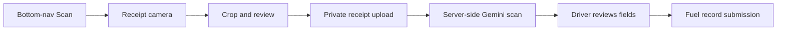

# Feature: Fuel

## Status: working scanner flow — USER-CONFIRMED

Receipt capture and Gemini extraction work on-device. The last live row-count check was 2026-08-11, when `fuelrecords` had **0 rows**; the database count was not re-queried today, so persisted end-to-end usage remains to be verified after the latest scanner change.

## What exists

| Piece | Note |
|---|---|
| `src/services/fuel.service.js` | **33 lines of `apiFetch`** — a client fetch wrapper, not a domain service → [[DEBT Services Folder Mixes Two Concerns]] |
| `/api/fuel/*` routes | CRUD |
| Dashboard page | Under `(dashboard)/` |
| Mobile refuel screen | Embedded receipt camera, review, manual recovery, and fuel submission |
| `/api/mobile/fuel/upload` | Stores the driver's receipt and returns a signed URL |
| `/api/mobile/fuel/scan` | Verifies URL ownership, fetches the uploaded image, and invokes Gemini server-side |
| `gemini-receipt.js` | Structured extraction and strict field normalization |
| `fuelstations` | Table **dropped** in an earlier migration; still appears in both stale ERDs → [[DOC ERDs Missing Core Table]] |

## Mobile receipt flow — VERIFIED 2026-08-22

- The center navigation action opens the camera immediately with `scan=1`.
- `CameraView` captures the receipt; `receipt-crop.js` maps the visible guide to the source image before resize/compression.
- Gemini model: `gemini-3.1-flash-lite`, structured JSON, 12-second server timeout.
- Fields: `station_name`, `fuel_date`, `liters`, `price_per_liter`, and final `amount`.
- Brand normalization: Petron → `PETRON`; Shell/Skyewin Prime Resources → `SHELL`. Dealer/operator names are not stored as the station brand.
- Petron's `Description / Qty / Price / Amount` layout and Skyewin's discounted final invoice are explicitly described in the extraction prompt.
- Local ML Kit/deterministic receipt parsing has been removed. Gemini failure keeps the receipt attached and falls back to driver review/manual completion.
- Odometer is no longer extracted or entered. `POST /api/mobile/fuel` derives it from the assigned vehicle's latest server-side mileage.
- Price per liter is shown independently when Gemini reads it; the server still calculates the stored value from `amount / liters`.
- The old fuel-gauge card was removed because receipt volume is not the same as the vehicle's current tank level.

## Trust boundaries

- Gemini API credentials stay on the server.
- The scan route only accepts a signed receipt URL owned by the authenticated driver.
- Receipt images must be valid image responses and no larger than 10 MB.
- Driver, trip, vehicle, fuel type, odometer, price per liter, and initial `Pending` status are server-owned or server-derived.
- `client_submission_id` keeps mobile submissions idempotent.

## Why it's worth a note

`fuel.service.js` is the clearest example of the naming collision in `src/services/`: it sits alongside `reservation-lifecycle.service.js`, which does transactions and DB writes, but it is 33 lines of browser `fetch`. Same folder, same suffix, completely different kind of module.

## Remaining verification

Save one Petron and one Skyewin/Shell scan against an active trip, then verify the resulting `fuelrecords` row, automatic odometer, signed receipt URL, calculated price per liter, and `Pending` review status.

## Related

[[Fleet And Vehicles]] · [[DEBT Services Folder Mixes Two Concerns]] · [[Feature Index]] · [[Reports]]
