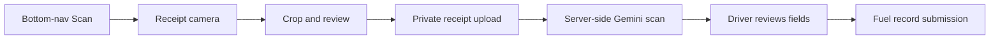

# Feature: Fuel

## Status: working scanner flow — USER-CONFIRMED

Receipt capture and Gemini extraction work on-device. The last live row-count check was 2026-08-11, when `fuelrecords` had **0 rows**; the database count was not re-queried today, so persisted end-to-end usage remains to be verified after the latest scanner change.

## Positioning: a Fuel Planning, Authorization, Monitoring & Consumption Control system

The module is deliberately structured in four layers (external review adopted 2026-08-25):

| Layer | Purpose | Where it lives |
|---|---|---|
| Planning | Predict upcoming fuel requirement from dispatch data | 24h forecast query + `request-policy.js` |
| Authorization | Control how much may be purchased | Auto-authorization policy + manager ladder |
| Transaction | Record actual refueling | Mobile receipt flow (`/api/mobile/fuel`) |
| Analytics | Actual consumption & anomalies | Variance flag, budget utilization, reports |

## What exists

| Piece | Note |
|---|---|
| `src/services/fuel.service.js` | **33 lines of `apiFetch`** — a client fetch wrapper, not a domain service → [[DEBT Services Folder Mixes Two Concerns]] |
| `/api/fuel/*` routes | CRUD |
| Dashboard page | Under `(dashboard)/` |
| Mobile refuel screen | Embedded receipt camera, review, manual recovery, and fuel submission |
| `/api/mobile/fuel/upload` | Stores the driver's receipt and returns a short-lived signed URL **plus** the object key |
| `/api/mobile/fuel/scan` | Verifies URL ownership, fetches the uploaded image, and invokes Gemini server-side |
| `gemini-receipt.js` | Structured extraction and strict field normalization (now incl. `fuel_type`) |
| `/api/fuel/requests` | Driver-submitted consolidated refill requests + policy auto-authorization + manager approval ladder |
| `/api/fuel/allocations` | Monthly per-vehicle budget plus tank capacity / efficiency profile |
| `request-policy.js` | Pure decision core: recommendation math, variance check, fuel-policy evaluation, tank/type checks |
| `fuelstations` | Table **dropped** in an earlier migration; still appears in both stale ERDs → [[DOC ERDs Missing Core Table]] |

## Fuel request lifecycle — three-value model — VERIFIED 2026-08-25

The refill decision separates three numbers so the manager sees *why*, not just an amount (external review adopted 2026-08-25):

| Value | Formula | Example (60 L tank · 25% · 160 km @ 8 km/L) |
|---|---|---|
| **Minimum safe refill** | `forecast_consumption + reserve − current`, floored at 0 | **11 L** |
| **Preferred target** | `min(tank, max(90% tank, consumption + reserve)) − current` | **39 L** (to 54 L) |
| **Maximum allowed** | `tank_capacity × (1 − reported level)` | **45 L** |

The 90% target is deliberately kept as a *preferred* operating level to reduce repeated refueling stops — it is displayed next to the minimum, never instead of it.

### Approval: policy auto-authorization + manager ladder — VERIFIED 2026-08-25

**Auto-authorization (strict conditions, all server-computed).** At request creation `evaluateFuelPolicy()` approves instantly (`status='Approved'`, `approved_by=NULL`, `auto_authorized: true` in the snapshot) only when **all** hold:

- a positive recommendation exists,
- no fuel variance was detected,
- the forecast fits inside the tank (no range warning),
- minimum safe ≤ recommendation,
- the monthly budget covers the recommended liters.

Anything else stays `Pending` with its reasons in `policy_reasons`. Drivers cannot influence any input — `requested_liters` is always the server's own recommendation. Auto-authorized requests immediately count as committed against the budget. The audit trail logs action `auto-authorize` vs plain `create`.

**Manager ladder (for exceptions).**

| `gemini-receipt.js` | Structured extraction and strict field normalization (now incl. `fuel_type`) |
| `/api/fuel/requests` | Driver-submitted consolidated refill requests + policy auto-authorization + manager approval ladder |
| `/api/fuel/allocations` | Monthly per-vehicle budget plus tank capacity / efficiency profile |
| `request-policy.js` | Pure decision core: recommendation math, variance check, fuel-policy evaluation, tank/type checks |
| `fuelstations` | Table **dropped** in an earlier migration; still appears in both stale ERDs → [[DOC ERDs Missing Core Table]] |

## Fuel request lifecycle — three-value model — VERIFIED 2026-08-25

The refill decision separates three numbers so the manager sees *why*, not just an amount (external review adopted 2026-08-25):

| Value | Formula | Example (60 L tank · 25% · 160 km @ 8 km/L) |
|---|---|---|
| **Minimum safe refill** | `forecast_consumption + reserve − current`, floored at 0 | **11 L** |
| **Preferred target** | `min(tank, max(90% tank, consumption + reserve)) − current` | **39 L** (to 54 L) |
| **Maximum allowed** | `tank_capacity × (1 − reported level)` | **45 L** |

The 90% target is deliberately kept as a *preferred* operating level to reduce repeated refueling stops — it is displayed next to the minimum, never instead of it.

### Approval: policy auto-authorization + manager ladder — VERIFIED 2026-08-25

**Auto-authorization (strict conditions, all server-computed).** At request creation `evaluateFuelPolicy()` approves instantly (`status='Approved'`, `approved_by=NULL`, `auto_authorized: true` in the snapshot) only when **all** hold:

- a positive recommendation exists,
- no fuel variance was detected,
- the forecast fits inside the tank (no range warning),
- minimum safe ≤ recommendation,
- the monthly budget covers the recommended liters.

Anything else stays `Pending` with its reasons in `policy_reasons`. Drivers cannot influence any input — `requested_liters` is always the server's own recommendation. Auto-authorized requests immediately count as committed against the budget. The audit trail logs action `auto-authorize` vs plain `create`.

**Manager ladder (for exceptions).**

1. `approved < minimum_safe_liters` → blocked unless an override reason is provided (schedule changed / cancelled trip / emergency)
2. `minimum ≤ approved ≤ recommended` → normal
3. `approved > recommended` → reason required
4. `approved > monthly budget remaining` → allowed with a required override reason; the modal warns "will exceed by N L" — hotel operations are never hard-blocked by budget
5. Tank-space cap always applies

### Budget tiers (not a quota)

The plan table shows per-vehicle utilization: normal under 80%, amber "Near budget limit" ≥ 80%, red "Budget exceeded" > 100% with review required. Vocabulary is deliberately *budget/target*, not *allowance*.

### Transaction validation & verification studio

At receipt submission (`POST /api/mobile/fuel`), beyond actual ≤ authorized and allocation-month checks:

- **Impossible-quantity check** — estimated current level + claimed liters must fit the tank, else 409
- **Fuel-type mismatch flag** — Gemini extracts the product line (`fuel_type`); stored in `fuelrecords.receipt_fuel_type` (migration 067) and compared to the vehicle's fuel type in the verification studio. Flag-only, never blocking: receipts often omit the product, and "Diesel Max"-style product names normalize to Diesel/Gasoline/Gasoline≈Petrol synonyms or null.
- **High-End Receipt Verification Studio (`ReceiptVerificationModal`)** — provides a dedicated thermal-receipt inspection workspace:
  - 🔄 90° image rotation for mobile pump photos
  - 🌓 Thermal paper contrast booster (clarifies faint blue/purple/grey thermal print)
  - 🔍 Fluid zoom, pan, and fullscreen inspection dialog
  - 🛡️ Three-check automated audit cockpit (Fuel Type Compatibility, Tank Space Plausibility, and Math Consistency)
  - ⚡ Quick-reason rejection dialog (`RejectClaimDialog`) with single-click preset chips.

### Gauge photo evidence + AI-assisted level read — VERIFIED 2026-08-25 (build)

Every fuel request is backed by a dashboard gauge photo (**required** — enforced in the app UI *and* server-side: `POST /api/fuel/requests` rejects without an owned `gauge_photo_url`).

- **Camera-only capture** ? no gallery option, so the evidence must be a fresh in-app camera shot; the bottom-nav scan shortcut routes contextually (approved request → receipt camera, otherwise → gauge camera).
- **Assisted input, never trusted input**: at capture time the photo is uploaded to `fuel-receipts/{driverId}/gauge/` and scanned by `gemini-gauge.js` (`scanFuelGaugeWithGemini`). The estimate only **pre-fills** the level field when it is still empty; the driver always confirms. Unreadable → fail-closed nulls ("enter manually"), never a guess — `normalizeGaugeScan` also rejects impossible values instead of clamping them into lies.
- Prompt explicitly warns the model away from temperature/tach gauges and handles needle **and** digital-segment gauges.
- Manager review panel shows the claimed % next to the photo thumbnail (zoomable) plus what the AI read (`calculation_snapshot.gauge_scan`).
- Accuracy is measurable without a real vehicle: `scripts/gauge-fixtures.html` renders synthetic gauges at exact levels (needle, tilted, digital) → `scripts/verify-gauge-scan.mjs <folder> <token>` uploads them through the real pipeline and prints a ±5 / ±10 point accuracy table.
- Gemini credentials come from the `aiproviders` table **or fall back to `GEMINI_API_KEY` in `.env.local`** (`llm-adapter.js`) — live scanning works without any DB setup.

Stacking order of trust for one claim: gauge photo + AI read → driver-confirmed % → variance flag vs history → receipt liters ≤ authorized → manager verification.

### Fuel variance flag

At request creation the server compares the driver-reported level against the last reported level minus completed-trip consumption since (`assessFuelVariance`). A gap larger than **15% of tank capacity** stores `fuel_variance` in `calculation_snapshot` and renders "Fuel variance detected — review recommended" in the review modal; a flagged request always goes to the manager's Pending queue, never auto-authorized. The gauge photo above is the visual evidence layer on top of this flag.

### Allowance semantics (committed vs consumed)

`allocationUsage()` deducts only **verified** liters (`fuelrecords.status='Approved'`) as consumed, and additionally holds approved-but-unverified request amounts as *committed* so concurrent approvals cannot double-spend the same allocation. Remaining = allocated − consumed − committed.

All values ride in the `fuelrequests.calculation_snapshot` JSONB; the receipt fuel type is the one new column (`fuelrecords.receipt_fuel_type`, migration 067). Legacy pending rows derive their floor via `minimumSafeFromSnapshot()`.

### Manual verification checklist (defense-ready)

1. **T1 happy path** — driver requests with a low gauge % → manager reviews six-tile panel → approve → mobile unlocks logging → receipt → verify claim → verified liters consume budget
2. **Sufficient-fuel rejection** — high gauge % → 409 by design
3. **Below-minimum approval** — blocked without override reason, allowed with one
4. **Above-budget approval** — warns "exceeds by N L", allowed only with reason
5. **Auto-authorization** — clean request (no variance, budget ok) approves itself instantly: no Review button needed, "Within policy" badge on Approved row
6. **Variance badge** — report far below expected remaining → amber flag in review modal, request goes to Pending even if otherwise clean
7. **Impossible quantity** — submit liters > tank space → 409
8. **Fuel-type mismatch** — receipt stating another product shows ⚠ in verification modal
9. **Budget tiers** — set allocation low → utilization bar turns amber/red

## Mobile receipt flow — VERIFIED 2026-08-22

- The center navigation action opens the camera immediately with `scan=1`.
- `CameraView` captures the receipt; `receipt-crop.js` maps the visible guide to the source image before resize/compression.
- Gemini model: `gemini-3.1-flash-lite`, structured JSON, 12-second server timeout.
- Fields: `station_name`, `fuel_date`, `liters`, `price_per_liter`, and final `amount`.
- Brand normalization: Petron → `PETRON`; Shell/Skyewin Prime Resources → `SHELL`. Dealer/operator names are not stored as the station brand.
- Petron's `Description / Qty / Price / Amount` layout and Skyewin's discounted final invoice are explicitly described in the extraction prompt.
- Local ML Kit/deterministic receipt parsing has been removed. Gemini failure keeps the receipt attached and falls back to driver review/manual completion.
- Odometer is no longer extracted or entered. `POST /api/mobile/fuel` derives it from the assigned vehicle's latest server-side mileage.
- Price per liter is shown independently when Gemini reads it; the server still calculates the stored value from `amount / liters`.
- The old fuel-gauge card was removed because receipt volume is not the same as the vehicle's current tank level.

## Trust boundaries

- Gemini API credentials stay on the server.
- The scan route only accepts a receipt reference owned by the authenticated driver — either an owned signed URL or an owned object key, both matched against the same expected path prefix.
- Receipt images must be valid image responses and no larger than 10 MB.
- Driver, trip, vehicle, fuel type, odometer, price per liter, and initial `Pending` status are server-owned or server-derived.
- `client_submission_id` keeps mobile submissions idempotent.
- **The stored filename's extension is server-derived** (2026-09-17). It used to
  come from `file.name?.split(".").pop()`, so `receipt.html` declared as
  `image/png` was stored as `<uuid>.html` under `Content-Type: image/png` — the
  exact disagreement a content sniffer is built to resolve, and a stored-XSS
  shape wherever the object is served from a host that honours the extension.
  `storeFuelReceipt` now uses the extension the magic-byte validator returned,
  as `vehicles/[id]/image/route.js` already did. Found by the security
  assessment (SEC-UPLOAD-002, LOW). → [[Travel Expenses]] carries the same fix.
- **An owned receipt URL is matched segment-by-segment** (same pass,
  SEC-UPLOAD-004). `isOwnedFuelImageUrl` used `path.includes(...)`, so
  `/…/sign/other-bucket/storage/v1/object/sign/fuel-receipts/4/x.png` satisfied
  it, and decoding the path first let an encoded separator (`fuel-receipts%2F4%2F`)
  decode *into* a match the real path never had. It now builds the expected path
  one percent-encoded segment at a time and compares it as a raw **prefix**,
  keeping the host check and the `token` requirement.
- **The fuel columns store an object KEY, not a URL** (2026-09-18, SEC-UPLOAD-003
  Phase B). `receipt_url` and `gauge_photo_url` used to hold a ten-year signed
  URL — a bearer credential with no revocation path, and the column was readable.
  Both now hold a bucket-qualified key (`fuel-receipts/4/….jpg`) and every reader
  signs a 1-hour URL on the way out: `api/fuel`, `api/fuel/[id]`,
  `api/fuel/requests`, `api/admin/analytics/fuel`, `api/mobile/fuel`,
  `api/mobile/fuel/[id]`. The upload route returns **both** shapes —
  `receipt_url` (short-lived, for the immediate preview/scan) and `receipt_path`
  (the key) — so an already-installed APK keeps working; `isOwnedFuelImageUrl`
  accepts either shape and checks both against the same expected prefix. The
  write path **canonicalises**: the client echoes back the URL it was shown and
  the server reduces it to a key rather than trusting the client.
  Consequently `scan`/`gauge-scan` sign the reference themselves instead of
  `fetch`ing what the client sent — a key is not fetchable, and trusting the
  client to hand over something already signed is not a control.
- **Behaviours that changed:** an upload URL is fetchable for **1 hour instead of
  10 years** (the scan runs within seconds, so the flow is unaffected); an ``
  preview built from a *stale* upload URL breaks after an hour; a **dangling**
  legacy object now reads as `null` rather than as a broken image.
- **Data residual — SEC-UPLOAD-003 is PARTIALLY CLOSED, not closed.** The code
  stops minting long-lived URLs; it does not revoke the ones already stored. The
  2026-09-18 census found 7 rows in `fuelrecords.receipt_url` (6 of them already
  dangling) and 1 in `fuelrequests.gauge_photo_url` still holding ten-year tokens.
  Clearing them means rewriting the rows to keys or rotating the storage key —
  both are separate, explicitly-approved actions. → [[Bugs]]

## Why it's worth a note

`fuel.service.js` is the clearest example of the naming collision in `src/services/`: it sits alongside `reservation-lifecycle.service.js`, which does transactions and DB writes, but it is 33 lines of browser `fetch`. Same folder, same suffix, completely different kind of module.

## Remaining verification

Save one Petron and one Skyewin/Shell scan against an active trip, then verify the resulting `fuelrecords` row, automatic odometer, signed receipt URL, calculated price per liter, and `Pending` review status.

## Console consolidation (2026-09-04)

- `fleet/fuel` retired → redirects to `/fuel`. Its exceptions list + measured-efficiency table live on as the console's **Needs review** section (flags + full-record Review handoff into the existing verification studio; the bespoke `window.prompt` resolve path is gone).
- Page order now teaches budget → permit → receipt: allocations → requests (renamed from the lying "Allocation History" title) → needs review → registry.
- Stat cards are summaries; the pill row is the single filter. CSV export pages through the full filtered set (was first-page-only data). Dead Archive flow + unused imports deleted.
- Roles closed: `driver` removed from `/fuel` NAV_ROLES; Review/Configure/record-approve buttons gated on `fuel_requests.review` / `fuelallocations.update` / `fuel.update` (matrix already denied drivers).
- Driver web `Log Fuel` (direct-record bypass) replaced with mobile-app request guidance + a My-requests table (server-scoped to the driver). Full gauge-photo upload on web deferred — the API hard-requires an owned gauge photo, so this closes the bypass honestly.
- `fuel/analytics` kept as the read-only view: loading/error states, Monthly Trend upgraded to `AreaChart` (executive pattern + sr-only data table), fuel-type bars kept (no fake color semantics).
- Overview cards work like the assignments module (2026-09-04): Monthly Budget / Permits / Registry switch the single visible table (scroll-spotlight tried first, rejected for looking cheap). Pills remain the registry's only status filter.
- Needs Review dissolved as a tab (2026-09-04): the flagged panel now pins atop the Registry view when count > 0 (collapsing to nothing when clear); measured efficiency moved to the Analytics page. Tabs are Registry · Budget · Permits with a spring sliding-pill indicator (icons + pending count, reduced-motion collapses to instant, `tablist` semantics).
- Discoverability fix: KPIs went back to display-only and switching moved to an explicit labeled tab bar (`role="tablist"`) — clickable KPIs hide their affordance from new staff.
- Smart registry default (2026-09-04): pure derivation (no effect) — user pick wins, else Pending while loading or when review work exists, All when healthy-but-nonempty. Pills override anytime and stick for the session.
- Per-table KPIs (2026-09-04): each tab carries its own display-only KPI row from already-loaded data — Budget (configured / unconfigured / total liters / over-budget), Permits (pending / approved / fulfilled / rejected), Review (flagged / efficiency measured), Registry (total / pending / approved ₱ / rejected). Tab bar sits above the KPIs; Registry is the default view.

## Fuel request list offline tolerance (2026-09-16)

- `mobile/app/(app)/fuel-report.js` `loadFuelRequests` is now cached-first via `CACHE_KEYS.FUEL_REQUESTS` (`mobile/lib/offline-cache.js`, driver-namespaced, cleared on logout) — same Offline Read Mode pattern as Home/Trips. Display-only; approval gates still run on live state.
- Transport failures (`isTransportFailure`) no longer `console.warn` — the global connectivity banner owns them (PR #3.1 dedup). Genuine errors (auth/validation/5xx) still warn.
- Cold-start tolerance: one automatic retry via `shouldAutoRetry` + `LIST_AUTO_RETRY_MS` before giving up, matching Home/Trips.
- The 15 s approval poll early-returns while `useConnectivity()` reports fully `offline` (cached list stays, no network attempt, no warn); `unstable` still polls so mid-blip approvals are picked up. Poll resumes automatically on recovery.
- Verified: `vitest run mobile/lib/connectivity-state.test.js mobile/lib/offline-cache.test.js mobile/lib/offline-ux.test.js` (33 passed), `eslint` on touched files clean.

## Related

[[Fleet And Vehicles]] · [[DEBT Services Folder Mixes Two Concerns]] · [[Feature Index]] · [[Reports]]
