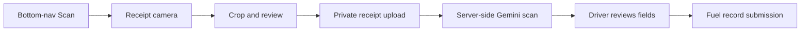

# Feature: Fuel

## Status: working scanner flow — USER-CONFIRMED

Receipt capture and Gemini extraction work on-device. The last live row-count check was 2026-08-11, when `fuelrecords` had **0 rows**; the database count was not re-queried today, so persisted end-to-end usage remains to be verified after the latest scanner change.

## Positioning: a Fuel Planning, Authorization, Monitoring & Consumption Control system

The module is deliberately structured in four layers (external review adopted 2026-08-25):

| Layer | Purpose | Where it lives |
|---|---|---|
| Planning | Predict upcoming fuel requirement from dispatch data | 24h forecast query + `request-policy.js` |
| Authorization | Control how much may be purchased | Auto-authorization policy + manager ladder |
| Transaction | Record actual refueling | Mobile receipt flow (`/api/mobile/fuel`) |
| Analytics | Actual consumption & anomalies | Variance flag, budget utilization, reports |

## What exists

| Piece | Note |
|---|---|
| `src/services/fuel.service.js` | **33 lines of `apiFetch`** — a client fetch wrapper, not a domain service → [[DEBT Services Folder Mixes Two Concerns]] |
| `/api/fuel/*` routes | CRUD |
| Dashboard page | Under `(dashboard)/` |
| Mobile refuel screen | Embedded receipt camera, review, manual recovery, and fuel submission |
| `/api/mobile/fuel/upload` | Stores the driver's receipt and returns a short-lived signed URL **plus** the object key |
| `/api/mobile/fuel/scan` | Verifies URL ownership, fetches the uploaded image, and invokes Gemini server-side |
| `gemini-receipt.js` | Structured extraction and strict field normalization (now incl. `fuel_type`) |
| `/api/fuel/requests` | Driver-submitted consolidated refill requests + policy auto-authorization + manager approval ladder |
| `/api/fuel/allocations` | Monthly per-vehicle budget plus tank capacity / efficiency profile |
| `request-policy.js` | Pure decision core: recommendation math, variance check, fuel-policy evaluation, tank/type checks |
| `fuelstations` | Table **dropped** in an earlier migration; still appears in both stale ERDs → [[DOC ERDs Missing Core Table]] |

## Fuel request lifecycle — three-value model — VERIFIED 2026-08-25

The refill decision separates three numbers so the manager sees *why*, not just an amount (external review adopted 2026-08-25):

| Value | Formula | Example (60 L tank · 25% · 160 km @ 8 km/L) |
|---|---|---|
| **Minimum safe refill** | `forecast_consumption + reserve − current`, floored at 0 | **11 L** |
| **Preferred target** | `min(tank, max(90% tank, consumption + reserve)) − current` | **39 L** (to 54 L) |
| **Maximum allowed** | `tank_capacity × (1 − reported level)` | **45 L** |

The 90% target is deliberately kept as a *preferred* operating level to reduce repeated refueling stops — it is displayed next to the minimum, never instead of it.

### Approval: policy auto-authorization + manager ladder — VERIFIED 2026-08-25

**Auto-authorization (strict conditions, all server-computed).** At request creation `evaluateFuelPolicy()` approves instantly (`status='Approved'`, `approved_by=NULL`, `auto_authorized: true` in the snapshot) only when **all** hold:

- a positive recommendation exists,
- no fuel variance was detected,
- the forecast fits inside the tank (no range warning),
- minimum safe ≤ recommendation,
- the monthly budget covers the recommended liters.

Anything else stays `Pending` with its reasons in `policy_reasons`. Drivers cannot influence any input — `requested_liters` is always the server's own recommendation. Auto-authorized requests immediately count as committed against the budget. The audit trail logs action `auto-authorize` vs plain `create`.

**Manager ladder (for exceptions).**

| `gemini-receipt.js` | Structured extraction and strict field normalization (now incl. `fuel_type`) |
| `/api/fuel/requests` | Driver-submitted consolidated refill requests + policy auto-authorization + manager approval ladder |
| `/api/fuel/allocations` | Monthly per-vehicle budget plus tank capacity / efficiency profile |
| `request-policy.js` | Pure decision core: recommendation math, variance check, fuel-policy evaluation, tank/type checks |
| `fuelstations` | Table **dropped** in an earlier migration; still appears in both stale ERDs → [[DOC ERDs Missing Core Table]] |

## Fuel request lifecycle — three-value model — VERIFIED 2026-08-25

The refill decision separates three numbers so the manager sees *why*, not just an amount (external review adopted 2026-08-25):

| Value | Formula | Example (60 L tank · 25% · 160 km @ 8 km/L) |
|---|---|---|
| **Minimum safe refill** | `forecast_consumption + reserve − current`, floored at 0 | **11 L** |
| **Preferred target** | `min(tank, max(90% tank, consumption + reserve)) − current` | **39 L** (to 54 L) |
| **Maximum allowed** | `tank_capacity × (1 − reported level)` | **45 L** |

The 90% target is deliberately kept as a *preferred* operating level to reduce repeated refueling stops — it is displayed next to the minimum, never instead of it.

### Approval: policy auto-authorization + manager ladder — VERIFIED 2026-08-25

**Auto-authorization (strict conditions, all server-computed).** At request creation `evaluateFuelPolicy()` approves instantly (`status='Approved'`, `approved_by=NULL`, `auto_authorized: true` in the snapshot) only when **all** hold:

- a positive recommendation exists,
- no fuel variance was detected,
- the forecast fits inside the tank (no range warning),
- minimum safe ≤ recommendation,
- the monthly budget covers the recommended liters.

Anything else stays `Pending` with its reasons in `policy_reasons`. Drivers cannot influence any input — `requested_liters` is always the server's own recommendation. Auto-authorized requests immediately count as committed against the budget. The audit trail logs action `auto-authorize` vs plain `create`.

**Manager ladder (for exceptions).**

1. `approved < minimum_safe_liters` → blocked unless an override reason is provided (schedule changed / cancelled trip / emergency)
2. `minimum ≤ approved ≤ recommended` → normal
3. `approved > recommended` → reason required
4. `approved > monthly budget remaining` → allowed with a required override reason; the modal warns "will exceed by N L" — hotel operations are never hard-blocked by budget
5. Tank-space cap always applies

### Budget tiers (not a quota)

The plan table shows per-vehicle utilization: normal under 80%, amber "Near budget limit" ≥ 80%, red "Budget exceeded" > 100% with review required. Vocabulary is deliberately *budget/target*, not *allowance*.

### Transaction validation & verification studio

At receipt submission (`POST /api/mobile/fuel`), beyond actual ≤ authorized and allocation-month checks:

- **Impossible-quantity check** — estimated current level + claimed liters must fit the tank, else 409
- **Fuel-type mismatch flag** — Gemini extracts the product line (`fuel_type`); stored in `fuelrecords.receipt_fuel_type` (migration 067) and compared to the vehicle's fuel type in the verification studio. Flag-only, never blocking: receipts often omit the product, and "Diesel Max"-style product names normalize to Diesel/Gasoline/Gasoline≈Petrol synonyms or null.
- **High-End Receipt Verification Studio (`ReceiptVerificationModal`)** — provides a dedicated thermal-receipt inspection workspace:
  - 🔄 90° image rotation for mobile pump photos
  - 🌓 Thermal paper contrast booster (clarifies faint blue/purple/grey thermal print)
  - 🔍 Fluid zoom, pan, and fullscreen inspection dialog
  - 🛡️ Three-check automated audit cockpit (Fuel Type Compatibility, Tank Space Plausibility, and Math Consistency)
  - ⚡ Quick-reason rejection dialog (`RejectClaimDialog`) with single-click preset chips.

### Gauge photo evidence + AI-assisted level read — VERIFIED 2026-08-25 (build)

Every fuel request is backed by a dashboard gauge photo (**required** — enforced in the app UI *and* server-side: `POST /api/fuel/requests` rejects without an owned `gauge_photo_url`).

- **Camera-only capture** ? no gallery option, so the evidence must be a fresh in-app camera shot; the bottom-nav scan shortcut routes contextually (approved request → receipt camera, otherwise → gauge camera).
- **Assisted input, never trusted input**: at capture time the photo is uploaded to `fuel-receipts/{driverId}/gauge/` and scanned by `gemini-gauge.js` (`scanFuelGaugeWithGemini`). The estimate only **pre-fills** the level field when it is still empty; the driver always confirms. Unreadable → fail-closed nulls ("enter manually"), never a guess — `normalizeGaugeScan` also rejects impossible values instead of clamping them into lies.
- Prompt explicitly warns the model away from temperature/tach gauges and handles needle **and** digital-segment gauges.
- Manager review panel shows the claimed % next to the photo thumbnail (zoomable) plus what the AI read (`calculation_snapshot.gauge_scan`).
- Accuracy is measurable without a real vehicle: `scripts/gauge-fixtures.html` renders synthetic gauges at exact levels (needle, tilted, digital) → `scripts/verify-gauge-scan.mjs <folder> <token>` uploads them through the real pipeline and prints a ±5 / ±10 point accuracy table.
- Gemini credentials come from the `aiproviders` table **or fall back to `GEMINI_API_KEY` in `.env.local`** (`llm-adapter.js`) — live scanning works without any DB setup.

Stacking order of trust for one claim: gauge photo + AI read → driver-confirmed % → variance flag vs history → receipt liters ≤ authorized → manager verification.

### Fuel variance flag

At request creation the server compares the driver-reported level against the last reported level minus completed-trip consumption since (`assessFuelVariance`). A gap larger than **15% of tank capacity** stores `fuel_variance` in `calculation_snapshot` and renders "Fuel variance detected — review recommended" in the review modal; a flagged request always goes to the manager's Pending queue, never auto-authorized. The gauge photo above is the visual evidence layer on top of this flag.

### Allowance semantics (committed vs consumed)

`allocationUsage()` deducts only **verified** liters (`fuelrecords.status='Approved'`) as consumed, and additionally holds approved-but-unverified request amounts as *committed* so concurrent approvals cannot double-spend the same allocation. Remaining = allocated − consumed − committed.

All values ride in the `fuelrequests.calculation_snapshot` JSONB; the receipt fuel type is the one new column (`fuelrecords.receipt_fuel_type`, migration 067). Legacy pending rows derive their floor via `minimumSafeFromSnapshot()`.

### Manual verification checklist (defense-ready)

1. **T1 happy path** — driver requests with a low gauge % → manager reviews six-tile panel → approve → mobile unlocks logging → receipt → verify claim → verified liters consume budget
2. **Sufficient-fuel rejection** — high gauge % → 409 by design
3. **Below-minimum approval** — blocked without override reason, allowed with one
4. **Above-budget approval** — warns "exceeds by N L", allowed only with reason
5. **Auto-authorization** — clean request (no variance, budget ok) approves itself instantly: no Review button needed, "Within policy" badge on Approved row
6. **Variance badge** — report far below expected remaining → amber flag in review modal, request goes to Pending even if otherwise clean
7. **Impossible quantity** — submit liters > tank space → 409
8. **Fuel-type mismatch** — receipt stating another product shows ⚠ in verification modal
9. **Budget tiers** — set allocation low → utilization bar turns amber/red

## Mobile receipt flow — VERIFIED 2026-08-22

```mermaid
flowchart LR
    N[Bottom-nav Scan] --> C[Receipt camera]
    C --> R[Crop and review]
    R --> U[Private receipt upload]
    U --> G[Server-side Gemini scan]
    G --> F[Driver reviews fields]
    F --> S[Fuel record submission]
```

- The center navigation action opens the camera immediately with `scan=1`.
- `CameraView` captures the receipt; `receipt-crop.js` maps the visible guide to the source image before resize/compression.
- Gemini model: `gemini-3.1-flash-lite`, structured JSON, 12-second server timeout.
- Fields: `station_name`, `fuel_date`, `liters`, `price_per_liter`, and final `amount`.
- Brand normalization: Petron → `PETRON`; Shell/Skyewin Prime Resources → `SHELL`. Dealer/operator names are not stored as the station brand.
- Petron's `Description / Qty / Price / Amount` layout and Skyewin's discounted final invoice are explicitly described in the extraction prompt.
- Local ML Kit/deterministic receipt parsing has been removed. Gemini failure keeps the receipt attached and falls back to driver review/manual completion.
- Odometer is no longer extracted or entered. `POST /api/mobile/fuel` derives it from the assigned vehicle's latest server-side mileage.
- Price per liter is shown independently when Gemini reads it; the server still calculates the stored value from `amount / liters`.
- The old fuel-gauge card was removed because receipt volume is not the same as the vehicle's current tank level.

## Trust boundaries

- Gemini API credentials stay on the server.
- The scan route only accepts a receipt reference owned by the authenticated driver — either an owned signed URL or an owned object key, both matched against the same expected path prefix.
- Receipt images must be valid image responses and no larger than 10 MB.
- Driver, trip, vehicle, fuel type, odometer, price per liter, and initial `Pending` status are server-owned or server-derived.
- `client_submission_id` keeps mobile submissions idempotent.
- **The stored filename's extension is server-derived** (2026-09-17). It used to
  come from `file.name?.split(".").pop()`, so `receipt.html` declared as
  `image/png` was stored as `<uuid>.html` under `Content-Type: image/png` — the
  exact disagreement a content sniffer is built to resolve, and a stored-XSS
  shape wherever the object is served from a host that honours the extension.
  `storeFuelReceipt` now uses the extension the magic-byte validator returned,
  as `vehicles/[id]/image/route.js` already did. Found by the security
  assessment (SEC-UPLOAD-002, LOW). → [[Travel Expenses]] carries the same fix.
- **An owned receipt URL is matched segment-by-segment** (same pass,
  SEC-UPLOAD-004). `isOwnedFuelImageUrl` used `path.includes(...)`, so
  `/…/sign/other-bucket/storage/v1/object/sign/fuel-receipts/4/x.png` satisfied
  it, and decoding the path first let an encoded separator (`fuel-receipts%2F4%2F`)
  decode *into* a match the real path never had. It now builds the expected path
  one percent-encoded segment at a time and compares it as a raw **prefix**,
  keeping the host check and the `token` requirement.
- **The fuel columns store an object KEY, not a URL** (2026-09-18, SEC-UPLOAD-003
  Phase B). `receipt_url` and `gauge_photo_url` used to hold a ten-year signed
  URL — a bearer credential with no revocation path, and the column was readable.
  Both now hold a bucket-qualified key (`fuel-receipts/4/….jpg`) and every reader
  signs a 1-hour URL on the way out: `api/fuel`, `api/fuel/[id]`,
  `api/fuel/requests`, `api/admin/analytics/fuel`, `api/mobile/fuel`,
  `api/mobile/fuel/[id]`. The upload route returns **both** shapes —
  `receipt_url` (short-lived, for the immediate preview/scan) and `receipt_path`
  (the key) — so an already-installed APK keeps working; `isOwnedFuelImageUrl`
  accepts either shape and checks both against the same expected prefix. The
  write path **canonicalises**: the client echoes back the URL it was shown and
  the server reduces it to a key rather than trusting the client.
  Consequently `scan`/`gauge-scan` sign the reference themselves instead of
  `fetch`ing what the client sent — a key is not fetchable, and trusting the
  client to hand over something already signed is not a control.
- **Behaviours that changed:** an upload URL is fetchable for **1 hour instead of
  10 years** (the scan runs within seconds, so the flow is unaffected); an ``
  preview built from a *stale* upload URL breaks after an hour; a **dangling**
  legacy object now reads as `null` rather than as a broken image.
- **Data residual — SEC-UPLOAD-003 is PARTIALLY CLOSED, not closed.** The code
  stops minting long-lived URLs; it does not revoke the ones already stored. The
  2026-09-18 census found 7 rows in `fuelrecords.receipt_url` (6 of them already
  dangling) and 1 in `fuelrequests.gauge_photo_url` still holding ten-year tokens.
  Clearing them means rewriting the rows to keys or rotating the storage key —
  both are separate, explicitly-approved actions. → [[Bugs]]

## Why it's worth a note

`fuel.service.js` is the clearest example of the naming collision in `src/services/`: it sits alongside `reservation-lifecycle.service.js`, which does transactions and DB writes, but it is 33 lines of browser `fetch`. Same folder, same suffix, completely different kind of module.

## Remaining verification

Save one Petron and one Skyewin/Shell scan against an active trip, then verify the resulting `fuelrecords` row, automatic odometer, signed receipt URL, calculated price per liter, and `Pending` review status.

## Console consolidation (2026-09-04)

- `fleet/fuel` retired → redirects to `/fuel`. Its exceptions list + measured-efficiency table live on as the console's **Needs review** section (flags + full-record Review handoff into the existing verification studio; the bespoke `window.prompt` resolve path is gone).
- Page order now teaches budget → permit → receipt: allocations → requests (renamed from the lying "Allocation History" title) → needs review → registry.
- Stat cards are summaries; the pill row is the single filter. CSV export pages through the full filtered set (was first-page-only data). Dead Archive flow + unused imports deleted.
- Roles closed: `driver` removed from `/fuel` NAV_ROLES; Review/Configure/record-approve buttons gated on `fuel_requests.review` / `fuelallocations.update` / `fuel.update` (matrix already denied drivers).
- Driver web `Log Fuel` (direct-record bypass) replaced with mobile-app request guidance + a My-requests table (server-scoped to the driver). Full gauge-photo upload on web deferred — the API hard-requires an owned gauge photo, so this closes the bypass honestly.
- `fuel/analytics` kept as the read-only view: loading/error states, Monthly Trend upgraded to `AreaChart` (executive pattern + sr-only data table), fuel-type bars kept (no fake color semantics).
- Overview cards work like the assignments module (2026-09-04): Monthly Budget / Permits / Registry switch the single visible table (scroll-spotlight tried first, rejected for looking cheap). Pills remain the registry's only status filter.
- Needs Review dissolved as a tab (2026-09-04): the flagged panel now pins atop the Registry view when count > 0 (collapsing to nothing when clear); measured efficiency moved to the Analytics page. Tabs are Registry · Budget · Permits with a spring sliding-pill indicator (icons + pending count, reduced-motion collapses to instant, `tablist` semantics).
- Discoverability fix: KPIs went back to display-only and switching moved to an explicit labeled tab bar (`role="tablist"`) — clickable KPIs hide their affordance from new staff.
- Smart registry default (2026-09-04): pure derivation (no effect) — user pick wins, else Pending while loading or when review work exists, All when healthy-but-nonempty. Pills override anytime and stick for the session.
- Per-table KPIs (2026-09-04): each tab carries its own display-only KPI row from already-loaded data — Budget (configured / unconfigured / total liters / over-budget), Permits (pending / approved / fulfilled / rejected), Review (flagged / efficiency measured), Registry (total / pending / approved ₱ / rejected). Tab bar sits above the KPIs; Registry is the default view.

## Fuel request list offline tolerance (2026-09-16)

- `mobile/app/(app)/fuel-report.js` `loadFuelRequests` is now cached-first via `CACHE_KEYS.FUEL_REQUESTS` (`mobile/lib/offline-cache.js`, driver-namespaced, cleared on logout) — same Offline Read Mode pattern as Home/Trips. Display-only; approval gates still run on live state.
- Transport failures (`isTransportFailure`) no longer `console.warn` — the global connectivity banner owns them (PR #3.1 dedup). Genuine errors (auth/validation/5xx) still warn.
- Cold-start tolerance: one automatic retry via `shouldAutoRetry` + `LIST_AUTO_RETRY_MS` before giving up, matching Home/Trips.
- The 15 s approval poll early-returns while `useConnectivity()` reports fully `offline` (cached list stays, no network attempt, no warn); `unstable` still polls so mid-blip approvals are picked up. Poll resumes automatically on recovery.
- Verified: `vitest run mobile/lib/connectivity-state.test.js mobile/lib/offline-cache.test.js mobile/lib/offline-ux.test.js` (33 passed), `eslint` on touched files clean.

## Related

[[Fleet And Vehicles]] · [[DEBT Services Folder Mixes Two Concerns]] · [[Feature Index]] · [[Reports]]

## Verified reference-price workflow — review fixes, 2026-10-08 (prepared; live apply held)

**Historical checkpoint:** the prepared/unapplied status in the reference-price, atomic-snapshot and provider sections below is superseded by the current database closeout recorded under **Fuel database closeout**. It remains here as the original review evidence, not the current migration verdict.

The fuel console links to `/fuel/reference-prices`. Staff with `fuelallocations.read` can review product, region, PHP/L price, effectivity, source, verifier and lifecycle. Only staff with `fuelallocations.update` can record a manual verified price or choose the estimate region. The API obtains the verifier from the signed-in employee; submitted verifier, method and lifecycle cannot grant authority. Manual verification requires checking the dated publication. The form labels Manila time and converts it to an explicit `+08:00` instant.

`src/lib/fuel/price-repository.js` owns real server SQL. It validates scalar PHP/L prices with two-decimal storage, required source URLs, real calendar dates and explicit timezones, Manual verifier identity and Automatic ingestion hash. A transaction and advisory lock serialize publication. Exact repeats return the existing snapshot; conflicting same-effectivity prices require a new later correction with provenance. Consecutive implausible adjustments are held for review. Future rows remain Pending; an atomic effectivity transition promotes the current row and retains previous rows as Historical. Repeating activation leaves prices and provenance unchanged.

`priceAt` includes verified Historical rows when resolving earlier instants. Invalid or absent basis returns null. An expiry/stale-warning horizon for a particular official source remains an open business decision; the code does not invent a market-validity period. Receipt pump prices and receipt approval remain independent.

Draft migration `154_fuel_price_snapshots.sql` creates the table, effectivity uniqueness, provenance checks and RLS, revoking anon/authenticated and PUBLIC table privileges. Re-entry checks reject incompatible columns or a wrong/partial/invalid unique index instead of silently accepting a same-named object. `PENDING_TABLES.fuel_price_snapshots` in `scripts/lib/schema-contract.mjs` is an explicit reviewed migration-backed classification separate from applied `TABLES`. Offline source-SQL coverage includes it and checks the exact draft; live `db:contract` still fails when the relation is absent or protection is wrong. `schema.sql` was not edited or regenerated.

## Atomic trip fuel snapshot — review fixes, 2026-10-08 (prepared; live apply held)

The real completion API calls the real service without a test-only price seam. `completeTrip` locks the trip row and rechecks terminal state inside its transaction. It resolves the configured `fuel_price_region` setting and the vehicle product through the verified server repository. The entire first completion basis is captured together: planned and actual distance, distance provenance, vehicle efficiency, reference price, snapshot identity, region, separate planned/actual estimated liters and cost, unavailable reason and capture time. Completed retries return the existing row without rewriting its basis or repeating transition side effects. Missing inputs remain unavailable, including on later retries after prices or vehicle efficiency change.

Actual distance prefers valid odometer math, a validated supplied trip distance, then the server GPS trail. The locked trip's stored start odometer is authoritative; a validated client start is only a fallback for legacy trips with no real stored start. Derivation requires an actual end reading. Boolean/object/array odometers are rejected before writing, preventing input coercion from corrupting the immutable distance and fuel estimate. Numeric-string readings and absent-input legacy completion remain supported. Planned route distance is never promoted to actual. Malformed supplied distance is rejected before a write. Estimate arithmetic uses decimal integer ratios: liters round to 3 decimal places; cost uses those rounded liters and rounds to cents. 36 km at 9 km/L and PHP 62.70/L stores 4.000 L / PHP 250.80; a 32 km plan separately stores 3.556 L / PHP 222.96. Half-cent ties and boolean/object basis inputs have regression coverage. `fuel_consumed` keeps its original meaning.

Draft `155_trip_fuel_estimate.sql` adds the snapshot fields, requiring 154 first. Its rerun guard checks nullable column types/precision and a target-table-scoped FK with the exact source/target columns, target relation, validation and action modes. An incompatible same-named constraint aborts instead of being accepted. No live apply or catalog verification has occurred.

## Optional provider pipeline — review fixes, 2026-10-08 (disabled by default)

`GET /api/cron/fuel-prices` uses real shared-service-token authentication and fails closed when the cron secret is absent. Automatic updates require `FUEL_PRICE_PROVIDER_ENABLED=1`, `FUEL_PRICE_SOURCE_VERIFIED=1`, a configured source identity and an HTTPS source approved by the operator. No official source URL has been guessed or activated.

The enabled pipeline activates already verified due announcements, fetches without following redirects, rejects a changed response origin, parses the configured source fixture shape, validates against stored consecutive price history and publishes through the repository. Automatic publication compares against the latest verified announcement, including future Pending rows, and retains that announcement when an older unseen provider payload arrives. Manual review can explicitly backfill historical intervals. Repeated fetches are duplicates; relative jumps, format drift and transport failures retain the existing prices. The server generates the bounded ingestion hash. No scraping runs in dispatch/request paths and no DB schedule was created. Manual verified prices remain available through the same review workflow after the authorized schema checkpoint.

**Offline verification:** focused fuel/caller/manual UI/API/cron/schema-contract and release acceptance suites; real application modules with fake external DB/transport adapters, no mock of the repository/service being tested. Coverage includes the actual completion route, serialized concurrent retries, unavailable snapshot immutability, history/effectivity, role denials, server-owned verifier, origin spoofing, strict timestamps/scalars and exact decimal rounding. Whole page rendering checks manager/observer/loading/schema-error states. Lint and whitespace checks cover the touched files. These are offline tests, not browser/device or live PostgreSQL evidence.

The final odometer/latest-announcement follow-up reproduced four failures before fixes: omitted stored start used supplied distance, boolean legacy start was accepted, an older automatic announcement bypassed the stale gate, and nonnumeric end readings silently completed. The real completion/cron/repository/service tests then passed (4 files, 24 tests), including stored-start precedence, numeric-string legacy readings, missing actual distance, and serialized first capture.

### Closeout evidence harness

The strengthened offline completion test runs the real ownership, geofence, status, audit, reservation, completion and price repository modules, replacing only identity and external DB/Supabase boundaries. Manual region selection and price creation flow into the real completion route: snapshot 44, signed-in verifier 3, 36 km / 9 km/L / PHP 62.70 produces 4 L / PHP 250.80. A paused capture interleaves a retry and preserves the whole first basis. GPS actual distance remains separate from the 32 km plan. UTC and Manila effectivity boundaries and redirect refusal/changed-origin responses have explicit assertions. The focused closeout run passed 29 tests across five files.

`src/lib/fuel/postgres-closeout.test.js` is opt-in with `FLEETOPS_REVIEW_DB_TEST=1`. It prepares a guarded random private review schema, clones live column types without production defaults, sequences, triggers or foreign keys, and inserts fixture trip/request/vehicle/manual-price rows. It checks persisted completion rows, GPS versus plan, and two real PostgreSQL clients using `pg_blocking_pids` to establish row-lock overlap. Mutation targets are allowlisted; the search path excludes public. Cleanup verifies the exact generated schema, its owner and allowed fixture tables before dropping it. Production constraints, grants and RLS remain separate live-catalog evidence. Without the flag, all three database tests are skipped and no connection is made. Preparation/skip validation is not a successful live run; its result must be recorded after the authorized parent run.

The first authorized database attempt exposed fixture mismatches: bigint IDs arrive as strings, and CTAS did not copy the audit index required by `ON CONFLICT (event_key) WHERE event_key IS NOT NULL`. The fixture now compares exact ID text and creates that exact partial unique index in its private schema. Assertions require two persisted manual-workflow audit entries and one completion audit entry even under concurrent retry, so logged audit failures cannot count as successful evidence. These fixture corrections passed lint and whitespace checks; the parent owns the enabled rerun and final live verdict.

The next authorized attempt passed persisted manual snapshot/completion evidence. Its GPS fixture represented an 11 km jump in one minute, correctly rejected by the real trail helper's speed guard; it now spans 30 minutes with a preceding trip start. Blocking observation now uses `pg_backend_pid()` inside each transaction rather than the pooler's client ID. Every adapter query, fixture query and transaction uses `BEGIN` with `SET LOCAL search_path` and bounded local timeouts, then commits or rolls back. The adapter checks its actual schema before each query. No session search-path setting survives to a pooled backend's next user. Final GPS/concurrency success still requires the parent's enabled rerun.

### Fuel database closeout — 2026-10-08

The authorized parent checkpoint applied migrations 150–155 through the repository runner, refreshed the generated schema and reported a clean database contract (77 relations, zero findings). This supersedes the earlier statement that fuel migrations 154/155 were only drafts. See [[FleetOps Passenger Cargo Review Closeout 2026-10-08]] for the shared closeout and remaining release decisions.

The enabled isolated PostgreSQL fuel suite passed all three tests (full fuel run: 19.39 seconds). Real manual region/price routes persisted snapshot 44 with verifier 3; the real completion route persisted 36 km, 9 km/L, PHP 62.70/L, 4.000 L and PHP 250.80, with separate planned estimates. A realistic 30-minute GPS trail persisted approximately 11.1 km actual distance while keeping the 32 km plan. Two distinct PostgreSQL backend IDs overlapped: `pg_blocking_pids` showed the second completion waiting for the first trip-row lock. Both calls returned the same first distance, efficiency, reference price, snapshot, region, planned/actual costs, unavailable reason and capture time. One completion audit event persisted under retry. No application service or repository was mocked; identity and the Supabase status lookup remained external fixture boundaries.

A later combined run exposed a 5-second test timeout and overlap on the shared fixture connection. The final harness gives each fixture query its own exclusive transaction, serializes fixture operations, qualifies every fixture relation with the generated private schema, and checks schema scope inside pinned application transactions. Setup/reset and cleanup drain outstanding transactions; each real test has a bounded 30-second allowance. This prevents a timed-out fixture operation from changing a following operation's transaction settings or resolving a mutation to public. The corrected combined PostgreSQL run passed all 16 tests across four files in 26.79 seconds; all three fuel tests passed, including the genuine blocking proof. Production SQL and behavior were unchanged by these harness fixes. Shared post-run operational-count/default-path checks are recorded in the closeout note.

Fixtures used a generated private schema and transaction-local settings only. Production business rows, production sequences and official provider sources were not changed. The fixture copied current live column types and explicit indexes needed by exercised SQL; it did not reproduce production triggers, foreign keys, RLS or grants. Those remain separate catalog evidence. The cleanup dropped the exact verified fixture schema, explicitly queried the catalog to confirm its absence, and ended its pool.

**Remaining gates:** browser/device acceptance and release decisions belong to the shared closeout; the final configured production build passed. Official-source clearance and its stale-warning policy remain external; automatic ingestion stays disabled until explicitly configured. Missing fuel relations/columns still return a clear 503 pending-schema error for an unprepared environment.

## Export exports the view you are looking at — 2026-10-01 (implemented)

The header **Export CSV** button always exported fuel **receipt claims**, whichever of the three views (Registry / Monthly Budget / Permits) was on screen — and it did it wrong. `getFuelRecords` answers in paginated mode with an envelope, `{ rows, total, counts }`, and that object was handed straight to `exportToCSV`, which tests `data?.length` — `undefined` on an object — and returns `{ count: 0 }` without writing a file. Clicking Export with **45 permits** visible produced no download and a toast reading *"Exported undefined records"*.

Confirmed against live on 2026-10-01: `fuelrequests` = **45** rows, `fuelrecords` = **1**. The two lists are different entities and the export could match neither.

`src/lib/fuel/export-targets.js` now yields one target per view, each with its own `entity`, button `label`, `filename`, `columns` and `collect()`:

| View | Exports | Endpoint |
|---|---|---|
| Registry | receipt claims | `GET /api/fuel` (through `collectPagedRows`, so **every** page of the active filter, not page 1) |
| Monthly Budget | monthly budget rows | `GET /api/fuel/allocations` |
| Permits | fuel permits | `GET /api/fuel/requests` |

`collectPagedRows()` lives in `src/lib/export.js` beside `exportToCSV` and keeps the envelope-unwrapping in one place: it reads `rows`, walks pages until `total` is reached, stops on an empty page (a wrong `total` cannot spin), honours a `maxPages` bound, and passes a bare array through for endpoints that do not paginate. The button in the header names its entity ("Export receipt claims" / "Export permits" / "Export monthly budget") so the label can no longer disagree with the file, and an empty filter produces a warning instead of a silent no-op.

The old `pageSize: total` call was also an unbounded single query; the paged walk replaces it.

## Fleet Manager live-use remediation - 2026-10-03

`GET /api/fuel/requests` now includes active and archived receipt counts plus the statuses of active receipts for each permit. The Permits table shows whether the linked receipt is approved, pending, completed, rejected, archived, or missing, and whether it is eligible for Fuel Analytics. Fulfilled remains the permit lifecycle state; it does not promise that a receipt is currently active or approved. Fuel Analytics includes non-deleted `Approved` fuel records only.

An earlier read-only snapshot (about 02:04 Manila) of the documented live project found 24 fulfilled permits: 21 had archived receipts only and 3 had active receipts (2 Approved, 1 Pending). It counted 12 active Approved fuel records. A later same-day snapshot differed; see the archive audit follow-up below. No permits or receipts were modified. The receipt-state helper and route response tests passed.

**Verification.** `src/lib/export.test.js` (8 tests) — including the root-cause pin that `exportToCSV` refuses a paginated envelope and reports `count: 0` — and `src/lib/fuel/export-targets.test.js` (7 tests), which asserts the 45-permit case explicitly: the permits view must call the permits endpoint, must not touch `getFuelRecords`, and must carry the active status/search filter through every page of the registry walk.

## Fuel Governance & Policy Engine — 2026-10-03 (implemented & verified)

Refueling planning, pilferage detection, and auto-authorization previously relied on hard-coded constants (10% reserve, 90% target fill, 15% variance threshold, and 60 L auto-approval). These are now centralized in an audited, configurable policy engine stored in `system_settings` under setting key `fuel_policy`:

| Policy Key | Default | Allowed Range | Description |
|---|---|---|---|
| `reserveBufferPercent` | `10` | 5% – 40% | Safety floor retained in tank before mandatory refill is recommended |
| `preferredTargetPercent` | `90` | 40% – 100% | Operating refill target to minimize repeated pump visits |
| `maxFillCapPercent` | `100` | 80% – 100% | Physical tank upper bound accounting for thermal expansion |
| `varianceThresholdPercent` | `15` | 5% – 40% | Mileage vs gauge discrepancy triggering an anomaly alert |
| `enableVarianceAlerts` | `true` | boolean | Toggles pilferage & consumption variance detection |
| `autoApprovalEnabled` | `true` | boolean | Toggles instant auto-authorization engine |
| `autoApprovalMaxLiters` | `60` | 10 – 200 L | Liter ceiling above which requests require Fleet Manager review |
| `budgetEnforcementMode` | `"warning"` | `"warning"` \| `"strict"` | Warning permits manager override with reason; Strict hard blocks |
| `maxPricePerLiter` | `120` | ₱40 – ₱200 / L | Receipts exceeding this ceiling trigger anomaly warning |
| `strictFuelTypeMatching` | `false` | boolean | Strictly block claims where receipt fuel type conflicts with engine |

### Architecture & Touchpoints

- **Pure Policy Definition:** `src/lib/fuel/fuel-policy.js` provides `DEFAULT_FUEL_POLICY`, `FUEL_POLICY_RANGES`, `mergeFuelPolicy()`, and `validateFuelPolicy()`.
- **Database Storage:** `src/services/fuel-settings.service.js` reads/writes `system_settings` using `fuel_policy` key, preventing any breaking table migration.
- **REST Endpoints:** `GET` / `PUT /api/settings/fuel` (`src/app/api/settings/fuel/route.js`) with RBAC guard (`requirePermission(req, "fuel_settings", ...)`), parameter allowlist, and audit logging (`writeAudit`).
- **Core Decision Logic:** `src/lib/fuel/request-policy.js` accepts optional `policy` in `calculateFuelRecommendation()`, `assessFuelVariance()`, and `evaluateFuelPolicy()`.
- **Request Creation Integration:** `src/app/api/fuel/requests/route.js` fetches the active policy and injects it into all calculations and auto-authorization evaluations.
- **Approval and receipt integration:** Strict budget mode blocks manager over-budget approvals even with an override reason. Mobile receipt submission uses the configured price ceiling for anomaly flags and blocks a known fuel-type mismatch when strict matching is enabled. Gauge photos on requests and receipt photos on claims remain mandatory in the mobile flow; neither is exposed as a configurable toggle.
- **UI Management Console:** `src/app/(dashboard)/settings/fuel/page.js` provides a modern settings console with HeroHeader, 5 KPI stat cards, an interactive Three-Value Tank Visualizer, Refueling & Planning Thresholds, Pilferage & Variance Detection, Auto-Authorization Engine, Cost & Budget Governance, and action buttons.
- **Navigation & Access:** Added to `NAV_ROLES["/settings/fuel"]` and `MATRIX.fuel_settings` for `admin`, `super_admin`, and `fleet_manager` (`src/lib/auth/permissions.js`), workspace sidebars (`src/lib/workspaces.js`), and Command Palette (`src/components/ui/command-palette.jsx`).

**Verification.** Policy, request, and mobile receipt suites passed in the 3,605-test full run; `npm run lint:ci`, `npm run verify:auth`, and `npm run db:check` passed. The new settings reject non-boolean switches and a target fill above the tank cap.

### Receipt archive audit follow-up - 2026-10-03

A later read-only snapshot of the same project (02:59 Manila) found 22 fulfilled permits: 21 with archived receipts only, 1 with an active linked receipt, and none without a linked receipt. Across `fuelrecords`, 49 of 50 records were soft-deleted (20 with status `Approved`, 29 `Pending`); none had a matching `fuelrecords` audit event. The actor and reason for those historical archives cannot be recovered. Counts differed from the earlier same-day snapshot, so each is timestamped evidence rather than a stable total. Both snapshots predate the controlled defense data cleanup and must not be treated as current counts.

`DELETE /api/fuel/[id]` now locks an active record, soft-deletes it, and writes a required `fuelrecords` audit event in the same transaction. The event captures the actor, timestamp, previous status, and linked permit ID without logging receipt contents or free-text notes. If the audit write fails, the archive rolls back. The existing endpoint remains reason-free; this adds future attribution but cannot explain historical archives.

**Verification.** The latest focused run passed 14 tests across four files, including archive success, already-archived behavior, and rollback when required audit logging fails. Changed route/helper paths passed ESLint and `git diff --check`. No live row or migration was changed.

### Fuel request review dialog viewport fit - 2026-10-07

The dialog already capped its full height to `100dvh - 2rem`, but the root used `overflow-hidden` while only the body scrolled. The action row sat outside that body scroll area, so a tall dialog could clip the buttons at the viewport edge. The dialog root now owns vertical scrolling, and the header and action row stick to its top and bottom edges. The footer wraps at narrow widths and keeps each button at its natural width. No automated or browser verification was run.
