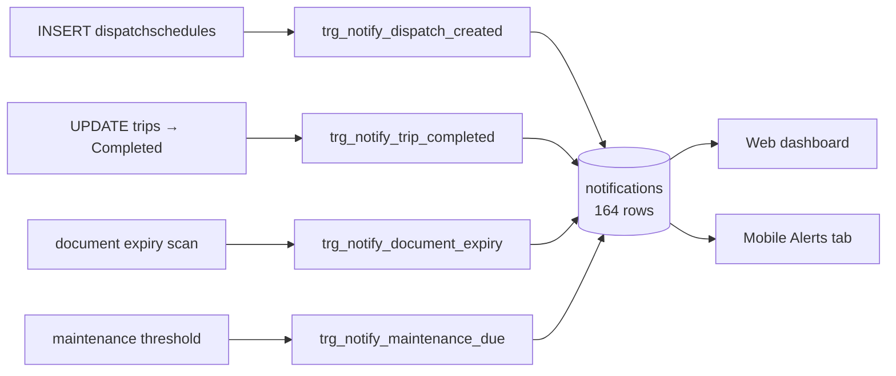

# Feature: Notifications

## What it does

Creates in-app notifications for the events staff and drivers need to know about. **164 rows** — one of the more genuinely exercised features.

## The design choice: notifications are database triggers — CONFIRMED

Four plpgsql triggers write `notifications` rows:

| Trigger | Fires on |
|---|---|
| `trigger_notify_dispatch_created` | new [[dispatchschedules]] row |
| `trigger_notify_trip_completed` | [[trips]] reaching Completed |
| `trigger_notify_document_expiry` | document expiry threshold |
| `trigger_notify_maintenance_due` | maintenance threshold |

**Business logic living in plpgsql rather than JS is a real architectural decision, and it cuts both ways.**

**For:** a notification cannot be missed. Any code path that inserts a dispatch — the API, a migration, a manual `INSERT`, one of the root `apply*.js` scripts — produces a notification. No caller can forget.

**Against:** the logic is invisible from the JS codebase. Someone grepping `src/` for "notification" finds the read API and concludes notifications are created there. It isn't in version-controlled application code in any obvious place, it's harder to test, and it can't easily call out to email or push.

The repository does not currently document why this decision was made. → [[ADR-005 Notifications In Database Triggers]]

## Delivery is in-app only — CONFIRMED

Rows in a table, read by the web dashboard and the mobile **Alerts** tab. No email, no push. A driver who doesn't open the app doesn't find out.

INFERRED: acceptable for a capstone demo; a real deployment would need push, and push can't come from a plpgsql trigger — it would need an outbox pattern or a Supabase webhook.

## Mobile 3-tier delivery — SHIPPED (2026-08-19)

The mobile driver app now surfaces new notifications through a 3-tier system instead of only the Alerts tab. All three route through a single delivery layer.

| Tier | Where it appears | Use for |
|---|---|---|
| 🔔 Push | Loud OS notification (real push, high-importance channel, sound) even when app is killed | Important real-time events |
| 📢 Heads-up | In-app banner **+ quiet OS notification** (low-importance channel, no sound) on shade/lock screen | Urgent / time-sensitive events |
| 💬 Toast | Compact pill above the tab bar | Confirmation / informational feedback |

**Tier classification** (`mobile/lib/notifications/tiers.js`, pure + unit-tested):
- `type === "Alert"` / `"Emergency"`, `severity ∈ {Critical, Major}`, or `reference_type === "incident"` → **push + heads-up**
- `type === "Warning"` or `severity === "Moderate"` → **heads-up only**
- everything else → **silent** (Alerts tab + badge only)

**Delivery architecture** (`mobile/`):
- `NotificationFeedProvider` (`context/notification-feed.jsx`) polls `/api/notifications` every 30s + on foreground, seeds a seen-set (no flood on mount), routes each new row through `tiers.js`, exposes `unreadCount` + mark-read. The Alerts tab and home-header badge read the same feed (no duplicate polling). Also fixes the Alerts tab's previously-broken `api.patch` mark-read calls → `api.put`.
- `NotificationHost` (`components/NotificationHost.jsx`, mounted in root layout) renders the heads-up banner + toast stacks — double-bezel, MD3 tone containers, spring motion, reduced-motion aware, ≤2 banners / ≤3 toasts, deep-link on tap.
- `notify.*` (`lib/notifications/notify.js`) is the imperative API (AppAlert-style singleton): `notify.toast / headsUp / push`.
- `lib/notifications/push.js` wraps `expo-notifications` (permission, Android channel, immediate local schedule, tap→deep-link via `mobileNotificationTarget`).

**Honest scope:** local notifications fire while the app process is alive (foreground or recently backgrounded). True push for a killed app still needs FCM/APNs + the outbox pattern — documented future work (see [[ADR-005 Notifications In Database Triggers]]).

**Install:** `expo-notifications@0.32.17` (SDK 54). Android local notifications need a dev build (`expo run:android`), which this dev-client project already uses.

## Real push delivery — SHIPPED (2026-08-19)

Replaced the in-app-simulated push with **server-sent real push** via Expo Push Service + FCM, so a push-worthy notification now arrives on the lock screen / notification shade even when the app is killed.

**Flow:**
1. On sign-in the mobile app mints an Expo push token (`getExpoPushTokenAsync` with the EAS `projectId`) and registers it via `POST /api/device-tokens`; on sign-out it deactivates it (`DELETE`). Fire-and-forget — push setup never blocks login/logout.
2. `device_tokens` table (migration 058, RLS: user manages own tokens; server send path bypasses RLS via service role).
3. When a push-worthy notification is created, `sendPush` (`src/services/push.service.js`) reads the target employees' active tokens and POSTs to `https://exp.host/--/api/v2/push/send` — best-effort, never throws, deactivates tokens Expo reports as `DeviceNotRegistered`.
4. `deliveryFor(row)` mirrors the mobile tier rule server-side and decides the OS surface: push-tier rows (`Alert`/`Emergency`, severity Critical/Major, or incident ref) go on the loud `default` channel with sound; heads-up-tier rows (`Warning`/`Moderate`) go on the quiet `heads-up` channel with **no sound** so they still reach the shade/lock screen without interrupting.

**Wired create paths:** `POST /api/notifications` (employee or role target), and the incident route's dispatcher alerts ("Vehicle Taken Out of Service", "🚨 URGENT: Active Dispatch Interrupted") + oversight "Incident Report Submitted" alerts.

**Double-delivery guard:** with real push enabled, the feed skips the in-app heads-up for push-tier rows (the OS banner already covered it). Now keyed on `notifications.pushed_at`: when the server pushed a row, the feed skips entirely; the local `notify.push` fallback only fires for rows the server couldn't push (e.g. no device token). Fixes a latent double-notify (server push + feed's local push firing for the same event).

## Trigger-created notifications now push via an outbox — SHIPPED (2026-08-19)

DB-trigger notifications (which bypass the API routes that call `sendPush`) now reach the OS through the vault's documented **outbox pattern** (realizes [[ADR-005 Notifications In Database Triggers]]):

- **Migration 059** adds `push_outbox` (id, employee_id, title, body, channel_id, reference_type, reference_id, status `pending|sent|error`, sent_at, error) + `notifications.pushed_at`. The `notify_dispatch_created` trigger was escalated `Info → Alert`, and a new `trigger_enqueue_dispatch_push` enqueues a loud (`default` channel) push for the assigned driver on every `dispatchschedules` insert.
- **`flushOutbox()`** (`src/services/push.service.js`) reads `pending` rows, sends each via `sendPush` on its channel, marks them `sent`, and stamps `notifications.pushed_at`. Best-effort, never throws.
- **Hooked** (fire-and-forget) after dispatch creation: `POST /api/dispatch`, and `syncDispatchSideEffects()` (`dispatch-autocreate.service.js`) which the transport-request assign route calls — so the **integration assign path also pushes**.
- **VERIFIED end-to-end 2026-08-19:** inserted a test dispatch → outbox row `pending` + `Alert` notification enqueued → flush delivered (Expo ticket `ok`, id `01a0189b`) → outbox `sent` + `pushed_at` stamped. Test rows cleaned up.

**Build config:** `app.json` → `android.googleServicesFile = ./services/google-services.json` (package `com.fleet.mobile`). Expo prebuild auto-wires the Google services Gradle plugin — no manual `build.gradle` edits (that dir is generated/gitignored). `google-services.json` is untracked (contains Firebase config); keep it out of git.

**Two credentials required for Android real push:**
- `google-services.json` (client config) → lets the app mint an Expo push token. Gitignored; uploaded to EAS via `mobile/.easignore` (which otherwise mirrors `.gitignore`). eas-cli's "won't be uploaded" warning is a **false positive** when `.easignore` is used — proven by successful token minting.
- **FCM V1 service account** (Firebase → Service accounts → *Generate new private key* → `fleetops-d559a-firebase-adminsdk-….json`) → lets **Expo's** push server authenticate to FCM. Without it Expo returns `InvalidCredentials` / "Unable to retrieve the FCM server key". Uploaded via `eas credentials` → Android → Google Service Account → select the key (not the legacy "FCM API Key", which Google deprecates).

**Android channel fix (commit 175075b):** the "default" notification channel was only created inside `showLocalNotification`, so remote FCM pushes arrived "delivered" (receipt `ok`) but were **silently dropped** on Android 8+ when the channel didn't exist yet. `initPush()` (`mobile/lib/notifications/push.js`) now creates the channels + foreground handler at app startup (`mobile/app/_layout.js`) so backgrounded/killed delivery displays. **Two channels now:** `default` (HIGH, loud) for the push tier and `heads-up` (LOW, quiet) for the heads-up tier (commit 1704690).

**VERIFIED 2026-08-19:** test push returned Expo ticket `ok` + receipt `ok`; delivered as a real OS notification to a foregrounded dev build. Backgrounded/killed delivery covered by the channel-at-startup build.

**Remaining limits:** delivery is one-shot best-effort (outbox rows go straight to `error`, no retry loop); receipts not polled (only `DeviceNotRegistered` cleanup). iOS APNs needs a matching `google-services`-equivalent setup if the iOS build is ever pushed for real.

## Header dropdown behavior (2026-09-05)

`src/components/ui/notification-dropdown.jsx` shows the 5 most recent, **unread-first** (stable sort, read order preserved within each group). Read items stay visible but dimmed (`opacity-70`, full on hover) instead of vanishing — the unread badge is the read/unread signal, and keeping rows stable preserves traceability (re-click a just-read link) per the Gmail-style pattern.

Dedup is by `notification_id`, falling back to the content key only when an id is missing — content-key dedup was collapsing genuinely different notifications with identical text. Same fix in `src/app/(dashboard)/notifications/page.js`. Verified: eslint clean on both files; no unit tests cover this surface.

## The unused table

`notification_preferences` — **0 rows**. Per-user notification settings were designed and never wired. Everyone gets everything.

## Database tables used

`notifications` (164) · `notification_preferences` (**0**)

## Producer audit + event→recipient matrix — 2026-09-07

Decision: the inbox stays **per-user** (own `employee_id` rows, per-user
read/unread — no shared role inboxes). Role-awareness lives in the **producers**:
each event fans out one row per `employee_id`, and this matrix defines who that
set must be. Verified against code + live DB (508 rows; 1 admin, 2 dispatcher,
8 driver, 3 fleet_manager, 1 management, 1 system_admin employees).

Role-id map (`src/lib/constants.js:13-20`): 1 system_admin · 2 fleet_manager ·
3 dispatcher · 4 driver · 7 management · 9 admin.

Key for `rolesFor(...)` (resolved from `src/lib/auth/permissions.js` MATRIX):
- `incidents.read` → system_admin, admin, fleet_manager, dispatcher, **management**
- `incidents.route_to_maintenance` → system_admin, admin, fleet_manager
- `drivers.update` → system_admin, admin, fleet_manager
- `trips.update_all` → system_admin, admin, fleet_manager, dispatcher
- Overseer triple (hard-coded in incident paths) → system_admin, fleet_manager, admin

### The matrix

| Event | Producer | Current recipients | Verdict + proposal |
|---|---|---|---|
| Incident reported | `driver/incidents/route.js:435-448` + self-ack `:338-349` | overseers triple + reporting driver | **OK** — authority + owner. |
| Vehicle Taken Out of Service (grounding) | `grounding.js:69-87` via `rolesFor(incidents,read)` | sysadmin, admin, fleet_mgr, dispatcher, **management** | **OVER-BROAD** — live proof: the single management user holds **22** of these Alerts. Management is read-only (`acknowledge/resolve: false`) yet the copy demands action ("Reassign immediately!"). Proposal: drop management (precedent: SLA path already excludes them). |
| GUEST STRANDED trip abort | `grounding.js:124-153` (`IN ('guest_services','system_admin','dispatch')`) | **system_admin only** | **BUG (role-name mismatch)** — `guest_services` and `dispatch` do not exist in `roles` (verified live: only the 6 known roles). The dispatcher — the one role that must arrange replacement transport — is never paged. Proposal: `('dispatcher','fleet_manager','admin','system_admin')`. |
| Scheduled Dispatch Interrupted | `grounding.js:163-184` via same `staffRecipients()` | incl. management | **OVER-BROAD** — same fix as grounding alert. |
| SLA breach escalation | `sla.js:31-57` overseers triple | sysadmin, fleet_mgr, admin | **OK** — correctly excludes dispatcher/management (no action for them). |
| Responder assigned / Help updates / Arrived | `incidents/[id]/responder/route.js:188-224`, `responder-tracking.js:247-306` | responder + reporter; overseers on Arrived | **OK** — both field parties + authority handover. |
| Acknowledge / response / resolve / reopen | `incidents/[id]/{acknowledge,response}/route.js`, `incidents/[id]/route.js:295-315`, `.../reopen`, `.../resolve`, `.../arrived` routes | reporter (+ overseers where applicable) | **OK** — owner loop-closure throughout. |
| Maintenance WO created | `maintenance.js:104-143` via `route_to_maintenance` | sysadmin, admin, fleet_mgr | **OK** — maintenance queue owners. |
| Repair completed | `vehicle-maintenance/[id]/route.js:182-209` | reporting driver | **OK**. |
| Dispatch Assigned | trigger `059` | assigned driver | **OK**. |
| Trip Completed | trigger `003:94-116` | dispatch creator | **OK** — but see orphans below. |
| Reservation Approved | trigger `003:6-41` on `vehiclereservations` | **nobody (0 rows ever)** | **DEAD + GAP** — live path uses `transportation_requests`, so approvals notify no one. Proposal: emit from `setReservationStatus` (requester + dispatcher/fleet_mgr/admin). |
| Maintenance Due Soon | trigger `003:68-91` | fleet_mgr, admin | **INCONSISTENT** — omits system_admin, unlike the JS overseer triple. Proposal: add system_admin. |
| Document Expiring Soon | trigger `003:118-140` | fleet_mgr, admin | **INCONSISTENT** — same fix. (Only 2 rows ever — expiry scan rarely runs; separate concern.) |
| Leave requested | trigger `053/055` | fleet_mgr, admin | **OK** — dispatcher was added in 054 then deliberately removed in 055 "per business rules". Precedent for narrow audiences. |
| Leave reviewed | trigger `053:73-98` | owning driver | **OK**. |
| Failed pre-trip inspection | `mobile/driver/inspections/route.js:123-145` via `trips.update_all` | sysadmin, admin, fleet_mgr, dispatcher | **OK** — dispatcher assigns trips and must know. |
| Driver Auto-Suspended | `status.service.js:283-304` via `drivers.update` | staff only — **driver never told** | **GAP (owner not notified)** — 0 driver-role rows for any compliance title, ever. Proposal: also notify the suspended driver. |
| Driver Reinstated | `drivers/[id]/route.js:280-300` via `drivers.update` | staff only — **driver never told** | **GAP** — same fix. |
| License self-upload | `driver/license-scan/route.js:174-194` via `drivers.update` | sysadmin, admin, fleet_mgr | **OK** — staff must review; driver knows they uploaded. |
| Registration / license expiry scan | `status.service.js:160-233` hard-coded `fleet_manager,admin` | fleet_mgr, admin | **INCONSISTENT** — omits system_admin (suspension path right below includes them). Proposal: align to the same triple. |
| UVVRP block / warn / approval | `uvvrp.service.js:138-217` hardcoded `[1,2,3,9]` / `[1,2,9]` | matches `decide` authority (approval correctly excludes dispatcher) | **OK but fragile** — raw role ids break silently on role changes; prefer role names. |
| Generic `POST /api/notifications` (incl. `role_id` broadcast) | `notifications/route.js:40-102` | — | **BROKEN / DEAD** — validator accepts `role_id, entity_type, entity_id, link, priority` but `information_schema` confirms **none of these columns exist**, so any such INSERT fails. Zero in-`src` callers (`sendNotification` unused). Proposal: strip the dead fields from the validator and document fan-out producers as the only broadcast path. |

### Data hygiene (live DB)

- **33 orphan rows** addressed to role-less recipients (17 Info, 15 Success, 1 Alert) — producers never check that the target employee still has a role. Proposal: skip + warn when recipient has no role.
- Trigger role lists and JS producers disagree on whether system_admin is in the audience (triggers: no; JS overseers: yes). Pick the triple everywhere staff action is expected.

### Explicitly out of scope (kept as-is per decision)

- Per-user inbox + per-user read/unread: unchanged. No shared role inboxes.
- `notification_preferences`: preserved, still UI-only (nothing in the delivery path reads it — wiring it as an opt-out for Info-tier remains a follow-up, not this audit).

## Role-aware routing — SHIPPED (2026-09-07)

Inbox stays per-user; producers are now role-aware. Full event→recipient
matrix (audit) is above; this is what changed in implementation:

- **New resolver** (`src/lib/notifications/recipients.js`, unit-tested):
  `notificationRolesFor(resource, action, { exclude })` derives from authority
  but strips non-operational roles (default: `system_admin`); `dedupeEmployeeIds`
  collapses multi-path qualification to exactly 1 row; `employeeIdsForRoles` /
  `resolveNotificationRecipients` exclude role-less and deleted employees.
- **system_admin silent** on routine ops: dropped from SLA, responder-tracking,
  field resolve/reopen/arrive, incident-submit, maintenance-team, inspections,
  reinstatement, license-scan, suspend, and UVVRP fan-outs. (Triggers already
  excluded them — now consistent everywhere.)
- **management out of action alerts**: grounding `staffRecipients()` excludes
  observers (was the source of 22 "Vehicle Taken Out of Service" Alerts to the
  read-only role). SLA already excluded them.
- **Stranded-guest role-name bug fixed** (`grounding.js`): `('guest_services',
  'system_admin', 'dispatch')` — two of which match no live role — is now
  `('dispatcher', 'fleet_manager', 'admin')`. The dispatcher is paged on
  stranded guests for the first time.
- **"Transport Assigned" loop-closure** (`reservation-lifecycle.service.js`):
  first arrival at Assigned emits to dispatcher/fleet_manager/admin via
  `notificationRolesFor("reservations", "assign")`. No owner row exists to send
  — requests originate from Booking (no internal `created_by`); external status
  flows back through `emitTransportStatus`. Retries (reassignment path, hops
  empty) never re-emit. Replaces the dead `reservation_approved` key:
  `NOTIFICATION_EVENTS` renamed, and migration 107 moved the 8 live
  `notification_preferences` rows to `transport_assigned` (verified: 0 legacy
  rows remain; branch 2B of the lock).
- **Owner loop-closure**: auto-suspend (`status.service.js`) and reinstatement
  (`drivers/[id]`) now notify the driver alongside staff (previously staff-only;
  0 driver-role compliance rows had ever existed).
- **POST cleanup** (`api/notifications/route.js`): validator accepts exactly the
  storable columns; `role_id/entity_type/entity_id/link/priority` dropped and
  the dead `role_id` push-expansion branch removed. `is_read` is a real column
  but server/user-state controlled — never client-set at creation.
- UVVRP `notifyCoding` takes role names (was hardcoded ids `[1,2,3,9]`).

Verification: eslint clean on all touched files; vitest 628/628 (60 files,
incl. 7 new resolver tests); `db:check` clean (110 files valid);
`db:up` applied 107 + `db:dump` refreshed (schema.sql diff is 106's
`ai_prompt_templates` table, unrelated); live checks 6/6 (legacy key gone,
audiences resolve without mgmt/sysadmin, dispatcher present, assign audience
non-empty). Trip-completed `created_by`-NULL orphans and the dead
`vehiclereservations` approval trigger remain documented follow-ups (need a
trigger-touching migration batch).

## Driver notification microcopy — SHIPPED (2026-09-08)

All **JS-produced driver-facing** notification wording now lives in one pure
module: `src/lib/notifications/copy.js` (119 vitest cases in `copy.test.js`).
Producers pass data in and get `{ title, message, pushBody }` out — no
hand-rolled driver strings in the routes anymore.

**Tone rules** (module header, enforced by tests): title is a stable event
name with no IDs/names/dates (title is the dedupe key in the SLA + maintenance
paths); message = what happened + who + what happens next, never a promised
response time; pushBody ≤ one short sentence; **no incident numbers in driver
copy** — a driver never sees "report #47"; the notification's `reference_id`
deep-links to the incident instead (revised 2026-09-08 per user feedback —
the number read as clutter in the push banner); **dates read as words**
("January 1, 2026", never ISO "2026-01-01" — via the module's `dateWords()`,
UTC-calendar-stable for timestamped values); incident types pass through
`incidentTypeLabel()` (`src/lib/incidents/resolution.js`) so a driver sees
"Vehicle Breakdown", never "breakdown"; no staff jargon in driver copy.

**Coverage — the full reporter loop-closure:** report submitted → under review
(`driver/incidents/route.js`), acknowledged (`incidents/[id]/acknowledge`),
manual response updates (`incidents/[id]/response` — was "Tow Truck en route
for your incident report (#47)"), responder assigned to **both** driver
audiences (`incidents/[id]/responder` — the responder driver and the stranded
reporter), auto-tracking en-route/arrived/new-ETA
(`lib/incidents/responder-tracking.js`), arrived-on-device
(`driver/responder/arrived`), resolved by responder / by staff
(`driver/responder/resolve`, `incidents/[id]`), and vehicle repaired
(`vehicle-maintenance/[id]`).

**Compliance audience split (fixed a real bug):** auto-suspend
(`status.service.js`) and reinstatement (`drivers/[id]`) previously sent ONE
copy to staff ∪ driver — the driver was told to "reinstate from their
profile". Now staff keep the operational wording
(`driverAutoSuspendedStaff` / `driverReinstatedStaff`, unchanged) while the
owner gets driver-appropriate copy (`driverAutoSuspendedDriver` — renew your
license and contact the fleet team; `driverReinstatedDriver`).

**Two SQL-trigger copy exceptions** (migration 110, applied + dumped): the
producers whose wording is composed inside plpgsql can't read the JS module —
`notify_dispatch_created` + `enqueue_dispatch_push` (059, "You have a new
dispatch (DSP-X). Open the app for pickup time, guest, and route details.")
and `notify_leave_reviewed` (053, dates moved out of the copy — "Check the
app for the approved dates."). Editing those means editing the migration's
`CREATE OR REPLACE` bodies and re-dumping.

**Left for a separate pass:** staff/overseer copy (SLA breach, Responder On
Scene, Resolved by Driver, Reopened, Incident Report Submitted, Maintenance
WO, grounding alerts), mobile-local toasts, and historical rows (old copy
stays as-is — rendering is read-only).

**Verified:** vitest 945/945 (82 files, incl. the 119 copy tests); eslint
clean on all touched files; `db:up` applied 110, `db:dump` refreshed, the
schema.sql diff also caught up migration 109's `trip_monitor_alerts` table
(applied earlier but never dumped); live smoke
`scripts/verify-notification-copy.mjs` (route-harness loader) — 10/10: the
reporter's notification rows match the copy module byte-for-byte through the
real driver POST → staff acknowledge → staff resolve flow, and `pg_proc`
carries the new trigger copy. Test rows hard-deleted. Re-verified 2026-09-08
after removing incident numbers from the wording and spelling out dates
(same 10/10 smoke).

## Staff notification copy audit — 2026-09-08 (prep for the deferred staff pass)

Audited every producer that pages dispatcher / fleet_manager / admin. No code
changed — findings only. Best copy in the codebase: the live-trip-monitor
signals (`live-trip-monitor.service.js` — "Juan Dela Cruz is running about 8
min behind the schedule", "projected to MISS the next assigned pickup (about
12 min late)") — who + what + number + consequence, the exact benchmark the
driver copy was built to; also UVVRP (`lib/uvvrp/uvvrp.service.js` — plate +
restriction + day + what to do).

Findings, worst first:

1. **Raw `incident_type` leaks into staff copy** (the bug class the driver
   pass fixed): "Incident Report Submitted" (`driver/incidents/route.js` —
   "Driver Juan Dela Cruz reported breakdown (Severity: Critical)"), SLA
   breach (`sla.js` — "Incident #47 (breakdown, Critical)"), Reopened
   (`driver/incidents/[id]/reopen/route.js`). None pass through
   `incidentTypeLabel()`.
2. **ISO date in Driver License Updated** (`driver/license-scan/route.js` —
   "New expiry on file: 2026-01-01") — the exact format removed from driver
   copy; `dateWords()` lives in `copy.js` but that module is driver-only.
3. **No pushBody discipline**: every staff producer pushes the full message
   (SLA ~150 chars, GUEST STRANDED ~200); license-scan slices at 160
   arbitrarily. Driver copy has dedicated ≤120-char push bodies.
4. **Suppression gap**: when grounding fires, "Incident Report Submitted" is
   skipped, so the *most severe* incidents notify staff only via "Vehicle
   Taken Out of Service" — which omits driver name, severity, and type.
5. **Three audience-resolution patterns for the same roles**:
   `notificationRolesFor(...)` (the designed way) vs hardcoded
   `OVERSEER_ROLES = ["fleet_manager","admin"]` duplicated in 4 files vs
   inline role lists (`sla.js`, `grounding.js`). A MATRIX edit strands the
   hardcoded lists — e.g. dispatcher holds `incidents.acknowledge: true` but
   is **not** paged for SLA breach / Incident Report Submitted / Responder On
   Scene, only for grounding + live-ops + transport-assigned.
6. **grounding.js is the only producer with emoji + ALL CAPS +
   "IMMEDIATELY!"** — urgency is right for stranded guests, the register is
   not.
7. Numbers ARE right for staff (lookup keys: Incident #47, WO #12, Dispatch
   #DSP-X) — keep, just normalize "incident #47" vs "Incident #47" casing.

Staff-pass shape (mirrors the driver pass): extend `copy.js` with staff
variants, `incidentTypeLabel()` at every incident-type call site,
`dateWords()` for the license-scan expiry, per-event pushBody, and replace
hardcoded role lists with `notificationRolesFor()` after deciding whether the
dispatcher belongs in the incident loop.

## Open questions

- Why triggers rather than service-layer calls? Undocumented. → [[ADR-005 Notifications In Database Triggers]]
- Is `notification_preferences` read anywhere? **TODO:** grep for it; if nothing reads it, it's dead schema.

## Related

[[Dispatch]] · [[Trips]] · [[Maintenance]] · [[Database Overview]] · [[Feature Index]]
