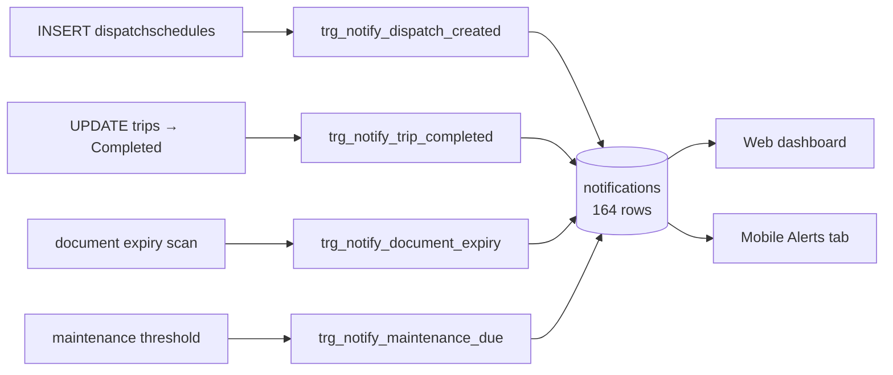

# Feature: Notifications

## What it does

Creates in-app notifications for the events staff and drivers need to know about. **164 rows** — one of the more genuinely exercised features.

## The design choice: notifications are database triggers — CONFIRMED

Four plpgsql triggers write `notifications` rows:

| Trigger | Fires on |
|---|---|
| `trigger_notify_dispatch_created` | new [[dispatchschedules]] row |
| `trigger_notify_trip_completed` | [[trips]] reaching Completed |
| `trigger_notify_document_expiry` | document expiry threshold |
| `trigger_notify_maintenance_due` | maintenance threshold |

**Business logic living in plpgsql rather than JS is a real architectural decision, and it cuts both ways.**

**For:** a notification cannot be missed. Any code path that inserts a dispatch — the API, a migration, a manual `INSERT`, one of the root `apply*.js` scripts — produces a notification. No caller can forget.

**Against:** the logic is invisible from the JS codebase. Someone grepping `src/` for "notification" finds the read API and concludes notifications are created there. It isn't in version-controlled application code in any obvious place, it's harder to test, and it can't easily call out to email or push.

The repository does not currently document why this decision was made. → [[ADR-005 Notifications In Database Triggers]]

## Delivery is in-app only — CONFIRMED

Rows in a table, read by the web dashboard and the mobile **Alerts** tab. No email, no push. A driver who doesn't open the app doesn't find out.

INFERRED: acceptable for a capstone demo; a real deployment would need push, and push can't come from a plpgsql trigger — it would need an outbox pattern or a Supabase webhook.

## Mobile 3-tier delivery — SHIPPED (2026-08-19)

The mobile driver app now surfaces new notifications through a 3-tier system instead of only the Alerts tab. All three route through a single delivery layer.

| Tier | Where it appears | Use for |
|---|---|---|
| 🔔 Push (in-app simulated) | OS local notification (`expo-notifications`) even in another app / background | Important real-time events |
| 📢 Heads-up | Banner across the top of the current screen | Urgent / time-sensitive events |
| 💬 Toast | Compact pill above the tab bar | Confirmation / informational feedback |

**Tier classification** (`mobile/lib/notifications/tiers.js`, pure + unit-tested):
- `type === "Alert"` / `"Emergency"`, `severity ∈ {Critical, Major}`, or `reference_type === "incident"` → **push + heads-up**
- `type === "Warning"` or `severity === "Moderate"` → **heads-up only**
- everything else → **silent** (Alerts tab + badge only)

**Delivery architecture** (`mobile/`):
- `NotificationFeedProvider` (`context/notification-feed.jsx`) polls `/api/notifications` every 30s + on foreground, seeds a seen-set (no flood on mount), routes each new row through `tiers.js`, exposes `unreadCount` + mark-read. The Alerts tab and home-header badge read the same feed (no duplicate polling). Also fixes the Alerts tab's previously-broken `api.patch` mark-read calls → `api.put`.
- `NotificationHost` (`components/NotificationHost.jsx`, mounted in root layout) renders the heads-up banner + toast stacks — double-bezel, MD3 tone containers, spring motion, reduced-motion aware, ≤2 banners / ≤3 toasts, deep-link on tap.
- `notify.*` (`lib/notifications/notify.js`) is the imperative API (AppAlert-style singleton): `notify.toast / headsUp / push`.
- `lib/notifications/push.js` wraps `expo-notifications` (permission, Android channel, immediate local schedule, tap→deep-link via `mobileNotificationTarget`).

**Honest scope:** local notifications fire while the app process is alive (foreground or recently backgrounded). True push for a killed app still needs FCM/APNs + the outbox pattern — documented future work (see [[ADR-005 Notifications In Database Triggers]]).

**Install:** `expo-notifications@0.32.17` (SDK 54). Android local notifications need a dev build (`expo run:android`), which this dev-client project already uses.

## Real push delivery — SHIPPED (2026-08-19)

Replaced the in-app-simulated push with **server-sent real push** via Expo Push Service + FCM, so a push-worthy notification now arrives on the lock screen / notification shade even when the app is killed.

**Flow:**
1. On sign-in the mobile app mints an Expo push token (`getExpoPushTokenAsync` with the EAS `projectId`) and registers it via `POST /api/device-tokens`; on sign-out it deactivates it (`DELETE`). Fire-and-forget — push setup never blocks login/logout.
2. `device_tokens` table (migration 058, RLS: user manages own tokens; server send path bypasses RLS via service role).
3. When a push-worthy notification is created, `sendPush` (`src/services/push.service.js`) reads the target employees' active tokens and POSTs to `https://exp.host/--/api/v2/push/send` — best-effort, never throws, deactivates tokens Expo reports as `DeviceNotRegistered`.
4. `shouldPush(row)` mirrors the mobile tier rule server-side (`Alert`/`Emergency`, severity Critical/Major, or incident ref), so only push-tier rows are sent.

**Wired create paths:** `POST /api/notifications` (employee or role target), and the incident route's dispatcher alerts ("Vehicle Taken Out of Service", "🚨 URGENT: Active Dispatch Interrupted") + oversight "Incident Report Submitted" alerts.

**Double-delivery guard:** with real push enabled, the feed skips the in-app heads-up for push-tier rows (the OS banner already covered it) — no double notify.

**Build config:** `app.json` → `android.googleServicesFile = ./services/google-services.json` (package `com.fleet.mobile`). Expo prebuild auto-wires the Google services Gradle plugin — no manual `build.gradle` edits (that dir is generated/gitignored). `google-services.json` is untracked (contains Firebase config); keep it out of git.

**Remaining limits:** delivery is one-shot best-effort (no retry queue); receipts not polled (only `DeviceNotRegistered` cleanup). iOS APNs needs a matching `google-services`-equivalent setup if the iOS build is ever pushed for real.

## The unused table

`notification_preferences` — **0 rows**. Per-user notification settings were designed and never wired. Everyone gets everything.

## Database tables used

`notifications` (164) · `notification_preferences` (**0**)

## Open questions

- Why triggers rather than service-layer calls? Undocumented. → [[ADR-005 Notifications In Database Triggers]]
- Is `notification_preferences` read anywhere? **TODO:** grep for it; if nothing reads it, it's dead schema.

## Related

[[Dispatch]] · [[Trips]] · [[Maintenance]] · [[Database Overview]] · [[Feature Index]]
