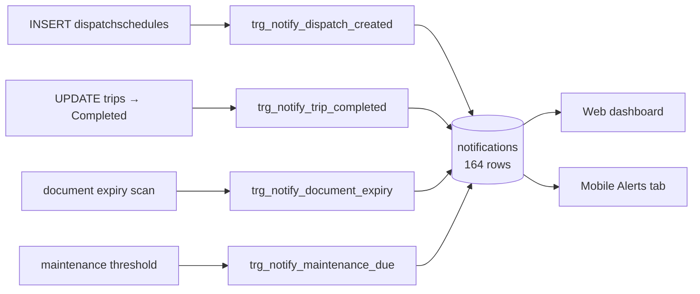

# Feature: Notifications

## What it does

Creates in-app notifications for the events staff and drivers need to know about. **164 rows** — one of the more genuinely exercised features.

## The design choice: notifications are database triggers — CONFIRMED

Four plpgsql triggers write `notifications` rows:

| Trigger | Fires on |
|---|---|
| `trigger_notify_dispatch_created` | new [[dispatchschedules]] row |
| `trigger_notify_trip_completed` | [[trips]] reaching Completed |
| `trigger_notify_document_expiry` | document expiry threshold |
| `trigger_notify_maintenance_due` | maintenance threshold |

**Business logic living in plpgsql rather than JS is a real architectural decision, and it cuts both ways.**

**For:** a notification cannot be missed. Any code path that inserts a dispatch — the API, a migration, a manual `INSERT`, one of the root `apply*.js` scripts — produces a notification. No caller can forget.

**Against:** the logic is invisible from the JS codebase. Someone grepping `src/` for "notification" finds the read API and concludes notifications are created there. It isn't in version-controlled application code in any obvious place, it's harder to test, and it can't easily call out to email or push.

The repository does not currently document why this decision was made. → [[ADR-005 Notifications In Database Triggers]]

## Delivery is in-app only — CONFIRMED

Rows in a table, read by the web dashboard and the mobile **Alerts** tab. No email, no push. A driver who doesn't open the app doesn't find out.

INFERRED: acceptable for a capstone demo; a real deployment would need push, and push can't come from a plpgsql trigger — it would need an outbox pattern or a Supabase webhook.

## The unused table

`notification_preferences` — **0 rows**. Per-user notification settings were designed and never wired. Everyone gets everything.

## Database tables used

`notifications` (164) · `notification_preferences` (**0**)

## Open questions

- Why triggers rather than service-layer calls? Undocumented. → [[ADR-005 Notifications In Database Triggers]]
- Is `notification_preferences` read anywhere? **TODO:** grep for it; if nothing reads it, it's dead schema.

## Related

[[Dispatch]] · [[Trips]] · [[Maintenance]] · [[Database Overview]] · [[Feature Index]]
