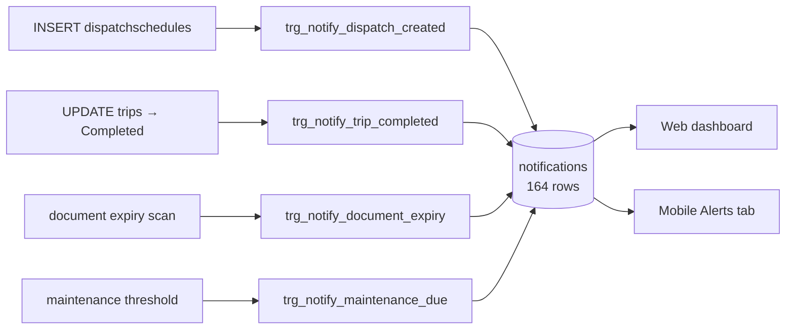

# Feature: Notifications

## What it does

Creates in-app notifications for the events staff and drivers need to know about. **164 rows** — one of the more genuinely exercised features.

## The design choice: notifications are database triggers — CONFIRMED

Four plpgsql triggers write `notifications` rows:

| Trigger | Fires on |
|---|---|
| `trigger_notify_dispatch_created` | new [[dispatchschedules]] row |
| `trigger_notify_trip_completed` | [[trips]] reaching Completed |
| `trigger_notify_document_expiry` | document expiry threshold |
| `trigger_notify_maintenance_due` | maintenance threshold |

**Business logic living in plpgsql rather than JS is a real architectural decision, and it cuts both ways.**

**For:** a notification cannot be missed. Any code path that inserts a dispatch — the API, a migration, a manual `INSERT`, one of the root `apply*.js` scripts — produces a notification. No caller can forget.

**Against:** the logic is invisible from the JS codebase. Someone grepping `src/` for "notification" finds the read API and concludes notifications are created there. It isn't in version-controlled application code in any obvious place, it's harder to test, and it can't easily call out to email or push.

The repository does not currently document why this decision was made. → [[ADR-005 Notifications In Database Triggers]]

```mermaid
flowchart LR
    A["INSERT dispatchschedules"] --> T1[trg_notify_dispatch_created]
    B["UPDATE trips → Completed"] --> T2[trg_notify_trip_completed]
    C["document expiry scan"] --> T3[trg_notify_document_expiry]
    D["maintenance threshold"] --> T4[trg_notify_maintenance_due]
    T1 & T2 & T3 & T4 --> N[("notifications<br/>164 rows")]
    N --> W["Web dashboard"]
    N --> M["Mobile Alerts tab"]
```

## Delivery is in-app only — SUPERSEDED (written before 2026-08-19)

> **Superseded, not confirmed.** Real push shipped 2026-08-19 — see "Real push
> delivery" and "Trigger-created notifications now push via an outbox" below.
> Kept for the reasoning, which is still worth reading; the state it describes
> is no longer true.

Rows in a table, read by the web dashboard and the mobile **Alerts** tab. No email, no push. A driver who doesn't open the app doesn't find out.

INFERRED: acceptable for a capstone demo; a real deployment would need push, and push can't come from a plpgsql trigger — it would need an outbox pattern or a Supabase webhook. *(The outbox pattern is what shipped, and the webhook concern was solved by the outbox plus explicit `flushOutbox()` calls.)*

## Mobile 3-tier delivery — SHIPPED (2026-08-19)

The mobile driver app now surfaces new notifications through a 3-tier system instead of only the Alerts tab. All three route through a single delivery layer.

| Tier | Where it appears | Use for |
|---|---|---|
| 🔔 Push | Loud OS notification (real push, high-importance channel, sound) even when app is killed | Important real-time events |
| 📢 Heads-up | In-app banner **+ quiet OS notification** (low-importance channel, no sound) on shade/lock screen | Urgent / time-sensitive events |
| 💬 Toast | Compact pill above the tab bar | Confirmation / informational feedback |

**Tier classification** (`mobile/lib/notifications/tiers.js`, pure + unit-tested):
- `type === "Alert"` / `"Emergency"`, `severity ∈ {Critical, Major}`, or `reference_type === "incident"` → **push + heads-up**
- `type === "Warning"` or `severity === "Moderate"` → **heads-up only**
- everything else → **silent** (Alerts tab + badge only)

**Delivery architecture** (`mobile/`):
- `NotificationFeedProvider` (`context/notification-feed.jsx`) polls `/api/notifications` every 30s + on foreground, seeds a seen-set (no flood on mount), routes each new row through `tiers.js`, exposes `unreadCount` + mark-read. The Alerts tab and home-header badge read the same feed (no duplicate polling). Also fixes the Alerts tab's previously-broken `api.patch` mark-read calls → `api.put`.
- `NotificationHost` (`components/NotificationHost.jsx`, mounted in root layout) renders the heads-up banner + toast stacks — double-bezel, MD3 tone containers, spring motion, reduced-motion aware, ≤2 banners / ≤3 toasts, deep-link on tap.
- `notify.*` (`lib/notifications/notify.js`) is the imperative API (AppAlert-style singleton): `notify.toast / headsUp / push`.
- `lib/notifications/push.js` wraps `expo-notifications` (permission, Android channel, immediate local schedule, tap→deep-link via `mobileNotificationTarget`).

**Honest scope:** local notifications fire while the app process is alive (foreground or recently backgrounded). True push for a killed app still needs FCM/APNs + the outbox pattern — documented future work (see [[ADR-005 Notifications In Database Triggers]]).

**Install:** `expo-notifications@0.32.17` (SDK 54). Android local notifications need a dev build (`expo run:android`), which this dev-client project already uses.

## Real push delivery — SHIPPED (2026-08-19)

Replaced the in-app-simulated push with **server-sent real push** via Expo Push Service + FCM, so a push-worthy notification now arrives on the lock screen / notification shade even when the app is killed.

**Flow:**
1. Device-token registration is strictly decoupled from permission requesting:
   - On sign-in (`mobile/lib/auth.js`) and cold-start session restore, `registerDeviceTokenIfAuthorized()` checks permission non-promptingly (`hasPushPermission()`); if permission was already granted previously, it registers the token in the background with `POST /api/device-tokens`. If permission is undetermined or denied, it does nothing and never prompts.
   - On first-time onboarding (`mobile/app/permissions.js`), when the driver explicitly taps "Enable Permissions", `requestAppPermission("notifications")` prompts the OS dialog; if granted, the token is minted and registered with `POST /api/device-tokens`. A denial or registration error never blocks entering the app.
   - On sign-out it deactivates it (`DELETE`).
   - Profile → Permissions (`mobile/app/(app)/profile/permissions.js`): turning Push Notifications ON prompts via user gesture and registers the token; turning OFF syncs bulk server preferences (`/api/notifications/preferences`) and dismisses local notifications.
2. `device_tokens` table (migration 058, RLS: user manages own tokens; server send path bypasses RLS via service role).
3. When a push-worthy notification is created, `sendPush` (`src/services/push.service.js`) reads the target employees' active tokens and POSTs to `https://exp.host/--/api/v2/push/send` — best-effort, never throws, deactivates tokens Expo reports as `DeviceNotRegistered`.
4. `deliveryFor(row)` mirrors the mobile tier rule server-side and decides the OS surface: push-tier rows (`Alert`/`Emergency`, severity Critical/Major, or incident ref) go on the loud `default` channel with sound; heads-up-tier rows (`Warning`/`Moderate`) go on the quiet `heads-up` channel with **no sound** so they still reach the shade/lock screen without interrupting.

**Wired create paths:** `POST /api/notifications` (employee or role target), and the incident route's dispatcher alerts ("Vehicle Taken Out of Service", "🚨 URGENT: Active Dispatch Interrupted") + oversight "Incident Report Submitted" alerts.

**Double-delivery guard:** with real push enabled, the feed skips the in-app heads-up for push-tier rows (the OS banner already covered it). Now keyed on `notifications.pushed_at`: when the server pushed a row, the feed skips entirely; the local `notify.push` fallback only fires for rows the server couldn't push (e.g. no device token). Fixes a latent double-notify (server push + feed's local push firing for the same event).

## Trigger-created notifications now push via an outbox — SHIPPED (2026-08-19)

DB-trigger notifications (which bypass the API routes that call `sendPush`) now reach the OS through the vault's documented **outbox pattern** (realizes [[ADR-005 Notifications In Database Triggers]]):

- **Migration 059** adds `push_outbox` (id, employee_id, title, body, channel_id, reference_type, reference_id, status `pending|sent|error`, sent_at, error) + `notifications.pushed_at`. The `notify_dispatch_created` trigger was escalated `Info → Alert`, and a new `trigger_enqueue_dispatch_push` enqueues a loud (`default` channel) push for the assigned driver on every `dispatchschedules` insert.
- **`flushOutbox()`** (`src/services/push.service.js`) reads `pending` rows, sends each via `sendPush` on its channel, marks them `sent`, and stamps `notifications.pushed_at`. Best-effort, never throws.
- **Hooked** (fire-and-forget) after dispatch creation: `POST /api/dispatch`, and `syncDispatchSideEffects()` (`dispatch-autocreate.service.js`) which the transport-request assign route calls — so the **integration assign path also pushes**.
- **VERIFIED end-to-end 2026-08-19:** inserted a test dispatch → outbox row `pending` + `Alert` notification enqueued → flush delivered (Expo ticket `ok`, id `01a0189b`) → outbox `sent` + `pushed_at` stamped. Test rows cleaned up.

**Build config:** `app.json` → `android.googleServicesFile = ./services/google-services.json` (package `com.fleet.mobile`). Expo prebuild auto-wires the Google services Gradle plugin — no manual `build.gradle` edits (that dir is generated/gitignored). `google-services.json` is untracked (contains Firebase config); keep it out of git.

**Two credentials required for Android real push:**
- `google-services.json` (client config) → lets the app mint an Expo push token. Gitignored; uploaded to EAS via `mobile/.easignore` (which otherwise mirrors `.gitignore`). eas-cli's "won't be uploaded" warning is a **false positive** when `.easignore` is used — proven by successful token minting.
- **FCM V1 service account** (Firebase → Service accounts → *Generate new private key* → `fleetops-d559a-firebase-adminsdk-….json`) → lets **Expo's** push server authenticate to FCM. Without it Expo returns `InvalidCredentials` / "Unable to retrieve the FCM server key". Uploaded via `eas credentials` → Android → Google Service Account → select the key (not the legacy "FCM API Key", which Google deprecates).

**Android channel fix (commit 175075b):** the "default" notification channel was only created inside `showLocalNotification`, so remote FCM pushes arrived "delivered" (receipt `ok`) but were **silently dropped** on Android 8+ when the channel didn't exist yet. `initPush()` (`mobile/lib/notifications/push.js`) now creates the channels + foreground handler at app startup (`mobile/app/_layout.js`) so backgrounded/killed delivery displays. **Two channels now:** `default` (HIGH, loud) for the push tier and `heads-up` (LOW, quiet) for the heads-up tier (commit 1704690).

**VERIFIED 2026-08-19:** test push returned Expo ticket `ok` + receipt `ok`; delivered as a real OS notification to a foregrounded dev build. Backgrounded/killed delivery covered by the channel-at-startup build.

**Remaining limits:** delivery is one-shot best-effort (outbox rows go straight to `error`, no retry loop); receipts not polled (only `DeviceNotRegistered` cleanup). iOS APNs needs a matching `google-services`-equivalent setup if the iOS build is ever pushed for real.

## Time-driven trip start-window notifications — SHIPPED (2026-09-09)

The first **JS time-driven producer** (everything before this was
request-triggered). A driver now gets notified when their trip start window
opens, when it's time to head to the pickup, and when the scheduled pickup
has passed without the trip starting.

**Three thresholds of one window** (the same
`computeDepartureWindow` model the start gate enforces):

| Threshold crossed | Title | Tier / channel | Audience |
|---|---|---|---|
| `earliest_start` | "Trip Start Window Open" | quiet heads-up (`Warning` type, `heads-up` channel, no sound) | driver |
| `recommended_departure` | "Time to Head to Pickup" | loud Alert (`default` channel, sound) | driver |
| `latest_start` (= scheduled pickup) | "Trip Has Not Started" / "Scheduled Trip Has Not Started" | loud Alert | driver + dispatchers (`dispatch.update_all` → admin, fleet_manager, dispatcher; management/system_admin never) |

**Design rules** (full contract in
[[Trip Start Window Notifications Implementation Plan]]):
- **Driver Accepted only.** Pending/Approved/Assigned/Vehicle Assigned/
  Driver Assigned/Dispatched trips are never scanned — a driver who hasn't
  accepted cannot start, so a start-window notification is noise. A trip
  that starts or is cancelled between scans simply disappears from the scan.
- **No third window implementation.** The ETA ladder (TomTom → haversine
  heuristic → stored `COALESCE(r.estimated_duration, tr.estimated_duration)`)
  + policy buffers were extracted into
  `src/lib/scheduling/start-window.js` (`resolveEtaMinutes` /
  `resolveStartWindow` / `crossedStartWindowThreshold`); the start gate
  (`PUT /api/trips/[id]/start`) and the driver trips feed
  (`GET /api/mobile/driver/trips`) now consume it too. Parity is pinned by
  tests.
- **Catch-up rule:** one threshold event per trip per run — only the MOST
  ADVANCED crossed threshold fires. A scan that slept through earliest_start
  jumps straight to departure_due or overdue.
- **Concurrency-safe dedupe:** per-trip
  `pg_advisory_xact_lock(hashtext('trip_start_notif_' || trip_id))` inside a
  transaction, then check-then-insert on (employee, title, reference) —
  titles are stable (copy.js rule), so the title IS the event key. No
  global unique constraint (other events legitimately repeat titles).
- **Copy honesty:** never mentions the pre-trip inspection and never says
  "you can start your trip" — the start endpoint still gates on inspection,
  vehicle/driver status and work schedule, and is untouched. Pickup times
  render in **Asia/Manila** explicitly (`manilaTime()` in copy.js), never
  the server's zone. 4 new copy entries: `tripStartWindowOpen`,
  `timeToHeadToPickup`, `tripNotStartedDriver`, `tripNotStartedStaff`.
- **Deep-link:** `reference_type = "trip"`, `reference_id = trip_id` →
  Home tab via `mobileNotificationTarget`.

**Wiring** (`src/services/start-window-notifications.service.js`, called from
`/api/cron/sync` as an isolated best-effort step — one trip's failure never
stops the scan; a scan failure never fails the sync): returns
`start_window_notifications_created` / `start_window_pushes_attempted` /
`start_window_skipped` observability fields, plus
**`start_window_stale_locations`** — eligible trips whose driver position fed
the ETA but is older than 10 minutes or of unknown age
(`drivers.last_location_update`; a NULL position is not counted, that trip's
ETA used the stored duration instead). The ETA ladder keys off
`current_latitude/longitude`, so a driver who hasn't posted recently makes
the window legitimately based on stale position data — pre-existing
behavior, surfaced for acceptance testing. **Cadence: ~once per minute
target; the endpoint is NOT a scheduler** — production must configure an
external caller with `CRON_SECRET` (same deploy-check as the rest of the
sync; see the acceptance checklist in
`[[Trip Start Window Notifications Implementation Plan]]` — caller landed
2026-09-24, not yet firing until the three operator steps (see
**Scheduler status** below). After inserts it drains the outbox **targeted**:
`flushOutbox({ employeeIds: affected })`, never a global flush. Also fixed
`flushOutbox` to send heads-up-channel rows without sound (it previously
always sent `sound: "default"`).

**Scheduler status (2026-09-24):** `.github/workflows/cron-sync.yml` landed —
`*/5 * * * *` schedule with a 5×60s in-job loop (effective ~1/min) calling
`POST /api/cron/sync` with `Bearer $CRON_SECRET`, plus one
`/api/cron/reconcile` per tick. `vercel.json` mirrors both paths for a
possible Vercel return. **Not yet firing:** needs merge to `main`, repository
secrets (`APP_BASE_URL`, `CRON_SECRET`), and `CRON_SECRET` in HostForge —
`cron_sync_last_ok` was still **2026-09-06T04:30:43Z** at the 2026-09-24
re-probe. Operator steps and pass criteria:
[[Trip Start Window Notifications Implementation Plan]] §1–2.

**Verified:** vitest 1088/1088 (94 files) incl. 3 new suites —
`start-window.test.js` (ladder + parity + catch-up),
`start-window-notifications.service.test.js` (all 15 plan scenarios + the
staleness watch item), `preferences.test.js` — plus extended `copy.test.js`
(+30 cases) and `cron/sync/route.test.js` (step isolation + counters);
eslint clean on all touched files; no migration (no schema change).

## Notification preferences are now real — SHIPPED (2026-09-09)

`notification_preferences` is no longer dead schema. Two halves:

- **Producer side:** the start-window service is the first producer that
  reads preferences (`src/lib/notifications/preferences.js` —
  `channelEnabled()` / `loadPreferenceRows()`): a row overrides, an absent
  row inherits the `NOTIFICATION_EVENTS` default. A disabled `in_app`
  suppresses the notifications row; a disabled `push` suppresses the
  push_outbox row (a push-only user still gets the OS push without the
  inbox row).
- **Mobile Push toggle sync:** the app-local Push ON/OFF toggle in
  profile/permissions.js now also best-effort PUTs a **bulk** preference
  (`{ channel: "push", enabled, bulk: true }`) to
  `/api/notifications/preferences` — OFF writes one explicit false row per
  event for the push channel; ON deletes the channel's rows so every event
  falls back to its default (the master switch deliberately wins over
  per-event customization). Without this, remote FCM pushes kept arriving
  even with the in-app toggle OFF.
- Three new `NOTIFICATION_EVENTS` keys: `trip_start_window`,
  `trip_departure_due`, `trip_start_overdue` (in_app + push on, email off).

## Header dropdown behavior (2026-09-05)

`src/components/ui/notification-dropdown.jsx` shows the 5 most recent, **unread-first** (stable sort, read order preserved within each group). Read items stay visible but dimmed (`opacity-70`, full on hover) instead of vanishing — the unread badge is the read/unread signal, and keeping rows stable preserves traceability (re-click a just-read link) per the Gmail-style pattern.

Dedup is by `notification_id`, falling back to the content key only when an id is missing — content-key dedup was collapsing genuinely different notifications with identical text. Same fix in `src/app/(dashboard)/notifications/page.js`. Verified: eslint clean on both files; no unit tests cover this surface.

## The unused table → WIRED (2026-09-09)

`notification_preferences` was **0 rows** and read by nothing until
2026-09-09 — see "Notification preferences are now real" above. The
start-window producer reads it; the mobile Push toggle bulk-writes it.

## New-device sign-in notice — SHIPPED (2026-09-22)

The first producer whose recipient is the **account owner about their own
activity**. Every other event here is about operations (a trip, a dispatch, an
incident); this one is about the account itself.

**Trigger:** a successful sign-in from a device label this employee has not
signed in from in the last **90 days**. The label is
`sessionDeviceLabel(userAgent)` (`src/lib/auth/sessions.js:35`) — browser + OS,
**no version**, so a Chrome update is not a new device. Reusing that helper is
deliberate: it is already tested, and the version-blindness is the property
that keeps this from firing every few weeks.

**Ordering is the whole dedupe.** The check runs in both login gates
(`src/lib/auth.js:280`, `src/app/api/mobile/auth/login/route.js:294`)
**immediately before** the `writeAudit(login_success)` call. That is what stops
the current sign-in counting as its own precedent, and it means a label can
only ever fire once — no separate dedupe key, no advisory lock, no unique
constraint. **No prior `login_success` at all → silent**, so a brand-new account
is not told its own first login was suspicious.

**Producer:** `src/lib/auth/new-device-alert.js` — `recordNewDeviceAlert()`.
Reads `audit_logs` (`resource='authentication'`, `action='login_success'`,
`resource_id = employee_id`, via `idx_audit_resource`) and maps each row's
channel through `sessionDeviceLabel(ua, kind)`, so a web row labels as
"Chrome on Windows" and a mobile row as "FleetOps Driver app".

**Channels:** `in_app` + `push` + **`email`**, all honouring
`notification_preferences` through the standard `loadPreferenceRows` /
`channelEnabled` pair. `type='Alert'` → loud `default` push channel.

`new_sign_in` is **the one event whose email channel is actually delivered**
(2026-09-22). `sendNewSignInAlertEmail` (`src/lib/email/smtp.js`) reuses the
same SMTP transport as the login OTP, and the producer calls it after the
in-app row is committed — awaited, not detached, because a detached send can be
lost when the invocation ends with the response, and this path runs once per
device rather than once per login so the round trip costs the ordinary login
nothing. It is gated exactly as the OTP is: skipped when the transport is
unconfigured or the address is non-deliverable, so the abandoned `@example.com`
fixtures cannot spend sender reputation on a bounce. It carries **no link** —
the only base-URL source is the optional `NEXT_PUBLIC_APP_URL`, so a link could
render as `localhost` in a real inbox. The email is sent **only if the `email`
channel is enabled**, which makes that toggle meaningful for this event alone;
every other event still offers an inert one (BUG-NOTIF-001).

**Deep link:** `reference_type='security'` + `reference_id = employee_id`, with
a new `security` entry in `STAFF_ROUTES` (`src/lib/notifications/target.js`).
`reference_id` **must** be non-null — `getNotificationHref` returns null when
the id is missing, and the tap would silently just mark the row read. Both the
`notifications` and `push_outbox` rows carry the same pair, which is also what
lets `flushOutbox` stamp `notifications.pushed_at`.

**Best-effort, never blocking:** the whole routine is wrapped and cannot deny a
valid sign-in — the same contract as `flushOutbox`. `flushOutbox({
employeeIds: [id] })` is awaited *after* the writes and only when a signal
actually fired, so the ordinary login path pays nothing. The push and email
legs each carry **their own** catch as well: both sit after the in-app row is
committed, so an unhandled failure in either would suppress the ones after it
and report a delivered alert as an error. Push is the channel already known to
reach nobody for an account with no `device_tokens` row, which is exactly the
case that must not matter.

**Honest scope — this is a web control.** `sessionDeviceLabel(ua, "mobile")`
returns the **constant** `"FleetOps Driver app"`, ignoring the user agent
entirely. So every driver phone collapses to one label: a driver is alerted at
most once ever, and a second phone is indistinguishable from the first. Making
mobile meaningful needs the app to send a device model/id. It is also a **coarse**
control by design — an attacker reporting the same browser family + OS as the
victim is not detected, and no location signal exists at all (a country check
was considered and rejected: IP geolocation cannot separate two points inside
the same metro, so it would fire on the owner and miss the attacker).

**No migration** — `notifications`, `push_outbox` and `audit_logs` all already
carried every column used.

**A preference toggle came for free:** the preferences page renders one row per
`NOTIFICATION_EVENTS` key, so `new_sign_in` appeared there with no UI work.

**Gates green (2026-09-22).** Focused 44 (`new-device-alert.test.js` 26,
`smtp.test.js` 18) · full suite 2280 tests / 189 files ·
`eslint --max-warnings 0` clean · `npm run build` succeeds · `db:contract`
(61 relations, 0 violations) and `verify:anon` (0 EXPOSED) unchanged, as
expected with no schema change.

**Sent for real, once.** The producer was driven against the live database for
emp 48 (`crypticalrome@gmail.com`, admin) with a Firefox user agent — a family
that account's history provably lacks, since all eight of its rows are Chrome.
Result `{alerted: true, label: "Firefox on Windows"}`, and Gmail answered
`250 2.0.0 OK` with the recipient `accepted` and none `rejected`. The
`notifications` row (`type='Alert'`, `reference_type='security'`,
`reference_id=48`) and the `push_outbox` row were both written; the latter came
back `status='error'`, because that account has **0 `device_tokens` rows** — so
push reaches it never, and the email is the only channel that would have.

**A private window will NOT fire this for that account** — worth knowing before
a demo. The label is browser family + OS, and a private window clears cookies,
not the user agent, so an owner who already has `"Chrome on Windows"` history
stays quiet. Triggering it on web needs a **different browser family or OS**
(Firefox, Edge, a phone browser), not merely a fresh session.

**Two live-data checks that could each have made this feature wrong, both
run against the real database (read-only):**

1. **User-agent coverage is total, so no false "new device" on first login.**
   `audit_logs` holds 264 `login_success` rows across 10 employees and
   **all 264 carry a non-blank `user_agent`**. The concern that historical nulls
   would label as `"Browser on device"` and never match a real browser — making
   every existing user look like a new device — does not apply here.
2. **Mobile self-dedup holds.** All 64 `okhttp` rows (the app's UA) carry
   `new_values->>'channel' = 'mobile'`, so they resolve to the constant
   `"FleetOps Driver app"` and match the label the current mobile login passes
   in. Had those rows lacked `channel`, they would have been parsed down the web
   path and **every driver would have been alerted on every mobile sign-in**.
   They do not. Web rows likewise carry `channel: 'web'` and parse normally.

**Known false negative, from contaminated test data — not from a bug here.**
`scratch-test.mjs` (committed, repo root) logs in as real drivers against the
live mobile API and writes `login_success` rows with fabricated user agents
(`MobileDeviceA/B/C`, `UserBDevice`, `PrivateIPDevice`, `PublicIPDevice`) and
fake IPs (`123.123.123.123`, `8.8.8.8`). Those rows land on the same
`"FleetOps Driver app"` label as genuine mobile logins, so they **suppress** the
alert they should not. Concretely, employees 1 (Juan Dela Cruz) and 7 (Joseph
Lims) have *no genuine login history at all* — every row is fabricated — so a
real first sign-in from the app will be treated as a known device and stay
silent. `curl/8.17.0` rows on employees 39 and 41 have the same effect but those
accounts have ample genuine history. Removing the script and its rows is
outstanding; the false negative persists until then.

**Still unverified: no real sign-in has exercised the producer.** Both call
sites are wired and correctly ordered before their `writeAudit` (confirmed by
reading), and every run so far drove `recordNewDeviceAlert` directly rather than
through a login. The remaining check is a human signing in from a browser family
the account has never used (expect the notice, in-app and by email), then from
the same one again (expect silence), and tapping the notification (must land on
`/settings/security`). The mobile path remains unexercised entirely.

## Deletion, dismissal & retention — 2026-09-24 (migration 127)

The inbox is **soft delete on both platforms**, with a retention purge.

- **Schema**: `notifications.deleted_at TIMESTAMPTZ` (migration `127`) plus two
  partial indexes — `(employee_id, sent_at DESC)` and `(user_id, sent_at
  DESC)`, both `WHERE deleted_at IS NULL` — so dismissed rows never enter the
  read path.
- **Web** — `DELETE /api/notifications/[id]` runs
  `UPDATE … SET deleted_at = NOW()` (it used to be a literal `DELETE FROM`,
  the one hard-delete row path among the feature tables). Same self-scope /
  `delete_all` scoping; 404 on a repeat dismiss; response shape unchanged
  (`{ deleted: true }`), so the inbox page and confirm dialog needed no change.
- **Mobile** — new dismiss (trailing X on each Alerts card, no confirm) calls
  the same endpoint through the pre-existing `api.del` helper: optimistic
  remove, 404 = already-gone (success), anything else refetches to roll back.
  Before this, mobile had **no** delete path at all — only mark-read — so web
  and mobile were asymmetric.
- **One filter hides them everywhere** — `GET /api/notifications` always adds
  `n.deleted_at IS NULL`; the web inbox, bell badge, unread counts, the driver
  "Important notifications" card, and the mobile feed all read that one
  endpoint.
- **Retention** — `purge_deleted_notifications(p_retention_days = 90)`
  (SECURITY INVOKER; `EXECUTE` revoked from `PUBLIC`, `anon`, `authenticated`)
  hard-deletes rows dismissed more than 90 days ago. Scheduled **daily at
  `41 3 * * *`** through **pg_cron** (job `notifications-purge`) — deliberately
  not `/api/cron/sync`, because at the time of writing (2026-09-24) the HTTP
  scheduler workflow exists but is not yet firing (`cron_sync_last_ok` still
  stale since 2026-09-06; needs merge + secrets + HostForge `CRON_SECRET`),
  while pg_cron demonstrably runs. The window is interval-based off each row's
  `deleted_at`, so the DB timezone in the cron expression is irrelevant.
- **Dedup queries deliberately unchanged** — the anti-spam existence checks
  (`SELECT 1 FROM notifications …` in start-window, SLA escalation,
  assigned-trip scan, UVVRP, incidents) still count dismissed rows, so
  dismissing a notification never re-arms a producer to re-spam the same user.
- **Read/unread untouched** — `is_read`/`read_at` remain the only other soft
  state; the table still has no restore endpoint (restore = operational/DB
  concern, not a user flow).

Verified 2026-09-24: `db:check` valid (127 files) → `db:up` applied →
`db:dump` refreshed `schema.sql`; new route tests 9/9; full suite **206 files
/ 2504 tests** green; lint clean; `verify:anon` **0 exposed**; `db:contract`
**0 violations**; production build green; live probes **8/8**
(`scratch/probe-notifications-soft-delete.mjs`) — column, both partial
indexes, anon `EXECUTE = false`, pg_cron job present, purge smoke (100-day-old
probe row purged, 1-day-old kept) inside a rolled-back transaction, 607-row
partition consistent. **Not device-verified:** the mobile X button (UI only;
the endpoint it calls is covered by the route tests).

## End Duty reminder (two-stage) — 2026-09-26 (Part C)

The first producer whose subject is a driver's **own unfinished paperwork**
rather than an event that happened to them. Every other producer here notifies
about something that occurred (a dispatch, a trip window, an incident, a
sign-in); this one notifies about something that has **not** occurred yet, which
is why it needs two rules the others do not — see the header of
`src/services/end-duty-reminder.service.js`.

**Two stages, one ladder** (`src/lib/scheduling/end-duty-thresholds.js`:
`crossedEndDutyThreshold`, plus `END_DUTY_GRACE_MINUTES = 30` /
`END_DUTY_OVERDUE_MINUTES = 120`):

| Boundary crossed | Title | in-app type | push channel | Sound |
|---|---|---|---|---|
| shift end **+ 30 min** | `End Duty Reminder` | `Warning` | `heads-up` | **silent** |
| shift end **+ 2 h** | `End Duty Still Not Reported` | `Alert` | `default` | **loud** |

Catch-up rule, same as the start-window producer: only the **most advanced**
crossed stage fires, so a scan that slept through 30 minutes jumps straight to
stage 2. One run therefore never sends both.

- **The grace starts *after* the shift ends; the mobile nudge opens *before* it.**
  `mobile/lib/end-duty.js` opens the End Duty card 30 minutes early, while this
  producer's clock does not start until `shiftEnd`. A driver still driving home
  has not forgotten anything, so firing at the same moment the card appears
  would be a duplicate of a surface they can already see.
- **The roster out-time is read, never re-derived.** `syncEndDutyReminders`
  calls `loadDriverScheduleContext` + `driverDayEligibility` and takes
  `duty.end` from that verdict — the same pair `GET /api/mobile/driver/duty`
  answers from. Recomputing it here would give the reminder and the `setDuty`
  gate two clocks that can drift. A `blocked` verdict (rest day, approved leave,
  no roster row) increments `end_duty_skipped`, never `errors`.
- **The dedupe's per-day half lives in `reference_id = YYYYMMDD`** (the
  `dutyDayKey` of the duty's own `date`). Titles are stable event names and the
  title *is* the dedupe key (the copy.js rule), so the title contributes nothing
  to the date. A constant in `reference_id` would notify each driver **once
  ever** and then silently swallow every later night — the failure mode this
  module is most likely to grow, and the one two tests pin. Dedupe runs under
  `pg_advisory_xact_lock(hashtext('end_duty_reminder_' || attendance_id))` with
  check-then-insert on `(employee, title, reference_type, reference_id)`, the
  migration-029 convention — and the check reads **both** tables
  (`notifications UNION ALL push_outbox LIMIT 1`). It has to: a driver with
  `in_app` off gets no `notifications` row at all, so a notifications-only
  lookup would never trip and every cron tick would enqueue another push until
  the stage advanced. Found by post-plan review 2026-09-26 and fixed here; the
  start-window producer still reads `notifications` only and is recorded
  unfixed under `Bugs.md` → Severity 2.
- **Both stages share one `NOTIFICATION_EVENTS` key**, `end_duty_reminder`
  (`src/lib/constants.js:268`, `{ label: "End Duty Reminder", defaults: { in_app:
  true, email: false, push: true } }`). Deliberate: the mobile Push toggle is a
  master switch over the channel, so a driver cannot silence stage 2 while
  keeping stage 1. That asymmetry is the safe direction — stage 2 only fires once
  the report is hours late and the automatic close is the next thing due to touch
  the row. Preferences are honoured exactly as the start-window producer honours
  them (`loadPreferenceRows(ids, [event])` + `channelEnabled`): a disabled
  `in_app` suppresses the `notifications` row, a disabled `push` suppresses the
  `push_outbox` row, both disabled writes nothing.
- **The dedupe queries dismissed rows too**, so dismissing a reminder does not
  re-arm the producer (same rule as the other producers, see the retention
  section above).
- **Honest limit:** a driver with no active `device_tokens` row receives no OS
  notification at all. `flushOutbox` reports it as an `error` and the sync
  counters surface it, but nothing can fix it — the app must have been signed in
  on a **real device build** at least once. Nothing here is retried for that
  driver.

**Wiring:** `syncEndDutyReminders()` from `/api/cron/sync` as an isolated
best-effort step — the producer never throws, and the route wraps it in a
`try/catch` returning zeroes anyway (a zeroed field reads as "ran and failed";
an absent one reads as "did not run"). Response fields:
`end_duty_reminders_created`, `end_duty_pushes_attempted`, `end_duty_skipped`,
and `N end-duty reminders` in the `message`. The outbox is flushed **targeted**
(`flushOutbox({ employeeIds: affected })`), never globally. Deep link:
`reference_type = "duty"` → mobile `/end-duty`
(`mobileNotificationTarget`), web `/driver` (driver-only; `STAFF_ROUTES`
deliberately omits `duty`, so a staff tap resolves to `null` = mark-read).

**The trigger — the part future readers most need: `/api/cron/sync` had no
caller.** The route is not a scheduler (see its own `DEPLOY CHECK` header
comment, which this does not duplicate); no scheduler was configured, and
`cron_sync_last_ok` had been stale since **2026-09-06**. Every time-driven
producer was therefore correct code that never executed — the trip start-window
producer included, dead in the same silent way since 2026-09-09.
`.github/workflows/cron-sync.yml` is now that caller (`*/5 * * * *` with a 5×60s
in-job loop for an effective ~1/min, one `/api/cron/reconcile` per tick;
`vercel.json` mirrors both paths), and it unblocks the start-window producer
too. Honest limits, all accepted for a capstone: GitHub's schedule is **queued,
not punctual** and can be skipped on a busy minute; it runs **only on the default
branch**; and GitHub **disables scheduled workflows after 60 days without
repository activity**. It is also **not yet firing** as of 2026-09-26 — it still
needs a merge to `main`, the `APP_BASE_URL` / `CRON_SECRET` repository secrets,
and `CRON_SECRET` in the deployment environment (see
`Capstone/07 - Development/Technical Debt.md`).

Verified 2026-09-26: `src/lib/scheduling/end-duty-thresholds.test.js` 15/15 and
`src/services/end-duty-reminder.service.test.js` 13/13 (both red-green),
`cron/sync/route.test.js` 7/7, `mobile/lib/notifications/navigation.test.js` +
`src/lib/notifications/target.test.js` 5/5; lint exit 0; repo-wide **217 files /
2657 tests**. **No device verification exists** — acceptance criteria 1–3 and 6
of the plan need a real device build (Expo Go cannot receive remote pushes), and
criterion 10 needs a manual Actions run; all recorded as not performed.

## Database tables used

`notifications` (164) · `notification_preferences` (**0** at last audit;
written by the mobile Push toggle since 2026-09-09) · `push_outbox`

## Producer audit + event→recipient matrix — 2026-09-07

Decision: the inbox stays **per-user** (own `employee_id` rows, per-user
read/unread — no shared role inboxes). Role-awareness lives in the **producers**:
each event fans out one row per `employee_id`, and this matrix defines who that
set must be. Verified against code + live DB (508 rows; 1 admin, 2 dispatcher,
8 driver, 3 fleet_manager, 1 management, 1 system_admin employees).

Role-id map (`src/lib/constants.js:13-20`): 1 system_admin · 2 fleet_manager ·
3 dispatcher · 4 driver · 7 management · 9 admin.

Key for `rolesFor(...)` (resolved from `src/lib/auth/permissions.js` MATRIX):
- `incidents.read` → system_admin, admin, fleet_manager, dispatcher, **management**
- `incidents.route_to_maintenance` → system_admin, admin, fleet_manager
- `drivers.update` → system_admin, admin, fleet_manager
- `trips.update_all` → system_admin, admin, fleet_manager, dispatcher
- Overseer triple (hard-coded in incident paths) → system_admin, fleet_manager, admin

### The matrix

| Event | Producer | Current recipients | Verdict + proposal |
|---|---|---|---|
| Incident reported | `driver/incidents/route.js:435-448` + self-ack `:338-349` | overseers triple + reporting driver | **OK** — authority + owner. |
| Vehicle Taken Out of Service (grounding) | `grounding.js:69-87` via `rolesFor(incidents,read)` | sysadmin, admin, fleet_mgr, dispatcher, **management** | **OVER-BROAD** — live proof: the single management user holds **22** of these Alerts. Management is read-only (`acknowledge/resolve: false`) yet the copy demands action ("Reassign immediately!"). Proposal: drop management (precedent: SLA path already excludes them). |
| GUEST STRANDED trip abort | `grounding.js:124-153` (`IN ('guest_services','system_admin','dispatch')`) | **system_admin only** | **BUG (role-name mismatch)** — `guest_services` and `dispatch` do not exist in `roles` (verified live: only the 6 known roles). The dispatcher — the one role that must arrange replacement transport — is never paged. Proposal: `('dispatcher','fleet_manager','admin','system_admin')`. |
| Scheduled Dispatch Interrupted | `grounding.js:163-184` via same `staffRecipients()` | incl. management | **OVER-BROAD** — same fix as grounding alert. |
| SLA breach escalation | `sla.js:31-57` overseers triple | sysadmin, fleet_mgr, admin | **OK** — correctly excludes dispatcher/management (no action for them). |
| Responder assigned / Help updates / Arrived | `incidents/[id]/responder/route.js:188-224`, `responder-tracking.js:247-306` | responder + reporter; overseers on Arrived | **OK** — both field parties + authority handover. |
| Acknowledge / response / resolve / reopen | `incidents/[id]/{acknowledge,response}/route.js`, `incidents/[id]/route.js:295-315`, `.../reopen`, `.../resolve`, `.../arrived` routes | reporter (+ overseers where applicable) | **OK** — owner loop-closure throughout. |
| Maintenance WO created | `maintenance.js:104-143` via `route_to_maintenance` | sysadmin, admin, fleet_mgr | **OK** — maintenance queue owners. |
| Repair completed | `vehicle-maintenance/[id]/route.js:182-209` | reporting driver | **OK**. |
| Dispatch Assigned | trigger `059` | assigned driver | **OK**. |
| Trip Completed | trigger `003:94-116` | dispatch creator | **OK** — but see orphans below. |
| Reservation Approved | trigger `003:6-41` on `vehiclereservations` | **nobody (0 rows ever)** | **DEAD + GAP** — live path uses `transportation_requests`, so approvals notify no one. Proposal: emit from `setReservationStatus` (requester + dispatcher/fleet_mgr/admin). |
| Maintenance Due Soon | trigger `003:68-91` | fleet_mgr, admin | **INCONSISTENT** — omits system_admin, unlike the JS overseer triple. Proposal: add system_admin. |
| Document Expiring Soon | trigger `003:118-140` | fleet_mgr, admin | **INCONSISTENT** — same fix. (Only 2 rows ever — expiry scan rarely runs; separate concern.) |
| Leave requested | trigger `053/055` | fleet_mgr, admin | **OK** — dispatcher was added in 054 then deliberately removed in 055 "per business rules". Precedent for narrow audiences. |
| Leave reviewed | trigger `053:73-98` | owning driver | **OK**. |
| Failed pre-trip inspection | `mobile/driver/inspections/route.js:123-145` via `trips.update_all` | sysadmin, admin, fleet_mgr, dispatcher | **OK** — dispatcher assigns trips and must know. |
| Driver Auto-Suspended | `status.service.js:283-304` via `drivers.update` | staff only — **driver never told** | **GAP (owner not notified)** — 0 driver-role rows for any compliance title, ever. Proposal: also notify the suspended driver. |
| Driver Reinstated | `drivers/[id]/route.js:280-300` via `drivers.update` | staff only — **driver never told** | **GAP** — same fix. |
| License self-upload | `driver/license-scan/route.js:174-194` via `drivers.update` | sysadmin, admin, fleet_mgr | **OK** — staff must review; driver knows they uploaded. |
| Registration / license expiry scan | `status.service.js:160-233` hard-coded `fleet_manager,admin` | fleet_mgr, admin | **INCONSISTENT** — omits system_admin (suspension path right below includes them). Proposal: align to the same triple. |
| UVVRP block / warn / approval | `uvvrp.service.js:138-217` hardcoded `[1,2,3,9]` / `[1,2,9]` | matches `decide` authority (approval correctly excludes dispatcher) | **OK but fragile** — raw role ids break silently on role changes; prefer role names. |
| Generic `POST /api/notifications` (incl. `role_id` broadcast) | `notifications/route.js:40-102` | — | **BROKEN / DEAD** — validator accepts `role_id, entity_type, entity_id, link, priority` but `information_schema` confirms **none of these columns exist**, so any such INSERT fails. Zero in-`src` callers (`sendNotification` unused). Proposal: strip the dead fields from the validator and document fan-out producers as the only broadcast path. |

### Data hygiene (live DB)

- **33 orphan rows** addressed to role-less recipients (17 Info, 15 Success, 1 Alert) — producers never check that the target employee still has a role. Proposal: skip + warn when recipient has no role.
- Trigger role lists and JS producers disagree on whether system_admin is in the audience (triggers: no; JS overseers: yes). Pick the triple everywhere staff action is expected.

### Explicitly out of scope (kept as-is per decision)

- Per-user inbox + per-user read/unread: unchanged. No shared role inboxes.
- `notification_preferences`: preserved, still UI-only (nothing in the delivery path reads it — wiring it as an opt-out for Info-tier remains a follow-up, not this audit).

## Role-aware routing — SHIPPED (2026-09-07)

Inbox stays per-user; producers are now role-aware. Full event→recipient
matrix (audit) is above; this is what changed in implementation:

- **New resolver** (`src/lib/notifications/recipients.js`, unit-tested):
  `notificationRolesFor(resource, action, { exclude })` derives from authority
  but strips non-operational roles (default: `system_admin`); `dedupeEmployeeIds`
  collapses multi-path qualification to exactly 1 row; `employeeIdsForRoles` /
  `resolveNotificationRecipients` exclude role-less and deleted employees.
- **system_admin silent** on routine ops: dropped from SLA, responder-tracking,
  field resolve/reopen/arrive, incident-submit, maintenance-team, inspections,
  reinstatement, license-scan, suspend, and UVVRP fan-outs. (Triggers already
  excluded them — now consistent everywhere.)
- **management out of action alerts**: grounding `staffRecipients()` excludes
  observers (was the source of 22 "Vehicle Taken Out of Service" Alerts to the
  read-only role). SLA already excluded them.
- **Stranded-guest role-name bug fixed** (`grounding.js`): `('guest_services',
  'system_admin', 'dispatch')` — two of which match no live role — is now
  `('dispatcher', 'fleet_manager', 'admin')`. The dispatcher is paged on
  stranded guests for the first time.
- **"Transport Assigned" loop-closure** (`reservation-lifecycle.service.js`):
  first arrival at Assigned emits to dispatcher/fleet_manager/admin via
  `notificationRolesFor("reservations", "assign")`. No owner row exists to send
  — requests originate from Booking (no internal `created_by`); external status
  flows back through `emitTransportStatus`. Retries (reassignment path, hops
  empty) never re-emit. Replaces the dead `reservation_approved` key:
  `NOTIFICATION_EVENTS` renamed, and migration 107 moved the 8 live
  `notification_preferences` rows to `transport_assigned` (verified: 0 legacy
  rows remain; branch 2B of the lock).
- **Owner loop-closure**: auto-suspend (`status.service.js`) and reinstatement
  (`drivers/[id]`) now notify the driver alongside staff (previously staff-only;
  0 driver-role compliance rows had ever existed).
- **POST cleanup** (`api/notifications/route.js`): validator accepts exactly the
  storable columns; `role_id/entity_type/entity_id/link/priority` dropped and
  the dead `role_id` push-expansion branch removed. `is_read` is a real column
  but server/user-state controlled — never client-set at creation.
- UVVRP `notifyCoding` takes role names (was hardcoded ids `[1,2,3,9]`).

Verification: eslint clean on all touched files; vitest 628/628 (60 files,
incl. 7 new resolver tests); `db:check` clean (110 files valid);
`db:up` applied 107 + `db:dump` refreshed (schema.sql diff is 106's
`ai_prompt_templates` table, unrelated); live checks 6/6 (legacy key gone,
audiences resolve without mgmt/sysadmin, dispatcher present, assign audience
non-empty). Trip-completed `created_by`-NULL orphans and the dead
`vehiclereservations` approval trigger remain documented follow-ups (need a
trigger-touching migration batch).

## Driver notification microcopy — SHIPPED (2026-09-08)

All **JS-produced driver-facing** notification wording now lives in one pure
module: `src/lib/notifications/copy.js` (119 vitest cases in `copy.test.js`).
Producers pass data in and get `{ title, message, pushBody }` out — no
hand-rolled driver strings in the routes anymore.

**Tone rules** (module header, enforced by tests): title is a stable event
name with no IDs/names/dates (title is the dedupe key in the SLA + maintenance
paths); message = what happened + who + what happens next, never a promised
response time; pushBody ≤ one short sentence; **no incident numbers in driver
copy** — a driver never sees "report #47"; the notification's `reference_id`
deep-links to the incident instead (revised 2026-09-08 per user feedback —
the number read as clutter in the push banner); **dates read as words**
("January 1, 2026", never ISO "2026-01-01" — via the module's `dateWords()`,
UTC-calendar-stable for timestamped values); incident types pass through
`incidentTypeLabel()` (`src/lib/incidents/resolution.js`) so a driver sees
"Vehicle Breakdown", never "breakdown"; no staff jargon in driver copy.

**Coverage — the full reporter loop-closure:** report submitted → under review
(`driver/incidents/route.js`), acknowledged (`incidents/[id]/acknowledge`),
manual response updates (`incidents/[id]/response` — was "Tow Truck en route
for your incident report (#47)"), responder assigned to **both** driver
audiences (`incidents/[id]/responder` — the responder driver and the stranded
reporter), auto-tracking en-route/arrived/new-ETA
(`lib/incidents/responder-tracking.js`), arrived-on-device
(`driver/responder/arrived`), resolved by responder / by staff
(`driver/responder/resolve`, `incidents/[id]`), and vehicle repaired
(`vehicle-maintenance/[id]`).

**Compliance audience split (fixed a real bug):** auto-suspend
(`status.service.js`) and reinstatement (`drivers/[id]`) previously sent ONE
copy to staff ∪ driver — the driver was told to "reinstate from their
profile". Now staff keep the operational wording
(`driverAutoSuspendedStaff` / `driverReinstatedStaff`, unchanged) while the
owner gets driver-appropriate copy (`driverAutoSuspendedDriver` — renew your
license and contact the fleet team; `driverReinstatedDriver`).

**Two SQL-trigger copy exceptions** (migration 110, applied + dumped): the
producers whose wording is composed inside plpgsql can't read the JS module —
`notify_dispatch_created` + `enqueue_dispatch_push` (059, "You have a new
dispatch (DSP-X). Open the app for pickup time, guest, and route details.")
and `notify_leave_reviewed` (053, dates moved out of the copy — "Check the
app for the approved dates."). Editing those means editing the migration's
`CREATE OR REPLACE` bodies and re-dumping.

**Left for a separate pass:** staff/overseer copy (SLA breach, Responder On
Scene, Resolved by Driver, Reopened, Incident Report Submitted, Maintenance
WO, grounding alerts), mobile-local toasts, and historical rows (old copy
stays as-is — rendering is read-only).

**Verified:** vitest 945/945 (82 files, incl. the 119 copy tests); eslint
clean on all touched files; `db:up` applied 110, `db:dump` refreshed, the
schema.sql diff also caught up migration 109's `trip_monitor_alerts` table
(applied earlier but never dumped); live smoke
`scripts/verify-notification-copy.mjs` (route-harness loader) — 10/10: the
reporter's notification rows match the copy module byte-for-byte through the
real driver POST → staff acknowledge → staff resolve flow, and `pg_proc`
carries the new trigger copy. Test rows hard-deleted. Re-verified 2026-09-08
after removing incident numbers from the wording and spelling out dates
(same 10/10 smoke).

## Staff notification copy audit — 2026-09-08 (prep for the deferred staff pass)

Audited every producer that pages dispatcher / fleet_manager / admin. No code
changed — findings only. Best copy in the codebase: the live-trip-monitor
signals (`live-trip-monitor.service.js` — "Juan Dela Cruz is running about 8
min behind the schedule", "projected to MISS the next assigned pickup (about
12 min late)") — who + what + number + consequence, the exact benchmark the
driver copy was built to; also UVVRP (`lib/uvvrp/uvvrp.service.js` — plate +
restriction + day + what to do).

Findings, worst first:

1. **Raw `incident_type` leaks into staff copy** (the bug class the driver
   pass fixed): "Incident Report Submitted" (`driver/incidents/route.js` —
   "Driver Juan Dela Cruz reported breakdown (Severity: Critical)"), SLA
   breach (`sla.js` — "Incident #47 (breakdown, Critical)"), Reopened
   (`driver/incidents/[id]/reopen/route.js`). None pass through
   `incidentTypeLabel()`.
2. **ISO date in Driver License Updated** (`driver/license-scan/route.js` —
   "New expiry on file: 2026-01-01") — the exact format removed from driver
   copy; `dateWords()` lives in `copy.js` but that module is driver-only.
3. **No pushBody discipline**: every staff producer pushes the full message
   (SLA ~150 chars, GUEST STRANDED ~200); license-scan slices at 160
   arbitrarily. Driver copy has dedicated ≤120-char push bodies.
4. **Suppression gap**: when grounding fires, "Incident Report Submitted" is
   skipped, so the *most severe* incidents notify staff only via "Vehicle
   Taken Out of Service" — which omits driver name, severity, and type.
5. **Three audience-resolution patterns for the same roles**:
   `notificationRolesFor(...)` (the designed way) vs hardcoded
   `OVERSEER_ROLES = ["fleet_manager","admin"]` duplicated in 4 files vs
   inline role lists (`sla.js`, `grounding.js`). A MATRIX edit strands the
   hardcoded lists — e.g. dispatcher holds `incidents.acknowledge: true` but
   is **not** paged for SLA breach / Incident Report Submitted / Responder On
   Scene, only for grounding + live-ops + transport-assigned.
6. **grounding.js is the only producer with emoji + ALL CAPS +
   "IMMEDIATELY!"** — urgency is right for stranded guests, the register is
   not.
7. Numbers ARE right for staff (lookup keys: Incident #47, WO #12, Dispatch
   #DSP-X) — keep, just normalize "incident #47" vs "Incident #47" casing.

Staff-pass shape (mirrors the driver pass): extend `copy.js` with staff
variants, `incidentTypeLabel()` at every incident-type call site,
`dateWords()` for the license-scan expiry, per-event pushBody, and replace
hardcoded role lists with `notificationRolesFor()` after deciding whether the
dispatcher belongs in the incident loop.

## Web Notification Card UI Redesign — 2026-09-29

Redesigned the web notification card presentation (`src/components/notifications/notification-card.jsx`, `src/app/(dashboard)/notifications/page.js`, `src/components/ui/notification-dropdown.jsx`, `src/app/(dashboard)/driver/page.js`) according to the modern enterprise visual reference (`media_1790645679741.png`).

### Core Design Rules & Principles
1. **Neutral Surface & Anti-Tinted Card Rule**: Eliminated heavy full-card tinted gradients (`from-sky-500/10`, `from-rose-500/10`). All cards utilize a neutral crisp white surface (`#ffffff`, in dark mode `dark:bg-slate-900/90`), subtle hairline border (`#d7dee7`, `dark:border-slate-800`), smooth `22px` rounded corners, and soft ambient drop shadow (`0 8px 24px rgba(15, 23, 42, 0.04)`).
2. **Targeted Semantic Accentuation**: Semantic color is exclusively concentrated on:
   - **Left Squircle Icon Container** (`56px × 56px`, `rounded-[18px]`):
     - *Failed Inspection / Incident / Alert / Error*: soft pinkish/red `#fdebed` background with `#e5484d` icon (`AlertCircle`).
     - *Maintenance Due Soon / Warning / Moderate*: soft peach/amber `#f9f1e3` background with `#d97706` icon (`AlertTriangle`).
     - *Success / Completed*: soft emerald `#ecfdf5` background with `#059669` icon (`CheckCircle2`).
     - *Info / Dispatch / Trip*: soft blue `#eff6ff` background with `#2563eb` icon (`Send` / `Route` / `Info`).
   - **Status Indicator**: High-contrast blue dot (`#3b82f6`, 10px circular pill) sitting directly beside the title when unread.
   - **Pill Category Badge**: Uppercase reference badge with subtle tone (e.g. `[ MAINTENANCE #57 ]` in `#fdebed`/`#e5484d` for repairs or `#f9f1e3`/`#c46b00` for scheduled due items).
3. **Typography & Spacing**:
   - Title: 18–20px bold (`#101828` / `dark:text-white`), `leading-snug`, `tracking-tight`.
   - Description: 15–16px normal (`#667085` / `dark:text-slate-400`), `leading-relaxed`.
   - Meta Row: Pill badge + 1px vertical hairline divider (`#d9e1ec`) + formatted date (`formatDate`, e.g. "Sep 29, 2026").
4. **Circular Action Icons**: Top-right circular buttons (`w-12 h-12 sm:w-14 sm:h-14 rounded-full`):
   - Acknowledge / Check Button: Neutral circular button (`#fafbfc`, border `#e6ebf2`, text `#667085`, `Check` icon).
   - Delete Button: Circular button with soft rose border (`#f0d5d9`), white background, and red icon (`#ef4444`, `Trash2` icon).
5. **Universal Web Adoption**:
   - `/notifications` page: Removed clumsy gray card wrapper in favor of clean vertical card stack (`gap-5`).
   - Header `NotificationDropdown`: Adopted `compact={true}` mode with unified neutral card architecture and semantic icon container.
   - Driver Dashboard: Upgraded Important Notifications feed to compact neutral card layout.

### Verification
- 14/14 unit tests passing in `src/components/notifications/notification-card.test.js`.
- ESLint clean with 0 errors and 0 warnings across all touched web files.
- Full responsive test across desktop, tablet, and mobile viewports.

## Mechanic work-order fan-out — 2026-10-06

Post-commit, best-effort fan-out on every PUT lifecycle event in
`src/app/api/vehicle-maintenance/[id]/route.js` (Task 3 guards untouched).
One shared `fanout()` helper does the dedupe-guarded
`INSERT … SELECT … WHERE NOT EXISTS` (with the `::varchar` casts
`maintenance.js` requires), and pushes only to genuinely new recipients.
Recipients come from `notificationRolesFor("incidents",
"route_to_maintenance")` + `resolveNotificationRecipients`, sanitized with
`dedupeEmployeeIds`. The PUT never fails on notify failure (`writeAppError`,
never `console.warn`).

| Trigger | Audience | Title | `reference_type` |
|---|---|---|---|
| Newly assigned (null → Y) | assignee Y | Maintenance Work Assigned | `mechanic_maintenance` |
| Reassigned (X → Y) | **both** Y and X | Maintenance Reassignment | `mechanic_maintenance` |
| Escalated to High/Emergency (edge only, assigned) | assignee + `route_to_maintenance` staff | Urgent Maintenance Assigned (`Alert`) | assignee `mechanic_maintenance`, staff `maintenance` |
| → Pending Inspection **by a mechanic actor** | `route_to_maintenance` staff | Maintenance Ready for Inspection | `maintenance` |
| Pending Inspection → In Progress (rework, reason guaranteed by the guard) | assignee | Maintenance Returned for Rework | `mechanic_maintenance` |
| → Completed | assignee (+ existing `vehicleRepaired` to the reporter) | Maintenance Work Approved | `mechanic_maintenance` |
| Assigned WO's vehicle/date changed, or WO archived | assignee | Assigned Maintenance Updated | `mechanic_maintenance` |

**Reference split.** Mechanic-audience rows are `mechanic_maintenance` so taps
resolve to `/mechanic/work-orders/:id` (`MECHANIC_ROUTES`, mechanic branch in
`target.js`); staff rows stay `maintenance` so their taps keep resolving to
the staff surface. Same Maintenance chip in `presentation.js` — the type
differs only to route the tap. The summary `attention` query has no
`reference_type` filter, so both land on Today's Line.

**Why reassignment gets its own title.** The dedupe key is
`(employee, title, reference)`. Reusing Assigned for a reassignment would
collapse the new row into the old one for a re-notified employee — or read as
a duplicate. A distinct Reassignment title keeps X's and Y's rows apart and
guarantees "Reassigned to both, never Assigned twice". Ready-for-inspection
fires only on the mechanic actor's edge: staff moving a WO to Pending
Inspection themselves already know, so paging them would be self-notification
noise. Urgent fires only on the escalation edge, not on every PUT to an
already-urgent WO.

**Verified.** TDD RED (29 `fn is not a function`) then GREEN (`copy.test.js`
184/184; vehicle-maintenance + notifications suites 230/230; Task 3 guard
tests unbroken; notification-adjacent sweep 135/135). `verify:auth` 295/295
(pre-4b). No migration touched (`reference_type` is unconstrained
`varchar(100)`).

## Open questions

- Why triggers rather than service-layer calls? Undocumented. → [[ADR-005 Notifications In Database Triggers]]
- ~~Is `notification_preferences` read anywhere?~~ **Answered 2026-09-09:** yes — the start-window producer reads it (`src/lib/notifications/preferences.js`), the mobile Push toggle bulk-writes it, and the preferences API GET/PUT resolves it.

## Related

[[Dispatch]] · [[Trips]] · [[Maintenance]] · [[Database Overview]] · [[Feature Index]]
