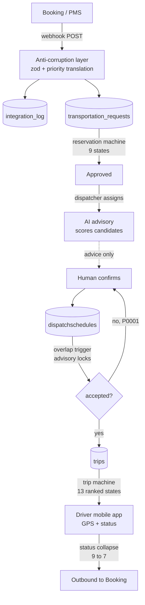

# Request Lifecycle

The end-to-end path of one guest transport request, and **the three state machines it passes through**. This is the note to read if you only read one workflow note.

## The chain

## Which machine owns which stage

| Stage | Machine | Table |
|---|---|---|
| Request approval | [[Reservation State Machine]] — 9 states, adjacency + BFS | [[transportation_requests]] |
| Vehicle/driver booking | [[Dispatch State Machine]] — 3 ranks + Cancelled | [[dispatchschedules]] |
| Execution | [[Trip State Machine]] — 13 ranked states | [[trips]] |

Three machines, three designs, deliberately not unified — each models a different shape of rule. → [[State Machines]]

## The two places a request can be refused

1. **The UVVRP check** — Manila number coding, currently `response: "block"`. A vehicle whose plate ends in a restricted digit can't be dispatched that weekday. → [[UVVRP Number Coding]]
2. **The overlap trigger** — `trg_dispatch_overlap` raises `P0001` if the vehicle or driver is already booked in that window. → [[TOCTOU And Advisory Locks]]

Both are hard refusals, and the second one is the only guarantee — the app-level pre-check is advisory. → [[ADR-006 Dual Double-Booking Guard]]

## Where a human is required — CONFIRMED

The AI advisory scores and ranks candidates. It has **no write path**. A dispatcher calls the assign endpoint. → [[ADR-003 Deterministic AI]] · [[AI Advisory]]

## Where this chain is broken today — CONFIRMED

| Break | Effect |
|---|---|
| `BOOKING_GATEWAY` unset | The outbound leg goes to a **mock**. Nothing reaches Booking. |
| `BOOKING_WEBHOOK_SECRET` unset | Inbound webhooks are unverified |
| 2 rows in `trips`, 2 in `dispatchschedules` | The right-hand half of this diagram has barely run |
| Pull ingest diverges from push | Two ingest paths with different behaviour → [[DEBT Ingest Paths Diverge]] |

So the left half (ingest → request) has 149 `integration_log` rows and 15 requests behind it. The right half is essentially unexercised. → [[Current State]]

## Related

[[Data Flow]] · [[Reservations]] · [[Dispatch]] · [[Trips]] · [[System Boundaries]] · [[Feature Index]]
