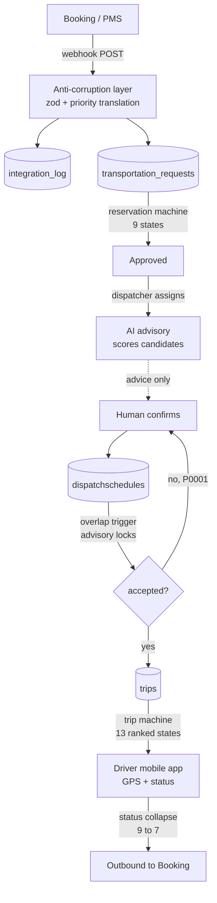

# Request Lifecycle

## Partner correction validation checkpoint — 2026-10-07

V2 updates now retain and validate a complete passenger/cargo request snapshot with authenticated identity, normalized date/priority and checked location-code/proposal shape. Partial patches and malformed snapshots reject. This is boundary validation only: push still refuses valid updates/cancels with 409; pull still counts valid unsupported revisions as skipped/rejected. Invalid updates return push 400 or pull malformed-item skipped-only; subsequent items continue. No Fleet request, dispatch, trip or route history changes. The user chose to hold newer revisions until missing versions arrive; durable events/revisions, enforcement and committed-trip dispatcher review remain Task 1 work. Focused integration tests passed 10 files / 122 tests after observed contract/route RED; full suite passed 313 files / 3,739 tests and strict lint passed. See [[System Boundaries]].

The end-to-end path of one guest transport request, and **the three state machines it passes through**. This is the note to read if you only read one workflow note.

## The chain

```mermaid
flowchart TD
    B[Booking / PMS] -->|webhook POST| ACL[Anti-corruption layer<br/>zod + priority translation]
    ACL --> LOG[(integration_log)]
    ACL --> TR[(transportation_requests)]
    TR -->|reservation machine<br/>9 states| APPROVE[Approved]
    APPROVE -->|dispatcher assigns| ADV[AI advisory<br/>scores candidates]
    ADV -.->|advice only| HUMAN[Human confirms]
    HUMAN --> DS[(dispatchschedules)]
    DS -->|overlap trigger<br/>advisory locks| OK{accepted?}
    OK -->|no, P0001| HUMAN
    OK -->|yes| TRIP[(trips)]
    TRIP -->|trip machine<br/>13 ranked states| GPS[Driver mobile app<br/>GPS + status]
    GPS -->|status collapse<br/>9 to 7| OUT[Outbound to Booking]
```

## Which machine owns which stage

| Stage | Machine | Table |
|---|---|---|
| Request approval | [[Reservation State Machine]] — 9 states, adjacency + BFS | [[transportation_requests]] |
| Vehicle/driver booking | [[Dispatch State Machine]] — 3 ranks + Cancelled | [[dispatchschedules]] |
| Execution | [[Trip State Machine]] — 13 ranked states | [[trips]] |

Three machines, three designs, deliberately not unified — each models a different shape of rule. → [[State Machines]]

## The two places a request can be refused

1. **The UVVRP check** — Manila number coding, currently `response: "block"`. A vehicle whose plate ends in a restricted digit can't be dispatched that weekday. → [[UVVRP Number Coding]]
2. **The overlap trigger** — `trg_dispatch_overlap` raises `P0001` if the vehicle or driver is already booked in that window. → [[TOCTOU And Advisory Locks]]

Both are hard refusals, and the second one is the only guarantee — the app-level pre-check is advisory. → [[ADR-006 Dual Double-Booking Guard]]

## Where a human is required — CONFIRMED

The AI advisory scores and ranks candidates. It has **no write path**. A dispatcher calls the assign endpoint. → [[ADR-003 Deterministic AI]] · [[AI Advisory]]

## Chain continuity in the UI — CONFIRMED 2026-08-23

Every screen in the chain now links to its neighbours, so a dispatcher can walk
request → dispatch → trip without a manual search:

| Surface | Continuity |
|---|---|
| Trip detail (`/trips/[id]`) | Chips link to the dispatch (`dispatch_id`) and the originating request (`transportation_requests.request_id`, labelled by reservation number — guest_name is **not** in the trip detail projection). Progress rail is the full live driver chain via `<PhaseRail>`; legacy ingest statuses fall back with a note. |
| Trips log (`/trips`) | Dispatch # cell is a real link when `dispatch_id` exists. No Guest column — the list projection carries no request join. |
| Reservation detail | Lifecycle is `<PhaseRail>` over Pending → Scheduled → Assigned → In Progress → Completed; raised-dispatch rows expose "View trip"; cancel uses `ConfirmDialog requireReason` (matches the queue). |
| AI recommendation panel | After assign succeeds it shows "Dispatch {number} created" + a View-dispatch link from the endpoint's `dispatch_id`/`dispatch_number`. |
| Dispatch calendar | Default dispatch surface (`/dispatch` redirects here); `?date=` deep-links land on the day. Queue ⇄ calendar header buttons. |
| Reservation queue | Auto-sorts **Pending Reassignment first**, then derived priority; `?filter=reassignment` chip + API filter surface interrupted runs (incident/leave). |

Driver names render as stored everywhere new (no lowercase+CSS-capitalize mangling of e.g.
"MC Dela Cruz").

## Where this chain is broken today — CONFIRMED

| Break | Effect |
|---|---|
| `BOOKING_GATEWAY` unset | The outbound leg goes to a **mock**. Nothing reaches Booking. |
| `BOOKING_WEBHOOK_SECRET` unset | Inbound webhooks are unverified |
| 2 rows in `trips`, 2 in `dispatchschedules` | The right-hand half of this diagram has barely run |
| Pull ingest diverges from push | Two ingest paths with different behaviour → [[DEBT Ingest Paths Diverge]] |

So the left half (ingest → request) has 149 `integration_log` rows and 15 requests behind it. The right half is essentially unexercised. → [[Current State]]

## Booking Status vs Fleet Status — manual follow-up 2026-10-01

`transportation_requests.booking_status` is the last value Booking supplied at ingest (“what Booking believes”); `fleet_status` is Fleet's lifecycle. Cancelling locally moves only `fleet_status` and emits an outbound `CANCELLED` event — there is no local writer that overwrites `booking_status`, so `Cancelled` + Booking Status `Pending` after reload is expected for the current model.

The recent synthetic request's integration history contains processed `SCHEDULED` and `CANCELLED` payloads, but the runtime uses `BOOKING_GATEWAY=mock` and has no Booking API URL. “Processed” therefore means the mock accepted the event; no external Booking system received it.

**Fixed the same day — the message now reports the real hand-off.** `emitTransportStatus()` returns `{ delivered, gateway, reason? }` (gateway name resolved before the early return, so an un-booked request reports `no-external-booking-id` rather than a bare false); `advanceReservation()` returns `bookingNotify` instead of discarding the result; the cancel route returns `{ ...request, booking_notify }`; and the client-safe `describeBookingNotify()` (`src/lib/integration/booking-notify.js`) turns that into one sentence, checking **mock before delivered** so Fleet's own stub can never read as a notification. Both cancel dialogs now say the notice is *queued* and that whether it leaves Fleet depends on the gateway being connected; both toasts report the actual result. Real external proof still requires a connected HTTP gateway plus Booking-side correlation/audit. → [[Manual Functional Testing Follow-up Audit]]

## Source-specific outbound handoff — 2026-10-07

PMS and POS status replies/retries now select separate adapters by durable source identity. An explicit positive delivery ACK is required before a log row is processed; negative/missing ACKs remain retryable. Unknown sources are never sent through PMS as a fallback. Retry preserves the recorded event ID/status/time. If an outbound log cannot be written, Fleet does not send and the notification message says it was not queued; staff follow-up is required. No HTTP partner is connected and mock acceptance remains local only. Focused tests passed 131/131 after regression RED. See [[System Boundaries]] and [[integration_log]] for remaining Task 1 and migration release holds.

## Related

[[Data Flow]] · [[Reservations]] · [[Dispatch]] · [[Trips]] · [[System Boundaries]] · [[Feature Index]]
