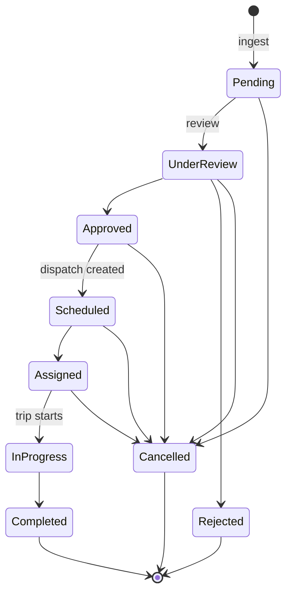

# Feature: Reservations

## What it does

Receives guest transportation requests from the Booking subsystem, triages them, and moves them through review → approval → scheduling.

## Why it exists

Fleet doesn't own guests or bookings — the parent system does. This feature is the **intake and lifecycle** half of the boundary: turn an external request into a Fleet-owned record that a dispatcher can act on. → [[System Boundaries]]

## How it works

Nine states, governed by an **adjacency map** in `src/lib/scheduling/reservation-state.js` — with a BFS `transitionPath()` helper that finds a legal route between two states.

**This is the strictest of the three state machines.** [[Dispatch State Machine]] and [[Trip State Machine]] use rank monotonicity (skip forward freely); reservations use explicit adjacency (only declared edges). → [[State Machines]]

### The single-writer rule — CONFIRMED

`advanceReservation()` in `src/services/reservation-lifecycle.service.js` is the only function that should write `status`. It validates, writes, appends a [[reservation_events]] row, and emits an outbound event. → [[ADR-007 Single Writer For Reservation Status]]

## Files involved

| File | Role |
|---|---|
| `src/app/api/integration/transport-requests/route.js` | Push ingest — full semantics |
| `src/app/api/integration/pull/route.js` | Pull ingest — **fewer semantics** → [[DEBT Ingest Paths Diverge]] |
| `src/services/reservation-lifecycle.service.js` | `advanceReservation()` |
| `src/lib/scheduling/reservation-state.js` | Adjacency map, `transitionPath()` |
| `src/lib/scheduling/priority.js` | Priority derivation |
| `src/lib/integration/contracts.js` | Zod schemas, `normalizePriority()` |

## Database tables used

[[transportation_requests]] (15) · [[reservation_events]] (69) · [[integration_log]] (149) · `vehiclecategories`

## API endpoints

`/api/integration/*` — the only door. The `/api/reservations/*` tree (6 routes,
already answering 410) was deleted with migration 036 on 2026-08-11.

## Edge cases

- **Unknown priority from Booking** → degrades to `Medium`, never throws. Availability over strictness.
- **Unresolvable `requested_vehicle_type`** → `requested_category_id` stays NULL, raw string kept verbatim. The request survives.
- **Duplicate `external_booking_id`** → both doors dedupe on it, via the one
  shared writer. Push answers 200 `idempotent: true`; pull counts the item as
  skipped. (This line previously claimed pull did not dedupe — it always did.)
- **Malformed item in a pull batch** → skipped and counted, so one bad record
  from Booking cannot block the good ones behind it. Push answers its sender 400.
- **Booking gateway down** → status still advances; the failure is recorded in `integration_log`.

## What I learned

The vocabulary-translation layer is the interesting part, not the CRUD. Booking says `"Normal"`, Fleet says `"Medium"`, and the translation is one small pure function that can never block ingest. → [[Anti-Corruption Layer]]

## Open questions

Both of these were **answered on 2026-08-11**, kept here because the answers are
the useful part:

- *Should `/api/integration/pull` be deleted, or brought up to parity?* →
  **Parity.** Pull is not dead code: `src/services/transport.service.js:112`
  wires it to a live UI button. Both doors now call `ingestRequest()` in
  `src/lib/integration/ingest.js`. → [[DEBT Ingest Paths Diverge]]
- *Why does `transportation_requests` coexist with an empty `vehiclereservations`?*
  → It no longer does; migration 036 dropped the empty table. The repository
  never documented why it was originally kept. → [[DEBT vehiclereservations vs transportation_requests]]

## Related

[[Request Lifecycle]] · [[Reservation State Machine]] · [[Dispatch]] · [[Feature Index]]
