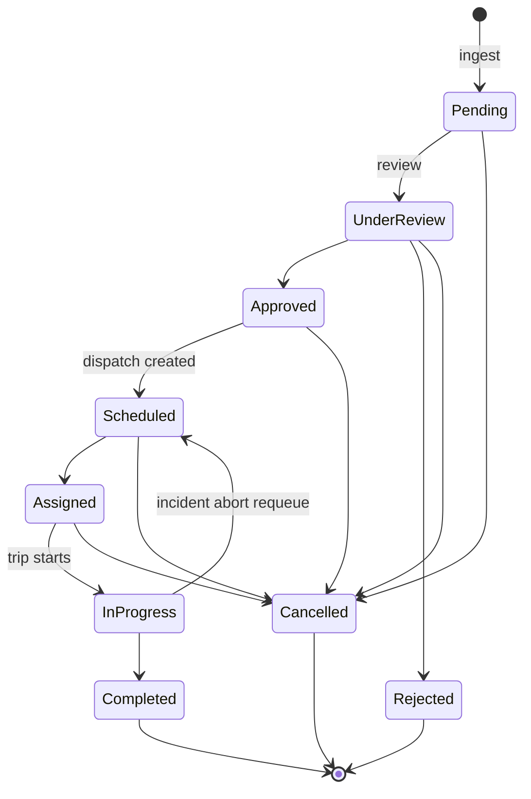

# Feature: Reservations

## Manual Analyze controls removed - 2026-09-15

Removed the remaining Copilot Analyze buttons from its header, empty state and recovery flow. Selecting an option still automatically generates and validates the required queue plan. Recheck reservation now repeats the chosen-pair check when a pair is selected, so stale or failed queue evidence has a recovery path without a separate Analyze action. Seven focused panel/assignment tests and touched-source ESLint passed.

## Analysis summary removed - 2026-09-15

Removed the queue-wide Ready, Review Required, Blocked and Needs Verification cards, plus their evaluated-count/plan-expiry row and duplicate Analyze action, at the user's request. The reservation list and Copilot remain the workspace; existing plan analysis, validation and guarded assignment behavior are unchanged. Verification: ESLint passed for the queue page.

## Conversational assignment - 2026-09-15

Reservation Queue now keeps Copilot options, free questions, selected-pair checking and confirmation inside one chat. Typed option selection and buttons share the same handler. After automatic revalidation, one explicit Assign it confirms the named pair; no separate Review assignment click is needed. The completed reservation remains selected for the success reply after its actionable queue row disappears, and the mobile drawer remains open. See [[Temporal Dispatch Recommendation Implementation Plan#Unified conversation follow-up - 2026-09-15]] for tests and acceptance limitations.

## What it does

Receives guest transportation requests from the Booking subsystem, triages them, and moves them through review → approval → scheduling.

## Why it exists

Fleet doesn't own guests or bookings — the parent system does. This feature is the **intake and lifecycle** half of the boundary: turn an external request into a Fleet-owned record that a dispatcher can act on. → [[System Boundaries]]

## How it works

```mermaid
stateDiagram-v2
    [*] --> Pending: ingest
    Pending --> UnderReview: review
    Pending --> Cancelled
    UnderReview --> Approved
    UnderReview --> Rejected
    UnderReview --> Cancelled
    Approved --> Scheduled: dispatch created
    Approved --> Cancelled
    Scheduled --> Assigned
    Scheduled --> Cancelled
    Assigned --> InProgress: trip starts
    Assigned --> Cancelled
    InProgress --> Completed
    InProgress --> Scheduled: incident abort requeue
    Rejected --> [*]
    Completed --> [*]
    Cancelled --> [*]
```

Nine states, governed by an **adjacency map** in `src/lib/scheduling/reservation-state.js` — with a BFS `transitionPath()` helper that finds a legal route between two states. The only reverse edge is `In Progress → Scheduled` (incident requeue, `INCIDENT_REQUEUED` event) — see [[ADR-014 Incident Abort Requeues Request]].

**This is the strictest of the three state machines.** [[Dispatch State Machine]] and [[Trip State Machine]] use rank monotonicity (skip forward freely); reservations use explicit adjacency (only declared edges). → [[State Machines]]

### Queue reassignment surface — 2026-09-23

The list GET LEFT JOINs the latest non-deleted `dispatchschedules` row and exposes `dispatch_id` / `dispatch_status`. Rows whose dispatch is `Pending Reassignment` show a **Needs reassignment** pill (table + card), sort to the top of their tab (interrupt outranks derived priority), and respond to `?filter=reassignment` (dashboard "Need reassignment" cards already link here). Event type: `INCIDENT_REQUEUED`.

### Restaurant / trip-attribute pills — badge source

The **Restaurant** pill (and Airport / VIP / Group) is a **client-side location heuristic**, not a `source_system` column: `getDerivedTags` / `formatTripMetrics` in `reservation-queue-table.jsx` regex-match pickup+dropoff for `resto|restaurant|lumière|lumiere|dining|bistro|cafe|bar`. `source_system` (`PMS` / `POS` / …) is displayed separately on the card and does not drive the pill. A temporary demo row can be planted with `node scripts/tmp-seed-restaurant-booking.mjs` (markers `RS-DEMO-RESTO` / `DEMO-RESTO-001`; `--remove` reverses it). Calendar events do **not** surface this — `dispatchToEvent` maps only vip / reservationNumber / requestId / priority.

### The single-writer rule — CONFIRMED

`advanceReservation()` in `src/services/reservation-lifecycle.service.js` is the only function that should write `status`. It validates, writes, appends a [[reservation_events]] row, and emits an outbound event. → [[ADR-007 Single Writer For Reservation Status]]

### The request → location link — 2026-09-24

`pickup_location` and `dropoff_location` are **text**, and they stay the display value. They
are Booking's own record of what Booking asked for, kept verbatim for the same reason
`requested_vehicle_type` is (`src/lib/integration/ingest.js`) — refreshing them on a rename
would rewrite the parent system's words.

`pickup_location_id` / `dropoff_location_id` are the durable link to
`locations(location_id)`. Migration `122` re-declared them on this table as "the durable link"
that stops a rename from orphaning a reservation — but **nothing ever wrote one there**. They
appeared in `schema.sql`, the migrations and these notes, and nowhere in `src/`, `mobile/` or
`scripts/`. The defect `122` describes was live the whole time: every resolution was an
exact-name match, so renaming a location silently dropped its requests back to
`Legacy / Unknown` and could spawn a duplicate route under the new name.

The pair is not new to the *concept*. Migration `007` gave the same two columns to
`vehiclereservations` and backfilled them, matching on name **and** coordinates together — so
the link was once real. That table was replaced by `transportation_requests`, and the link did
not come with it: `122` brought the columns across and left the writer behind. Nothing in the
schema could show that, which is why the gap survived review for so long.

The link is now written at ingest by `linkRequestLocations()`
(`src/services/route-resolver.service.js`), after the INSERT and **best-effort** — a request
is fully usable unlinked, since an unlinked request resolves by name exactly as before, so a
failure there is logged and swallowed rather than failing the ingest. It resolves each side
independently (`dropoff_location` is nullable, and pickup == dropoff is a legitimate round
trip that is not a routable route pair) using the resolver's own rule: exactly one active
location, or nothing. An ambiguous match is left NULL, never guessed.

`resolveRouteForRequest` and `resolveRequestEstimate` then seed from the link with
`allowNameFallback: true` — the link is **preferred, not authoritative**. That qualifier is
load-bearing rather than defensive: a physical move retires a location and creates a new one,
so a link can outlive what it points at, and without the fallback a stale link would resolve
*worse* than no link at all. Route creation (`/api/routes`, the radar, travel signals) keeps
`allowNameFallback: false`, where an id remains the sole authority.

Existing rows are linked once by `scripts/backfill-request-location-links.mjs` — **dry run by
default**, `--apply` to write. It runs `linkRequestLocations()` against a handle that refuses
writes, so what the dry run reviews is the code that will run, not a re-implementation of it.

A request naming a **retired** location is skipped whole and reported, never half-linked. Its
text is not unresolvable — it is attached to a decision that has not been made, and writing to
the row pre-empts it. The rule lives in `scripts/lib/request-location-links.mjs` and is imported
by both the script and the read-only review harness, so the excluded set is identical in both by
construction rather than by agreement.

**Production state after the 2026-09-24 backfill — verified, not assumed.** 11 requests (#486,
#487, #490, #495, #499–#505) now hold a link. #487 has its drop-off only; its pickup names
`Main Lobby`, which is in no registry at any state. 5 requests (#481–#485) were skipped
untouched, their pickup naming the retired `NAIA Terminal 2` (#3). #488 and #489 are unchanged,
neither side of either resolving. Verification diffed the live rows against a snapshot taken
before the write: the 11 changed exactly as proposed, #481–#485 byte-identical including
`updated_at`, and no `locations`, `routes` or `addresses` row touched.

**What this did and did not change.** Those ten requests already resolved — their stored text
matched location names exactly, and route #30 already existed for the pair. The link changes
*durability*, not resolution: rename `NAIA Terminal 2 - Arrivals` and a linked request still
resolves while an unlinked one orphans. It does **not** yet carry structured addresses to
reservations, because no location holds an `address_id`; that needs the canonical-location
address migration first. Read as: the link is written and resolves — not "reservations inherit
structured addresses".

Both ids are on the list and card projections in
`src/app/api/integration/transport-requests/route.js`, so "the link is populated" is
answerable from the API. **Nothing renders them yet** — the queue still shows the stored text.
Showing the *linked location's* structured address beside it is a separate, deferred
improvement.

## Files involved

| File | Role |
|---|---|
| `src/app/api/integration/transport-requests/route.js` | Push ingest — full semantics |
| `src/app/api/integration/pull/route.js` | Pull ingest — **fewer semantics** → [[DEBT Ingest Paths Diverge]] |
| `src/services/reservation-lifecycle.service.js` | `advanceReservation()` |
| `src/lib/scheduling/reservation-state.js` | Adjacency map, `transitionPath()` |
| `src/lib/scheduling/priority.js` | Priority derivation |
| `src/lib/integration/contracts.js` | Zod schemas, `normalizePriority()` |
| `src/services/route-resolver.service.js` | `linkRequestLocations()` (the request → location link), `resolveRouteForRequest()`, `resolveRequestEstimate()` |
| `scripts/backfill-request-location-links.mjs` | One-time backfill of the link for rows that predate it — dry run by default, skips a request naming a retired location |
| `scripts/lib/request-location-links.mjs` | The retired-location freeze rule, imported by both the backfill and the read-only review harness so both exclude the same set |
| `src/components/reservations/reservation-queue-table.jsx` | Compact semantic table with selectable rows, inline category text next to reference (`#RS-xxxx · Category`), trip attribute pill tags (`VIP`, `Airport`, `Restaurant`, `Group`), and Copilot status chips |
| `src/app/(dashboard)/reservations/queue/page.js` | Persistent two-column queue workspace + Copilot aside coordinator |

## Database tables used

[[transportation_requests]] (15) · [[reservation_events]] (69) · [[integration_log]] (149) · `vehiclecategories`

## API endpoints

`/api/integration/*` — the only door. The `/api/reservations/*` tree (6 routes,
already answering 410) was deleted with migration 036 on 2026-08-11.

## Edge cases

- **Unknown priority from Booking** → degrades to `Medium`, never throws. Availability over strictness.
- **Unresolvable `requested_vehicle_type`** → `requested_category_id` stays NULL, raw string kept verbatim. The request survives.
- **Duplicate `external_booking_id`** → both doors dedupe on it, via the one
  shared writer. Push answers 200 `idempotent: true`; pull counts the item as
  skipped. (This line previously claimed pull did not dedupe — it always did.)
- **Malformed item in a pull batch** → skipped and counted, so one bad record
  from Booking cannot block the good ones behind it. Push answers its sender 400.
- **Booking gateway down** → status still advances; the failure is recorded in `integration_log`.
- **The New Reservation form (`/reservations/new`) must speak Booking's vocabulary**
  → its Priority select offers Low/Normal/High/Urgent (the inbound Zod enum), never
  "Medium" — the schema rejects `"Medium"` *before* `normalizePriority()` can run,
  so a "Medium" default surfaced to the user as
  `Invalid option: expected one of "Low"|"Normal"|"High"|"Urgent"` (fixed 2026-09-08;
  the field also had native `<option>` children inside the Radix `FloatingSelect`,
  which made the dropdown unopenable). Verified via a scratch vitest run against
  `parseTransportationRequest`.
- **Operational timezone boundary ('Asia/Manila') in Queue predicates** →
  PostgreSQL runs in UTC by default. Timestamps for early morning next-day Manila trips
  (e.g. Sep 16, 01:00 AM PHT) convert to late previous-day in UTC (Sep 15, 17:00 UTC).
  Casting with `(pickup_datetime AT TIME ZONE 'Asia/Manila')::date` ensures next-day
  reservations are categorized under Upcoming, not Today.

## What I learned

The vocabulary-translation layer is the interesting part, not the CRUD. Booking says `"Normal"`, Fleet says `"Medium"`, and the translation is one small pure function that can never block ingest. → [[Anti-Corruption Layer]]

## Open questions

Both of these were **answered on 2026-08-11**, kept here because the answers are
the useful part:

- *Should `/api/integration/pull` be deleted, or brought up to parity?* →
  **Parity.** Pull is not dead code: `src/services/transport.service.js:112`
  wires it to a live UI button. Both doors now call `ingestRequest()` in
  `src/lib/integration/ingest.js`. → [[DEBT Ingest Paths Diverge]]
- *Why does `transportation_requests` coexist with an empty `vehiclereservations`?*
  → It no longer does; migration 036 dropped the empty table. The repository
  never documented why it was originally kept. → [[DEBT vehiclereservations vs transportation_requests]]

## Prepared passenger/cargo intake — Task 2, 2026-10-05 (NOT deployed)

PMS v1 remains passenger-only and defaults missing count to 1. Authenticated v2 create requires explicit matching canonical `service_code` and `load_type`: passenger needs positive count; cargo needs positive representable kg and a nonblank description, never a fabricated rider. New cargo description and department have bounded lengths. The shared push/pull writer resolves active internal service ID and hashes service/load/cargo details for exact-id replay protection (changed cargo weight → 409). In-process mock pull demonstrates POS cargo and PMS VIP passenger using v2, while non-mock HTTP pull is NOT an authenticated POS adapter. List/register/card projections return typed columns and service code; detail GET's `tr.*` carries typed columns after migration. Legacy in-app PMS injection remains v1. Unknown/inactive code rejects new create without inserting; an unchanged replay of an older row remains idempotent even if that service was later retired.

**Release hold:** SQL migrations 144/145 are unapplied drafts, so this code cannot be enabled independently. Cargo dispatch/capacity/driver mobile remain later tasks; do not dispatch cargo on passenger assumptions before the cargo eligibility gate is complete. No external PMS/POS connection exists. See the Task 2 report for tests and rollout limitations.

## Related

[[Request Lifecycle]] · [[Reservation State Machine]] · [[Dispatch]] · [[Feature Index]]

## Manual functional testing remediation — 2026-10-01 (implemented)

Four reported queue/request symptoms, all verified against the code and a read-only live probe before changing anything.

### The request state machine gained a second release hop

`Pending → Scheduled → Assigned → In Progress → Completed`, `Cancelled` from any non-terminal, **plus `Assigned → Scheduled`** — the pre-start counterpart of the existing `In Progress → Scheduled` incident requeue. Both are *release* hops: a committed pair goes back to the pool and the request re-enters the queue, still the guest's transport. `src/lib/scheduling/reservation-state.js` lists both in `RELEASE_INTO_SCHEDULED`, and `transitionPath`'s BFS refuses to use either as an intermediate leg of a longer invented path. Taken only by the teardown paths (`setDispatchStatus → Cancelled`, incident grounding), never by a forward workflow. → [[Dispatch]] · [[Reservation State Machine]]

### "Today (6)" was not lying, the label was

`QUEUE_TAB_PREDICATES.today` is `pickup_datetime <= today (Asia/Manila)` — today **or already past**. The vault already documented that as intentional dispatcher work grouping; the tab's bare word "Today" hid it, so a request dated the 15th under "Today (6)" read as a bug. The tab is now **Today & overdue**, with a tooltip and an `aria-label` that spell out the filter, and the empty state reads "Nothing today or overdue".

The count badge and the highlight were two more honesty defects:

- `counts[id] || 0` rendered `(0)` until the first response landed, which claims an empty queue. Badges now render `(…)` and announce "count loading" while `!countsReady`. `queueTabBadges()` in `src/lib/scheduling/smart-default-tab.js` returns `null` — not `0` — for "not loaded".
- The highlighted tab was derived from `counts` (the tab the queue was about to steer *to*) while the query still fetched the fallback tab, so for the length of a fetch one tab was highlighted over another tab's rows. `resolveQueueTabView()` now returns `activeTab` = the **fetched** tab, and a `steerTo` decision that fires once, only when the user has not picked. A manual pick is still never yanked by a 30-second poll.

Queue rows also stopped inventing: a null `pickup_datetime` printed a hard-coded "10:30 AM", and a request with no travel estimate printed a `request_id`-seeded "12 km · ~25 min" (the source comment said "so numbers look authentic"). Both now say what is true (`Time not set`, `Distance not estimated`).

### The injector page read a contract the route never sent

`/reservations/new` read `res.id` and `res.created`. `POST /api/integration/transport-requests` answers with the created (or already-on-file) request **row**: `request_id`, `reservation_number`, and `idempotent: true` on a replay. Every submission therefore toasted **"Created transport request #undefined"**. `describeIngestOutcome()` in the new `src/lib/integration/ingest-outcome.js` owns the reading — its own module, with no imports, because `ingest.js` pulls in `@/lib/db` and this is a client component. It prefers the reservation number, falls back to `#request_id`, never renders `undefined`, and reports a replay as "Already on file … returned unchanged".

The mutation also invalidated only `["reservations"]`, which matches **no query in the app** — the queue and the register are keyed under `["transport-requests", …]`, so neither list refreshed after a submission. Both keys are invalidated now.

### An explicit request cancel still cancels everything

`PUT /api/integration/transport-requests/[id]/cancel` is unchanged except that its dispatch sweep now also covers a dispatch sitting at `Pending Reassignment` (an interrupted run whose pair the incident grounding had already released) — otherwise cancelling the request left a dispatch behind still holding the vehicle.

### Verification

`src/lib/scheduling/smart-default-tab.test.js` (+9), a new `src/app/(dashboard)/reservations/queue/page.test.js` (5), `src/lib/integration/ingest-outcome.test.js` (5), plus the touched-file ESLint and production build. Full suite 3484 passed / 6 failed, the six being the pre-existing failures already recorded for 2026-10-01.

## Partner endpoint proposal storage — Task 1 (2026-10-06, prepared; migration not applied)

The prepared migration adds nullable `partner_pickup_location_proposal` and `partner_dropoff_location_proposal` JSONB fields to `transportation_requests`. Each proposal is constrained to an object with only `address`, `latitude`, and `longitude`; it needs a nonempty address or a complete coordinate pair, limits addresses to 2,000 characters, and rejects partial, non-finite, or out-of-range coordinates. This preserves partner place information durably for a later review flow.

These values are untrusted review data only. Same-named proposal CHECK constraints are accepted on rerun only when validated and their complete PostgreSQL-deparsed definitions match the trusted expected expression; an `OR TRUE` weakening now fails closed. Task 1 does not add a v2 writer or project proposals to the reservation queue, and partner coordinates do not become route, dispatch, mobile, or geofence inputs. The migration remains unapplied; only static migration tests and offline `db:check` were run.

## V2 canonical location intake — Task 2 (2026-10-06, prepared; migration unapplied)

V2 request creates accept optional UUID `pickup_location_code` / `dropoff_location_code` values and bounded, strict partner proposals. Only an active Fleet location matched by its opaque code can populate `pickup_location_id` / `dropoff_location_id`; unknown codes reject with `422 LOCATION_CODE_UNKNOWN`, retired/inactive codes with `409 LOCATION_CODE_RETIRED`. Replay, tombstone, and create-fingerprint checks run before code lookup, so an exact replay remains idempotent if a location is retired later. V2 never links from the partner's text; legacy PMS v1 keeps its existing estimator and name-link path.

Partner proposal address/coordinates are validated and persisted only in the dedicated `partner_*_location_proposal` JSONB columns. They are excluded from generic integration-log payloads and create/pull responses, and never copied into Fleet locations or used as route inputs. At the Task 2 boundary (before Task 3), every v2 request stored null distance/duration and created no route. Existing authorized reservation register/queue reads expose proposal values with per-endpoint `canonical_registry`, `pending_review`, or `unknown` provenance; their existing reservation-read permission is unchanged. Task 2 did not apply SQL. The read-only `db:status` command could not verify the live ledger because neither `.env.local` nor `.env` is available; no live schema or deployment behavior is claimed. Verification was by focused mocked route/ingest tests and offline gates.

## Strict v2 request estimates — Task 3 (2026-10-06)

V2 ingest now invokes `resolveRequestEstimate()` with `strictRegistry: true` and the code-resolved `pickup_location_id` / `dropoff_location_id`. Persisted requests are also detected by non-null `external_create_fingerprint`. Partner proposals remain review-only: they do not resolve locations or provide estimate coordinates.

An estimate is available only when both linked locations still resolve by ID to active, non-retired Fleet rows with complete finite in-range coordinates. That gate applies even to stored route estimates. V2 never fills a missing/retired link by name and never uses dynamic hotel/gazetteer or legacy text estimates. Unusable endpoint pairs return null distance, duration, and source with basis `Canonical location unavailable`, a stable reason, and endpoint provenance consistent with the queue/register projection. Only a usable pair may use an existing canonical route or TomTom; no unresolved or missing-coordinate pair creates a route. PMS v1 behavior and name-linking remain unchanged.

Verification: resolver and ingest suites passed 53/53; touched-file ESLint and `git diff --check` passed. No API route, migration, live SQL, generated schema, mobile, or geofence code changed. Static/mock verification only; Task 2 migrations remain unapplied, so this revision is not independently deployable.
