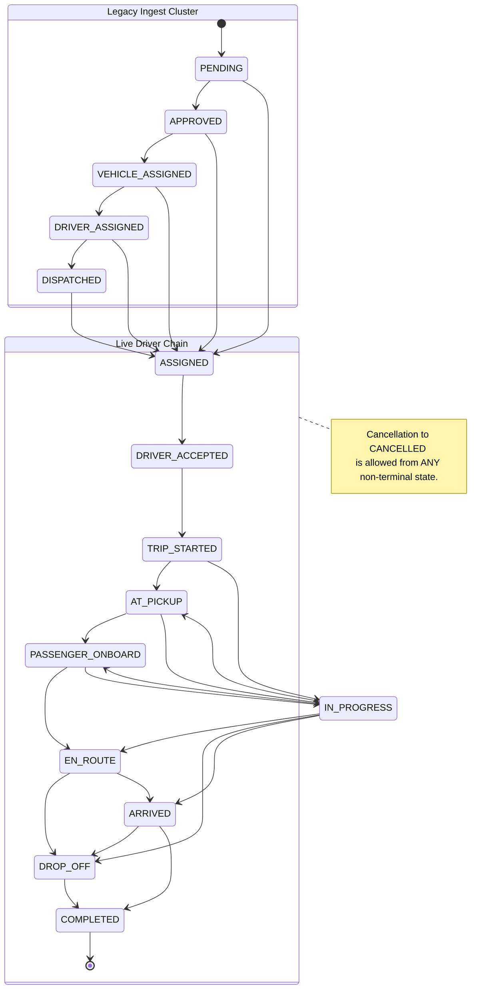

# Trip State Machine

**16 statuses, adjacency-based.** The trip state machine is a directed graph of allowed transitions. A trip moves FORWARD one edge at a time, or cancels. There is no longer a rank-based skipping mechanism; the application strictly enforces specific transition paths.

## The State Transitions

The state machine separates into two distinct chains connected by `ASSIGNED`.

## What the Adjacency Map Buys

| Design choice | Effect |
|---|---|
| Explicit `NEXT` map instead of ranks | Strict enforcement of granular steps (`AT_PICKUP`, `PASSENGER_ONBOARD`). Drivers can no longer skip crucial parts of the pickup lifecycle. |
| Loose Ingest Cluster | Legacy states (`PENDING`, `APPROVED`, etc.) can hop directly to `ASSIGNED` as vehicles and drivers are mapped. |
| Strict Live Driver Chain | `ASSIGNED` is the only bridge in. A driver must follow the step-by-step physical lifecycle. |
| `IN_PROGRESS` as an escape hatch | It acts as a fallback or parallel state that can branch back out to most active physical states. |
| Terminal enforcement | `COMPLETED` and `CANCELLED` are explicitly marked terminal. No transitions out. |

## What this does NOT model

| Missing | Consequence |
|---|---|
| Anything backwards | A driver who declines after `DRIVER_ACCEPTED` has no modelled path in this machine. |

## Where it's used

Called by the trip route handlers before any status write. Pure — no I/O in the file, so it's testable with no setup. It guarantees the application will never write an illegal trip state to the database, enforcing the same rules as the DB CHECK constraint. → [[Pure Core Imperative Shell]] · [[Testing]]

## Related

[[Trips]] · [[State Machines]] · [[Dispatch State Machine]] · [[Reservation State Machine]] · [[Request Lifecycle]] · [[trips]]
