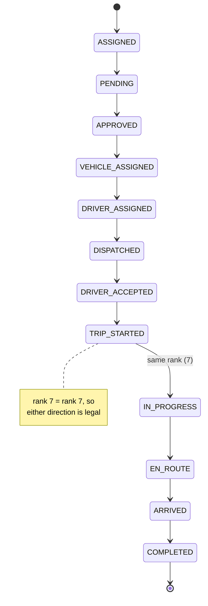

# Trip State Machine

**13 statuses, ranked.** A transition is legal when the target rank is **not lower** than the current rank. There is no adjacency table — one number per status expresses every rule.

## The ranks — CONFIRMED

```js
ASSIGNED: 0,          PENDING: 1,           APPROVED: 2,
VEHICLE_ASSIGNED: 3,  DRIVER_ASSIGNED: 4,   DISPATCHED: 5,
DRIVER_ACCEPTED: 6,   TRIP_STARTED: 7,      IN_PROGRESS: 7,
EN_ROUTE: 8,          ARRIVED: 9,           COMPLETED: 100
```

## What the numbers buy

| Design choice | Effect |
|---|---|
| Rank comparison instead of edges | 13 states, no 13×13 table to maintain |
| `TRIP_STARTED` and `IN_PROGRESS` both `7` | Aliases — mutually reachable, neither can regress |
| `COMPLETED: 100` | Room to insert states later without renumbering |
| Monotonic rule | A trip can never move backwards |

→ [[State Machines]] for why rank monotonicity was the right fit here and what it can't express.

## Diagram



Equal-or-greater rank means every state can also transition **to itself**, and skipping forward is permitted — `APPROVED` → `DISPATCHED` is legal (rank 2 → 5). That's deliberate: dispatch can assign vehicle and driver in one operation.

## What this does NOT model — CONFIRMED

| Missing | Consequence |
|---|---|
| Cancellation | No `CANCELLED` in `RANK`. Unlike [[Dispatch State Machine]], which special-cases it. |
| Anything backwards | A driver who declines after `DRIVER_ACCEPTED` has no modelled path |
| Terminal enforcement | `COMPLETED: 100` blocks moves *by rank*, but nothing marks it terminal explicitly |

**UNKNOWN:** whether trip cancellation is handled elsewhere or simply not supported. The repository does not currently document why cancellation is absent from this machine. → [[Open Questions]]

## Live data — CONFIRMED

`trips` has **2 rows**. At most 2 of these 13 statuses have ever occurred. The machine is essentially untested by real usage. → [[trips]]

## Where it's used

Called by the trip route handlers before any status write. Pure — no I/O in the file, so it's testable with no setup. → [[Pure Core Imperative Shell]] · [[Testing]]

## Related

[[Trips]] · [[State Machines]] · [[Dispatch State Machine]] · [[Reservation State Machine]] · [[Request Lifecycle]] · [[trips]]
