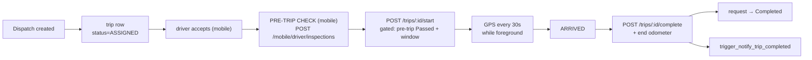

# Feature: Trips

## What it does

Records what actually happened: start odometer, GPS positions, arrival, completion odometer.

A [[dispatchschedules]] row is the **promise**; a `trips` row is the **execution**. 2 rows.

## START ROUTE is gated — CONFIRMED 2026-08-14

`src/app/api/trips/[id]/start/route.js` now enforces two gates **before** the trip can start (after the existing vehicle-license / vehicle-status / driver-status checks):

1. **Pre-trip inspection gate (per-trip):** a `vehicleinspection` row with `status = 'Passed'` for this trip must exist, else `400`. The mobile flow routes the driver through `/inspection?tripId=` first; this is the enforcement that makes the UI hint honest.
2. **Departure-window gate:** the driver may not start before `earliest_start = recommended_departure − earlyStartAllowanceMinutes`, else `409`. Fail-open by design — when the dispatch has no `scheduled_departure` or no ETA can be computed, the window is null and no time block applies (the pre-trip gate above still holds).

`recommended_departure = scheduled_departure − eta_to_pickup − departureBufferMinutes`, computed by `src/lib/scheduling/departure-window.js` (pure, tested in `departure-window.test.js`).

- ETA resolution order (all fail-open to null): TomTom live route from the driver's `current_latitude/current_longitude` to the pickup (trip origin) → straight-line heuristic (`etaFromDistanceKm`) → stored route/request `estimated_duration`.
- Config: `departureBufferMinutes` / `earlyStartAllowanceMinutes` in `src/lib/dispatch-policy.js` (defaults 10/10), overridable via `system_settings.dispatch_policy`.
- Distinct from the **dispatch safety buffer** (`travel-buffer.js`): that answers "can this resource be *assigned* to the next booking?"; this answers "when may the driver *actually start*?". The two are deliberately separate.

**Not wired (yet):** FAIL-item policy (which FAIL items hard-block vs warn) and feeding inspection findings into predictive maintenance / `vehiclemaintenance`.

## How it works

## The state machine is adjacency-based, not rank-based — CONFIRMED

`src/lib/scheduling/trip-state.js`:

`canTransitionTrip` enforces an **explicit adjacency graph** (`NEXT` object) — a trip must follow defined single hops and can no longer skip arbitrary states by rank.

Two details worth noting:

1. **Granular Driver Flow:** The driver chain strictly walks `ASSIGNED` → `DRIVER_ACCEPTED` → `TRIP_STARTED` → `AT_PICKUP` → `PASSENGER_ONBOARD` → `EN_ROUTE` → `DROP_OFF` → `COMPLETED`.
2. **Terminal States:** `COMPLETED` and `CANCELLED` are explicitly terminal (no transitions out).
3. **Cancellation is orthogonal.** A driver can cancel from any non-terminal state.

16 status values in `chk_trip_status` (`012_status_constraints.sql` and `trip-state.js`).

→ [[Trip State Machine]] · [[State Machines]]

## Odometer validation — CONFIRMED

`src/lib/vehicles/odometer.js` → `validateOdometerReading()`. Pure function, no I/O. Guards against a reading lower than the vehicle's last known value — the cheap check that keeps mileage-derived reporting honest.

## Database tables used

[[trips]] (2) · [[dispatchschedules]] · [[transportation_requests]] · `vehicles` · `drivers` · `audit_logs` · `vehicleinspection` (pre-trip rows)

## Edge cases

- **Trip id doesn't exist** → 404. ~~🔴 threw `ReferenceError`, returning 500~~ →
  **fixed 2026-08-11**, the import was missing. → [[BUG AuthError Not Imported]]
- **Not the driver's trip** → 404, not 403, so ids can't be enumerated. → [[Anti Enumeration 404 vs 403]]
- **Expired vehicle document** → `isExpired()` check at start
- **App backgrounded mid-trip** → GPS stops. Foreground-only by design. → [[Tracking]]

## Open questions

- With 2 rows, most of this is unexercised. Which of the 13 trip statuses have ever actually occurred? **TODO:** `SELECT status, count(*) FROM trips GROUP BY status`.

## Related

[[Trip State Machine]] · [[Dispatch]] · [[Tracking]] · [[Mobile Architecture]] · [[Feature Index]]
