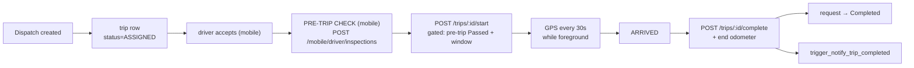

# Feature: Trips

## What it does

Records what actually happened: start odometer, GPS positions, arrival, completion odometer.

A [[dispatchschedules]] row is the **promise**; a `trips` row is the **execution**. 2 rows.

## START ROUTE is gated — CONFIRMED 2026-08-14

`src/app/api/trips/[id]/start/route.js` now enforces two gates **before** the trip can start (after the existing vehicle-license / vehicle-status / driver-status checks):

1. **Pre-trip inspection gate (per-trip):** a `vehicleinspection` row with `status = 'Passed'` for this trip must exist, else `400`. The mobile flow routes the driver through `/inspection?tripId=` first; this is the enforcement that makes the UI hint honest.
2. **Departure-window gate:** the driver may not start before `earliest_start = recommended_departure − earlyStartAllowanceMinutes`, else `409`. Fail-open by design — when the dispatch has no `scheduled_departure` or no ETA can be computed, the window is null and no time block applies (the pre-trip gate above still holds).

`recommended_departure = scheduled_departure − eta_to_pickup − departureBufferMinutes`, computed by `src/lib/scheduling/departure-window.js` (pure, tested in `departure-window.test.js`).

- ETA resolution order (all fail-open to null): TomTom live route from the driver's `current_latitude/current_longitude` to the pickup (trip origin) → straight-line heuristic (`etaFromDistanceKm`) → stored route/request `estimated_duration`.
- Config: `departureBufferMinutes` / `earlyStartAllowanceMinutes` in `src/lib/dispatch-policy.js` (defaults 10/10), overridable via `system_settings.dispatch_policy`.
- Distinct from the **dispatch safety buffer** (`travel-buffer.js`): that answers "can this resource be *assigned* to the next booking?"; this answers "when may the driver *actually start*?". The two are deliberately separate.

**Not wired (yet):** FAIL-item policy (which FAIL items hard-block vs warn) and feeding inspection findings into predictive maintenance / `vehiclemaintenance`.

**Mobile start-gating (home + trip detail + live map):**
- **Unified START gate** — a pre-start trip (Pending/Approved/Assigned/Vehicle Assigned/Driver Assigned/Dispatched/Driver Accepted) shows a real START button on the home card, the trip-detail bottom bar, and the live map **when the departure window is reached AND the pre-trip inspection is `Passed`**. Before that it shows **VIEW DETAILS** / a disabled `START ROUTE IN X MIN` / `PRE-TRIP CHECK REQUIRED`. The button is NOT limited to `Driver Accepted` anymore — an `Assigned` trip in-window shows `ACCEPT & START`, and pressing it accepts first (Assigned → Driver Accepted) then starts (Driver Accepted → Trip Started), since the start endpoint only allows the one-hop `Driver Accepted → Trip Started` transition.
- Home card CTA (`index.js`): `startReady = isPreStart && windowOpen && pre_trip_status === "Passed"`. Ready → `START TRIP` (or `ACCEPT & START`); not ready → **View Details** → `/trip/:id`. When `earliest_start` is unknown the UI shows View Details (server may still fail-open and allow the start from the detail page).
- Trip detail screen (`trip/[id].js`): a **START TIMING** card shows `EARLIEST START` and `RECOMMENDED` times plus a banner ("You can start now" / "You can start in X min (HH:MM)"). The bottom-bar START button is gated on `windowOpen && preTripPassed` for ALL pre-start statuses (auto-accepts if not yet `Driver Accepted`), disabled otherwise with `START ROUTE IN X MIN` / `PRE-TRIP CHECK REQUIRED`, and auto-refreshes every 30s via a countdown tick.
- **Live map** (`map.js`): a pre-start trip before its window shows the pre-departure waiting state + secondary **VIEW DETAILS**. Once the window opens the action button becomes the START gate for ANY pre-start status — `PRE-TRIP CHECK` (→ `/inspection`) if not passed, `ACCEPT & START` / `START ROUTE` when passed and in-window (accept-then-start for non-accepted). In-progress states keep `EN ROUTE TO PICKUP` + live ETA + leg actions. The pending-state header label is `PICK UP LOCATION` (was `PICK UP DESTINATION`).
- `GET /api/mobile/driver/trips` now enriches **all pre-start trips** (not just Driver Accepted) with `pre_trip_status`, `eta_to_pickup_min`, `recommended_departure`, `earliest_start`, `latest_start`. The ETA (TomTom network call) is resolved once from the driver's current position and reused across rows. **Ordered by `ds.scheduled_departure ASC`** (the scheduled pickup time), NOT by `t.start_time` or `created_at` — a 5:30 PM trip always appears before a 7:00 PM trip regardless of booking order.
- **Live map pre-departure mode** (`map.js`): for ANY pre-start trip (Pending/Approved/Assigned/Vehicle Assigned/Driver Assigned/Dispatched/Driver Accepted) that has not reached its departure window, the map shows a waiting state instead of a live route — header reads `NEXT TRIP · 7:00 PM`, the location line shows `pickup → destination`, stats show a human countdown (`in 2h 12m` / `45m`) plus `Window opens HH:MM` and `Recommended HH:MM`, and the button is a secondary **VIEW DETAILS** (→ `/trip/:id`). When the window opens (30s tick), the button shifts to the real action — `ACCEPT TRIP` for not-yet-accepted trips, `PRE-TRIP CHECK` / `START ROUTE` for `Driver Accepted`. In-progress states keep `EN ROUTE TO PICKUP` + live ETA + leg actions. The pending-state header label is `PICK UP LOCATION` (was `PICK UP DESTINATION`).
- **Trips tab = time-aware QUEUE** (`trips.js`), not a plain time sort. Priority (highest → lowest): **in-progress → overdue → ready → upcoming → completed → cancelled**; within a bucket, trips sort by departure time ascending. Buckets: `inProgress` = started statuses; `overdue` = pre-start trip past its `departure_time` (badge `OVERDUE · ACTION REQUIRED`); `ready` = pre-start whose `earliest_start` is reached (badge `READY`, green); `upcoming` = pre-start not yet in window (badge `UPCOMING`); `completed` / `cancelled`. When `earliest_start` is unknown the trip fail-opens to `ready` (server still enforces the start gate). The screen shows a **CURRENT TIME** header, a `TODAY'S PROGRESS` count (sum of in-progress/overdue/ready/upcoming), and re-evaluates the queue every 30s via a live clock. To include completed/cancelled the screen fetches `GET /api/mobile/driver/trips?status=all` (new `all` group = pending + active + completed), so the queue lists the full schedule, not just pending/active.
- **High-End Visual Design & Impeccable Operate Tokens**: Driver companion screens (`map.js`, `trips.js`, `trip/[id].js`, `fuel-report.js`, `inspection.js`, `incidents.js`, `submissions.js`) updated with single-border depth hierarchy (`outlineVariant + '35'`), tabular monospace numbers (`IBMPlexMono_600SemiBold`), vertical route timeline connectors, 52-54px rounded-16 primary action buttons with haptic feedback, and semantic status pills.

## How it works

## The state machine is adjacency-based, not rank-based — CONFIRMED

`src/lib/scheduling/trip-state.js`:

`canTransitionTrip` enforces an **explicit adjacency graph** (`NEXT` object) — a trip must follow defined single hops and can no longer skip arbitrary states by rank.

Two details worth noting:

1. **Granular Driver Flow:** The driver chain strictly walks `ASSIGNED` → `DRIVER_ACCEPTED` → `TRIP_STARTED` → `AT_PICKUP` → `PASSENGER_ONBOARD` → `EN_ROUTE` → `DROP_OFF` → `COMPLETED`.
2. **Terminal States:** `COMPLETED` and `CANCELLED` are explicitly terminal (no transitions out).
3. **Cancellation is orthogonal.** A driver can cancel from any non-terminal state.

16 status values in `chk_trip_status` (`012_status_constraints.sql` and `trip-state.js`).

→ [[Trip State Machine]] · [[State Machines]]

## Odometer validation — CONFIRMED

`src/lib/vehicles/odometer.js` → `validateOdometerReading()`. Pure function, no I/O. Guards against a reading lower than the vehicle's last known value — the cheap check that keeps mileage-derived reporting honest.

## Database tables used

[[trips]] (2) · [[dispatchschedules]] · [[transportation_requests]] · `vehicles` · `drivers` · `audit_logs` · `vehicleinspection` (pre-trip rows)

## Edge cases

- **Trip id doesn't exist** → 404. ~~🔴 threw `ReferenceError`, returning 500~~ →
  **fixed 2026-08-11**, the import was missing. → [[BUG AuthError Not Imported]]
- **Not the driver's trip** → 404, not 403, so ids can't be enumerated. → [[Anti Enumeration 404 vs 403]]
- **Expired vehicle document** → `isExpired()` check at start
- **App backgrounded mid-trip** → GPS stops. Foreground-only by design. → [[Tracking]]

## Open questions

- With 2 rows, most of this is unexercised. Which of the 13 trip statuses have ever actually occurred? **TODO:** `SELECT status, count(*) FROM trips GROUP BY status`.

## Related

[[Trip State Machine]] · [[Dispatch]] · [[Tracking]] · [[Mobile Architecture]] · [[Feature Index]]
