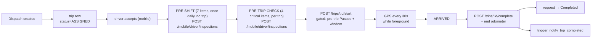

# Feature: Trips

## Current closeout — 2026-10-08

Main has been integrated into the feature worktree, preserving the separate Supply flow and both branches' test coverage. The authorized repository runner applied migrations 150–155 and refreshed the generated schema. Final database status reports **155 applied, 0 pending and 0 changed files**. The live schema contract covers **77 relations with 0 violations**. The anon probe reports **0 exposed, 29 explicitly refused and 48 inconclusive**, with the inconclusive cases explained by the live contract rather than counted as refusals. See [[FleetOps Passenger Cargo Review Closeout 2026-10-08]] for the coordinated release evidence.

The three real PostgreSQL behavioral cases passed using transaction-scoped temporary table clones and actual persisted fixture rows: Pending or missing verified documents cannot clear the final typed gate; a complete 650 kg cargo request succeeds with 150 minutes of occupancy for a 60-minute drive; deficient/equal explicit ends reject; all four assignment/dispatch-create/dispatch-edit/start endpoints return the same 1800 kg overload message; and a preserved null-classified historical request starts with Pending commissioning and no verified documents. The fixture writes were rolled back and did not commission or alter the production fleet. The separate namespace-rebound migration 151 regression passed its first apply and rerun with a valid Cargo row.

These results close the recorded migration/application/catalog checks for the checked environment. They do not establish real fleet cohort eligibility, partner connector activation, physical driver/device acceptance, or application deployment. Real evidence and explicit commissioning are still required before admitting a production vehicle to typed work.

**Historical migration checkpoint (2026-10-07; superseded by the closeout above):** Passenger/cargo/location drafts are now150/151/152 and remain unapplied. Older144/145/146 mentions below are historical. Renumbering changes no trip lifecycle/start behavior and establishes no cargo eligibility or driver acceptance. See [[FleetOps Migration Reconciliation 2026-10-07]] for unresolved shared dispatch and live-schema gates.

## Cargo driver workflow + estimates — Tasks 8, 9, 11, 2026-10-07 (prepared, NOT deployed)

- **Presentation (Task 8):** `src/lib/trips/load-presentation.js` + `mobile/lib/load-presentation.js` mirror (parity-tested): cargo rows render consignment + kilograms, never a guest name or `Passengers: 0`; `Passenger Onboard`/`Drop-off` display as Cargo Loaded/At Delivery with DB state unchanged. Mobile API, Home/trips/detail/map/history screens, web timeline rail, and live-map phase sentence all read it. Passenger rendering unchanged. Mobile changes use no new Expo SDK APIs (v57 docs index read; installed-vs-v57 discrepancy still open for native work).
- **Inspection + schedule (Task 9):** cargo Pre-Trip is `brakes_tires` + `cargo_secure` (hard gate) + `cabin_ready`, never the passenger-items question; server validates the per-trip set and start verifies the passed row matches the trip's load. Cargo service windows add loading/securement/unloading/turnaround (90 min default policy `fleetops-cargo-handling-policy-v1`); null arrival extends instead of zero-length. Pre-Shift/Post-Shift unchanged.
- **Estimates (Task 11):** migration 155 (unapplied) adds planned/actual distance, provenance, estimated litres/cost, reference price, snapshot FK, region to `trips`; `fuel_consumed` untouched. `completeTrip` writes the basis `COALESCE` first-write-wins with the price arriving on an explicit caller seam (the snapshots table is unreadable until the checkpoint registers it — the contract gate caught this). 36 km / 9 km·L⁻¹ / PHP 62.70/L → 4.00 L / PHP 250.80; missing basis stores nulls, never zeros.
- Verification: focused suites green; full suite 331/331 files, 3879/3879 tests; mobile suite 48 files / 524+ tests within it. No live DB, device, or browser acceptance claimed.

## Dispatcher vehicle field labels — 2026-10-03

Trip detail labels `vehicles.model` as **Model** and `vehicles.vehicle_name` as **Vehicle type/name**, matching the Fleet vehicle form's “Vehicle Type / Name” field. This avoids implying that `vehicle_name` is an individual unit identifier. It does not change vehicle data; any disputed master value still requires confirmation from its owner. The dispatcher live-use follow-up uses vehicle 37 (`model=Hiace`, `vehicle_name=SUV`) as the example. See [[Dispatcher Live Use-Case Remediation Plan]].

## What it does

Records what actually happened: start odometer, GPS positions, arrival, completion odometer.

A [[dispatchschedules]] row is the **promise**; a `trips` row is the **execution**. 2 rows.

## Start-time driver license recheck — 2026-09-27

Before trip start, `/api/trips/[id]/start` reloads the current driver credentials and vehicle
requirement. It blocks expired, Student Permit, malformed, unsupported, unreviewed, or
vehicle-class-incompatible licenses with the first reason. The expiry date is valid through
the end of that calendar day in Asia/Manila. The check is repeated even if the driver passed
assignment-time validation, so a license expiring between assignment and departure blocks
start.

## START ROUTE is gated — CONFIRMED 2026-08-14

`src/app/api/trips/[id]/start/route.js` now enforces two gates **before** the trip can start (after the existing vehicle-license / vehicle-status / driver-status checks):

1. **Pre-trip inspection gate (per-trip):** a `vehicleinspection` row with `status = 'Passed'` **and `inspection_type = 'Pre-Trip'`** for this trip must exist, else `400`. The type filter is load-bearing since the two-type model (2026-09-23): a **Pre-Shift** baseline row carries `trip_id IS NULL` and a 7-point checklist, so it can never satisfy this gate even for the same vehicle on the same day. The mobile flow routes the driver through `/inspection?tripId=` first; this is the enforcement that makes the UI hint honest.
2. **Departure-window gate:** the driver may not start before `earliest_start = recommended_departure − earlyStartAllowanceMinutes`, else `409`. Fail-open by design — when the dispatch has no `scheduled_departure` or no ETA can be computed, the window is null and no time block applies (the pre-trip gate above still holds).

`recommended_departure = scheduled_departure − eta_to_pickup − departureBufferMinutes`, computed by `src/lib/scheduling/departure-window.js` (pure, tested in `departure-window.test.js`).

- ETA resolution order (all fail-open to null): TomTom live route from the driver's `current_latitude/current_longitude` to the pickup (trip origin) → straight-line heuristic (`etaFromDistanceKm`) → stored route/request `estimated_duration`. Since 2026-09-09 this ladder lives in `src/lib/scheduling/start-window.js` (`resolveEtaMinutes` / `resolveStartWindow`) and is shared by three consumers — this start gate, `GET /api/mobile/driver/trips`, and the time-driven start-window notification producer (`[[Notifications]]`) — so the window math can never drift between them.
- **Start-window notifications (2026-09-09):** the driver is now actively notified at each threshold of this window ("Trip Start Window Open" when `earliest_start` opens, "Time to Head to Pickup" at `recommended_departure`, "Trip Has Not Started" past the scheduled pickup while still Driver Accepted) — driven by the CRON_SECRET `/api/cron/sync` scan, **Driver Accepted trips only**. See [[Notifications]] for the full contract.
- Config: `departureBufferMinutes` / `earlyStartAllowanceMinutes` in `src/lib/dispatch-policy.js` (defaults 10/10), overridable via `system_settings.dispatch_policy`.
- Distinct from the **dispatch safety buffer** (`travel-buffer.js`): that answers "can this resource be *assigned* to the next booking?"; this answers "when may the driver *actually start*?". The two are deliberately separate.

### Three inspection types — Pre-Shift (baseline) vs Pre-Trip (per trip) vs Post-Shift (End Duty) — updated 2026-09-29

`vehicleinspection` now records three distinct checks, told apart by `inspection_type`:

| | **Pre-Shift** | **Pre-Trip** | **Post-Shift** |
|---|---|---|---|
| UI label | Start Duty / Pre-Shift Check | Pre-Trip Check | **End Duty** |
| Checklist | 5 safety baseline items (`sounds`, `lights`, `dashboard`, `steering`, `brakes_tires`) | 3 items: Safety (`brakes_tires`), Passenger Check (`passenger_items`), Cabin Ready (`cabin_ready`) | **none** — one question + free text |
| Cadence | Once per day, per driver | Once per trip | Once per duty session, at the end |
| `trip_id` | **`NULL`** — not trip-scoped | the trip it clears | **`NULL`** |
| Opens from | Home banner → `/inspection?mode=preshift` | trip detail / map / `/inspection?tripId=` | Home nudge (30 min before shift end) / Profile `End duty` → `/end-duty` |
| Written by | `POST /api/mobile/driver/inspections` | same | **`POST /api/mobile/driver/duty` `{active:false}`** — never the inspections route |
| Enforced by the server? | **Yes** — `setDuty(true)` requires a `Passed` Pre-Shift row for today | Yes — the START gate requires a `Passed` Pre-Trip row | Yes — it *is* the clock-out |

`severity` is derived, not supplied: no FAIL → `None`; blocking failure (any failed Pre-Shift item, or Pre-Trip `brakes_tires`) → `High`; non-blocking finding (`passenger_items = ITEMS FOUND`) → `Medium`. Dispatch is notified for `High`/`Medium`; **no Pre-Shift or Pre-Trip inspection ever flips `vehicle_status`** (see [[Maintenance]]). A **Post-Shift** row stores `severity = NULL` for a reported fault instead.

**Pre-Shift baseline gate on Start Duty:** All five Pre-Shift items are critical roadworthiness checks. A negative finding on ANY item (`UNUSUAL SOUND HEARD`, `ISSUE FOUND`, `WARNING LIGHT PRESENT`) requires driver remarks, marks the inspection as `Failed`, surfaces the issue to dispatch, and server-authoritatively **blocks Start Duty** (`setDuty(true)` rejects with `409 PRESHIFT_REQUIRED` because `preshift_baseline` requires `i.status = 'Passed'`).

**Pre-Trip gate on Start Trip:** Pre-Trip confirms `brakes_tires` (hard safety gate: `ISSUE FOUND` fails the inspection and blocks Start Trip), `passenger_items` (non-blocking finding: `ITEMS FOUND` requires a description and logs the finding to dispatch without blocking trip departure), and `cabin_ready` (mandatory service-readiness acknowledgment). Start Trip requires `vehicleinspection.status = 'Passed'`.

**The Post-Shift report is atomic with the clock-out.** `endDutyWithReport` (`src/services/standby.service.js`) inserts the row, closes `driverattendance.time_out` and clears standby tracking **in one transaction**, so there is no state where duty ended without a report and none where a report exists with duty still open. `client_submission_id` + the partial unique index on `(driver_id, client_submission_id)` make a retried submit return the first row rather than filing a second — a flaky connection cannot produce two End Duty records. `active:false` with no valid `report` is `400 REPORT_INVALID`; the mobile screen never queues this offline (`queueOnFailure:false`, matching the existing duty toggle), because the outbox cannot replay an atomic server transaction and a driver told "saved" while still checked in is the one failure this must not have.

**A reported fault opens a `vehiclemaintenance` order** via `ensureInspectionMaintenance`, keyed on the new `vehiclemaintenance.source_inspection_id` (migration `121`), mirroring the incident path's `source_incident_id`. Grounding is decided by keyword (`shouldGroundReportedDefect`, `src/lib/driver/grounding.js`): a match writes `status='In Progress'`/`priority='High'`, which is what removes the vehicle from `GET /api/vehicles/available` (it excludes `In Progress` and `Pending Inspection`); no match writes `Scheduled`/`Normal` and leaves the vehicle dispatchable. Saying "nothing unusual" files no order at all. The keyword test decides **urgency only, never whether a report is recorded** — prose it fails to match still files a `Scheduled` order for a human to read. The work order is raised **after** the transaction commits and never throws: a maintenance failure must not strand a driver at the end of their shift (it is logged via `writeAppError` instead).

**Not wired (yet):** feeding the **checklist** findings (Pre-Shift / Pre-Trip FAILs) into predictive maintenance. **Partially wired:** Pre-Trip `brakes_tires` is a hard-block item (a FAIL blocks the start until re-inspected), and Pre-Shift FAILs are severity-classified (`High` critical) **dispatch notifications only** — never auto-grounding. **The End Duty (Post-Shift) report is the one path that does reach `vehiclemaintenance`** — see the three-type table above. Repeated checklist findings are still only recorded in `vehicleinspection.checklist`.

**Mobile start-gating (home + trip detail + live map):**
- **Unified START gate** — a pre-start trip (Pending/Approved/Assigned/Vehicle Assigned/Driver Assigned/Dispatched/Driver Accepted) shows a real START button on the home card, the trip-detail bottom bar, and the live map **when the departure window is reached AND the pre-trip inspection is `Passed`**. Before that it shows **VIEW DETAILS** / a disabled `START ROUTE IN X MIN` / `PRE-TRIP CHECK REQUIRED`. The button is NOT limited to `Driver Accepted` anymore — an `Assigned` trip in-window shows `ACCEPT & START`, and pressing it accepts first (Assigned → Driver Accepted) then starts (Driver Accepted → Trip Started), since the start endpoint only allows the one-hop `Driver Accepted → Trip Started` transition.
- Home card CTA (`index.js`): `startReady = isPreStart && windowOpen && pre_trip_status === "Passed"`. Ready → `START TRIP` (or `ACCEPT & START`); not ready → **View Details** → `/trip/:id`. When `earliest_start` is unknown the UI shows View Details (server may still fail-open and allow the start from the detail page).
- Trip detail screen (`trip/[id].js`): a **START TIMING** card shows `EARLIEST START` and `RECOMMENDED` times plus a banner ("You can start now" / "You can start in X min (HH:MM)"). The bottom-bar START button is gated on `windowOpen && preTripPassed` for ALL pre-start statuses (auto-accepts if not yet `Driver Accepted`), disabled otherwise with `START ROUTE IN X MIN` / `PRE-TRIP CHECK REQUIRED`, and auto-refreshes every 30s via a countdown tick.
- **Live map** (`map.js`): a pre-start trip before its window shows the pre-departure waiting state + secondary **VIEW DETAILS**. Once the window opens the action button becomes the START gate for ANY pre-start status — `PRE-TRIP CHECK` (→ `/inspection`) if not passed, `ACCEPT & START` / `START ROUTE` when passed and in-window (accept-then-start for non-accepted). In-progress states keep `EN ROUTE TO PICKUP` + live ETA + leg actions. The pending-state header label is `PICK UP LOCATION` (was `PICK UP DESTINATION`).
- `GET /api/mobile/driver/trips` now enriches **all pre-start trips** (not just Driver Accepted) with `pre_trip_status`, `eta_to_pickup_min`, `recommended_departure`, `earliest_start`, `latest_start`. The ETA (TomTom network call) is resolved once from the driver's current position and reused across rows. **Ordered by `ds.scheduled_departure ASC`** (the scheduled pickup time), NOT by `t.start_time` or `created_at` — a 5:30 PM trip always appears before a 7:00 PM trip regardless of booking order.
- **Endpoint-coordinate fallback (2026-09-09):** trips created by `ensureTripForDispatch` from booking dispatches whose `dispatch.route_id` is null (request-only dispatches) have no `routes`/`locations` rows to join, so their `origin_latitude`…`destination_longitude` came back null and the Home current-trip card + Trip Details fell to "Route preview unavailable" **even mid-trip**. The route now fills missing endpoint coordinates via `resolveCoordinates` (`src/lib/geo/distance.js`) on the endpoint text (`COALESCE(r.origin, tr.pickup_location)` etc.) — the same canonical → gazetteer → none chain `getTripGeofenceTargets` uses. Canonical route coordinates are never overwritten; unmatched text stays null (the client keeps its honest unavailable state). Covered by `route.test.js` beside the route (fill, no-overwrite, unknown-stays-null, half-resolves).
- **Live map pre-departure mode** (`map.js`): for ANY pre-start trip (Pending/Approved/Assigned/Vehicle Assigned/Driver Assigned/Dispatched/Driver Accepted) that has not reached its departure window, the map shows a waiting state instead of a live route — header reads `NEXT TRIP · 7:00 PM`, the location line shows `pickup → destination`, stats show a human countdown (`in 2h 12m` / `45m`) plus `Window opens HH:MM` and `Recommended HH:MM`, and the button is a secondary **VIEW DETAILS** (→ `/trip/:id`). When the window opens (30s tick), the button shifts to the real action — `ACCEPT TRIP` for not-yet-accepted trips, `PRE-TRIP CHECK` / `START ROUTE` for `Driver Accepted`. In-progress states keep `EN ROUTE TO PICKUP` + live ETA + leg actions. The pending-state header label is `PICK UP LOCATION` (was `PICK UP DESTINATION`).
- **Trips tab = time-aware QUEUE** (`trips.js`), not a plain time sort. Priority (highest → lowest): **in-progress → overdue → ready → upcoming → completed → cancelled**; within a bucket, trips sort by departure time ascending. Buckets: `inProgress` = started statuses; `overdue` = pre-start trip past its `departure_time` (badge `OVERDUE · ACTION REQUIRED`); `ready` = pre-start whose `earliest_start` is reached (badge `READY`, green); `upcoming` = pre-start not yet in window (badge `UPCOMING`); `completed` / `cancelled`. When `earliest_start` is unknown the trip fail-opens to `ready` (server still enforces the start gate). The screen shows a **CURRENT TIME** header, a `TODAY'S PROGRESS` count (sum of in-progress/overdue/ready/upcoming), and re-evaluates the queue every 30s via a live clock. To include completed/cancelled the screen fetches `GET /api/mobile/driver/trips?status=all` (new `all` group = pending + active + completed), so the queue lists the full schedule, not just pending/active.
- **Pre-Shift layer (2026-09-23).** `GET /api/mobile/driver/trips` sources `pre_trip_status` from `inspection_type = 'Pre-Trip'` rows **only** (a same-day Pre-Shift row can no longer be mistaken for the per-trip check). On top of that the app adds a Home banner while today's baseline is outstanding, and both `homeTripAction(trip, now, { preShiftPassed })` and `readinessFor(trip, now, { preShiftPassed })` gain a `pre_shift` gate that outranks schedule — the trip-detail CTA then reads `START YOUR SHIFT` and navigates to the baseline instead of starting. `usePreShift()` keeps `loaded: false` on a transport failure so an unknown baseline is never rendered as an outstanding one — offline must not erase a baseline the driver already passed.
  - **The trip-START endpoint is still unchanged** and knows nothing about a baseline; what changed is **Start Duty**: `setDuty(true)` now refuses with `409 PRESHIFT_REQUIRED` until today's Pre-Shift row exists. So the baseline is load-bearing at the duty boundary rather than at the trip boundary, and a driver who starts duty by another route (a trip CTA that auto-accepts) still cannot open a duty session without it. This **reverses** the earlier "Pre-Shift is UI-only" stance recorded above; that note has been rewritten rather than left contradicting this.
  - **No Pre-Shift prompt on a rest day or approved leave.** `driverDayEligibility` (`src/lib/scheduling/day-eligibility.js`) remains the single authority for working-day eligibility — approved leave, rest day, or a missing schedule row — and `GET /api/mobile/driver/duty` returns its verdict as `today: {blocked, reason, duty}`. The Home banner renders only when `today.blocked === false`, and `preshiftRequired` is reported as `false` on a blocked day, so a driver on leave is never told to inspect a vehicle for a shift they are not working. The client asks and does not re-derive: a JS copy of the leave-window and rest-day rules would be a second implementation that drifts.
  - **Unknown eligibility suppresses the prompt** (three-valued rule: unknown must never render as "outstanding"). That costs nothing, because the duty toggle is online-only — an offline driver could not start duty with or without the banner.
- **High-End Visual Design & Impeccable Operate Tokens**: Driver companion screens (`map.js`, `trips.js`, `trip/[id].js`, `fuel-report.js`, `inspection.js`, `incidents.js`, `submissions.js`) updated with single-border depth hierarchy (`outlineVariant + '35'`), tabular monospace numbers (`IBMPlexMono_600SemiBold`), vertical route timeline connectors, 52-54px rounded-16 primary action buttons with haptic feedback, and semantic status pills.

## Completion validation + GPS trail distance — PR #3 (2026-09-08)

`PUT /api/trips/[id]/complete` now gates far-from-destination completions against the server's own latest GPS ping (10-min freshness): outside the destination geofence → 409 with distance ("You appear to be 1.3 km from …"), unless `geofence_override: true` with a required `completion_reason` (≤500 chars, timeline metadata). Inside/unknown proceeds normally. `GET /api/trips/[id]/destination-check` is the read-only pre-check the driver app uses for its Go Back / Complete Anyway flow (reason captured on the summary screen). `completeTrip` additionally derives `trailDistanceKm` from the GPS trail (180 km/h teleport filter): persisted to `trips.gps_distance_km` always, and fills `distance` only when odometer math and supplied figures are both absent — never overriding them.

## How it works

```mermaid
flowchart LR
    D[Dispatch created] --> T["trip row<br/>status=ASSIGNED"]
    T --> A["driver accepts (mobile)"]
    A --> PS["PRE-SHIFT (7 items, once daily, no trip)<br/>POST /mobile/driver/inspections"]
    PS --> P["PRE-TRIP CHECK (4 critical items, per trip)<br/>POST /mobile/driver/inspections"]
    P --> S["POST /trips/:id/start<br/>gated: pre-trip Passed + window"]
    S --> G["GPS every 30s<br/>while foreground"]
    G --> AR[ARRIVED]
    AR --> C["POST /trips/:id/complete<br/>+ end odometer"]
    C --> R["request → Completed"]
    C --> N["trigger_notify_trip_completed"]
```

## The state machine is adjacency-based, not rank-based — CONFIRMED

`src/lib/scheduling/trip-state.js`:

`canTransitionTrip` enforces an **explicit adjacency graph** (`NEXT` object) — a trip must follow defined single hops and can no longer skip arbitrary states by rank.

Two details worth noting:

1. **Granular Driver Flow:** The driver chain strictly walks `ASSIGNED` → `DRIVER_ACCEPTED` → `TRIP_STARTED` → `AT_PICKUP` → `PASSENGER_ONBOARD` → `EN_ROUTE` → `DROP_OFF` → `COMPLETED`.
2. **Terminal States:** `COMPLETED` and `CANCELLED` are explicitly terminal (no transitions out).
3. **Cancellation is orthogonal.** A driver can cancel from any non-terminal state.

16 status values in `chk_trip_status` (`012_status_constraints.sql` and `trip-state.js`).

→ [[Trip State Machine]] · [[State Machines]]

## Odometer validation — CONFIRMED

`src/lib/vehicles/odometer.js` → `validateOdometerReading()`. Pure function, no I/O. Guards against a reading lower than the vehicle's last known value — the cheap check that keeps mileage-derived reporting honest.

## Database tables used

[[trips]] (2) · [[dispatchschedules]] · [[transportation_requests]] · `vehicles` · `drivers` · `audit_logs` · `vehicleinspection` (pre-trip rows)

## Edge cases

- **Trip id doesn't exist** → 404. ~~🔴 threw `ReferenceError`, returning 500~~ →
  **fixed 2026-08-11**, the import was missing. → [[BUG AuthError Not Imported]]
- **Not the driver's trip** → 404, not 403, so ids can't be enumerated. → [[Anti Enumeration 404 vs 403]]
- **Expired vehicle document** → `isExpired()` check at start
- **App backgrounded mid-trip** → GPS stops. Foreground-only by design. → [[Tracking]]

## Open questions

- With 2 rows, most of this is unexercised. Which of the 13 trip statuses have ever actually occurred? **TODO:** `SELECT status, count(*) FROM trips GROUP BY status`.

## Status-Aware Mobile Empty States — Trips & Home Tabs (2026-09-30, implemented)

Introduced status-aware empty states across the Driver Companion Trips tab (`mobile/app/(app)/(tabs)/trips.js`) and Home tab primary assignment card (`mobile/components/home/DriverHomeCards.jsx` & `mobile/app/(app)/(tabs)/index.js`):

- **Centralized Resolution Helper (`mobile/lib/duty-empty-states.js`):**
  Defines `resolveDutyEmptyState(duty, profile)` with strict priority hierarchy:
  1. `on_leave` (Driver profile status `on_leave` or `duty.isOnLeave` = true)
  2. `rest_day` (`duty.isRestDay` = true)
  3. `off_duty` (`!duty.isCheckedIn` = true)
  4. Returns `null` if driver is checked in / on-duty.

- **Trips Tab (`trips.js`):**
  - When the trip queue has zero items (`sections.length === 0`), checks `resolveDutyEmptyState(duty, profile)`.
  - If driver is non-operational (`Off Duty`, `Rest Day`, `On Leave`), displays a status-aware empty card (`ClayCard`, vector glyph `map-marker-off`, `calendar-minus`, or `calendar-blank-outline`, matching `ClayBadge` pill, title, and descriptive copy).
  - Replaces misleading "vehicle is active on standby" radar animation with a calm, informative notice.
  - Active standby drivers who ARE checked in continue to see the real-time scanning `RadarPulse`.
  - Pull-to-refresh calls both `load()` and `duty.refresh?.()`.

- **Home Tab Assignment Card (`DriverHomeCards.jsx`):**
  - Accepts `emptyState` resolved from `resolveDutyEmptyState(duty, driverProfile)`.
  - When driver has no active trip and is non-operational, suppresses the pulsating radar and displays a status card with matching icon, title, and copy ("Check in to receive assignments", "Enjoy your rest day", "On leave").

- **Verification:**
  - `mobile/lib/duty-empty-states.test.js` (7 tests passing)
  - `mobile/lib/trips-empty-state.test.js` (4 tests passing)
  - ESLint clean on all touched files.

## Dispatcher no-start signal - 2026-10-03

`PRE_START_TRIP_STATUSES` in `src/lib/scheduling/trip-state.js` is the shared list of statuses supported by the mobile accept-and-start flow. The start-window notification scan now includes assigned trips in those statuses, so a driver who has not yet accepted can still trigger the existing overdue driver/dispatcher alert at `latest_start` (scheduled pickup). Dashboard, Calendar, and Trip detail also show a derived due/no-start warning. These signals never change stored trip or dispatch state.

## Related

[[Trip State Machine]] · [[Dispatch]] · [[Tracking]] · [[Mobile Architecture]] · [[Feature Index]]

## Nullable trip times — 2026-10-01 (implemented)

A cancelled trip that never started showed **"Jan 1, 1970, 8:00 AM"** for both its Start Time and End Time. The stored data was correct: all three live `Cancelled` trips carry NULL `start_time` **and** NULL `end_time`. The display was wrong, because `formatDateTime` did `new Date(value)` and **`new Date(null)` is the epoch**, not "no value".

The fix is at the shared boundary, not in one page:

- `src/lib/utils.js` — `formatDate`, `formatDateTime` and `formatTime` now route through one `toDateOrNull()` helper and return **`—`** for `null`, `undefined`, `""`, numeric `0`, and any unparseable value. `0` is rejected deliberately: it is the epoch by another name and no caller has a legitimate timestamp of 0. Before this, an unparseable string threw `RangeError: Invalid time value` out of `Intl.format`, so the guard also removes a crash path.
- `src/app/(dashboard)/trips/[id]/page.js` reads **"Not started"** and **"Not ended"** (muted) rather than a bare dash, because on that page the absence has a specific meaning, and a null `actual_duration` reads `—` instead of `0 min`.

**Storage is untouched**: NULL stays NULL. No backfill, and no invented start/end times. `src/lib/utils.test.js` (6 tests) pins every nullish input, the no-1970 guarantee, the no-throw guarantee, and that a real instant still formats exactly as before.

## Strict v2 reposition readers — Task 4 Slice B (2026-10-06)

The route-feasibility next-dispatch leg and full live-trip-monitor reposition now use the next request's `external_create_fingerprint` and explicit pickup ID to choose coordinates. V2 uses only a matching, active, non-retired Fleet location with a complete finite in-range pair. Missing/retired/invalid links stay unknown; partner proposals and stored route endpoints never supply reposition coordinates. Per-endpoint `canonical_registry`, `pending_review`, or `unknown` provenance is preserved on the feasibility/monitor result. Legacy v1 keeps the previous text/gazetteer fallback.

No trip lifecycle or geofence state transitions changed. Verification: new RED on unchanged production, focused feasibility + live-trip-monitor GREEN (39/39), combined Task 4 reader suites GREEN (60/60), touched ESLint, and `git diff --check`. Mock/offline evidence only; migration 146 remains unapplied.

## Task 5 v2 reader contract and release hold — 2026-10-06

Across estimates, mobile endpoint coordinates, geofence targets, route-feasibility/reposition, and dispatch recommendations, persisted v2 requests use only active Fleet points reached through their explicit request location IDs. No request-text/name, gazetteer, dynamic hotel, seed, route-endpoint, or proposal-coordinate fallback is allowed; absent or unusable links stay null/unknown. `canonical_registry` is Fleet-managed point provenance, not independent verification. Proposals remain review-only and do not create or route to locations unless a future human dispatcher mapping action establishes a Fleet link; that UI/action is not implemented. Only a linked v2 `canonical_registry` target and route geometry fetched to that target may accept `(0,0)`; current GPS positions/recent pings and legacy v1 targets remain sentinel-safe. Trip lifecycle/geofence state transitions are unchanged. Migrations 144/145/146 remain drafts and unapplied, held for concurrent main Hotel/POS reconciliation and explicit apply approval; no live schema/RLS verification is claimed.

## Cargo review corrections — 2026-10-08 (prepared, not deployed)

Driver actions at pickup/delivery now read Cargo Loaded/Cargo Delivered for cargo, while passenger actions retain their wording. Map, trip detail and history status labels map the existing Passenger Onboard/Drop-off states to Cargo Loaded/At Delivery. The Home card names the cargo consignment alongside its declared kg, and cargo cards no longer offer a passenger call action. Internal lifecycle states, GPS behavior and trip transition endpoints are unchanged. Web trip status badges use the same display mapping.

The Trips register and report export now preserve the same service/status/search choices and display completion-captured planned and actual distance/estimated fuel/cost with price provenance. See [[Reports]] for the actual workbook and screen checks.

Cargo scheduling also now evaluates and saves the same service end: an explicit end shorter than drive time plus the 90-minute loading/securement/unloading/turnaround policy is rejected rather than extended. A missing end is derived from that complete service duration (60 minutes driving gives 150 minutes occupancy). Unknown drive time, invalid handling configuration or blank buffer values yield no verified window. Equal/backward explicit arrivals are rejected. Direct create/update persists the accepted buffered end and overlap checks use that same value; no short window is checked and then saved as a different zero-length booking.

Verification for presentation/report work: 13 focused suites / 71 tests passed and touched production files linted clean. The actual Home card JSX was rendered with lightweight native primitives; map/detail/history source wiring and shared helper parity were checked. These are offline render/contract tests, not device acceptance. Exact Expo v57 documentation was read before edits; no SDK/package or native API change was made, and installed-SDK reconciliation remains a separate native release gate. This earlier presentation verification does not claim device or browser acceptance. Scheduling, actual PostgreSQL cargo/readiness, identical endpoint blockers and preserved legacy-start verification are now recorded in [[FleetOps Passenger Cargo Review Closeout 2026-10-08]].
