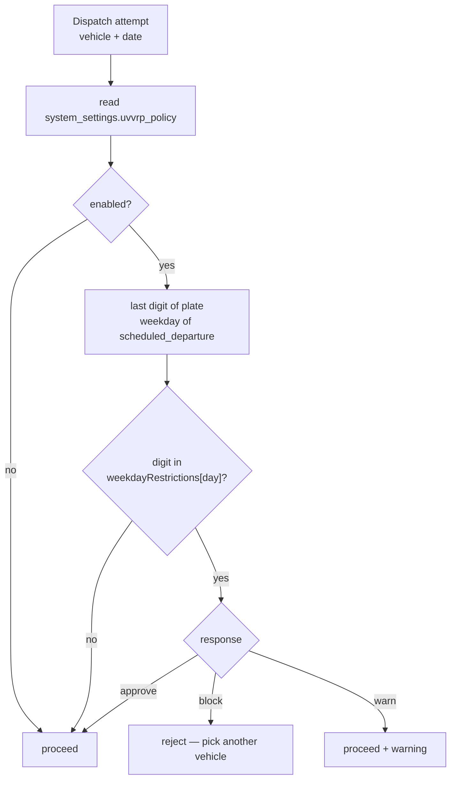

# Feature: UVVRP Number Coding

## What it does

Enforces the **Unified Vehicular Volume Reduction Program** — Metro Manila's number-coding scheme. A vehicle whose plate ends in a restricted digit may not be dispatched on its restricted weekday.

## Why it exists

It's the law in the operating city. A dispatch that violates it exposes the hotel to a fine and the guest to a stopped vehicle. This is a **domain-specific compliance rule that no generic fleet product would have** — arguably the most locally-grounded feature in the system.

## The live policy — CONFIRMED (`system_settings.uvvrp_policy`)

```json
{
  "enabled": true,
  "location": "Manila",
  "response": "block",
  "weekdayRestrictions": {
    "Mon": [1, 2], "Tue": [3, 4], "Wed": [5, 6],
    "Thu": [7, 8], "Fri": [9, 0]
  }
}
```

Standard UVVRP mapping: last plate digit → weekday. Weekends unrestricted.

The fleet vehicles page (`src/app/(dashboard)/fleet/vehicles/page.js`) surfaces
this as a **Coding Restricted** KPI card that actually filters: clicking it
toggles `filters.restrictedOnly`, which both `FleetGrid` and `FleetTable`
honour by keeping only vehicles whose plate is in the day's restricted set
(the page already computed restriction per-plate via `isRestricted()` for the
stat count — same set is reused).

## The three response modes — CONFIRMED

`src/lib/uvvrp/policy.js` supports:

| Mode | Behaviour |
|---|---|
| `block` | Reject the dispatch outright — **current setting** |
| `warn` | Allow, but surface a warning |
| `approve` | Allow silently |

**Making enforcement strength a runtime setting rather than a hard-coded rule is the right call.** Coding schemes get suspended (holidays, emergencies, policy changes) and the response needs to change without a deploy. That's why the policy lives in `system_settings`, not in code.

## How it works



`src/lib/uvvrp/policy.js` is **pure** — settings and date in, decision out, no I/O. Which is why it's unit-testable without a database. → [[Pure Core Imperative Shell]]

## Database tables used

`system_settings` (the policy) · `uvvrp_violations` — **0 rows**

## The gap — CONFIRMED

`uvvrp_violations` has **zero rows**. With `response: "block"`, violations are prevented rather than recorded, so an empty table is *consistent* with the policy working. But it also means:

- there's no evidence the logging path works at all
- in `warn` mode, allowed-but-restricted dispatches should be recorded, and that's untested

**TODO:** set `response: "warn"` in a test environment and confirm a row lands in `uvvrp_violations`.

## What I learned

Encoding a real-world regulation as data (`weekdayRestrictions` map) rather than logic (`if (day === 'Mon' && ...)`) means the rule can change without touching code. The pure function reads the data; the data lives in the DB.

## Related

[[Dispatch]] · [[Fleet And Vehicles]] · [[Pure Core Imperative Shell]] · [[Feature Index]]
