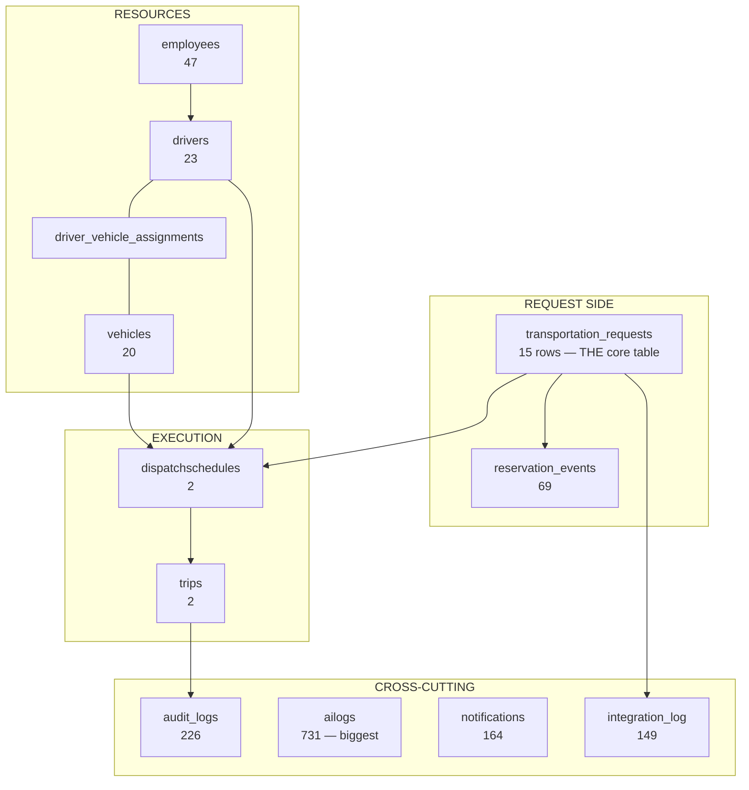

# Database Overview

Supabase Postgres, project `dnxuphhxlzidvwtdqqkq`, db `postgres`, schema `public`.
**38 base tables + 1 view (`driver_stats`) · 77 foreign keys.** All figures from a live read-only query on 2026-08-11, after migration 036.

## The shape of it

## Row counts — CONFIRMED (2026-08-11)

| Table | Rows | Read |
|---|---|---|
| `ailogs` | 731 | [[DEBT Runtime DDL On Hot Path]] |
| `audit_logs` | 226 | |
| `notifications` | 164 | [[Notifications]] |
| `integration_log` | 149 | [[integration_log]] |
| `reservation_events` | 69 | [[Request Lifecycle]] |
| `mobile_refresh_tokens` | 57 | [[Token Rotation And Refresh Races]] |
| `employees` | 47 | [[employees]] — 29 soft-deleted |
| `drivers` | 23 | |
| `vehicles` | 20 | |
| `transportation_requests` | 15 | |
| `trips` | **2** | |
| `dispatchschedules` | **2** | [[dispatchschedules]] |

**Ten tables have zero rows:** `fuelrecords`, `vehicleinspection`, `notification_preferences`, `recommendation_snapshots`, `ai_insights`, `ai_recommendations`, `uvvrp_violations`, `driverattendance`, `service_types`, `booking_channels`.

Was eleven. The eleventh, `vehiclereservations`, was **dropped** in migration 036 rather than filled — it had no writer, so nothing was ever going to fill it.

INFERRED: the UI and API for these exist; the workflows have never been exercised. Broad, not deep.

## The five things to know

### 1. RLS is enabled and inert — CONFIRMED
32 of 38 tables have RLS on, with **71 policies**. **None of them ever fire.** Both connection paths are privileged. → [[Why RLS Is Not A Boundary]]

### 2. `transportation_requests` is the core table — CONFIRMED
It is now the **only** request table. `vehiclereservations` was dropped 2026-08-11, and the four stale ERDs that omitted `transportation_requests` are deleted — `schema.sql`, generated by `npm run db:dump`, replaces them.

### 3. Double-booking is guarded in the database, not just the app — CONFIRMED
`trg_dispatch_overlap` (migration 023) uses `pg_advisory_xact_lock` before INSERT/UPDATE. This is the only concurrency-correct guard in the system. → [[ADR-006 Dual Double-Booking Guard]] · [[TOCTOU And Advisory Locks]]

### 4. Notifications are database-driven — CONFIRMED
Four triggers create rows: `trigger_notify_dispatch_created`, `trigger_notify_trip_completed`, `trigger_notify_document_expiry`, `trigger_notify_maintenance_due`. Business logic lives in plpgsql, not JS. → [[Notifications]]

### 5. The schema has drifted from the migrations — CONFIRMED
Four objects existed with no migration file and one CHECK constraint differed. **Closed 2026-08-11** by migrations `033`–`035`; the remaining view `driver_stats` is still undeclared. → [[DEBT Schema Drift From Migrations]]

## Table notes

**Core:** [[transportation_requests]] · [[dispatchschedules]] · [[trips]] · [[vehicles]] · [[drivers]] · [[employees]]
**Relationship:** [[driver_vehicle_assignments]] · [[reservation_events]]
**Boundary:** [[integration_log]]
**Dropped:** [[vehiclereservations]] — kept as a note because the *reason* it existed still explains the schema's shape

## Related

[[ERD]] · [[Migrations]] · [[Supabase]] · [[Architecture]] · [[Home]]
