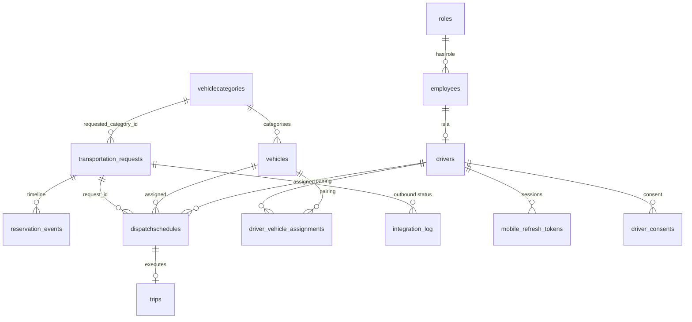

# ERD

**`docs/erd/` is deleted** — it held **four** hand-drawn diagrams, all modelling the pre-013 multi-branch schema and none containing `transportation_requests`. The generated `schema.sql` (`npm run db:dump`) is the reference; this note is the readable summary. See [[DOC ERDs Missing Core Table]].

Drawn from the **live schema**, limited to the tables on the main business line. The full schema is 38 tables + 77 FKs; showing all of them produces an unreadable diagram, which is part of why the old ERDs failed.

## Core relationships — CONFIRMED

## Reading the diagram

| Relationship | Note |
|---|---|
| `employees ||--o| drivers` | A driver **is** an employee. Login credentials live on `employees`; driver-specific data on `drivers`. → [[employees]] |
| `dispatchschedules` has **one** parent | `request_id`. It had a second, `reservation_id` → `vehiclereservations`, until migration 036 dropped both. → [[DEBT vehiclereservations vs transportation_requests]] |
| `dispatchschedules ||--o| trips` | One dispatch, at most one trip. The dispatch is the *booking*; the trip is the *execution*. |
| `driver_vehicle_assignments` | A join table with `uq_dva_active_*` **partial unique indexes** — only one active pairing per side. This is why `withTransaction` exists. → [[Connection Pooling vs Transactions]] |

## What's deliberately not in this diagram

`ailogs`, `audit_logs`, `notifications`, `system_settings`, `uvvrp_violations`, `recommendation_snapshots`, `ai_insights`, `ai_recommendations`, `fuelrecords`, `maintenance*`, `vehicleinspection`, `driverattendance`, `locations`, `service_types`, `booking_channels`, `substitute_vehicle_schedules`, `notification_preferences`, `driverincidents`, `driver_documents`, `driver_stats` (view), and the remaining lookups.

They are real; they are cross-cutting or leaf tables that add edges without adding understanding. INFERRED: this selectivity is the fix for what went wrong with the old 40-entity ERD.

## Regenerating this

The reliable route is a `pg` script against `information_schema.table_constraints` + `key_column_usage` (same pattern as [[Quick Reference]]'s migration procedure), emitting mermaid. **TODO:** write `scripts/generate-erd.mjs` so this note can be refreshed instead of hand-edited.

## Related

[[Database Overview]] · [[transportation_requests]] · [[dispatchschedules]] · [[driver_vehicle_assignments]] · [[Migrations]]
