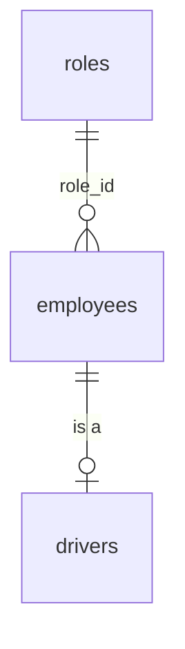

# Table: employees

**The identity table.** Every web login authenticates against a row here. 47 rows.

## Why it matters

`password_hash` on this table is the credential store for NextAuth. There is no Supabase Auth user table in play — see [[BUG Root proxy.js Is Dead Code]] for the file that wrongly implies otherwise.

## Key columns — CONFIRMED

| Column | Note |
|---|---|
| `password_hash` | bcryptjs. **Only 14 of 47 rows have one.** |
| `role_id` | FK → `roles`. **Only 15 of 47 rows have one.** No role → no dashboard access. |
| `deleted_at` | Soft delete. **29 rows are soft-deleted.** |

## The data is polluted — CONFIRMED

29 of 47 employees are **test-harness accounts**: `harness-qw-…@example.com`, `harness-vs-…@example.com`, all soft-deleted.

So the real employee count is roughly **18**, of which 14 can log in.

INFERRED: `scripts/verify-*.mjs` harnesses create accounts and soft-delete them instead of hard-deleting, leaving residue. Harmless (they're excluded by `deleted_at IS NULL` filters) but it makes `SELECT count(*)` misleading — worth knowing before you trust a dashboard number.

**TODO:** confirm every employee query filters `deleted_at IS NULL`. A missing filter here is a real auth bug, not cosmetic.

## Relationship to `drivers` — CONFIRMED

A driver **is** an employee with a `drivers` row. Credentials and role live on `employees`; licence, availability, and performance live on `drivers`. Mobile login therefore also goes through `employees` — then resolves a `driverId`. → [[Authentication]]

## Related

[[Authentication]] · [[RBAC]] · [[drivers]] · [[Database Overview]] · [[Driver Management]]
