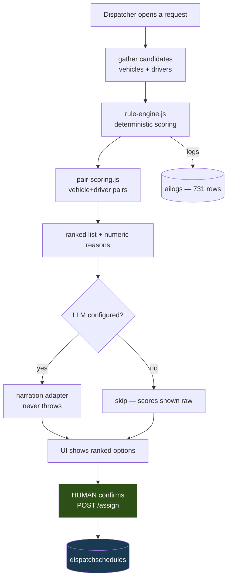

# AI Architecture

**The most defensible design decision in the project.** The AI does not decide anything.

## The rule — CONFIRMED

`src/lib/ai/dispatch-advisor.js:11-14`:

> *"DETERMINISTIC AND ADVISORY. The same inputs always produce the same output, every number traces to a rule in this file, and nothing here writes an assignment — a human confirms via the assign endpoint. LLM narration, when enabled, is a nullable presentation layer on top and never the decision."*

Three separate guarantees in one sentence: **determinism**, **traceability**, **no write authority**.

## The shape — CONFIRMED

**The only arrow into the database comes from the human.** That is the whole architecture.

## Why this matters for a capstone — INFERRED

An examiner asking *"how do you know the AI isn't wrong?"* gets a complete answer: it can't be wrong in a way that matters, because it never acts. Every score traces to a rule you can read. The LLM only rephrases.

Compare with a system where an LLM writes assignments: you'd need evaluation, guardrails, rollback, and an audit story for hallucinated dispatches. This design makes all of that unnecessary. → [[ADR-003 Deterministic AI]]

## The LLM layer is failure-tolerant — CONFIRMED

The narration adapter **never throws**. No API key, network failure, malformed response → narration is `null` and the UI shows the deterministic scores. `.env` currently has **no LLM key**, so this is the live path today.

A feature that degrades to "slightly less pretty" instead of "broken" is worth copying.

## Prompt loading — CONFIRMED

`src/lib/ai/prompt-loader.js` reads `resources/ai/instructions.md` with `fs.readFileSync` and falls back to a built-in string. Editing the prompt is a **content** change, not a code change.

`resources/ai/instructions.md` sets a read-only advisory role and includes:

> *"Never invent fake vehicle records, invalid plate numbers, or hallucinate data. If data is missing, state that it is missing."*

and a formatting rule that reveals the UI contract:

> *"Write your rationale in short, complete, and punchy sentences. Separate distinct points with periods so the UI can parse them cleanly into bullet points."*

INFERRED: the UI splits narration on periods. That's a fragile coupling — an abbreviation like "approx. 3 km" would split mid-thought. **TODO:** confirm how the UI parses this and consider a structured field instead.

## The weak spot — FIXED 2026-08-11

`src/lib/ai/logger.js:21`, `src/app/api/ai/logs/route.js:10`, and `src/app/api/ai/providers/route.js:10` **used to** run `CREATE TABLE IF NOT EXISTS` on **every request**. That is how `ailogs` (731 rows, still the largest table) came to exist with no migration file at all.

The DDL is gone from all three call sites, and migration **034** now declares `ailogs` and `ai_report_narratives` properly. The inline DDL had already drifted from the real table — it omitted `target_feature`, so a rebuild from it would have produced a *different* table than the one in production. → [[DEBT Runtime DDL On Hot Path]]

Also: `recommendation_snapshots`, `ai_insights`, and `ai_recommendations` all have **0 rows** — those persistence paths are unexercised.

## Related

[[AI Advisory]] · [[ADR-003 Deterministic AI]] · [[Dispatch]] · [[DEBT Runtime DDL On Hot Path]] · [[Architecture]] · [[Deterministic Core With Nullable Narration]]
