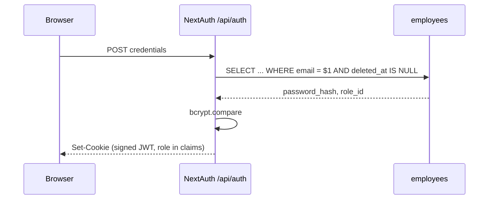

# Authentication

**Two independent auth systems**, by design. Web uses NextAuth cookies; mobile uses bearer JWTs. They share only the `employees` credential store.

## Web: NextAuth v4 — CONFIRMED

Credentials provider, **JWT session strategy** (not database sessions), `bcryptjs` compare against `employees.password_hash`.



Role lands in the JWT claims, so authorization needs no per-request DB lookup.

## Mobile: separate bearer JWT — CONFIRMED

`jose`, HS256. Two token types with **different audiences**:

| Token | Lifetime | Storage |
|---|---|---|
| Access | 15 minutes | memory / expo-secure-store |
| Refresh | 30 days, **single-use rotating** | SHA-256 **hashed** in `mobile_refresh_tokens` (57 rows) |

Three properties worth naming:

1. **Refresh tokens are hashed at rest.** A DB read doesn't yield usable tokens.
2. **Single-use rotation.** Presenting a refresh token invalidates it and issues a new one — replay is detectable.
3. **The audience split is the actual security control.** A refresh token cannot be presented as an access token, because audience is verified. Without that, a 30-day token would be a 30-day API key.

→ [[Token Rotation And Refresh Races]]

## The gate: `requireAuth()` — CONFIRMED

Everything hangs off `src/lib/api/utils.js`:

```js
const DEFAULT_ROLES = ["system_admin", "admin", "fleet_manager", "dispatcher", "management"];

resolveIdentity(req)   // Bearer token WINS over cookie session
requireAuth(req, allowedRoles = DEFAULT_ROLES)
requireDriver(req)     // requireAuth(req, ["driver"]) + guarantees driverId
```

**`driver` is deliberately absent from `DEFAULT_ROLES`.** Any route that forgets to pass explicit roles therefore **fails closed for drivers** — the most likely-to-be-abused role is excluded by default. That is a genuinely good default. → [[Fail Closed By Default]]

`resolveIdentity` preferring Bearer over cookie matters when both are present (e.g. a driver's browser session plus a mobile token) — the explicit credential wins.

## Where auth is NOT — CONFIRMED

| Place you'd look | Reality |
|---|---|
| `src/middleware.js` | **Doesn't exist.** Next 16 renamed it. → [[DOC SYSTEM.md References middleware.js]] |
| `src/proxy.js` | CORS preflight only. **No auth.** |
| `proxy.js` (root) | Dead file implying Supabase Auth. → [[BUG Root proxy.js Is Dead Code]] |
| RLS policies | 69 of them, all inert. → [[Why RLS Is Not A Boundary]] |

**Every one of the 113 route handlers calls `requireAuth()` itself.** There is no central chokepoint. That is the single most important fact about this system's security posture: the guarantee is *per-route discipline*, and a route that forgets is unprotected with nothing to catch it.

**TODO:** an audit that asserts every `src/app/api/**/route.js` contains a `requireAuth`/`requireDriver` call. Cheap to write, high value.

## Password recovery & reset — CONFIRMED (2026-08-20)

All credential-change paths are **server-side**; nothing writes `employees` from the browser anymore. The old anon-key escalation is gone.

- `auth.service.js` previously called Supabase `signUp`/`resetPassword`/`updatePassword` through the **browser anon client**. Migration 009 let that anon key `INSERT`/`SELECT` on `employees`, and the default grants went further (`UPDATE`/`DELETE`) — **anyone with the public anon key could insert a `system_admin` or overwrite a password hash**. Migration 060 dropped the 009 policies and `REVOKE ALL`d `anon`; verified live (`pg_policies` + `role_table_grants` both empty for `anon` on `employees`).
- `signUp`/`resetPassword`/`updatePassword` were **deleted** from `auth.service.js`; it no longer imports the anon `createClient`. Credential mutation lives in three routes:
  - `POST /api/auth/change-password` — session-bound, pre-existing.
  - `POST /api/auth/forgot-password` — **public** but rate-limited (per-IP + per-email, 5/60s), identical generic response whether or not the email exists (no enumeration), no email is actually sent yet.
  - `POST /api/auth/reset-password` — `requireAuth`, employee derived from the session (never the body), rate-limited, wipes the employee's `mobile_refresh_tokens` so a leaked mobile session dies too.
- `POST /api/mobile/auth/login` is now throttled **per-IP and per-account** (5/60s, 429 + `Retry-After`), mirroring the web Credentials provider — previously it ran unlimited bcrypt compares.
- Seeded `admin123` credential from migration 008 was a **real account takeover**: migration 061 NULLs the known hash where it still matches, and the live `admin@fleetops.com` password was **rotated** to a fresh strong hash (cost 10). Decision: keep the account, rotate the credential.

## Related

[[RBAC]] · [[employees]] · [[Mobile Architecture]] · [[Why RLS Is Not A Boundary]] · [[Architecture]] · [[Backend]]
