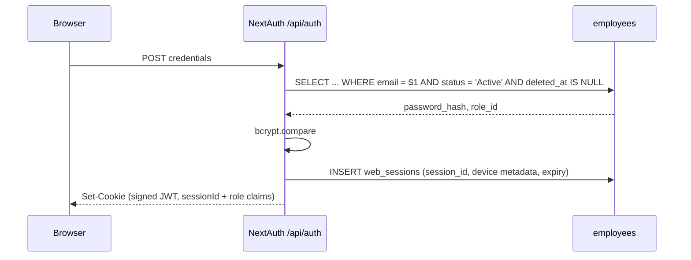

# Authentication

**Two independent auth systems**, by design. Web uses NextAuth cookies; mobile uses bearer JWTs. They share only the `employees` credential store.

## Web: NextAuth v4 — CONFIRMED

Credentials provider, signed JWT transport with a server-backed `web_sessions`
record, and `bcryptjs` compare against `employees.password_hash`. The JWT only
identifies the session row (`sessionId`); every API request rechecks ownership,
expiry, revocation, employee status, role, and `auth_version`.



Role lands in the JWT claims for landing/UI purposes. API authorization does a
live employee lookup before applying the route role list, so a stale claim cannot
survive a disablement or demotion.

## Mobile: separate bearer JWT — CONFIRMED

`jose`, HS256. Two token types with **different audiences**:

| Token | Lifetime | Storage |
|---|---|---|
| Access | 15 minutes, checked against its active refresh family | memory / expo-secure-store |
| Refresh | 30 days, **single-use rotating** | SHA-256 **hashed** in `mobile_refresh_tokens`, grouped by a family UUID with device metadata |

Three properties worth naming:

1. **Refresh tokens are hashed at rest.** A DB read doesn't yield usable tokens.
2. **Single-use rotation.** Presenting a refresh token invalidates it and issues a new one — replay is detectable.
3. **The audience split is the actual security control.** A refresh token cannot be presented as an access token, because audience is verified. Without that, a 30-day token would be a 30-day API key.

Each access token also carries its refresh `family_id`. Revoking one device
family (or all mobile families) therefore invalidates its access token on the
next API request instead of waiting for the 15-minute expiry.

→ [[Token Rotation And Refresh Races]]

## The gate: `requireAuth()` — CONFIRMED

Everything hangs off `src/lib/api/utils.js`:

```js
const DEFAULT_ROLES = ["system_admin", "admin", "fleet_manager", "dispatcher", "management"];

resolveIdentity(req)   // Bearer token WINS over cookie session
requireAuth(req, allowedRoles = DEFAULT_ROLES)
requirePermission(req, resource, action) // derives roles from permissions.js
requireDriver(req)     // requireAuth(req, ["driver"]) + guarantees driverId
```

**`driver` is deliberately absent from `DEFAULT_ROLES`.** Any route that forgets to pass explicit roles therefore **fails closed for drivers** — the most likely-to-be-abused role is excluded by default. That is a genuinely good default. → [[Fail Closed By Default]]

`resolveIdentity` preferring Bearer over cookie matters when both are present (e.g. a driver's browser session plus a mobile token) — the explicit credential wins.

## Where auth is NOT — CONFIRMED

| Place you'd look | Reality |
|---|---|
| `src/middleware.js` | **Doesn't exist.** Next 16 renamed it. → [[DOC SYSTEM.md References middleware.js]] |
| `src/proxy.js` | CORS preflight only. **No auth.** |
| `proxy.js` (root) | Dead file implying Supabase Auth. → [[BUG Root proxy.js Is Dead Code]] |
| RLS policies | 69 of them, all inert. → [[Why RLS Is Not A Boundary]] |

**Every exported route method is checked by `scripts/verify-route-auth.mjs`.**
There is no central Next.js auth middleware; the guarantee remains per-route
discipline, with the static method-level audit catching a forgotten guard before
CI accepts it.

`npm run verify:auth` scans 218 exported methods, recognizes explicit
service-token delegations and public protocol endpoints, and rejects bare
`requireAuth(req)` on every mutating handler.

## Password recovery & reset — CONFIRMED (2026-08-20)

All credential-change paths are **server-side**; nothing writes `employees` from the browser anymore. The old anon-key escalation is gone.

- `auth.service.js` previously called Supabase `signUp`/`resetPassword`/`updatePassword` through the **browser anon client**. Migration 009 let that anon key `INSERT`/`SELECT` on `employees`, and the default grants went further (`UPDATE`/`DELETE`) — **anyone with the public anon key could insert a `system_admin` or overwrite a password hash**. Migration 060 dropped the 009 policies and `REVOKE ALL`d `anon`; verified live (`pg_policies` + `role_table_grants` both empty for `anon` on `employees`).
- `signUp`/`resetPassword`/`updatePassword` were **deleted** from `auth.service.js`; it no longer imports the anon `createClient`. Credential mutation lives in three routes:
  - `POST /api/auth/change-password` — session-bound, pre-existing.
  - `POST /api/auth/forgot-password` — **public** but rate-limited (per-IP + per-email, 5/60s), identical generic response whether or not the email exists (no enumeration), no email is actually sent yet.
  - `POST /api/auth/reset-password` — `requireAuth`, employee derived from the session (never the body), rate-limited, wipes the employee's `mobile_refresh_tokens` so a leaked mobile session dies too.
- `POST /api/mobile/auth/login` is now throttled **per-IP and per-account** (5/60s, 429 + `Retry-After`), mirroring the web Credentials provider — previously it ran unlimited bcrypt compares.
- Seeded `admin123` credential from migration 008 was a **real account takeover**: migration 061 NULLs the known hash where it still matches, and the live `admin@fleetops.com` password was **rotated** to a fresh strong hash (cost 10). Decision: keep the account, rotate the credential.

## Credential and session lifecycle — CONFIRMED (2026-09-02)

The 2026-08-20 recovery description above is the historical baseline. Current
behavior is:

- `employees.auth_version` is included in NextAuth and mobile token claims and
  compared against the live employee row by `resolveIdentity()`. Password,
  email, role, and account-status changes increment it, so stale web sessions
  and mobile access tokens receive `401 Session expired` without waiting for
  their normal expiry.
- Password changes and email changes run their credential update and mobile/reset
  token revocation in a transaction. Driver-account password setup and account
  disablement revoke the same token classes. Password changes return
  `signInRequired: true`; the web settings screens sign the operator out.
- `POST /api/auth/reset-token` is restricted to `admin`/`system_admin` and issues
  a 30-minute one-time link. Only a SHA-256 token hash is stored. The reset page
  consumes the token without an employee id, marks it used, revokes other reset
  and mobile tokens, and requires a fresh sign-in afterward.
- `POST /api/auth/forgot-password` deliberately remains a uniform contact-admin
  response until a verified email delivery provider is selected. It does not
  claim that an email was sent.
- Authentication, session, and MFA events are written to `audit_logs` without storing
  passwords, cookies, bearer tokens, OTPs, recovery codes, or plaintext TOTP secrets. PostgreSQL-backed
  IP/account rate-limit buckets are shared across app instances and fail closed
  when the database is unavailable.
- Mobile refresh rotation uses one transaction, a family UUID, single-use rows,
  and family revocation on replay. The login path opportunistically removes
  expired and long-revoked rows; `/api/mobile/auth/logout` supports the existing
  `allDevices` flag.

Verified email delivery and scheduled pruning remain explicitly unimplemented
until their provider or deployment decisions are made.

## TOTP MFA and session management — CONFIRMED (2026-09-02)

- Settings > Security starts enrollment only after the current password is
  verified, returns an `otpauth://` URI/QR code, and requires a first six-digit
  TOTP before enabling the factor. Secrets are encrypted with AES-256-GCM in
  `employee_mfa`; production requires `MFA_ENCRYPTION_KEY`.
- Ten recovery codes are generated on enable or regeneration. Only SHA-256
  hashes are stored, each code is atomically single-use, and plaintext codes
  are returned once to the already-authenticated operator.
- TOTP verification uses the RFC 6238-compatible `otpauth` package with a
  30-second period, six digits, ±1 step skew, and `last_used_step` replay
  protection. Enrollment generates secrets with the v9-compatible
  `new Secret().base32` API, and MFA attempts have independent IP/account
  throttles.
- Web and mobile credential exchanges check the enrolled factor before issuing
  a session. Missing/invalid factors never create a web session or mobile token.
- Enabling/disabling MFA increments `auth_version` and revokes all web/mobile
  sessions. Password/email/role/account changes use the same revocation path.
- `web_sessions` records safe device metadata and bounded activity. The
  owner-scoped sessions API can list, revoke one, or revoke all other sessions;
  mobile refresh families are grouped as one device entry. Session listing includes 
  an approximate physical location derived from the IP address using `geoip-lite`, 
  and accurately identifies the current device for both web (`sessionId`) and mobile (`familyId`) contexts.

## Session idle timeout and expiration UX — CONFIRMED (2026-09-02)

- **Idle timeout**: 1 hour (`last_seen_at + 3600s`). Migration `089_session_idle_timeout.sql` adds `web_sessions.idle_timeout_seconds` defaulting to `3600`.
- **Absolute expiration**: 12-hour hard maximum (`expires_at`), computed at login and never extended.
- **Server authority**: `resolveCurrentIdentity()` independently validates both `expires_at > NOW()` and `last_seen_at + idle_timeout_seconds > NOW()`. Idle expiration throws `SESSION_IDLE_TIMEOUT` with HTTP 401; 12-hour expiration throws `SESSION_EXPIRED`; revoked sessions throw `SESSION_REVOKED`.
- **5-minute activity throttle vs idle timeout**: The existing 5-minute threshold is strictly a database-write throttle for updating `last_seen_at`. It is not the idle timeout.
- **Heartbeat & human activity**: `GET/POST /api/auth/heartbeat`. Frontend monitors DOM events (`click`, `keydown`, `touchstart`, `pointerdown`) and pings heartbeat at 5-minute intervals only if human activity occurred. Background polling (dispatch boards, notifications) does not touch the human-activity flag.
- **Stay signed in**: Issues a `POST /api/auth/heartbeat` to slide `last_seen_at` and idle deadline by 1 hour; the 12-hour maximum remains unchanged.
- **Warning UX**: A double-bezel modal appears at 5 minutes before idle expiry (55m of inactivity) and 5 minutes before absolute expiry (11h55m). Error toasts are suppressed (`setSuppressAuthToasts(true)`) while any session modal is open.
- **Multi-tab synchronization**: `BroadcastChannel("fleetops_session_bus")` broadcasts auth failures, session extensions, and explicit logouts across open tabs.
- **Return-to-route protection**: `sessionStorage` preserves the user's current route across re-authentication, strictly validated against open-redirect and protocol vulnerabilities via `isValidInternalPath()`.

## Related

[[RBAC]] · [[employees]] · [[Mobile Architecture]] · [[Why RLS Is Not A Boundary]] · [[Architecture]] · [[Backend]]
