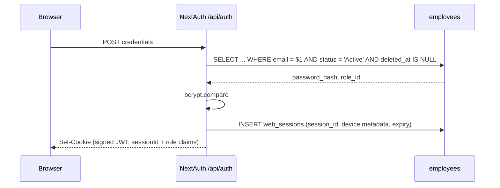

# Authentication

**Two independent auth systems**, by design. Web uses NextAuth cookies; mobile uses bearer JWTs. They share only the `employees` credential store.

## Web: NextAuth v4 — CONFIRMED

Credentials provider, signed JWT transport with a server-backed `web_sessions`
record, and `bcryptjs` compare against `employees.password_hash`. The JWT only
identifies the session row (`sessionId`); every API request rechecks ownership,
expiry, revocation, employee status, role, and `auth_version`.



Role lands in the JWT claims for landing/UI purposes. API authorization does a
live employee lookup before applying the route role list, so a stale claim cannot
survive a disablement or demotion.

**Production Edge & CORS Proxy Awareness:** `src/proxy.js` validates `Origin` headers on POST login requests against dynamic same-origin identifiers (`request.nextUrl.origin`, `Host`, `X-Forwarded-Host`) and deployment domains (`NEXT_PUBLIC_APP_URL`, `NEXTAUTH_URL`, `VERCEL_URL`). Non-OPTIONS 403 rejections return structured JSON `{ error: "Forbidden: origin not allowed" }` rather than empty null bodies to prevent client-side `Unexpected end of JSON input` syntax errors. `signIn` in `src/services/auth.service.js` translates any low-level JSON parser failures into user-friendly diagnostic guidance.

## Mobile: separate bearer JWT — CONFIRMED

`jose`, HS256. Two token types with **different audiences**:

| Token | Lifetime | Storage |
|---|---|---|
| Access | 15 minutes, checked against its active refresh family | memory / expo-secure-store |
| Refresh | 30 days, **single-use rotating** | SHA-256 **hashed** in `mobile_refresh_tokens`, grouped by a family UUID with device metadata |

Three properties worth naming:

1. **Refresh tokens are hashed at rest.** A DB read doesn't yield usable tokens.
2. **Single-use rotation.** Presenting a refresh token invalidates it and issues a new one — replay is detectable.
3. **The audience split is the actual security control.** A refresh token cannot be presented as an access token, because audience is verified. Without that, a 30-day token would be a 30-day API key.

Each access token also carries its refresh `family_id`. Revoking one device
family (or all mobile families) therefore invalidates its access token on the
next API request instead of waiting for the 15-minute expiry.

→ [[Token Rotation And Refresh Races]]

## The gate: `requireAuth()` — CONFIRMED

Everything hangs off `src/lib/api/utils.js`:

```js
const DEFAULT_ROLES = ["super_admin", "admin", "fleet_manager", "dispatcher", "management"];

resolveIdentity(req)   // Bearer token WINS over cookie session
requireAuth(req, allowedRoles = DEFAULT_ROLES)
requirePermission(req, resource, action) // derives roles from permissions.js
requireDriver(req)     // requireAuth(req, ["driver"]) + guarantees driverId
```

**`driver` is deliberately absent from `DEFAULT_ROLES`.** Any route that forgets to pass explicit roles therefore **fails closed for drivers** — the most likely-to-be-abused role is excluded by default. That is a genuinely good default. → [[Fail Closed By Default]]

`resolveIdentity` preferring Bearer over cookie matters when both are present (e.g. a driver's browser session plus a mobile token) — the explicit credential wins.

## Where auth is NOT — CONFIRMED

| Place you'd look | Reality |
|---|---|
| `src/middleware.js` | **Doesn't exist.** Next 16 renamed it. → [[DOC SYSTEM.md References middleware.js]] |
| `src/proxy.js` | CORS preflight only. **No auth.** |
| `proxy.js` (root) | Dead file implying Supabase Auth. → [[BUG Root proxy.js Is Dead Code]] |
| RLS policies | 69 of them, all inert. → [[Why RLS Is Not A Boundary]] |

**Every exported route method is checked by `scripts/verify-route-auth.mjs`.**
There is no central Next.js auth middleware; the guarantee remains per-route
discipline, with the static method-level audit catching a forgotten guard before
CI accepts it.

`npm run verify:auth` scans 218 exported methods, recognizes explicit
service-token delegations and public protocol endpoints, and rejects bare
`requireAuth(req)` on every mutating handler.

## Password recovery & reset — CONFIRMED (2026-08-20)

All credential-change paths are **server-side**; nothing writes `employees` from the browser anymore. The old anon-key escalation is gone.

- `auth.service.js` previously called Supabase `signUp`/`resetPassword`/`updatePassword` through the **browser anon client**. Migration 009 let that anon key `INSERT`/`SELECT` on `employees`, and the default grants went further (`UPDATE`/`DELETE`) — **anyone with the public anon key could insert a `system_admin` or overwrite a password hash**. Migration 060 dropped the 009 policies and `REVOKE ALL`d `anon`; verified live (`pg_policies` + `role_table_grants` both empty for `anon` on `employees`).
- `signUp`/`resetPassword`/`updatePassword` were **deleted** from `auth.service.js`; it no longer imports the anon `createClient`. Credential mutation lives in three routes:
  - `POST /api/auth/change-password` — session-bound, pre-existing.
   - `POST /api/auth/forgot-password` — **public** but rate-limited (per-IP + per-email, 5/60s), identical generic response whether or not the email exists (no enumeration). Since 2026-09-19 it self-serves over SMTP (Nodemailer; briefly Resend on day one, swapped the same day) when `SMTP_HOST`/`SMTP_USER`/`SMTP_PASS` are set (link + paste-able code emailed, `password_reset_requested` audited); without a provider it keeps the administrator-issued wording.
  - `POST /api/auth/reset-password` — `requireAuth`, employee derived from the session (never the body), rate-limited, wipes the employee's `mobile_refresh_tokens` so a leaked mobile session dies too.
- `POST /api/mobile/auth/login` is now throttled **per-IP and per-account** (5/60s, 429 + `Retry-After`), mirroring the web Credentials provider — previously it ran unlimited bcrypt compares.
- Seeded `admin123` credential from migration 008 was a **real account takeover**: migration 061 NULLs the known hash where it still matches, and the live `admin@fleetops.com` password was **rotated** to a fresh strong hash (cost 10). Decision: keep the account, rotate the credential.

## Credential and session lifecycle — CONFIRMED (2026-09-02)

The 2026-08-20 recovery description above is the historical baseline. Current
behavior is:

- `employees.auth_version` is included in NextAuth and mobile token claims and
  compared against the live employee row by `resolveIdentity()`. Password,
  email, role, and account-status changes increment it, so stale web sessions
  and mobile access tokens receive `401 Session expired` without waiting for
  their normal expiry.
- Password changes and email changes run their credential update and mobile/reset
  token revocation in a transaction. Driver-account password setup and account
  disablement revoke the same token classes. Password changes return
  `signInRequired: true`; the web settings screens sign the operator out.
- `POST /api/auth/reset-token` is restricted to `admin`/`system_admin` and issues
  a 30-minute one-time link. Only a SHA-256 token hash is stored. The reset page
  consumes the token without an employee id, marks it used, revokes other reset
  and mobile tokens, and requires a fresh sign-in afterward.
- `POST /api/auth/forgot-password` self-serves since 2026-09-19: with SMTP credentials set it mints from the shared `issueResetToken()` issuer and emails the link + code via `src/lib/email/smtp.js` (Nodemailer; Resend SDK was installed and removed the same day before any production send); without a provider it keeps the uniform contact-admin wording. The message depends only on provider configuration, never on the lookup result, so enumeration safety holds either way. Delivery failures are warn-logged server-side and still answer generically. It does not claim that an email was sent when none was.
- **Web recovery UI (2026-09-20):** `forgot-password/page.js` and `reset-password/page.js` share `recovery-shell.jsx`, which reuses the login page's normal ambient background, desktop brand panel, right-side `max-w-[27rem]` column, and double-bezel card positioning as a standard page layout—not a modal or nested login-page backdrop. Forgot-password keeps the email field neutral on first render and while incomplete; a syntactically valid address immediately shows the compact success feedback, while invalid feedback waits for blur or a submit attempt. The server's generic response remains verbatim, and a local resend affordance is included. Reset-password keeps the token and authenticated current-password paths, gates submission on the shared strong policy (8+ characters, upper/lowercase, number, special character, and 72 UTF-8-byte bcrypt limit), shows four lightweight requirement rows plus a secondary strength indicator, handles mismatch/verification/expired-link states, revokes sessions through the existing server route, and waits for an explicit fresh sign-in action after success. The UI does not weaken server validation or account-enumeration protections.
- Authentication, session, and MFA events are written to `audit_logs` without storing
  passwords, cookies, bearer tokens, OTPs, recovery codes, or plaintext MFA secrets. PostgreSQL-backed
  IP/account rate-limit buckets are shared across app instances and fail closed
  when the database is unavailable.
- Mobile refresh rotation uses one transaction, a family UUID, single-use rows,
  and family revocation on replay. The login path opportunistically removes
  expired and long-revoked rows; `/api/mobile/auth/logout` supports the existing
  `allDevices` flag.

Verified email delivery landed 2026-09-19 (SMTP/Nodemailer, forgot-password only); scheduled pruning of expired reset tokens remains explicitly unimplemented until its deployment decision is made.

## Temporary password invitations — IMPLEMENTED (2026-09-23)

Admin-created staff accounts no longer take a password on the form. **Add User**
collects email + names + role only; the server generates a strong temporary
password (16 chars, passes `isPassword`, `node:crypto.randomInt`, charset
excludes `<>&` and quotes so email stays safe), emails it, and the employee must
replace it at first sign-in. Drivers/mobile are out of scope.

**Flow.**

1. **Create (fail closed).** `POST /api/auth/register` (`accounts:create`)
   validates → role checks → duplicate 409 → **deliverability precheck before
   any INSERT** (`isEmailConfigured` + `isDeliverableEmailAddress`, each 400) →
   generate + bcrypt(10) → INSERT with `must_change_password = true` and
   `temp_credential_expires_at = now + 7 days` → `sendTempPasswordEmail`
   (subject `Your FleetOps temporary password` — never the password value,
   multipart HTML+text) → 201. **If the send fails the row is DELETEd**
   (compensating), audited as `invite_email_failed`, answered 502: no account
   survives an undelivered credential. The 201 response never contains the
   password; audit `create.newValues` never contains the password or hash.
2. **Login.** `authorize()` throws `TEMP_PASSWORD_EXPIRED` when the flag is set
   and the expiry has passed — **before** the OTP branch, so no code is emailed
   to an expired credential; the login page shows *"This temporary password has
   expired. Ask your administrator to resend it."* Otherwise `mustChangePassword`
   rides `authorize` → `jwt` → `session.user`.
3. **Server gate (authoritative).** `assertPasswordChangeGate` in
   `resolveIdentity` answers `403 PASSWORD_CHANGE_REQUIRED` for every path
   outside the allowlist `MUST_CHANGE_ALLOWED_PATHS` = change-password (the
   fix), profile (display name/avatar), heartbeat (keep-alive while the form is
   open). The `DashboardLayout` redirect to `/set-password` (and its early
   `return null`, so children never mount and fire 403s) is a **UX hint only**.
   `/set-password` sits in `authRoutes` — it renders bare through the root
   layout like the other recovery pages.
4. **Rotate-and-stay.** Forced `POST /api/auth/change-password` (no
   `currentPassword` re-check — the claim authorizes it) runs one transaction:
   new hash, `auth_version + 1`, both invite flags cleared, optimistic lock on
   the old hash (409 if it moved), every session revoked, pending reset tokens
   deleted. After commit `mintRotatedSession` (`src/lib/auth/session-rotation.js`)
   inserts a fresh `web_sessions` row and sets a new NextAuth cookie on the same
   200 — the user lands on `/dashboard` **signed in, no second login**. The
   voluntary Settings path is unchanged (`signInRequired: true` → sign out).
5. **Resend.** `POST /api/settings/users/[id]/resend-invite` (`accounts:create`)
   — only while `must_change_password` is still true (otherwise 400 pointing at
   the one-time reset-link flow). Rotates hash + expiry + `auth_version` and
   revokes sessions **in one transaction, then emails**; an email failure answers
   502 *"press Resend invite again"* — the fresh password is unknown to everyone,
   deliberately unlike create, where the row itself must not survive. Audit
   `invite_resend`, `newValues` = `{ email }` only. The users list shows amber
   **Password not set · expires …** plus a Resend invite action for pending rows.

**Columns** (migration `120_temp_password_invite.sql`, no new tables → no RLS
ceremony): `employees.must_change_password` (boolean NOT NULL DEFAULT false)
and `employees.temp_credential_expires_at` (timestamptz, nullable).

**Pinned by:** `src/security-boundaries.test.js` structural guards (register
wiring, expiry-before-OTP order, gate allowlist, forced-path rotation),
`src/app/api/auth/register/route.invite.test.js` (11 mocked route cases),
`src/lib/auth/temp-password.test.js` (9), `src/lib/auth/session-rotation.test.js` (4).

**Verified 2026-09-23:** vitest 2332/2332, lint clean, `verify:auth` 277/277,
`verify:anon` 0 exposed + `db:contract` 0 violations, `db:check`/`db:status`
clean, harness `verify-register-account.mjs` 29/29. Manual 10-step E2E
(real mailbox) confirmed working by the operator, 2026-09-23.

## Driver credential screens on mobile — CONFIRMED (2026-09-13)

No new backend route: the three mobile screens reuse the existing
credential endpoints, which already authorize mobile bearer tokens.

- **Change** (`mobile/app/(app)/profile/change-password.js`, via Profile →
  Privacy & Security): `POST /api/auth/change-password` accepts any role and
  `resolveIdentity()` prefers Bearer over cookie, so the driver's access token
  authorizes directly. Success carries `signInRequired: true` — the app signs
  out (offline cache cleared before SecureStore, per the `auth.js` ordering)
  and returns to login, mirroring web Settings > Security.
- **Forgot** (`mobile/app/forgot-password.js`, public, linked from login):
  `POST /api/auth/forgot-password` with `skipAuth`; renders the generic
  server message verbatim (no enumeration). Since 2026-09-19 that message
  reports a sent email when SMTP delivery is configured — the driver opens the link
  or pastes the code from the same email.
- **Reset** (`mobile/app/reset-password.js`, public, paste-the-code): the
  token mode of `POST /api/auth/reset-password` (`{ token, newPassword }`,
  `skipAuth`) consumes the 30-minute single-use code from the email (or an
  administrator-issued one — both mint from the same issuer).
  A deep link for the web `reset-password?token=` URL is a follow-up.
- **Policy enforcement is two-layered.** Client: pure
  `mobile/lib/password-validation.js` (min 8, lower + upper + number +
  special, ≤72 UTF-8 bytes, new-must-differ, confirm-must-match) blocks submit
  on both screens with a live checklist. Server: both routes validate
  `newPassword` as `type: "password"`, so a bypassed client still cannot set a
  weak password. `password-validation.test.js` locks client≡server parity by
  importing `isPassword`/`isPasswordByteLengthAllowed` from
  `src/lib/validation/index.js` and asserting identical verdicts on an
  adversarial corpus plus 2000 deterministic fuzz passwords.
- **Never queued.** All three mutations pass `queueOnFailure: false` — a
  credential change the server has not confirmed is not a change; offline the
  driver gets a plain connection error (the global banner speaks for it).

Verified: mobile suite 129/129, ESLint clean on all 7 touched files,
`npm run verify:auth` 261/261 (no new backend surface). Physical-device E2E
(airplane-mode errors, post-change forced re-login, admin-code reset) pending.

## Mobile OTP verification screen — IMPLEMENTED (2026-09-23)

The MFA step that used to be a single inline `ClayInput` on the login form is
now a dedicated verification step in FleetOps clay styling, mirroring the web
`MfaVerificationDialog` behavior: **no confirm button — the final digit
auto-verifies, the success check plays, and the app navigates with no second
tap.** No new endpoint, no new screen route: `mobile/app/login.js` renders
`OtpVerificationView` over the login shell while `mfaRequired` holds, keeping
the username/password in memory for the verify/resend calls.

- **Files.** `mobile/components/otp/OtpInput.jsx` (cells, digit pop, paste
  distribute, backspace nav), `mobile/components/otp/OtpVerificationView.jsx`
  (state machine, timer, resend, status), `mobile/lib/otp.js` + `otp.test.js`
  (dependency-free mirrors of `OTP_CODE_DIGITS`/`OTP_TTL_SECONDS`/
  `OTP_RESEND_COOLDOWN_SECONDS`, server-matching mask, MM:SS, sanitizer).
- **Six cells, not four.** The design sketch shows four boxes, but the server
  issues a 6-digit challenge — a four-digit entry could never verify — so the
  screen renders six cells and auto-submits on the sixth digit, exactly like
  the web modal. Backend response stays the source of truth throughout.
- **Proportional squircles and 3–3 chunking (enhanced 2026-09-23).** Resolved
  oversized cell height (`minHeight: 58` + `paddingVertical: 12`) and edge-to-edge
  row stretch: cells are now compact ~44w × 48h squircles with `borderRadius: 12`
  (matching control tokens) with zero extraneous font padding. The six inputs are
  chunked into two 3-digit clusters separated by a subtle middle divider (`—`),
  reducing cognitive strain and matching email delivery format. An animated pulsing
  cursor pill guides active empty cells, accompanied by primary glow and theme-aware
  tints. The verification view includes a security shield badge, an elevated email pill
  chip, and refined footer layout.
- **State machine.** ENTERING → VERIFYING → ERROR → ENTERING, or VERIFYING →
  SUCCESS → consent check → `/`. Input and resend lock during verification;
  the loader holds ≥500ms so the transition reads on fast networks; success
  holds ~650ms then navigates. Errors shake subtly (~350ms), show
  icon + message (never color-only), clear the cells, and refocus the first
  one — except transport failures, which keep the code for a no-retype retry.
- **Timer/resend.** 5:00 expiry countdown from the server TTL, 60s resend
  cooldown (resend = re-sign-in with an empty code, so no new endpoint), masked
  destination address, recovery-code fallback with auto-submit at 20 chars.
- **Security.** Code lives in local state only — never logged, never in
  analytics, cleared on error/back/unmount — and verification runs through the
  existing `signIn` credential exchange.

Verified: `mobile/lib/otp.test.js` 9/9 (client≡server contract pins),
mobile suite 335/335 passing, ESLint clean on all touched files. Physical-device
E2E (keyboard behavior, SMS autofill, light/dark states) pending.

## Email OTP as the second factor and session management — CONFIRMED (2026-09-22)

Replaces the TOTP scheme documented here from 2026-09-02. **This is a deliberate
downgrade in factor strength and is recorded as one** — see Decision Log. It was chosen
because it demos without a phone, and accepted knowing what it costs.

- **The factor is a 6-digit code emailed to `employees.email`.** There is no enrollment,
  no authenticator app, no QR code, no shared secret and no per-account switch: it is
  mandatory for every role **including `driver`**, on both web and mobile. The only
  variable is whether the server can currently *deliver* it.
- **Where the check lives.** Both factors are checked inside the existing credential
  exchange, so **no new public endpoint was added** and `verify:auth` does not move.
  `authorize()` in `src/lib/auth.js` and the mirrored gate in
  `src/app/api/mobile/auth/login/route.js` run only *after* the password verifies, which
  is why a code is never emailed to an unauthenticated caller and there is no account
  enumeration surface to protect.
- **Challenge binding with nothing on the wire.** Mirroring `issueResetToken`
  (`src/lib/auth/reset-token.js`), issuing *deletes* that employee's live unconsumed
  challenges and inserts one. "Verify" therefore means "the newest live challenge for
  this employee", the client contract is unchanged, and issuing a new code invalidates
  the previous one by construction — which is also what removes the two-concurrent-logins
  race. **Re-submitting the sign-in form is the resend**, so there is no resend endpoint
  either.
- **`email_otp_challenges`** (migration `119`) stores `code_hash` (SHA-256 hex),
  `purpose` (`login` | `break_glass`), `attempts`/`max_attempts`, `auth_version`,
  `consumed_at` and `expires_at`. RLS is enabled **and** `REVOKE ALL` is applied to
  `anon`/`authenticated`, because row security does not cover `TRUNCATE`.
- **The hash is not the protection, and the code says so.** A six-digit space is 10^6
  values; a plain SHA-256 digest of it is enumerable offline instantly. What actually
  holds is the 5-minute TTL (`OTP_TTL_SECONDS`), the 5-attempt ceiling
  (`OTP_MAX_ATTEMPTS`, which *burns* the challenge), the 60-second send cooldown
  (`OTP_RESEND_COOLDOWN_SECONDS`), and the table being unreachable from the anon key.
  Policy constants live in `src/lib/auth/otp-policy.js`, dependency-free so the
  `"use client"` modal cannot drift from the server.
- **Fail closed, twice.** If `isEmailConfigured()` is false *or* the address is not
  deliverable, the login is refused with an honest message and the event is audited as
  `mfa_unavailable`. There is no fallback path that lets the login through. A remembered
  browser is checked *before* the mail path so an SMTP outage cannot sign out a device
  that already proved itself.
- **`employee_mfa` is retained but no longer read.** Dropping it would be irreversible
  (the secret column is encrypted) and the destructive-DDL gate requires its contract
  entry and every caller to move in one change. It is dead weight kept for rollback, and
  its contract `reason` says so.
- **Recovery codes (break-glass 1).** Ten SHA-256-hashed single-use codes per set, as
  before — but the issuance points moved, because TOTP enrollment used to be where they
  came from. They are now issued at account creation and regenerated in Settings >
  Security, gated on **the current password** rather than a TOTP code. That gate is
  deliberately not an emailed code: this is the path someone takes when email is not
  reaching them, and requiring a code here would be circular.
- **Admin-issued emergency codes (break-glass 2).** `POST /api/auth/mfa/emergency-code`
  issues a 15-minute single-use `break_glass` challenge and returns the plaintext **once**
  for an operator to read aloud. Every issue writes an audit row **and** raises a security
  alert. A live `break_glass` challenge is never displaced by a self-service send:
  `issueLoginChallenge` returns `break_glass_held` and sends nothing, which closes the
  deadlock where an admin's hand-delivered code would be destroyed and replaced by an
  email the locked-out user cannot receive.
- **Trusted web devices now last 7 days, shortened from 30.** `POST/DELETE
  /api/auth/trusted-device`, HttpOnly opaque cookie, only a SHA-256 token hash stored,
  bound to `auth_version`, expiry and revocation. With the longest window in force the
  honest description is **"MFA at first login per device, per week"** — not "MFA on every
  login" — and the settings page says so in as many words rather than implying otherwise.
  Password, MFA, email, role, account and session-revocation changes all invalidate
  remembered devices through the shared auth lifecycle.
- **Web verification UX (2026-09-22):** after valid credentials return `MFA_REQUIRED`,
  `src/app/(auth)/login/page.js` opens the same centered modal (pale blue-gray veil,
  backdrop blur, lock/check hero, six animated cells backed by one accessible numeric
  input) with the copy changed from authenticator guidance to **the masked destination
  address**. Sending the domain through the mask is the point: a user whose address is at
  `@yahoo.com` seeing `••••@gmail.com` has just been told their code is going to the wrong
  mailbox, which is the one failure mode email OTP cannot otherwise distinguish. Recovery
  mode and a resend affordance sit in the same modal; the sixth digit auto-submits.
- **Delivery.** `sendOtpEmail` in `src/lib/email/smtp.js` reuses the same hand-built
  table/inline-style template as the password-reset mail, over Gmail SMTP with an App
  Password. The code is in the subject line so it is readable from an inbox list.
- **Deliverability — check this first when a code "does not arrive".** Gmail files this
  message under **Spam** for a recipient who has never corresponded with the sender: a
  bare six-digit code, in a table layout, from a personal Gmail address is the exact
  shape of a phishing code mail. Measured on 2026-09-22 — the send path was correct end
  to end (`250 2.0.0 OK`, `accepted: [recipient]`, `rejected: []`, plus the gate's
  `mfa_required … delivery:"sent"` row in `audit_logs`) and the message was sitting in
  Spam. So `delivery:"sent"` means **Gmail accepted the message**, not that a human can
  see it. Two mitigations, in order of reliability:
  1. **Recipient-side, deterministic — required setup for any demo or pilot.** On each
     account that will sign in, add a Gmail filter: From the `SMTP_USER` address →
     *Never send it to Spam* (`Settings → Filters and blocked addresses`). Do it before
     the demo, not during. Then open the first message → *Not spam*, and add the sender
     to **Contacts**. "Not spam" alone only teaches the filter about that one message;
     the filter is what survives a fresh code.
  2. **Sender-side, probabilistic.** The message now sends `text/html` **and**
     `text/plain` (`otpEmailText` / `resetEmailText`) — an HTML-only body is a recognised
     spam signal, and the text part is also what a screen reader and an HTML-disabled
     client actually read. Setting `EMAIL_FROM` to a display-name form
     (`FleetOps <address>`) also presents better than a bare address. Neither is a
     guarantee: the classifier is Google's, not ours.
  If a code is missing and the audit row says `delivery:"sent"`, look in the recipient's
  Spam folder, then in the sender's own inbox for an asynchronous **Mail Delivery
  Subsystem** bounce — a 250 at the SMTP layer can still be followed by a bounce that
  only lands on the sender. The footer says "please do not reply", but the From is a real
  mailbox, so replies do arrive and a two-way thread is one of the strongest signals
  available for keeping the mail out of Spam.
- Password/email/role/account changes still increment `auth_version` and revoke all
  web/mobile sessions and remembered devices via the shared revocation path.

**Accepted costs, stated plainly:** both factors now depend on one inbox; Gmail SMTP is a
hard dependency of every login with no graceful degradation; and an address that is
routable but belongs to a stranger fails *silently* — the code arrives, just not to the
right person. That last one is not a code defect and cannot be fixed in code, which is why
the inbox-ownership question is answered out of band by
`scripts/audit-otp-inbox-ownership.mjs` rather than assumed.

- `web_sessions` records safe device metadata and bounded activity. The
  owner-scoped sessions API can list, revoke one, or revoke all other sessions;
  mobile refresh families are grouped as one session entry. Session listing includes
  an approximate physical location derived from the IP address using `geoip-lite`,
  and accurately identifies the current session for both web (`sessionId`) and
  mobile (`familyId`) contexts. Those IDs are used for current detection,
  filtering, and revocation; the IP address is display metadata only and is
  never a device/session deduplication key.

## Session idle timeout and expiration UX — CONFIRMED (2026-09-02, revised 2026-09-18)

- **Idle timeout**: **5 minutes** (`last_seen_at + 300s`). Migration `089_session_idle_timeout.sql` added `web_sessions.idle_timeout_seconds` defaulting to `3600`; migration `113_session_idle_timeout_5min.sql` lowers the column default to `300`.
- **Absolute expiration**: 12-hour hard maximum (`expires_at`), computed at login and never extended.
- **Server authority**: `resolveCurrentIdentity()` independently validates both `expires_at > NOW()` and `last_seen_at + idle_timeout_seconds > NOW()`. Idle expiration throws `SESSION_IDLE_TIMEOUT` with HTTP 401; 12-hour expiration throws `SESSION_EXPIRED`; revoked sessions throw `SESSION_REVOKED`.
- **Identity resolution is read-only for session timing** (2026-09-18): `resolveCurrentIdentity()` must never write `last_seen_at`. See "The idle timeout that wasn't" below.
- **Single policy source**: `src/lib/auth/session-policy.js` holds the constants. It is dependency-free precisely so the `"use client"` session manager can import it — `lib/auth/sessions.js` pulls in `@/lib/db` and `geoip-lite` and cannot be imported from a client component, which is why the client used to keep its own hand-copied literals. `sessions.js` re-exports for existing server importers.
- **Derived, not copied**: the warning window is 20% of the idle window capped at 5 minutes (60s at the current policy), and the heartbeat interval is half the idle window. Both are computed from `IDLE_TIMEOUT_SECONDS` so they cannot collide with it again (see below).
- **Heartbeat & human activity** (revised 2026-09-19 — optimistic local reset): `GET/POST /api/auth/heartbeat`. `POST` is the **only** writer of `last_seen_at`. The frontend monitors DOM events (`click`, `keydown`, `touchstart`, `pointerdown`; deliberately no `mousemove`) and snaps the visible countdown back to a full window **instantly** on every interaction. The server write stays throttled by `ACTIVITY_HEARTBEAT_MIN_GAP_SECONDS` (60s): the confirmation fires immediately when the gap has elapsed, otherwise it is scheduled once for the moment the gap elapses — never per keystroke, never later than ~60s after the activity. Before this fix the chip waited for the POST, so it kept draining through real activity (up to 60s of visible lag) despite the tooltip promising a reset on click/type. `GET` reconciles against the optimistic value (keeps the newer deadline only while the activity is still inside the unflushed throttle window); the periodic tick at half the idle window is now a timestamp-gated backstop for a lost flush only, so it can no longer extend a session long after the user walked away.
- **Stay signed in**: Issues a forced `POST /api/auth/heartbeat` (bypassing the throttle, since the user explicitly asked) to slide `last_seen_at` and the idle deadline by 5 minutes; the 12-hour maximum remains unchanged.
- **Warning and timeout UX (2026-09-18 enhanced)**: `SessionTimeoutDialog` (`src/components/auth/session-timeout-dialog.jsx`) implements a centered blocking modal over a dimmed backdrop (`rgba(15, 23, 42, 0.38)` with `backdrop-filter: blur(2px)`), perfectly matching the Operations Center visual language (white modal surface, subtle `#E4E7EC` border, soft elevation shadow `0 16px 40px rgba(16, 24, 40, 0.16)`, `#0F172A` dark navy primary button).
  - **Calm Warning State**: Renders a compact amber timer card (148px × 84px, `#FFF9F1` bg, `#F3E3C7` border, 32px tabular numbers) with `SESSION INACTIVITY` pill when the warning threshold starts.
  - **Critical Countdown State**: During the final 60 seconds, escalates to a 120px × 120px circular SVG countdown ring (8px thickness, `#F2F4F7` track, `#D92D20` critical accent) with `SESSION EXPIRING SOON` status pill, smooth non-jarring progress draining, and high-contrast tabular countdown digits.
  - **Expired Recovery State**: Expired sessions show `SESSION EXPIRED` status pill, explanatory error details, unsaved changes warning, and a direct `Go to sign in` recovery action.
  - **Fail-Safe Session Extension**: `handleStaySignedIn` enters `extending` loading state. If renewal fails, the modal remains open and enters `extension-error` with an inline alert (`Couldn't extend your session. Please try again.`), protecting unsaved operator work and permitting immediate retry. On renewal success, emits a "Session extended" toast and cleanly dismisses.
  - **Full Accessibility**: Focus is trapped inside the dialog with Tab/Shift-Tab cycling, default focus lands on the primary action (`Stay signed in` or `Go to sign in`), `role="dialog"` and `aria-modal="true"` are set, and an `aria-live="polite"` region provides spoken countdown updates at key intervals (60s, 45s, 30s, 15s, 10s, 5s).
  - **Backward Compatibility**: `SessionExpiryModal` (`src/components/auth/session-expiry-modal.jsx`) forwards legacy props to `SessionTimeoutDialog`.
- **Always-on idle countdown** (2026-09-18): `SessionCountdown` (`src/components/auth/session-countdown.jsx`) renders the idle deadline permanently in the `TopNav` action cluster. The modal only exists inside the 60-second warning window, so before this there was nothing on screen telling a user whether their session was fresh or nearly gone — the first signal was an interrupting modal. It recomputes `Math.ceil((idleExpiresAt - Date.now()) / 1000)` from the context deadline every second rather than decrementing a counter, so browser timer throttling cannot make it drift; it consumes `idleExpiresAt` straight off the provider, so `session-manager.jsx` needed no change. It is display-only — no click target — and `staySignedIn` remains the only way to extend a session. It escalates to its warning tone at `COUNTDOWN_WARNING_SECONDS` (**2×** `IDLE_WARNING_SECONDS`, i.e. 120s), deliberately *not* the modal's 60s threshold: the modal's opaque backdrop covers the screen from 60s down, so a tone change there would never be seen and the escalation would be dead code. Both surfaces format through `src/lib/auth/countdown.js`, so the chip and the modal cannot display different numbers for the same deadline.
- **Multi-tab synchronization**: `BroadcastChannel("fleetops_session_bus")` broadcasts auth failures, session extensions, and explicit logouts across open tabs.
- **Return-to-route protection**: `sessionStorage` preserves the user's current route across re-authentication, strictly validated against open-redirect and protocol vulnerabilities via `isValidInternalPath()`.
- **Client fetch interceptor scoping (`SessionManagerProvider`)**: The global 401 interceptor in `src/context/session-manager.jsx` is strictly scoped via `isAppApiRequest()` to app `/api/` endpoints (excluding internal Next.js RSC payload requests, `_next`, and auth status checks like `/api/auth/session`). It guarantees a valid Window invocation context (`this || window`) and prevents duplicate nesting across StrictMode remounts via `window.__fleetops_fetch_intercepted`.
- **CORS proxy development flexibility (`src/proxy.js`)**: In development (`NODE_ENV !== "production"`), `src/proxy.js` allows loopback (`localhost`, `127.0.0.1`, `::1`) and local LAN origins (`192.168.*`, `10.*`), echoing the allowed origin in `Access-Control-Allow-Origin` so dev traffic across different local addresses is not rejected with 403. Production remains strictly fail-closed to `NEXT_PUBLIC_APP_URL`.

## The idle timeout that wasn't — FIXED (2026-09-18)

For three weeks the dashboard advertised a 1-hour idle timeout that **could not fire**.

`resolveCurrentIdentity()` (`src/lib/api/utils.js`) slid `web_sessions.last_seen_at` on **any** authenticated request whose `last_seen_at` was more than 5 minutes stale. That write was not gated on human activity. The dashboard polls constantly — `app-shell.jsx` hits four sidebar-count endpoints every 30s on *every* dashboard page, plus live map at 15–30s, dispatch plan at 10s, notifications at 15s, two of them with `refetchIntervalInBackground: true` so they keep going with the window minimized.

Net effect: `last_seen_at` was refreshed roughly every 5.5 minutes by a browser nobody was touching, so `last_seen_at + 3600` never elapsed. **The effective web idle timeout was absent; only the 12-hour absolute cap ever fired.** The client's human-activity gate controlled the heartbeat POST only — it never constrained the server deadline, because the server was moving it anyway.

This note previously claimed "Background polling (dispatch boards, notifications) does not touch the human-activity flag". That was true of the *client flag* and false about the *server deadline*, which is the one that matters. Worth remembering as a class of error: a security control can be defeated by an adapter layer that never appears in the same file as the control.

**The fix** (three parts, all required):

1. **Deleted the auto-slide.** `resolveCurrentIdentity()` is now read-only for session timing; `POST /api/auth/heartbeat` is the only writer of `last_seen_at`. Pinned by a structural guard in `src/security-boundaries.test.js` that reads the source and asserts no `UPDATE web_sessions SET last_seen_at` exists there.
2. **Made the heartbeat reflect real activity.** The client used to only *sample* its activity flag every 5 minutes, so activity could be 5 minutes stale and the modal could fire at someone who was actively working. Activity now slides the deadline immediately, throttled to one write per minute.
3. **Derived the dependent constants** from `IDLE_TIMEOUT_SECONDS` instead of hand-copying 300s into five places.

**Why the naive change would have broken it.** Dropping `3600 → 300` without part 3 collides three separate 300s values: the client's `IDLE_WARNING_MS` would equal the whole timeout window (the modal appears at login and never dismisses, because the healthy branch requires `remainingIdle > 300000`), and the server's 5-minute slide throttle would sit exactly on the 5-minute idle deadline, making whether a poll is accepted or rejected a sub-second race. The invariant tests in `src/lib/auth/idle-session.test.js` exist to catch that class of collision.

**Trade-off accepted.** 5 minutes is aggressive for operator work — a dispatcher on a live map or a manager on a long form can lose unsaved state (`saveReturnTo()` preserves the route, not the form). Mitigated by the 60s warning and the immediate slide on activity; reversal is one constant plus the migration default. Strict enforcement was chosen deliberately over a "slide on mutating requests" safety net, which would have been a near-free backstop but leaves an hour of read-only work counting as idle.

→ [[Token Rotation And Refresh Races]] · [[Decision Log]]

## Login-first landing & client guard split — CONFIRMED (2026-09-05)

`/` is a server component (`src/app/page.js`) that redirects via `auth()`:
no session → `/login`, driver → `/driver`, other staff → `/dashboard`.
No `Loading...`, no dashboard-chrome flash.

The client guard (`useRequireRole()` in `src/lib/auth/role-guard.js` +
`RouteGuard`/`DashboardLayout` in `src/components/layout/dashboard-layout.jsx`)
distinguishes three states — `employee` is null only when there is no session:

- **loading** → wait, shell withheld.
- **no session** → `saveReturnTo()` + `router.replace("/login")`; `RouteGuard`
  renders null (auth-neutral) and `DashboardLayout` withholds `Sidebar`/`TopNav`
  until a session exists, so logged-out deep-route visits never flash dashboard
  chrome and never show the access-denied panel. The protected tree is never
  rendered shell-less.
- **session without role** → renders the role-not-configured card, never
  `/login` (that would loop: login → same session → guard → login).
- **wrong role** → role home (`/driver` or `/dashboard`) with the
  access-restricted panel while the redirect fires.

## Security hardening batch 1 — UNCOMMITTED (2026-09-16)

- **Client/server password parity:** `createUserSchema` (`src/lib/validation/schemas.js`) now refines with the shared `isPassword` rule instead of `min(6)`. The register route already enforced the strong rule; the form no longer accepts what the server rejects. Locked by `src/lib/validation/schemas.test.js`.
- **Account lockout:** `src/lib/auth/account-lockout.js` (`LOCKOUT_LIMIT = 10`, `LOCKOUT_WINDOW_MS = 15 min`) on the existing `auth_rate_limits` buckets — no migration. Web `authorize` peeks before bcrypt (throws `ACCOUNT_LOCKED:<seconds>`), records on bad password, clears on success; mobile login mirrors it with the existing 429 + `Retry-After` shape. Non-driver/missing-link rejections are not counted.
- **Edge throttle:** `src/lib/edge-throttle.js` (600 req/min/IP, in-memory, fail-open by design — availability guard, not credential guard) wired in `src/proxy.js` after the CORS checks.
- **Security alerts:** `raiseSecurityAlert` (`src/lib/auth/security-alerts.js`) writes `security_alert` audit rows for `account_locked` and `token_replay` (refresh-family replay wipe); admin-only `GET /api/system/security-alerts` (`reports/read`) returns the latest 50. Dashboard widget and push delivery are explicit follow-ups.
- **Dead guard removed:** `src/lib/auth/api-auth.js` (`withRole`/`requireRole`, zero callers, stale-role trust) deleted.
- **Pre-existing defects observed but NOT fixed in this batch:** (1) `isSafeAvatarUrl` is declared inside `authorize()` yet called from the `jwt` callback (`src/lib/auth.js`, eslint `no-undef` x2, present on `main`) — needs a module-scope move; (2) `AssignmentsHeading` in `mobile/components/home/DriverHomeCards.jsx` contains an unclosed old return plus a duplicate `const { colors }` (present on `main`) — file cannot parse as committed.
- **Follow-up fix (2026-09-16, implemented, uncommitted):** both defects above are now fixed — `isSafeAvatarUrl` moved back to module scope in `src/lib/auth.js` (lint clean, auth tests + `verify:auth` 270/0 green), and `AssignmentsHeading` in `DriverHomeCards.jsx` reduced to the single current implementation (duplicate import, stale return block, and duplicate `scheduleLink` style key removed; file lints clean).
- **Login lockout UX (2026-09-16, implemented, uncommitted):** wrong-password failures now read `Incorrect email or password. Please check and try again.` (raw `CredentialsSignin` never surfaces). `GET /api/auth/login-status?email=` also peeks the per-account lockout bucket (unlocked accounts always answer `locked:false`, so it stays enumeration-safe) and the login page shows a live `50, 49, 48…` countdown with submit blocked until it reaches zero, then `The temporary lock has lifted — you can try signing in again.`

## New-device sign-in notice — IMPLEMENTED (2026-09-22)

Answers "would I know if someone signed in as me?" — previously **nothing was
raised for a login of any kind**, from anywhere.

- **What it is.** `src/lib/auth/new-device-alert.js`. On a successful login, if
  this employee has no prior successful sign-in with the same
  `sessionDeviceLabel(userAgent)` (`src/lib/auth/sessions.js:35`) within
  `NEW_DEVICE_WINDOW_DAYS = 90`, the account owner is notified in-app, by push,
  and by email: *"New sign-in to your account … from Chrome on Windows."*
- **Where it runs.** Web `authorize` (`src/lib/auth.js`, immediately before the
  `login_success` audit row) and `POST /api/mobile/auth/login`. One call site per
  channel covers both the OTP path and the trusted-device bypass, which converge
  before it.
- **Ordering is load-bearing.** The call sits *before* the `login_success` write,
  so the sign-in being judged cannot act as its own precedent — which is also
  what makes the check self-deduping: once a label is in history it can never
  fire again.
- **History source.** `audit_logs` where `resource='authentication'`,
  `action='login_success'`, `resource_id = employee_id`. `resource_id` carries
  the employee id because `writeAudit` runs with a null session during login, so
  `employee_id` is NULL on those rows and `idx_audit_employee` does not apply;
  `idx_audit_resource (resource, resource_id)` does. The row's
  `new_values->>'channel'` selects the label kind.
- **Delivery.** The producer pattern of
  `start-window-notifications.service.js`: `loadPreferenceRows` +
  `channelEnabled` → one transaction inserting `notifications` (`type='Alert'`,
  `reference_type='security'`) and `push_outbox` (`channel_id='default'`) →
  `flushOutbox({ employeeIds })`. `notifications/preferences/page.js` renders a
  toggle per `NOTIFICATION_EVENTS` entry, so the new `new_sign_in` event gets its
  opt-out with no UI work.
- **Email is wired for this event and no other.** After the in-app row is
  committed, `sendNewSignInAlertEmail` (`src/lib/email/smtp.js`) sends through the
  same SMTP transport as the login OTP, gated the same way (`isEmailConfigured`
  plus `isDeliverableEmailAddress`, so the `@example.com` fixtures are skipped
  rather than bounced). Awaited, because a detached send can be lost when the
  invocation ends with the response, and this runs once per device rather than
  once per login — the ordinary login pays nothing. No link is included: the only
  base-URL source is the optional `NEXT_PUBLIC_APP_URL`, so a link could render as
  `localhost` in a real inbox. Push and email each carry their own catch, since
  both run after the in-app write and an unhandled failure in either would
  suppress what follows and report a delivered alert as an error.
- **`reference_id` must be non-null.** It holds the employee's own id.
  `target.js` returns no href when it is null, and `flushOutbox` matches
  `notifications.pushed_at` on `(employee_id, reference_type, reference_id)`
  where `= NULL` never matches. `STAFF_ROUTES.security` maps to
  `/settings/security`, then `getRequiredRolesForPath` drops it for roles that
  cannot open the page.
- **No migration.** `notifications`, `push_outbox` and `audit_logs` all already
  existed.
- **Best-effort by contract.** Modelled on `flushOutbox`: the whole routine is
  wrapped, so a fault here is a missed notification and never a failed login.

### Why no location or country signal

Deliberately excluded, not overlooked. IP geolocation maps ranges to the ISP's
registered place rather than to a user's position, so two points inside one
metro cannot be separated — Manila vs Makati is ~10 km, far inside the error
margin. Such a rule would fire on the legitimate owner and miss the attacker, so
it would be wrong in both directions. Location only becomes meaningful at country
scale, and that was declined. See the [[Decision Log]].

### Limits — none of these are hidden by the code

- **Mobile is much weaker than web.** `sessionDeviceLabel` returns the constant
  `"FleetOps Driver app"` for the mobile channel, and the app sends no
  device-identifying agent, so every driver sign-in on every phone shares one
  label. In practice a driver is notified at most once, on their first mobile
  sign-in, and a second phone is not distinguished. This is a **web-strength
  control**; closing the gap needs the app to send a device model/id.
- **The label is coarse by design.** Browser family + OS, no version — chosen so
  a browser update or a carrier IP change is not a "new device". The cost is that
  an attacker presenting the same family and OS as the owner is not detected.
- **The trusted-device bypass is covered only when the attacker's browser
  differs.** A stolen cookie replayed from the same browser family and OS passes
  silently — and it skips the OTP, so nothing else catches it either.
- **`new_sign_in` defaults `email: true` and actually delivers it** (changed
  2026-09-22). The alert is the one notification event wired to email, because
  it has to reach the owner when they are *not* in the app — the state a stolen
  credential is used in. Every other event still defaults `email: true` with
  nothing sending it, so its toggle remains inert ([[Bugs]] BUG-NOTIF-001).
- **This does not close** the "dashboard widget and push delivery are explicit
  follow-ups" note on the security-alert batch above — push delivery for
  `account_locked` / `token_replay` / `emergency_code_issued` remains open. The
  new-device notice is a separate producer that pushes directly.
- **Fabricated `audit_logs` rows suppress the alert today.** `scratch-test.mjs`
  (committed, repo root; left over from the declined location-signal work) signs
  in as real drivers against the live mobile API and writes `login_success` rows
  with invented agents (`MobileDeviceA/B/C`, `UserBDevice`, `PrivateIPDevice`,
  `PublicIPDevice`) and fake IPs. Those rows are `channel='mobile'`, so they
  label exactly like a genuine app login and count as precedent. Employees 1
  (Juan Dela Cruz) and 7 (Joseph Lims) have **no genuine login history at all**,
  so their real first sign-in from the app will be treated as known and stay
  silent. The check is behaving correctly on the history it is given — the
  history is wrong. Clearing the script and its rows is outstanding.
- **Verified against live data (2026-09-22).** All 264 `login_success`
  rows across 10 employees carry a non-blank `user_agent`, so no existing user
  gets a false notice from a null agent on first login. Every mobile row carries
  `channel='mobile'` and every web row `channel='web'`, so the two label paths
  are self-consistent — the one shape that would have made every driver alert on
  every mobile sign-in does not occur. 44 focused tests green, 2280 overall,
  eslint clean, build succeeds, `db:contract`/`verify:anon` unchanged.
- **One real send, from the producer to a live inbox** (emp 48, the admin, with a
  Firefox agent its Chrome-only history lacks): Gmail answered `250 2.0.0 OK`,
  `accepted` the recipient and rejected none, and both the `notifications` row
  and the `push_outbox` row were written — the latter `status='error'`, since
  that account has 0 `device_tokens` rows and push can never reach it. So email
  is the only channel that would have reached this owner.
- **Not to be confused with a login.** That run drove `recordNewDeviceAlert`
  directly; no sign-in has produced the notice yet. Outstanding: sign in from a
  browser family the account has never used (a **private window is not enough** —
  it clears cookies, not the user agent, so a known `"Chrome on Windows"` stays
  quiet), again from the same one (expect silence), then tap it (must land on
  `/settings/security`). The mobile path has never been exercised at all.

## Related

[[RBAC]] · [[employees]] · [[Mobile Architecture]] · [[Why RLS Is Not A Boundary]] · [[Architecture]] · [[Backend]]
