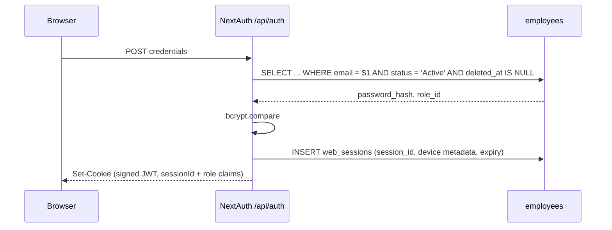

# Authentication

**Two independent auth systems**, by design. Web uses NextAuth cookies; mobile uses bearer JWTs. They share only the `employees` credential store.

## Web: NextAuth v4 — CONFIRMED

Credentials provider, signed JWT transport with a server-backed `web_sessions`
record, and `bcryptjs` compare against `employees.password_hash`. The JWT only
identifies the session row (`sessionId`); every API request rechecks ownership,
expiry, revocation, employee status, role, and `auth_version`.



Role lands in the JWT claims for landing/UI purposes. API authorization does a
live employee lookup before applying the route role list, so a stale claim cannot
survive a disablement or demotion.

**Production Edge & CORS Proxy Awareness:** `src/proxy.js` validates `Origin` headers on POST login requests against dynamic same-origin identifiers (`request.nextUrl.origin`, `Host`, `X-Forwarded-Host`) and deployment domains (`NEXT_PUBLIC_APP_URL`, `NEXTAUTH_URL`, `VERCEL_URL`). Non-OPTIONS 403 rejections return structured JSON `{ error: "Forbidden: origin not allowed" }` rather than empty null bodies to prevent client-side `Unexpected end of JSON input` syntax errors. `signIn` in `src/services/auth.service.js` translates any low-level JSON parser failures into user-friendly diagnostic guidance.

## Mobile: separate bearer JWT — CONFIRMED

`jose`, HS256. Two token types with **different audiences**:

| Token | Lifetime | Storage |
|---|---|---|
| Access | 15 minutes, checked against its active refresh family | memory / expo-secure-store |
| Refresh | 30 days, **single-use rotating** | SHA-256 **hashed** in `mobile_refresh_tokens`, grouped by a family UUID with device metadata |

Three properties worth naming:

1. **Refresh tokens are hashed at rest.** A DB read doesn't yield usable tokens.
2. **Single-use rotation.** Presenting a refresh token invalidates it and issues a new one — replay is detectable.
3. **The audience split is the actual security control.** A refresh token cannot be presented as an access token, because audience is verified. Without that, a 30-day token would be a 30-day API key.

Each access token also carries its refresh `family_id`. Revoking one device
family (or all mobile families) therefore invalidates its access token on the
next API request instead of waiting for the 15-minute expiry.

→ [[Token Rotation And Refresh Races]]

## The gate: `requireAuth()` — CONFIRMED

Everything hangs off `src/lib/api/utils.js`:

```js
const DEFAULT_ROLES = ["system_admin", "admin", "fleet_manager", "dispatcher", "management"];

resolveIdentity(req)   // Bearer token WINS over cookie session
requireAuth(req, allowedRoles = DEFAULT_ROLES)
requirePermission(req, resource, action) // derives roles from permissions.js
requireDriver(req)     // requireAuth(req, ["driver"]) + guarantees driverId
```

**`driver` is deliberately absent from `DEFAULT_ROLES`.** Any route that forgets to pass explicit roles therefore **fails closed for drivers** — the most likely-to-be-abused role is excluded by default. That is a genuinely good default. → [[Fail Closed By Default]]

`resolveIdentity` preferring Bearer over cookie matters when both are present (e.g. a driver's browser session plus a mobile token) — the explicit credential wins.

## Where auth is NOT — CONFIRMED

| Place you'd look | Reality |
|---|---|
| `src/middleware.js` | **Doesn't exist.** Next 16 renamed it. → [[DOC SYSTEM.md References middleware.js]] |
| `src/proxy.js` | CORS preflight only. **No auth.** |
| `proxy.js` (root) | Dead file implying Supabase Auth. → [[BUG Root proxy.js Is Dead Code]] |
| RLS policies | 69 of them, all inert. → [[Why RLS Is Not A Boundary]] |

**Every exported route method is checked by `scripts/verify-route-auth.mjs`.**
There is no central Next.js auth middleware; the guarantee remains per-route
discipline, with the static method-level audit catching a forgotten guard before
CI accepts it.

`npm run verify:auth` scans 218 exported methods, recognizes explicit
service-token delegations and public protocol endpoints, and rejects bare
`requireAuth(req)` on every mutating handler.

## Password recovery & reset — CONFIRMED (2026-08-20)

All credential-change paths are **server-side**; nothing writes `employees` from the browser anymore. The old anon-key escalation is gone.

- `auth.service.js` previously called Supabase `signUp`/`resetPassword`/`updatePassword` through the **browser anon client**. Migration 009 let that anon key `INSERT`/`SELECT` on `employees`, and the default grants went further (`UPDATE`/`DELETE`) — **anyone with the public anon key could insert a `system_admin` or overwrite a password hash**. Migration 060 dropped the 009 policies and `REVOKE ALL`d `anon`; verified live (`pg_policies` + `role_table_grants` both empty for `anon` on `employees`).
- `signUp`/`resetPassword`/`updatePassword` were **deleted** from `auth.service.js`; it no longer imports the anon `createClient`. Credential mutation lives in three routes:
  - `POST /api/auth/change-password` — session-bound, pre-existing.
  - `POST /api/auth/forgot-password` — **public** but rate-limited (per-IP + per-email, 5/60s), identical generic response whether or not the email exists (no enumeration), no email is actually sent yet.
  - `POST /api/auth/reset-password` — `requireAuth`, employee derived from the session (never the body), rate-limited, wipes the employee's `mobile_refresh_tokens` so a leaked mobile session dies too.
- `POST /api/mobile/auth/login` is now throttled **per-IP and per-account** (5/60s, 429 + `Retry-After`), mirroring the web Credentials provider — previously it ran unlimited bcrypt compares.
- Seeded `admin123` credential from migration 008 was a **real account takeover**: migration 061 NULLs the known hash where it still matches, and the live `admin@fleetops.com` password was **rotated** to a fresh strong hash (cost 10). Decision: keep the account, rotate the credential.

## Credential and session lifecycle — CONFIRMED (2026-09-02)

The 2026-08-20 recovery description above is the historical baseline. Current
behavior is:

- `employees.auth_version` is included in NextAuth and mobile token claims and
  compared against the live employee row by `resolveIdentity()`. Password,
  email, role, and account-status changes increment it, so stale web sessions
  and mobile access tokens receive `401 Session expired` without waiting for
  their normal expiry.
- Password changes and email changes run their credential update and mobile/reset
  token revocation in a transaction. Driver-account password setup and account
  disablement revoke the same token classes. Password changes return
  `signInRequired: true`; the web settings screens sign the operator out.
- `POST /api/auth/reset-token` is restricted to `admin`/`system_admin` and issues
  a 30-minute one-time link. Only a SHA-256 token hash is stored. The reset page
  consumes the token without an employee id, marks it used, revokes other reset
  and mobile tokens, and requires a fresh sign-in afterward.
- `POST /api/auth/forgot-password` deliberately remains a uniform contact-admin
  response until a verified email delivery provider is selected. It does not
  claim that an email was sent.
- Authentication, session, and MFA events are written to `audit_logs` without storing
  passwords, cookies, bearer tokens, OTPs, recovery codes, or plaintext TOTP secrets. PostgreSQL-backed
  IP/account rate-limit buckets are shared across app instances and fail closed
  when the database is unavailable.
- Mobile refresh rotation uses one transaction, a family UUID, single-use rows,
  and family revocation on replay. The login path opportunistically removes
  expired and long-revoked rows; `/api/mobile/auth/logout` supports the existing
  `allDevices` flag.

Verified email delivery and scheduled pruning remain explicitly unimplemented
until their provider or deployment decisions are made.

## Driver credential screens on mobile — CONFIRMED (2026-09-13)

No new backend route: the three mobile screens reuse the existing
credential endpoints, which already authorize mobile bearer tokens.

- **Change** (`mobile/app/(app)/profile/change-password.js`, via Profile →
  Privacy & Security): `POST /api/auth/change-password` accepts any role and
  `resolveIdentity()` prefers Bearer over cookie, so the driver's access token
  authorizes directly. Success carries `signInRequired: true` — the app signs
  out (offline cache cleared before SecureStore, per the `auth.js` ordering)
  and returns to login, mirroring web Settings > Security.
- **Forgot** (`mobile/app/forgot-password.js`, public, linked from login):
  `POST /api/auth/forgot-password` with `skipAuth`; renders the generic
  contact-admin message verbatim (no enumeration, no email sent).
- **Reset** (`mobile/app/reset-password.js`, public, paste-the-code): the
  token mode of `POST /api/auth/reset-password` (`{ token, newPassword }`,
  `skipAuth`) consumes the administrator-issued 30-minute single-use code.
  A deep link for the web `reset-password?token=` URL is a follow-up.
- **Policy enforcement is two-layered.** Client: pure
  `mobile/lib/password-validation.js` (min 8, lower + upper + number +
  special, ≤72 UTF-8 bytes, new-must-differ, confirm-must-match) blocks submit
  on both screens with a live checklist. Server: both routes validate
  `newPassword` as `type: "password"`, so a bypassed client still cannot set a
  weak password. `password-validation.test.js` locks client≡server parity by
  importing `isPassword`/`isPasswordByteLengthAllowed` from
  `src/lib/validation/index.js` and asserting identical verdicts on an
  adversarial corpus plus 2000 deterministic fuzz passwords.
- **Never queued.** All three mutations pass `queueOnFailure: false` — a
  credential change the server has not confirmed is not a change; offline the
  driver gets a plain connection error (the global banner speaks for it).

Verified: mobile suite 129/129, ESLint clean on all 7 touched files,
`npm run verify:auth` 261/261 (no new backend surface). Physical-device E2E
(airplane-mode errors, post-change forced re-login, admin-code reset) pending.

## TOTP MFA and session management — CONFIRMED (2026-09-02)

- Settings > Security starts enrollment only after the current password is
  verified, returns an `otpauth://` URI/QR code, and requires a first six-digit
  TOTP before enabling the factor. Secrets are encrypted with AES-256-GCM in
  `employee_mfa`; production requires `MFA_ENCRYPTION_KEY`.
- Ten recovery codes are generated on enable or regeneration. Only SHA-256
  hashes are stored, each code is atomically single-use, and plaintext codes
  are returned once to the already-authenticated operator.
- TOTP verification uses the RFC 6238-compatible `otpauth` package with a
  30-second period, six digits, ±1 step skew, and `last_used_step` replay
  protection. Enrollment generates secrets with the v9-compatible
  `new Secret().base32` API, and MFA attempts have independent IP/account
  throttles.
- Web and mobile credential exchanges check the enrolled factor before issuing
  a session. Missing/invalid factors never create a web session or mobile token.
- Enabling/disabling MFA increments `auth_version` and revokes all web/mobile
  sessions. Password/email/role/account changes use the same revocation path.
- `web_sessions` records safe device metadata and bounded activity. The
  owner-scoped sessions API can list, revoke one, or revoke all other sessions;
  mobile refresh families are grouped as one device entry. Session listing includes 
  an approximate physical location derived from the IP address using `geoip-lite`, 
  and accurately identifies the current device for both web (`sessionId`) and mobile (`familyId`) contexts.

## Session idle timeout and expiration UX — CONFIRMED (2026-09-02, revised 2026-09-18)

- **Idle timeout**: **5 minutes** (`last_seen_at + 300s`). Migration `089_session_idle_timeout.sql` added `web_sessions.idle_timeout_seconds` defaulting to `3600`; migration `113_session_idle_timeout_5min.sql` lowers the column default to `300`.
- **Absolute expiration**: 12-hour hard maximum (`expires_at`), computed at login and never extended.
- **Server authority**: `resolveCurrentIdentity()` independently validates both `expires_at > NOW()` and `last_seen_at + idle_timeout_seconds > NOW()`. Idle expiration throws `SESSION_IDLE_TIMEOUT` with HTTP 401; 12-hour expiration throws `SESSION_EXPIRED`; revoked sessions throw `SESSION_REVOKED`.
- **Identity resolution is read-only for session timing** (2026-09-18): `resolveCurrentIdentity()` must never write `last_seen_at`. See "The idle timeout that wasn't" below.
- **Single policy source**: `src/lib/auth/session-policy.js` holds the constants. It is dependency-free precisely so the `"use client"` session manager can import it — `lib/auth/sessions.js` pulls in `@/lib/db` and `geoip-lite` and cannot be imported from a client component, which is why the client used to keep its own hand-copied literals. `sessions.js` re-exports for existing server importers.
- **Derived, not copied**: the warning window is 20% of the idle window capped at 5 minutes (60s at the current policy), and the heartbeat interval is half the idle window. Both are computed from `IDLE_TIMEOUT_SECONDS` so they cannot collide with it again (see below).
- **Heartbeat & human activity**: `GET/POST /api/auth/heartbeat`. `POST` is the **only** writer of `last_seen_at`. The frontend monitors DOM events (`click`, `keydown`, `touchstart`, `pointerdown`) and slides the deadline as soon as activity occurs, throttled by `ACTIVITY_HEARTBEAT_MIN_GAP_SECONDS` (60s) so typing does not produce a write per keystroke; a periodic tick at half the idle window is a backstop for missed events.
- **Stay signed in**: Issues a forced `POST /api/auth/heartbeat` (bypassing the throttle, since the user explicitly asked) to slide `last_seen_at` and the idle deadline by 5 minutes; the 12-hour maximum remains unchanged.
- **Warning UX**: A double-bezel modal appears 60 seconds before idle expiry and 5 minutes before absolute expiry (11h55m). Error toasts are suppressed (`setSuppressAuthToasts(true)`) while any session modal is open. The idle-warning primary action takes focus; the modal copy derives its duration from the policy constant rather than stating "1 hour".
- **Multi-tab synchronization**: `BroadcastChannel("fleetops_session_bus")` broadcasts auth failures, session extensions, and explicit logouts across open tabs.
- **Return-to-route protection**: `sessionStorage` preserves the user's current route across re-authentication, strictly validated against open-redirect and protocol vulnerabilities via `isValidInternalPath()`.
- **Client fetch interceptor scoping (`SessionManagerProvider`)**: The global 401 interceptor in `src/context/session-manager.jsx` is strictly scoped via `isAppApiRequest()` to app `/api/` endpoints (excluding internal Next.js RSC payload requests, `_next`, and auth status checks like `/api/auth/session`). It guarantees a valid Window invocation context (`this || window`) and prevents duplicate nesting across StrictMode remounts via `window.__fleetops_fetch_intercepted`.
- **CORS proxy development flexibility (`src/proxy.js`)**: In development (`NODE_ENV !== "production"`), `src/proxy.js` allows loopback (`localhost`, `127.0.0.1`, `::1`) and local LAN origins (`192.168.*`, `10.*`), echoing the allowed origin in `Access-Control-Allow-Origin` so dev traffic across different local addresses is not rejected with 403. Production remains strictly fail-closed to `NEXT_PUBLIC_APP_URL`.

## The idle timeout that wasn't — FIXED (2026-09-18)

For three weeks the dashboard advertised a 1-hour idle timeout that **could not fire**.

`resolveCurrentIdentity()` (`src/lib/api/utils.js`) slid `web_sessions.last_seen_at` on **any** authenticated request whose `last_seen_at` was more than 5 minutes stale. That write was not gated on human activity. The dashboard polls constantly — `app-shell.jsx` hits four sidebar-count endpoints every 30s on *every* dashboard page, plus live map at 15–30s, dispatch plan at 10s, notifications at 15s, two of them with `refetchIntervalInBackground: true` so they keep going with the window minimized.

Net effect: `last_seen_at` was refreshed roughly every 5.5 minutes by a browser nobody was touching, so `last_seen_at + 3600` never elapsed. **The effective web idle timeout was absent; only the 12-hour absolute cap ever fired.** The client's human-activity gate controlled the heartbeat POST only — it never constrained the server deadline, because the server was moving it anyway.

This note previously claimed "Background polling (dispatch boards, notifications) does not touch the human-activity flag". That was true of the *client flag* and false about the *server deadline*, which is the one that matters. Worth remembering as a class of error: a security control can be defeated by an adapter layer that never appears in the same file as the control.

**The fix** (three parts, all required):

1. **Deleted the auto-slide.** `resolveCurrentIdentity()` is now read-only for session timing; `POST /api/auth/heartbeat` is the only writer of `last_seen_at`. Pinned by a structural guard in `src/security-boundaries.test.js` that reads the source and asserts no `UPDATE web_sessions SET last_seen_at` exists there.
2. **Made the heartbeat reflect real activity.** The client used to only *sample* its activity flag every 5 minutes, so activity could be 5 minutes stale and the modal could fire at someone who was actively working. Activity now slides the deadline immediately, throttled to one write per minute.
3. **Derived the dependent constants** from `IDLE_TIMEOUT_SECONDS` instead of hand-copying 300s into five places.

**Why the naive change would have broken it.** Dropping `3600 → 300` without part 3 collides three separate 300s values: the client's `IDLE_WARNING_MS` would equal the whole timeout window (the modal appears at login and never dismisses, because the healthy branch requires `remainingIdle > 300000`), and the server's 5-minute slide throttle would sit exactly on the 5-minute idle deadline, making whether a poll is accepted or rejected a sub-second race. The invariant tests in `src/lib/auth/idle-session.test.js` exist to catch that class of collision.

**Trade-off accepted.** 5 minutes is aggressive for operator work — a dispatcher on a live map or a manager on a long form can lose unsaved state (`saveReturnTo()` preserves the route, not the form). Mitigated by the 60s warning and the immediate slide on activity; reversal is one constant plus the migration default. Strict enforcement was chosen deliberately over a "slide on mutating requests" safety net, which would have been a near-free backstop but leaves an hour of read-only work counting as idle.

→ [[Token Rotation And Refresh Races]] · [[Decision Log]]

## Login-first landing & client guard split — CONFIRMED (2026-09-05)

`/` is a server component (`src/app/page.js`) that redirects via `auth()`:
no session → `/login`, driver → `/driver`, other staff → `/dashboard`.
No `Loading...`, no dashboard-chrome flash.

The client guard (`useRequireRole()` in `src/lib/auth/role-guard.js` +
`RouteGuard`/`DashboardLayout` in `src/components/layout/dashboard-layout.jsx`)
distinguishes three states — `employee` is null only when there is no session:

- **loading** → wait, shell withheld.
- **no session** → `saveReturnTo()` + `router.replace("/login")`; `RouteGuard`
  renders null (auth-neutral) and `DashboardLayout` withholds `Sidebar`/`TopNav`
  until a session exists, so logged-out deep-route visits never flash dashboard
  chrome and never show the access-denied panel. The protected tree is never
  rendered shell-less.
- **session without role** → renders the role-not-configured card, never
  `/login` (that would loop: login → same session → guard → login).
- **wrong role** → role home (`/driver` or `/dashboard`) with the
  access-restricted panel while the redirect fires.

## Security hardening batch 1 — UNCOMMITTED (2026-09-16)

- **Client/server password parity:** `createUserSchema` (`src/lib/validation/schemas.js`) now refines with the shared `isPassword` rule instead of `min(6)`. The register route already enforced the strong rule; the form no longer accepts what the server rejects. Locked by `src/lib/validation/schemas.test.js`.
- **Account lockout:** `src/lib/auth/account-lockout.js` (`LOCKOUT_LIMIT = 10`, `LOCKOUT_WINDOW_MS = 15 min`) on the existing `auth_rate_limits` buckets — no migration. Web `authorize` peeks before bcrypt (throws `ACCOUNT_LOCKED:<seconds>`), records on bad password, clears on success; mobile login mirrors it with the existing 429 + `Retry-After` shape. Non-driver/missing-link rejections are not counted.
- **Edge throttle:** `src/lib/edge-throttle.js` (600 req/min/IP, in-memory, fail-open by design — availability guard, not credential guard) wired in `src/proxy.js` after the CORS checks.
- **Security alerts:** `raiseSecurityAlert` (`src/lib/auth/security-alerts.js`) writes `security_alert` audit rows for `account_locked` and `token_replay` (refresh-family replay wipe); admin-only `GET /api/system/security-alerts` (`reports/read`) returns the latest 50. Dashboard widget and push delivery are explicit follow-ups.
- **Dead guard removed:** `src/lib/auth/api-auth.js` (`withRole`/`requireRole`, zero callers, stale-role trust) deleted.
- **Pre-existing defects observed but NOT fixed in this batch:** (1) `isSafeAvatarUrl` is declared inside `authorize()` yet called from the `jwt` callback (`src/lib/auth.js`, eslint `no-undef` x2, present on `main`) — needs a module-scope move; (2) `AssignmentsHeading` in `mobile/components/home/DriverHomeCards.jsx` contains an unclosed old return plus a duplicate `const { colors }` (present on `main`) — file cannot parse as committed.
- **Follow-up fix (2026-09-16, implemented, uncommitted):** both defects above are now fixed — `isSafeAvatarUrl` moved back to module scope in `src/lib/auth.js` (lint clean, auth tests + `verify:auth` 270/0 green), and `AssignmentsHeading` in `DriverHomeCards.jsx` reduced to the single current implementation (duplicate import, stale return block, and duplicate `scheduleLink` style key removed; file lints clean).
- **Login lockout UX (2026-09-16, implemented, uncommitted):** wrong-password failures now read `Incorrect email or password. Please check and try again.` (raw `CredentialsSignin` never surfaces). `GET /api/auth/login-status?email=` also peeks the per-account lockout bucket (unlocked accounts always answer `locked:false`, so it stays enumeration-safe) and the login page shows a live `50, 49, 48…` countdown with submit blocked until it reaches zero, then `The temporary lock has lifted — you can try signing in again.`

## Related

[[RBAC]] · [[employees]] · [[Mobile Architecture]] · [[Why RLS Is Not A Boundary]] · [[Architecture]] · [[Backend]]
