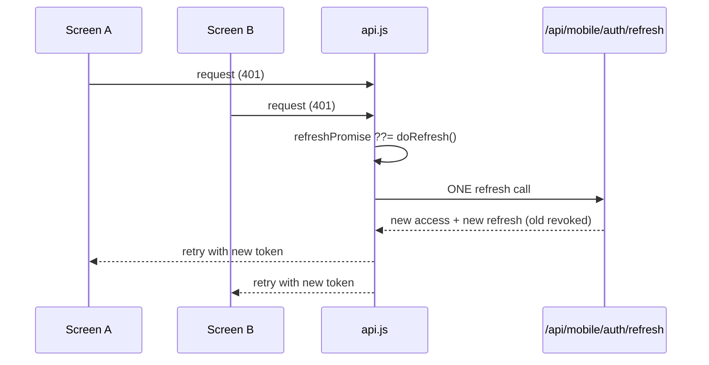

# Mobile Architecture

Expo SDK ~54, expo-router ~6. **Drivers only.** A separate app with a separate auth system, not a wrapper around the web dashboard.

## Navigation — CONFIRMED (`mobile/app/(app)/(tabs)/_layout.js`)

Visible tab order = declaration order (2026-09-10: explicit `trips` entry added — it previously auto-registered with no icon and landed out of order):

| Route | Label | Visible |
|---|---|---|
| `index` | Home | yes |
| `map` | Map | yes |
| `fuel_action` | (center scan FAB, no label) | yes |
| `trips` | Trips (navigate icon) | yes |
| `profile` | Profile | yes |
| `history` | — (`href: null`) | no |
| `notifications` | Alerts (via header bell) | no |
| `vehicle` | — (`href: null`, via Profile) | no |

**2026-09-13 Map presentation:** While Map is selected, the shared tab bar hides its scan button, wave and spacer, leaving Home / Map / Trips / Profile below the standby weather. Other tabs retain scan. The map shares the bar's bottom-offset function for safe-area separation.

Shared tab language: icons 24px (focused/outline pairs), labels 11px `bodyMedium`, item height 48, equal `flex: 1` slots; scan FAB is a 56px raised circle (`raisedControl`) centered in its slot.

Three separate documents describe these tabs differently, all wrong. → [[DOC Mobile Tabs Documented Three Ways]]

## The API client is the most carefully-written file in the mobile app — CONFIRMED

`mobile/lib/api.js`: `TIMEOUT_MS = 30000`, `MAX_RETRIES = 1`, and a **single-flight refresh promise**. From its docstring:

> *"Without this, a screen firing three requests at once on a stale token would run three refreshes; because refresh is single-use and rotating, the first would succeed and the other two would present an already-revoked token and log the driver out."*

That is a precise description of a real race. The fix — one shared in-flight refresh promise that all callers await — is the standard solution, and the comment explains *why* it's needed rather than just what it does.

→ [[Token Rotation And Refresh Races]]

## Local API reachability — CONFIRMED (2026-09-19)

`EXPO_PUBLIC_API_URL` is bundled into the Expo client. For a physical phone,
it must use the computer's current LAN IP and the running Next server's port
(the local default is `3000`); `localhost` points back to the phone. The API
server must be started separately from the repository root with `npm run dev`.
After changing `.env`, reload Expo so the public variable is re-inlined. EAS
preview/production profiles use the HTTPS deployment URL instead. A stale
ignored mobile `.env` LAN address was verified to time out while the current
address returned the API's normal HTTP response.

## Session management — CONFIRMED (2026-09-19)

The mobile **Devices & Sessions** screen lists active web session IDs and
mobile refresh-token families. A family ID, not an IP address, identifies a
session: shared Wi-Fi, carrier NAT, and VPNs can put multiple devices behind
the same public IP, so matching IPs must remain separate rows. The screen
reports active sessions, uses `kind:id` keys, and sends `DELETE /api/auth/sessions`
to revoke the selected session. Revoking the current mobile family is followed
by local token/cache cleanup before returning to sign-in. The confirmation
action uses the concise `Revoke` label.

## Home route preview — CONFIRMED (2026-09-19)

The primary Home assignment card uses the existing deferred TomTom WebView
preview so the pickup-to-drop-off road line is rendered. Secondary assignment
cards keep the native static-image preview to avoid mounting multiple WebViews;
the interactive preview is limited to one card per Home render.

## GPS tracking — CONFIRMED

**Foreground** (`mobile/lib/tracking.js`):
- `watchPositionAsync({ accuracy: Balanced, distanceInterval: 10 })` writes to a ref
- A separate interval POSTs the latest fix every **30 s** to `/api/mobile/driver/trips/${tripId}/gps`

**Background** (`mobile/lib/background-tracking.js`, added 2026-08-19): a `expo-task-manager` task (`fleetops-background-location`) posts GPS and accumulates per-leg km while the app is backgrounded during an active trip. `map.js` starts it on background via `AppState` and stops + merges km on return, so the two never overlap (no double-counted km, no duplicate posts). The foreground watcher remains the source of truth. → [[ADR-011 Background GPS Tracking]]

**Decoupling the sensor from the upload is the right shape**: position updates arrive at whatever rate the GPS produces them, but network traffic is bounded at one request per 30 s.

Background tracking **requires a custom dev build** (not Expo Go) — see the "Version warning" note below — and Android production release needs Play Store review. The old foreground-only decision is superseded: [[ADR-010 Foreground Only GPS]] → [[ADR-011 Background GPS Tracking]].

## Client-side role decoding — CONFIRMED (`mobile/lib/rbac.js`)

`decodeJwtRole()` base64url-decodes the JWT payload **without verifying the signature**. The docstring is explicit:

> *"signature verification stays server-side, so this is for reading claims, not trusting them."*

This is correct practice, correctly documented: the client decodes to decide what to *render*; the server verifies to decide what to *allow*. A forged local token changes the UI and nothing else. → [[Client Side Role Decoding Is Not Security]]

## Auth

Separate from web — 15-minute access tokens, 30-day single-use rotating refresh tokens hashed in `mobile_refresh_tokens`, audience-split. Full detail in [[Authentication]].

## Profile screens share the web driver endpoint — CONFIRMED (`mobile/app/(app)/profile/*.js`)

The profile sub-screens (personal, license, safety, vehicle) call **`/api/driver/me`** — the same endpoint as the web driver home — not `/api/mobile/driver/me`. That is deliberate: `DRIVER_VISIBLE_SECTIONS` / `DRIVER_SELF_EDITABLE_FIELDS` live in `src/lib/consent/driver-visibility.js`, and both surfaces reading one response keeps web and mobile views identical. The mobile-native endpoint only covers identity + active trip. Full scan-upload flow: [[Driver Consent]].

## Driver credential screens — CONFIRMED (2026-09-13)

Drivers change and recover passwords without the web dashboard, reusing the
existing credential endpoints (no new backend route — full detail in
[[Authentication]]):

- **Change** (`(app)/profile/change-password.js`): top row of Profile →
  Privacy & Security. Same `POST /api/auth/change-password` as web Settings >
  Security; success signs out (cache cleared before SecureStore) and returns
  to login on the `signInRequired` contract.
- **Recovery** (public, outside the `(app)` guard like login): `forgot-password.js`
  (email → generic server message; a reset link + paste-able code is emailed
  when SMTP delivery is configured, administrator wording otherwise) and
  `reset-password.js` (30-min single-use code + new password), linked from a new
  "Forgot password?" entry on `login.js`. Paste-the-code — no deep-link config.
- **Policy + offline rules (locked):** one pure validator
  (`mobile/lib/password-validation.js`, client≡server parity fuzz-pinned)
  drives both screens' live checklists and submit gates; every credential
  mutation uses `queueOnFailure: false` — never queued, offline is a plain
  connection error under the global banner. Profile/Settings stay silent about
  caching per the Offline Read Mode UX rule.

## OS permission registry — CONFIRMED (`mobile/lib/permissions.js`)

All five device permissions (foreground/background location, camera, photo library, notifications) are declared once in a registry with normalized `{ status, canAskAgain }`. Both the onboarding gate and Settings → PERMISSIONS consume it; see [[Driver Consent]] for the full behavior. Background location is listed as its own row (Android's "Allow all the time" is distinct from "While using"; iOS has no separate toggle).

## Version warning — CONFIRMED

`mobile/AGENTS.md`: *"Expo HAS CHANGED — read the exact versioned docs at https://docs.expo.dev/versions/v57.0.0/ before writing any code."*

Same trap as [[Framework Version Drift]] on the web side.

**Dev-build implication:** background location ([[ADR-011 Background GPS Tracking]]) is not available in Expo Go — it needs a custom build. Since `expo prebuild --clean` on 2026-08-19, `android/` carries the background-location permissions and config, but the installed app on a device still needs a rebuild + reinstall.

## Connectivity UX — PR #3.1 (2026-09-08)

Driver-only global connectivity status, mounted once in `mobile/app/(app)/_layout.js` as a layout-participating sibling above the `Stack` (inside `ConnectivityProvider`, inside the existing `NotificationFeedProvider`). The layout's driver-session + consent guards redirect before it, so it never renders on login/consent/setup screens. It pushes content down — map controls and bottom tabs are never covered — and renders nothing when healthy.

- **Dependency:** `@react-native-community/netinfo@11.4.1` via `npx expo install` (SDK 54-compatible). No other new dependencies.
- **State model** (`mobile/lib/connectivity-state.js`, pure + unit-tested): `online | unstable | offline | syncing` from NetInfo reachability + API transport-failure evidence (≥3 in 60 s → unstable; `isConnected`/`isInternetReachable` false → offline). 401/403/5xx never count; one success decisively clears; isolated failures never flicker. Context exposes `{status, isConnected, isInternetReachable, pendingCount, lastSyncedAt, lastFailureAt, lastSuccessAt}` plus transient `phase` (`recovered`/`synced`).
- **Sequence:** healthy → invisible; trouble → "Connection unstable"; no internet → "You're offline" + "N queued" badge; offline with live trip tracking → "Offline · GPS still recording / Dispatcher may see your last synced location" (only when the poster is genuinely feeding the current trip — never inferred); recovery → "Back online" + "Syncing N updates…"; queue drained to zero → "All updates synced" → auto-dismiss.
- **Queued-action UX:** `wasQueued()` helper (`mobile/lib/api.js`); trip transitions and completions that land in the outbox announce "Saved for sync / This update will be sent when you're online" instead of implying server confirmation. Advance/queue mechanics unchanged. Screens that already branched on `{queued:true}` (SOS, fuel, inspection, incidents) untouched.
- **Dedup follow-up:** Home + Trips list `load()` catches suppress inline `ErrorNotice` for transport failures only (`isTransportFailure`, now housed in the pure `connectivity-state.js` and re-exported from `api.js`) — the global banner already speaks for them. Genuine errors still surface; stale lists stay visible offline.
- **Reconnect auth hardening (driver-reported transient "session" warning, never an actual logout):** refresh POST retries once on transport failure (server 1-min grace covers the duplicate); 429 from refresh throws retryable instead of `clearAll()` + logout; a replay that 401s after a rotation gets one more refresh+replay before surfacing. Covered by `mobile/lib/api-refresh.test.js` (burst single-flight, second chance, 429-no-logout, refresh retry ×2).
- **Cold-start tolerance:** Home + Trips `load()` auto-retries once (1.5 s) for transient failures via pure `shouldAutoRetry` (transport, 401, 429, 5xx — never 400/403/404) before showing anything. The manual Retry tap the driver used to need is now automatic.
- **Forced-logout root cause (DB forensics 2026-09-08):** one family showed 63 rotations then a full wipe — the foreground poster and the background GPS task run in SEPARATE JS contexts with independent single-flights, alternating grace-rotations until one landed outside grace. Fix: `ROTATION_COOLDOWN_SECONDS = 10` in POST `/api/mobile/auth/refresh` — a family rotated seconds ago gets a stateless 429 with zero writes (covered by `refresh/route.test.js`: cooldown 429, normal rotation, genuine-replay wipe pinned).
- **429 silence follow-up (driver-visible "too many requests" on Home):** both 429 paths now carry `retry_after`; the client waits once per the hint (cap 10 s) and retries once silently — only a second consecutive 429 surfaces, session intact. Covered by `api-refresh.test.js` (+2). Full suite 714 passing.
- **Untouched:** trip lifecycle, auth/refresh/queue semantics, GPS lifecycle, PR #1–#3 logic, geofence rules. Tap detail sheet deferred.
- **Verified:** `connectivity-state.test.js` (8), full suite 686 passing, eslint warning-clean, `expo export -p android` bundles 1333 modules. Physical-device checklist (airplane-mode, drain, dark mode, map overlap, background→foreground) still requires a device — not claimed.

## Offline Read Mode (2026-09-08)

Stale-while-revalidate for the 6 core driver screens in one PR: Trips, History (shares the Trips `TRIPS_ALL` snapshot), Trip Detail (list-cache-first + per-trip `trip:{id}` key), Work Schedule (days/leaves/balances cached independently — one failing never blanks the rest), Activity Logs (submissions + inspections cached independently, rejected sources keep prior state instead of blanking to `[]`), Home (`HOME_TRIPS` + `DRIVER_ME`).

- **Foundation** (`mobile/lib/offline-cache.js`, no new dependencies): entries are `{ data, syncedAt }`, no TTL — last-good kept indefinitely. Every cache call takes an explicit `driverId` (`resolveDriverId`: `employeeId ?? driverId ?? employee_id ?? id ?? driver_id`); the module never imports storage/auth, so no circular dependency. Logout/session-death order is remember-driverId → `clearOfflineCache(driverId)` → `clearAll()` (orchestrated in `auth.js signOut` and a `clearSession()` helper in `api.js` covering both refresh-failure paths) — driver B on a shared phone never sees driver A's trips.
- **camelCase namespace bug (fixed 2026-09-08, same day):** the login route returns `{ driverId, employeeId, … }` camelCase and `signIn` stores it verbatim, but `resolveDriverId` checked only snake_case — it returned null for every real login, so the cache was never written NOR read on any screen (and `clearOfflineCache` was dead code). The unit tests fed snake_case shapes only, which is exactly how it slipped through. Fix: camelCase first (employeeId preferred — stable server identity matching the logout/login namespace), snake_case kept as fallback for hand-shaped fixtures. Regression-pinned by a test using the exact login-response shape. Lesson: when a resolver dispatches on payload shape, test it against the *wire* shape it actually receives, not the shape you imagined.
- **4-state offline UX (all 6 cached screens, shared implementation):** logic in the pure, unit-tested `mobile/lib/offline-ux.js` (`offlineViewState` for single-source screens; `combineOfflineSources` for multi-source), visuals in `mobile/components/OfflineStates.jsx` (`SyncNote` + `SavedChip` + `NeverSyncedCard`) — the same two pieces every screen consumes, work-schedule.js included (its local styles were folded into the shared components). State table (locked):
  - **data** (items exist) → normal; offline → one inline "Using your last synced {label} for offline access." note + `Saved · {age}` chip. ONE note per screen, never per row/bucket.
  - **empty-confirmed** (`syncedAt != null`, zero items — the server answered, even with `[]`) → online: "No X assigned right now."; offline: "No X were assigned when last synced." + Saved chip — a snapshot is not a current-truth claim.
  - **never-synced** (offline, `syncedAt == null`) → dedicated `NeverSyncedCard` ("Connect once…"), never rows/skeletons/fabricated shells pretending to be data.
  - **empty-unconfirmed** (ONLINE, `syncedAt == null` — fetch never confirmed) → "X couldn't be confirmed right now. Pull to refresh or try again." — never "Connect once", the device IS connected.
  - **partial** (multi-source only: some sources answered, some not) → "Some offline activity may be unavailable. Reconnect to refresh all activity logs." — one unanswered source forbids a confirmed-empty claim.
  - Honesty rules: confirmed-empty keys off per-source `syncedAt`, NEVER item count or a screen-wide `Math.min()`; filter-empty (data exists, active filter yields zero) is decided before the helper and keeps filter copy; `status: "unstable"` is treated as online (the amber banner speaks for it).
  - **Home hero correction:** "All clear / ready for new assignments" keys off `tripsSyncedAt` (HOME_TRIPS) alone — a cached DRIVER_ME profile proves nothing about assignments. Offline never-synced renders "No saved trips yet / Connect once…" with an Offline chip; offline confirmed-empty reads "All clear when last synced".
  - **Trip Detail:** offline + never-synced now renders `NeverSyncedCard` ("Trip not saved for offline") instead of the old fabricated `{trip_status: "Completed"}` shell. The ONLINE not-found fallback still fabricates that shell — logged as a follow-up in [[Current State]], out of this slice.
- **Staleness lives in the one global banner** (`mobile/components/ConnectivityBanner.jsx` reads the existing `lastSuccessAt` from `useConnectivity()` and formats it with the shared pure `formatLastSynced()`): offline → "Last synced {12 min ago / 3h ago / yesterday at 4:32 PM} · Showing saved data. Updates will sync automatically." (GPS variant keeps its recording copy + age; unstable appends age; never-synced sessions keep the generic copy). No per-screen badge — an earlier `OfflineCacheBadge` was removed for stacking a redundant second banner under the global one. Never-synced devices get a "connect once" empty state per screen instead of a blank page.
- **Authority safeguard (locked):** cache is display-only — it fills the same state the network would have, all trip gates/RBAC/server validation run unchanged. Offline actions still queue via `wasQueued()` → "Saved for sync"; server accept/reject on reconnect stands.
- **Offline driver context (2026-09-08, same-day follow-up):** Report Incident, Fuel Report, and Profile > Assigned Vehicle all need "what vehicle am I driving", but each did its own live fetch with a silent catch — offline meant a silently missing vehicle (and incidents.js used a **recent trip's** vehicle as fallback, which is not proof of a current assignment). Two new shared pieces:
  - `mobile/lib/driver-context.js` — pure resolver `resolveVehicleContext({ trip, trips, me, activeStatuses })` with the locked priority chain: **explicit trip → active trip vehicle (genuinely in-progress statuses) → standing assignment (`me.assignedVehicle`) → null** — NEVER a recent/finished trip's vehicle. `getCachedVehicleContext(driverId)` reads the caches the core screens already write (TRIPS_ALL, falling back to HOME_TRIPS, + DRIVER_ME), no network, never throws. Shape tolerance: trip rows and `/api/mobile/driver/me` are snake_case, `/api/driver/me`'s assignedVehicle is camelCase — both accepted and both pinned by wire-shape tests (`driver-context.test.js`, 12 tests, incl. the finished-trip anti-pattern). incidents.js and fuel-report.js now apply the cached resolution first, then revalidate live and re-warm the cache on success; fuel keeps its own non-terminal selection semantics (denylist of Completed/Cancelled) in both paths so offline and online pick the same vehicle.
  - `mobile/lib/driver-profile.js` — `useDriverProfile()` hook: cached DRIVER_ME read first, live `/api/driver/me` revalidate, cache write on success; on failure the cached profile stays and `onError` fires ONLY in the never-synced case. Consumed by the Profile tab and all four sub-screens (Personal Information, License & Compliance, Assigned Vehicle, Safety Settings) — replacing five copies of the same fetch+alert pattern. Personal Information no longer errors offline; the phone PATCH still requires a connection and refreshes the cache via `reload()` on success.
  - **UX rule (locked): Profile/Settings screens are SILENT about caching** — no SyncNote, no Saved chip, no never-synced card. The global connectivity banner is enough. Trips/Schedules/Logs need freshness indicators because they change operationally; a driver's own name/plate/license do not. Settings is device-local and works offline by nature (untouched). Server-dependent pages outside Profile (e.g. Logged-in Devices) are a separate slice.
- **Untouched:** write queue/retry semantics, incidents list, notifications history, map tiles, image bytes, GPS lifecycle, Settings screen.
- **Verified:** `offline-cache.test.js` (12) + `offline-ux.test.js` (9: single-source decision table incl. the online-empty-unconfirmed distinction, multi-source combiner incl. the partial state) + `driver-context.test.js` (12) — full mobile suite 65 passing, eslint warning-clean on all touched files, `expo export -p android` bundles clean (5 MB Hermes). Physical-device checklist (airplane-mode persistence across kill/relaunch, shared-phone driver switch E2E — the cross-driver clear is only now actually exercisable since resolveDriverId was null before) still requires a device — not claimed.

## Contextual Warnings — PR #4 Live Monitoring (2026-09-08)

Both GPS ingest routes (`/api/mobile/driver/trips/[id]/gps` and `/api/trips/[id]/locations`) now also return a `monitor` payload — the ingest-side `evaluatePingMonitor` verdict (off-route state, GPS health, traffic delay when already cached), computed **best-effort inside try/catch**: a banner failure can never fail the GPS write it describes. The foreground poster publishes it to screens exactly like the PR #3 geofence verdict — trip-id-tagged (`monitor` + `monitorTripId`) with the same staleness guard, so a finished trip's banner cannot linger onto the next assignment.

The map screen shows ONE calm banner while genuinely en route (gated to the en-route states, not at pickup/destination): "Route deviation detected / Check your navigation when safe." · "Heavy traffic ahead / Arrival may be delayed by about N min." (only from 5 min up, rounded) · "GPS updates delayed / Keep location access enabled." Derivation lives in the pure, RN-import-free `mobile/lib/monitor-banner.js` (priority: confirmed deviation > traffic > GPS delay; a single unconfirmed off-route observation or an unknown traffic value is silence) — re-exported by `tracking.js`, unit-tested by `monitor-banner.test.js` (5). No risk-level jargon, no dispatcher-style next-trip panic copy while driving; the driver's surface is this banner only, never the operational push (that goes to dispatch/fleet managers).

**Untouched:** GPS posting cadence, background task, geofence rules, connectivity banner, offline read mode. Full PR #4 architecture (engine, thresholds, durable alerts, APIs, web UI) → [[Tracking]].

## Related

[[Authentication]] · [[Tracking]] · [[Token Rotation And Refresh Races]] · [[Trips]] · [[Architecture]] · [[Driver Management]]

## PR 4.5 ? Context-aware dispatch (2026-09-13, implemented)

The existing global poster now owns foreground standby publication as well as trip/rescue posting. Profile adds clay duty controls backed by driverattendance. Standby is self-only, consented, paired, checked-in, session-validated and never queued offline. A fresh server acknowledgement drives the standby Live Tracking header; local map movement alone does not. Background standby remains out of scope. The existing carlive.png WebView marker and clay weather/navigation layout remain intact.

Verification and remaining device acceptance: [[PR 4.5 Context-Aware Dispatch Radar Implementation Plan#Implementation record ? 2026-09-13]]. Full suite: 1,140 passing tests; later focused checks: 37 passing tests; web build, Android export, route-auth audit and migration/query verification passed.

## Launch animation and startup optimization - 2026-09-14

The app previously played a five-second car Lottie at 1.2x, faded the launch overlay out over 360 ms, then faded/scaled the entire app in over another 620 ms. This could expose an empty intermediate frame and prolonged the opening sequence. The underlying navigator now stays rendered at its normal scale while one 240 ms native overlay fade reveals it. Touch and accessibility access to the underlying navigator remain disabled until launch completes.

The existing car artwork now plays once at 2.5x (about two seconds), with a 2.3-second fallback timer. The dial and wordmark settle earlier; the secondary location-beacon artwork holds a static frame instead of running a second Lottie loop. Motion waits for the OS reduced-motion preference, which uses a 150 ms hold and effectively immediate transition. Completion is guarded against duplicate events, cancelled car animations do not complete launch, and entrance animations stop on cleanup. Auth, consent, fonts and data loading retain their existing guards.

Direct imports load only the six font weights already used by the app. Verified Android export changed from 1,395 modules / 101 assets / 5.15 MB Hermes bundle to 1,373 modules / 79 assets / 5.13 MB; 22 unused font assets no longer enter the export. No typography or clay styling change and no dependency added.

Verification: two runnable launch-lifecycle tests passed (completion races, bounded timing, native/non-interaction flags, cleanup, pending/reduced-motion preferences); targeted ESLint passed; final Android Hermes export passed. No connected adb device was available, so physical-device cold-start duration, frame rate and light/dark appearance have not been measured. These are configured animation timings and bundle measurements, not a claimed FPS improvement. Native splash acceptance should be checked in a release build per the Expo splash-screen documentation: https://docs.expo.dev/versions/v57.0.0/sdk/splash-screen/ .

## Launch Screen & Startup Animation (2026-09-19, restored & verified)

The animated startup sequence in `mobile/components/LaunchScreen.js` plays the moving car Lottie composition (`mobile/assets/car animation.json`) inside the circular compass dial.
- **Animation timing**: Plays once at 2.2x speed with a 2,300 ms fallback safety timer (`launchHoldMs = 2300`), after which the launch overlay fades out smoothly over 240 ms.
- **Safety & Error Guards**: Completion is guarded against duplicate events, cancelled animations do not prematurely advance launch, and `onAnimationFailure` gracefully triggers completion. Motion respects the OS reduced-motion preference (`isReducedMotion`) using a 150 ms hold with immediate handoff.
- **Verification**: `mobile/lib/launch-animation.test.js` pins both the inclusion of `car animation.json` and the bounded timer duration ($\le 2300$ ms).

## Driver Avatar & Layered Fallback Architecture (2026-09-20, refined)

In `mobile/components/home/DriverHomeHeader.jsx` and `mobile/app/(app)/(tabs)/profile.js`, the driver avatar employs a **layered architecture**:
- **Layer 1 (Permanent Base)**: A clay-styled initials badge (e.g. "J" or "JM" for Jack Mors) is always rendered as the foundation view, with full clay sheen and background colors. This guarantees that during cold start, offline use, network revalidation, or slow remote image downloads, the UI never presents a blank dark green circle or transparent box.
- **Layer 2 (Remote Photo Overlay)**: When a profile photo is available (`photoUrl` / `facePhotoUrl`), `<Image>` is rendered directly on top of the initials with explicit dimensions (`width: '100%', height: '100%'`). When loaded, it seamlessly covers the base initials.
- **Fallback Chain & Failure Tolerance**: Resolves across `avatarUrl || faceImageUrl || license.imageUrl || user.avatarUrl`. If a remote fetch fails or is rejected, `<Image onError={...} />` unmounts the failed overlay, cleanly retaining the clay initials badge without layout shift. In Profile, the edit camera badge remains permanently anchored to the base circle.

## In-App Guidance & Contextual Coach Marks Subsystem (2026-09-16, implemented & refined)

Introduced a lightweight, just-in-time contextual guidance subsystem (`mobile/components/coachmarks/` and `mobile/lib/coach-marks.js`) to train drivers directly over live production screens without passive slide tours, simulations, mascots, or gamification:
- **Core Principles**: "Guidance when needed, not guidance everywhere." "Teach the difficult decision or workflow, not the button the driver already understands." "ONE COACH MARK = ONE EXACT COMPONENT TARGET."
- **Contextual Milestones**:
  - *Welcome*: Single non-intrusive card on first authenticated dashboard launch.
  - *Pre-Trip Inspection*: Spotlights Pass/Fail checks, mandatory remarks on Fail, and the 7/7 inspection completion requirement before trip start.
  - *Trip Readiness*: Explains allowed start readiness window, pre-trip safety confirmed state, and dynamic Start Trip vs. Continue to Map CTA semantics.
  - *Live Map*: Explains real-time mission target (Pickup vs. Drop-off confirmation) without making false turn-by-turn claims, live dispatch telemetry sharing, and trip progression slide control.
  - *Fuel OCR*: Camera framing and mandatory extracted liters/amount verification.
  - *Emergency SOS & Incident*: Explains stationary emergency assistance with immediate dispatch transmission, without requiring live emergency triggers to advance.
  - *Offline Resilience*: Explains local caching and automated outbox synchronization on connection loss.
- **Spotlight & Interactivity Architecture**:
  - *Exact Component Targeting*: Spotlights wrap the smallest meaningful interactive component via `CoachMarkTarget` (e.g. `incident.category` on the type grid, `inspection.pass_fail` on check buttons), never parent screens or large cards.
  - *Real 4-Scrim Passthrough*: Replaced React Native `<Modal>` with an absolute fill container (`pointerEvents="box-none"`) and 4 blocking scrim rectangles (`pointerEvents="auto"`). The spotlight hole is structurally unblocked (`pointerEvents="none"`) for `passthrough` steps, allowing drivers to interact directly with real native components (PASS/FAIL, Remarks TextInput, Category selection).
  - *Protected Action Safeguard*: Protected buttons (SOS, Start Trip, Complete Inspection, Swipe Progression) use `interaction: "blocked"`, with cutout `pointerEvents="auto"` so drivers advance with `[ Got it ]` without accidental execution.
  - *Cross-Screen Stale Coordinate Rejection*: Targets are stamped with `route: pathname`. Missing, zero-sized, or cross-route targets suppress the overlay until properly mounted.
  - *ScrollView Support*: Detects offscreen targets, auto-scrolls parent ScrollViews into the safe viewport, settles layout, and remeasures coordinates before presentation.
  - *Visual Contour*: Subtle theme forest-green primary contour (`colors.primary`), 8dp padding, 1 restrained arrival pulse, and zero bright neon #00E676.
- **State & Storage (`mobile/lib/coach-mark-storage.js`)**: Scoped per driver ID via AsyncStorage with versioned keys (`fleetops.guide.<key>.v<version>_<driverId>`). Reset available in **Profile $\rightarrow$ Help & Support $\rightarrow$ Reset In-App Tips**.

### Driving-motion state (2026-09-18)

The Driving Safety Lock needed one defensible answer to "is this vehicle moving", and the app already had exactly one GPS stream. Motion is therefore derived from the 30 s poster in `mobile/lib/tracking.js` rather than a second watcher:

- `mobile/lib/motion-state.js` holds the derivation and is **React Native-free**, following the same split as `connectivity-state.js` (pure, unit-tested) vs. `connectivity-context.js` (RN glue). It is also the only part of this feature the vitest suite can reach — `vitest.config.mjs` includes `src/**` and `mobile/lib/**` only.
- The poster publishes `motionSpeedMs` / `motionFixAt` on **every** fix, immediately after `getCurrentPositionAsync` resolves and before the trip / responder / standby branch, so evidence exists in all three modes and does not depend on a post succeeding. A fix is evidence; a delivered post is not a prerequisite for one.
- `useIsDriving()` consumes it through a new `subscribePosterStatus(listener)` rather than `usePosterStatus()`. That distinction is load-bearing: the coach-mark provider wraps the entire app tree, and a state subscription would re-render it every 30 s. The hook folds fixes into a ref-held state and runs a 15 s tick that calls `setState` **only when the boolean flips**, bounding how late the lock releases without engaging late.
- Motion is sticky for 2 minutes after the last moving fix, and unknown motion (no permission, tracking off, no fix yet) fails open. The threshold is `10 / 3.6` m/s because `LocationObjectCoords.speed` is metres per second — elsewhere in the app `coords.speed` is compared against raw `1` and `2`, so an un-converted `10` would sit at 36 km/h.

### One guide at a time (2026-09-18)

`triggerMilestone` refuses to pre-empt a guide that is **on screen**. The guard reads a render-time mirror of `shouldShowOverlay`, held in a ref, for two reasons: the value changes on every target measurement (the settling ticks re-register continuously) and `triggerMilestone`'s identity is in the dependency array of most screens' trigger effects, so it must not change on every measurement or transition. Owner state lives in `activeKeyRef`, set synchronously alongside `setActiveMilestoneKey` so the guard is never a render behind.

Scoping the guard to *visible* rather than *active* is what keeps it from wedging the app: a guide left behind by navigation, or one whose target never registered, is hidden — and blocking on an invisible guide would refuse every later guide with nothing on screen to dismiss. A superseded guide is left incomplete, so it returns when its trigger next fires.

### Target ownership and off-screen rejection (2026-09-18)

- **Ownership tokens**: a target id can be live more than once — `inspection.remarks` mounts once per *failed* checklist item. Each `CoachMarkTarget` mount carries a token; `registerTarget` records all live registrations per id and publishes the newest; `unregisterTarget(id, token)` removes only its own and promotes the survivor. Previously last-measure-wins overwrote the first registration and unmounting *either* deleted the shared one.
- **Off-screen rejection**: `activeTargetLayout` rejects a target measured entirely outside the safe viewport (`insets.top + 40` to `SCREEN_HEIGHT - insets.bottom - 80`) — the same bounds `CoachMarkTarget` scrolls against. Positive bounds are not sufficient evidence, since a card scrolled out of view measures positively. Only a box *entirely* outside is rejected: auto-scroll is gated on `isCurrentActiveTarget` independently of overlay visibility, so a partially visible target still scrolls in and presents.
- **Spotlight geometry is animated**: the four scrim rectangles and the cutout are driven by interpolated bounds. They were previously animated for 240 ms and then never referenced in JSX, so a re-measuring target snapped the spotlight instead of moving it.

- **Verification**: `mobile/lib/coach-marks.test.js` (39 tests) and `mobile/lib/motion-state.test.js` (11 tests) both pass, and the full suite is green as of 2026-09-18 — **143 test files, 1,389 tests**, run with `npx vitest run --no-file-parallelism --maxWorkers=1`. They cover the definitions, storage, motion arithmetic, and hold-window boundaries directly; the provider wiring is asserted as **source text** (the RN component tree is outside the vitest include list), which catches a revert but not a subtle rewrite — the suite passes even if the provider fails to render. ESLint has not been re-run. Manual device checks of the lock — the only thing that exercises the wiring rather than the arithmetic — remain outstanding; see the journal entry for that date.
