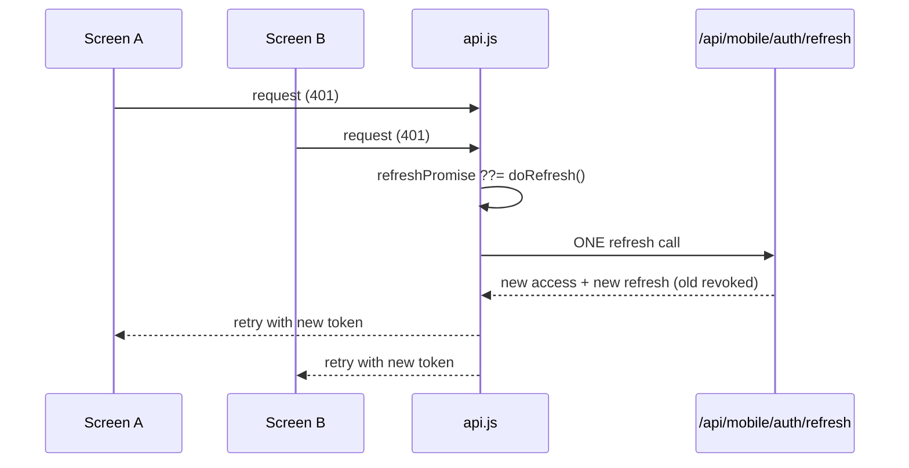

# Mobile Architecture

Expo SDK ~54, expo-router ~6. **Drivers only.** A separate app with a separate auth system, not a wrapper around the web dashboard.

## Navigation — CONFIRMED (`mobile/app/(app)/(tabs)/_layout.js`)

| Route | Label |
|---|---|
| `index` | Home |
| `trips` | Trips |
| `vehicle` | Vehicle |
| `notifications` | Alerts |
| `profile` | Profile |

Three separate documents describe these tabs differently, all wrong. → [[DOC Mobile Tabs Documented Three Ways]]

## The API client is the most carefully-written file in the mobile app — CONFIRMED

`mobile/lib/api.js`: `TIMEOUT_MS = 15000`, `MAX_RETRIES = 1`, and a **single-flight refresh promise**. From its docstring:

> *"Without this, a screen firing three requests at once on a stale token would run three refreshes; because refresh is single-use and rotating, the first would succeed and the other two would present an already-revoked token and log the driver out."*

That is a precise description of a real race. The fix — one shared in-flight refresh promise that all callers await — is the standard solution, and the comment explains *why* it's needed rather than just what it does.

→ [[Token Rotation And Refresh Races]]

## GPS tracking — CONFIRMED

**Foreground** (`mobile/lib/tracking.js`):
- `watchPositionAsync({ accuracy: Balanced, distanceInterval: 10 })` writes to a ref
- A separate interval POSTs the latest fix every **30 s** to `/api/mobile/driver/trips/${tripId}/gps`

**Background** (`mobile/lib/background-tracking.js`, added 2026-08-19): a `expo-task-manager` task (`fleetops-background-location`) posts GPS and accumulates per-leg km while the app is backgrounded during an active trip. `map.js` starts it on background via `AppState` and stops + merges km on return, so the two never overlap (no double-counted km, no duplicate posts). The foreground watcher remains the source of truth. → [[ADR-011 Background GPS Tracking]]

**Decoupling the sensor from the upload is the right shape**: position updates arrive at whatever rate the GPS produces them, but network traffic is bounded at one request per 30 s.

Background tracking **requires a custom dev build** (not Expo Go) — see the "Version warning" note below — and Android production release needs Play Store review. The old foreground-only decision is superseded: [[ADR-010 Foreground Only GPS]] → [[ADR-011 Background GPS Tracking]].

## Client-side role decoding — CONFIRMED (`mobile/lib/rbac.js`)

`decodeJwtRole()` base64url-decodes the JWT payload **without verifying the signature**. The docstring is explicit:

> *"signature verification stays server-side, so this is for reading claims, not trusting them."*

This is correct practice, correctly documented: the client decodes to decide what to *render*; the server verifies to decide what to *allow*. A forged local token changes the UI and nothing else. → [[Client Side Role Decoding Is Not Security]]

## Auth

Separate from web — 15-minute access tokens, 30-day single-use rotating refresh tokens hashed in `mobile_refresh_tokens`, audience-split. Full detail in [[Authentication]].

## Profile screens share the web driver endpoint — CONFIRMED (`mobile/app/(app)/profile/*.js`)

The profile sub-screens (personal, license, safety, vehicle) call **`/api/driver/me`** — the same endpoint as the web driver home — not `/api/mobile/driver/me`. That is deliberate: `DRIVER_VISIBLE_SECTIONS` / `DRIVER_SELF_EDITABLE_FIELDS` live in `src/lib/consent/driver-visibility.js`, and both surfaces reading one response keeps web and mobile views identical. The mobile-native endpoint only covers identity + active trip. Full scan-upload flow: [[Driver Consent]].

## Version warning — CONFIRMED

`mobile/AGENTS.md`: *"Expo HAS CHANGED — read the exact versioned docs at https://docs.expo.dev/versions/v57.0.0/ before writing any code."*

Same trap as [[Framework Version Drift]] on the web side.

**Dev-build implication:** background location ([[ADR-011 Background GPS Tracking]]) is not available in Expo Go — it needs a custom build. Since `expo prebuild --clean` on 2026-08-19, `android/` carries the background-location permissions and config, but the installed app on a device still needs a rebuild + reinstall.

## Related

[[Authentication]] · [[Tracking]] · [[Token Rotation And Refresh Races]] · [[Trips]] · [[Architecture]] · [[Driver Management]]
