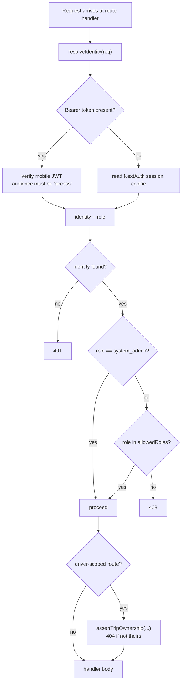

# RBAC

Role-based access control, **entirely in application code**. Six roles.

## The six roles — CONFIRMED (live `roles` table, 2026-08-11)

| id | name | Landing | Scope |
|---|---|---|---|
| 1 | `system_admin` | `/dashboard` | Everything — short-circuits the matrix |
| 2 | `fleet_manager` | `/dashboard` | Vehicles, drivers, maintenance, documents |
| 3 | `dispatcher` | `/dashboard` | The request queue: review, approve, assign, dispatch |
| 4 | `driver` | `/driver` | Own trips only |
| 7 | `management` | `/dashboard` | Read + analytics; **explicitly denied lifecycle verbs** |
| 9 | `admin` | `/dashboard` | Admin operations |

The gaps at 5, 6, 8 are the three hospitality roles removed by `022_remove_front_desk_roles.sql`.

✅ `docs/rbac-model.md` was **rewritten on 2026-08-11** — it had claimed 9 roles while self-labelling as authoritative. It now describes these six, and `scripts/verify-rbac.mjs` pins the claim: **78 checks**, run with `node --import ./scripts/route-harness-loader.mjs`. That harness is what makes the doc trustworthy rather than merely current. → [[DOC rbac-model Says 9 Roles]]

## The decision flow — CONFIRMED



## Two design choices worth keeping

### 1. Fail closed for drivers — CONFIRMED

```js
const DEFAULT_ROLES = ["system_admin", "admin", "fleet_manager", "dispatcher", "management"];
```

`driver` is **not** in the default list. A route that calls `requireAuth(req)` with no explicit roles rejects drivers. Forgetting to think about authorization produces the *safe* outcome for the untrusted role. → [[Fail Closed By Default]]

### 2. 404, not 403, for someone else's resource — CONFIRMED

`assertTripOwnership()` returns **404** when a driver requests a trip that isn't theirs — not 403.

A 403 confirms the record exists. Returning 404 makes "not yours" and "doesn't exist" indistinguishable, so a driver can't enumerate trip ids. → [[Anti Enumeration 404 vs 403]]

## Where this can go wrong

**Authorization is per-route, 113 times.** No middleware, no RLS. A new route with no `requireAuth()` call is silently public.

The 78-check harness does **not** close this. It pins the *role list* of routes it knows about; it never asserts that a given route calls a guard at all. A route added with no `requireAuth()` passes `verify-rbac` by being invisible to it. → priority 18 in [[Roadmap]]

The `system_admin` short-circuit also means that role is untestable through the matrix — it bypasses it entirely by design.

## Related

[[Authentication]] · [[employees]] · [[Why RLS Is Not A Boundary]] · [[Anti Enumeration 404 vs 403]] · [[Fail Closed By Default]] · [[Architecture]]
