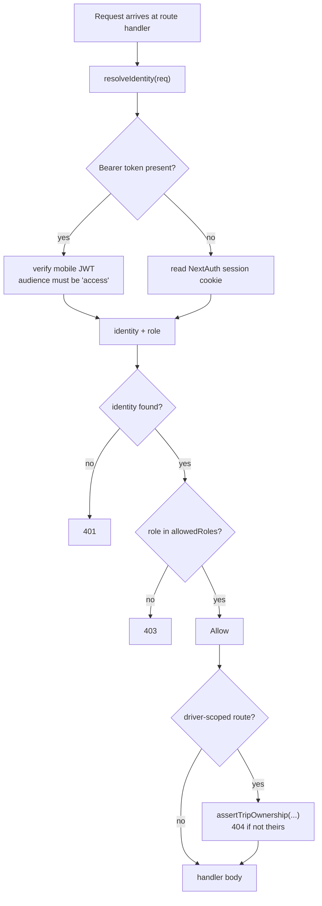

# RBAC

Role-based access control, **entirely in application code**. Six roles.

## The six roles — CONFIRMED (live `roles` table, 2026-09-01)

| id | name | Landing | Scope |
|---|---|---|---|
| 1 | `system_admin` | `/dashboard` | Everything — short-circuits the matrix |
| 2 | `fleet_manager` | `/dashboard` | Vehicles, drivers, maintenance, documents |
| 3 | `dispatcher` | `/dashboard` | The request queue: review, approve, assign, dispatch |
| 4 | `driver` | `/driver` | Own trips only |
| 7 | `management` | `/dashboard` | Read + analytics; **explicitly denied lifecycle verbs** |
| 9 | `admin` | `/dashboard` | Admin operations |

The gaps at 5, 6, 8 are the three hospitality roles removed by `028_remove_front_desk_roles.sql`.

The live table contains these six roles and 15 active accounts: 1 system admin, 1 admin, 3 fleet managers, 2 dispatchers, 7 drivers, and 1 management account. `docs/rbac-model.md` describes the same role set and now cites the actual removed-role migration filename `028`.

`scripts/verify-rbac.mjs` currently passes **72 checks**, but only exercises seven reservation/dispatch lifecycle routes. It does not prove the whole API matrix.

## The decision flow — CONFIRMED



## Two design choices worth keeping

### 1. Fail closed for drivers — CONFIRMED

```js
const DEFAULT_ROLES = ["system_admin", "admin", "fleet_manager", "dispatcher", "management"];
```

`driver` is **not** in the default list. A route that calls `requireAuth(req)` with no explicit roles rejects drivers. Forgetting to think about authorization produces the *safe* outcome for the untrusted role. → [[Fail Closed By Default]]

### 2. 404, not 403, for someone else's resource — CONFIRMED

`assertTripOwnership()` returns **404** when a driver requests a trip that isn't theirs — not 403.

A 403 confirms the record exists. Returning 404 makes "not yours" and "doesn't exist" indistinguishable, so a driver can't enumerate trip ids. → [[Anti Enumeration 404 vs 403]]

## Where this can go wrong

**Authorization is per-route across 154 route files / 218 exported HTTP methods.** No middleware and no effective RLS supplies a second boundary. A new handler with no guard is public.

`scripts/verify-route-auth.mjs` now parses each exported HTTP method (218 total), keys public exceptions by method + path, records delegated service-token handlers explicitly, and rejects bare `requireAuth(req)` on every mutating handler. It is wired as `npm run verify:auth` in CI and passes 218/218.

`scripts/verify-rbac.mjs` passes 72/72 against the live database, but its inventory is seven lifecycle routes. Its expected role lists now come from `rolesFor()` rather than a second policy copy. It remains a supplemental live check; CI runs the static route-auth audit because the live database is not available in the build job.

The `system_admin` short-circuit exists in `can()` and is mirrored by `rolesFor()` for matrix-backed API guards. `requireAuth()` itself does not short-circuit; self-service and protocol-specific routes still choose their own explicit guard.

## RBAC audit — 2026-09-01

### P0 — response data exceeds every role's need

- `GET /api/fuel`, `GET /api/fuel/[id]`, and the dispatch branch of `GET /api/ai/recommendations` serialize `row_to_json(e.*)`. The `employees` row contains `password_hash`, so authenticated callers receive password hashes alongside driver identity data.
- Replace every employee wildcard projection with an explicit safe field list and leave one response-shape test that fails if `password_hash` reappears.

### P0 — driver list routes are admitted without ownership scope

- `GET /api/trips` admits `driver` but never filters by `session.user.driverId`. The dedicated `/api/driver/trips` route explicitly documents this weakness while safely applying the filter.
- `GET /api/dispatch` admits `driver` and returns every dispatch plus full transportation-request rows. `GET /api/dispatch/[id]` correctly calls `assertDispatchOwnership`; the list route does not.
- `GET /api/vehicles` admits `driver` and returns `v.*` for the whole fleet even though `/api/driver/me` already returns the assigned vehicle.
- The smallest safe fix is to remove `driver` from the three general list routes and keep the existing driver-scoped endpoints.

### P0/P1 — driver writes trust resource ids too far

- `POST /api/fuel` forces `driver_id` to the authenticated driver but accepts client-supplied `vehicle_id` and `trip_id`. The web driver page uses this route. A driver can therefore submit against another vehicle/trip.
- `POST /api/vehicle-maintenance` admits `driver`, accepts a broad maintenance payload, and calls `syncVehicleStatus()` for any submitted vehicle. No driver UI uses this route; driver issue reporting already exists through incidents.
- Derive fuel vehicle/trip from the driver's assignment or own trip. Remove driver access from general maintenance creation; add a narrow driver maintenance-report endpoint only if the incident flow is later proven insufficient.

### P1 — role and account changes do not take effect immediately

- Web JWT sessions retain the login-time role until expiry. Disabling or demoting an employee does not invalidate an existing web session.
- Mobile refresh re-reads the role, but an issued access token remains valid for up to 15 minutes.
- Revalidate active employee status, current role, and driver link once in `resolveIdentity()` so every API route inherits immediate revocation without per-route edits. Add a versioned-token scheme only if the extra database read becomes measurable.

### P1 — privileged target protection is incomplete

- `canAssignRole()` prevents an admin from creating a system admin, but `PUT /api/settings/users` lets an admin disable or enable an existing system admin.
- `PUT /api/drivers/[id]/account` lets a fleet manager replace a linked non-driver employee's role with `driver` and reset the password.
- Reuse one target-role rule: only a system admin may mutate a system-admin account; the driver-account route must reject a linked employee whose current role is not already `driver`.

### P1/P2 — the documented matrix is not the server source of truth

- `MATRIX`, `NAV_ROLES`, page-local `useRequireRole()` lists, API `requireAuth()` arrays, workspaces, and verification scripts duplicate policy.
- Report APIs mostly use bare `requireAuth()`, which admits `dispatcher`, while `MATRIX` denies dispatcher report access and the reports pages exclude it.
- AI provider configuration/log endpoints use bare `requireAuth()` even though their only pages admit admin/system-admin. Two fuel analytics routes still name the nonexistent `finance` role.
- Export a server-safe `rolesFor(resource, action)` from the existing pure permission module and add `requirePermission(req, resource, action)`. Migrate only routes that map cleanly to the matrix; keep ownership helpers for row scope and explicit guards for self-service/machine routes.

## Implementation plan

1. **[x] Stop credential-field leakage.** Fuel list/detail and AI driver recommendations now project explicit employee identity fields; a regression test rejects wildcard employee serialization.
2. **[x] Close driver cross-tenant-style access.** General trips, dispatch, vehicles, and operator search surfaces no longer admit drivers; fuel totals and writes are driver-scoped; maintenance creation is operations-only; cross-owner fuel tests are in place.
3. **[x] Make account changes authoritative immediately.** `resolveIdentity()` revalidates the live employee/role/driver link, disabled accounts lose mobile refresh tokens, and privileged target accounts are protected.
4. **[x] Unify action permissions.** `rolesFor()` + `requirePermission()` now back cleanly mapped CRUD, lifecycle, settings, reports, fuel, AI, incident, notification, map, and account actions. Collection-wide `read_all`/`update_all` verbs preserve the driver ownership split. Self-service, row-ownership, machine-token, and internal recipient filters remain explicit by design.
5. **[x] Make omissions fail CI.** `verify-route-auth.mjs` checks every exported method, explicit exceptions, and mutating bare guards; `npm run verify:auth` runs in CI.
6. **[x] Pin high-risk behavior, not every route body.** Focused tests cover projections, fuel ownership, role derivation, stale sessions, and privileged targets; the live seven-route harness remains supplemental.
7. **[x] Clean the specification after behavior lands.** RBAC, Authentication, Security Audit, and `docs/rbac-model.md` now describe the shipped controls. RLS remains intentionally out of scope because the app still connects with elevated database identities.

## Implementation status — 2026-09-02

Shipped controls: explicit response projections (no employee wildcard/password-hash serialization), driver list denial on general fleet routes and global search, driver-owned fuel vehicle/trip checks and scoped counts, operations-only maintenance creation, live session revalidation, mobile refresh-token revocation on disable, system-admin target protection, non-driver demotion protection, matrix-derived report/AI permissions, and a method-level route-auth CI gate.

Verification: `npm run lint:ci` passed; `npm run db:check` passed (92 migration files); `npm run verify:auth` passed (218/218 methods); `node --import ./scripts/route-harness-loader.mjs scripts/verify-rbac.mjs` passed (72/72); production build passed. The retained Vitest suite passes 474/474 across 43 files with the local `--configLoader runner` workaround.

Permission centralization follow-up: every page guard now resolves its roles from
`getRequiredRolesForPath(pathname)`, and cleanly mapped API methods resolve roles
from `MATRIX` through `requirePermission()`. The matrix now names scoped collection
verbs (`read_all`, `update_all`), sensitive account/setup actions, notification and
device-token self-service, fuel request/allocation workflows, map access, AI scan /
narrative actions, and inactive-location visibility. Remaining direct checks are
ownership assertions, self-service helpers, machine-token handlers, or recipient
selection inside trusted side effects—not alternate route policy lists.

Verification for this follow-up: `npm run lint:ci` passed; `npm run db:check`
passed (92 migration files); `npm run verify:auth` passed (218/218 methods).

## Uncommitted worktree audit — 2026-09-02

The RBAC/security checkpoint currently spans 236 staged tracked paths, including
the session/MFA hardening and migrations 087–088. Only the unrelated `.claude/`
directory remains untracked and excluded from the commit. No merge, rebase, or
cherry-pick is active; no Git conflict markers were found; and `git diff --check`
exits 0. There is no project-level `test.js` to remove. Temporary implementation
tests were removed after verification; the retained suite still covers the
shipped RBAC and authentication boundaries.

Verification after the worktree audit: `npm run lint:ci`, `npm run build`,
`npm run verify:auth` (218/218), and `npm run db:check` (92 files) pass. The
retained suite runs with Vitest's `--configLoader runner` workaround at 474/474 across 43 files.
The integration-ingest fixture allows the route-resolver lookup and still
verifies that `integration_log` errors remain best-effort.

## Related

[[Authentication]] · [[employees]] · [[Why RLS Is Not A Boundary]] · [[Anti Enumeration 404 vs 403]] · [[Fail Closed By Default]] · [[Architecture]]
