```mermaid
flowchart TB
    subgraph Outside["☁️ OUTSIDE — External Systems & Actors"]
        GPSProvider["📡 GPS & Telematics Provider
            › Real-time Vehicle Location
            › Speed & Heading Data
            › Geofence Events"]
        
        MapsAPI["🗺️ Maps & Traffic API
            › Google Maps / HERE / OSRM
            › Route Optimization
            › Traffic Condition Data
            › Alternative Route Suggestions
            › Distance & ETA Calculation"]
        
        PushGateway["📱 Push Notification Gateway
            › Firebase Cloud Messaging
            › Apple APNs
            › Push Notifications
            › In-App Alerts"]
        
        AIEngine["🧠 AI & ML Engine
            › Intelligent Trip Matching
            › ETA Prediction
            › Dynamic Dispatch Optimization
            › Cost Optimization
            › Analytics & Insights"]
        
        CloudStorage["☁️ Cloud Storage
            › Fuel Receipt Images
            › Vehicle Document Uploads
            › Driver Photo Uploads
            › Report Exports"]
        
        Guest["👤 Guest / Customer
            › Transportation Request
            › Trip Feedback"]
        
        HotelStaff["🏨 Hotel Staff
            › Front Desk / Concierge
            › Create Reservations
            › Monitor Transport"]
        
        RestoStaff["🍽️ Restaurant Staff
            › Request Deliveries
            › Track Food Transport"]
        
        DriverUser["👨‍✈️ Driver (Mobile App)
            › View Dispatch Assignments
            › Update Trip Status
            › Send GPS Location
            › Upload Fuel Receipts
            › Report Incidents"]
    end

    subgraph Inside["🔒 INSIDE — Fleet & Transportation Management System"]
        subgraph IntegrationLayer["Integration Layer"]
            direction TB
            APIGateway["API Gateway
                › REST Endpoints
                › Webhook Handlers
                › Rate Limiting
                › Request Validation"]
            
            AuthGateway["Auth Gateway
                › JWT Verification
                › Session Management
                › RLS Enforcement"]
            
            IntLog["Integration Log
                › Inbound Events
                › Outbound Events
                › Error Tracking
                › Retry Logic"]
        end

        subgraph Module1["🚗 MODULE 1: Fleet & Vehicle Management"]
            M1A["Vehicle Registration
                › Add/Edit Vehicle Info
                › Plate Number Assignment
                › Category Assignment"]
            
            M1B["Vehicle Documents
                › OR/CR Storage
                › Insurance Tracking
                › Registration Expiry
                › Document Alerts"]
            
            M1C["Vehicle Status
                › Availability Tracking
                › Status Monitoring
                › Real-time Updates"]
            
            M1D["Maintenance & Inspection
                › Schedule Maintenance
                › Inspection Checklists
                › Service History
                › Recurring Services"]
            
            M1E["Assignment History
                › Vehicle-Driver Logs
                › Usage Reports"]
        end

        subgraph Module2["📅 MODULE 2: Vehicle Reservation & Dispatch"]
            M2A["Reservation Management
                › Request Creation
                › Calendar View
                › Approval Workflow
                › Cancellation & Reschedule"]
            
            M2B["AI Trip Matching
                › Intelligent Vehicle Match
                › Driver Allocation
                › AI ETA Prediction"]
            
            M2C["Dispatch Board
                › Dispatch Assignment
                › Vehicle Assignment
                › Dynamic Optimization
                › Real-time Updates"]
        end

        subgraph Module3["👨‍✈️ MODULE 3: Driver & Trip Performance"]
            M3A["Driver Management
                › Registration & Profile
                › License Tracking
                › Availability Monitoring
                › Face Recognition Attendance"]
            
            M3B["Trip Management
                › Trip Assignment
                › History Tracking
                › Status Monitoring
                › Completion Verification"]
            
            M3C["Performance & Incidents
                › Performance Assessment
                › Incident Reporting
                › Score Calculation"]
        end

        subgraph Module4["⛽ MODULE 4: Fuel Management"]
            M4A["Fuel Allocation
                › Allocation Management
                › Request Approval
                › Receipt Upload"]
            
            M4B["Fuel Analytics
                › Cost Monitoring
                › Consumption Analysis
                › Usage Reports"]
        end

        subgraph Module5["💰 MODULE 5: Transport Cost & Optimization"]
            M5A["Cost Tracking
                › Expense Recording
                › Cost Per Trip Analysis
                › Vehicle Operating Cost"]
            
            M5B["Cost Dashboard
                › Fleet Cost Overview
                › Optimization Recommendations
                › AI Cost Insights"]
        end

        subgraph Module6["🗺️ MODULE 6: Route Planning & GPS"]
            M6A["Route Management
                › Route Assessment
                › Route Scheduling
                › Alternative Suggestions"]
            
            M6B["GPS Tracking
                › Real-time Vehicle Tracking
                › Traffic Monitoring
                › Route History Playback"]
        end

        subgraph Module7["📊 MODULE 7: Reports & Analytics"]
            M7A["Report Generator
                › Fleet Utilization
                › Reservation Reports
                › Driver Performance
                › Fuel Consumption
                › Maintenance Reports
                › Cost Analysis"]
            
            M7B["AI Analytics
                › AI Dashboard
                › Predictive Insights
                › Trend Analysis"]
        end

        subgraph Module8["📱 MODULE 8: Mobile Fleet App"]
            M8A["Mobile Features
                › Secure Login
                › Mobile Dashboard
                › Reservation View
                › Vehicle Monitoring
                › GPS Tracking
                › Trip Updates
                › Fuel Receipt Upload
                › Push Notifications"]
        end

        subgraph Module9["🔐 MODULE 9: User & Security Management"]
            M9A["User Management
                › Registration
                › Authentication
                › RBAC
                › Profile Management"]
            
            M9B["Audit & Security
                › Activity Logs
                › Audit Trail
                › Security Monitoring"]
        end

        subgraph DataStore["💾 Data Layer"]
            DB[("Supabase PostgreSQL
                ─────────────────
                22 Tables
                Row Level Security
                Real-time Subscriptions")]
        end
    end

    %% Outside → Inside Connections
    GPSProvider -->|"GPS Coordinates"| M6B
    MapsAPI -->|"Route/Traffic Data"| M6A
    MapsAPI -->|"ETA Data"| M2B
    
    PushGateway -->|"Push Notifications"| M8A
    PushGateway -->|"Alerts"| Guest
    PushGateway -->|"Notifications"| HotelStaff
    PushGateway -->|"Notifications"| RestoStaff
    
    AIEngine -->|"Trip Matching"| M2B
    AIEngine -->|"ETA Prediction"| M2B
    AIEngine -->|"Dispatch Optimization"| M2C
    AIEngine -->|"Cost Optimization"| M5B
    AIEngine -->|"Analytics"| M7B
    
    CloudStorage -->|"Receipt Images"| M4A
    CloudStorage -->|"Document Files"| M1B
    CloudStorage -->|"Report Exports"| M7A
    
    Guest -->|"Transport Request"| HotelStaff
    Guest -->|"Transport Request"| RestoStaff
    
    HotelStaff -->|"Create Reservation"| M2A
    RestoStaff -->|"Request Delivery"| M2A
    
    DriverUser -->|"Login/Auth"| M9A
    DriverUser -->|"GPS Location"| M6B
    DriverUser -->|"Trip Status"| M3B
    DriverUser -->|"Fuel Receipt"| M4A
    DriverUser -->|"Incident Report"| M3C
    DriverUser -->|"View Dispatch"| M2C

    %% Inside → Database
    M1A --> DB
    M1B --> DB
    M1C --> DB
    M1D --> DB
    M1E --> DB
    M2A --> DB
    M2B --> DB
    M2C --> DB
    M3A --> DB
    M3B --> DB
    M3C --> DB
    M4A --> DB
    M4B --> DB
    M5A --> DB
    M5B --> DB
    M6A --> DB
    M6B --> DB
    M7A --> DB
    M7B --> DB
    M9A --> DB
    M9B --> DB
    IntLog --> DB

    %% Inside → Inside Flow
    M1C -->|"Vehicle Status"| M2C
    M1D -->|"Service Alerts"| M7A
    M2A -->|"Approved"| M2C
    M2C -->|"Dispatch Info"| M3B
    M2C -->|"Assignment"| M8A
    M3B -->|"Trip Completed"| M4B
    M3B -->|"Trip Data"| M5A
    M3B -->|"Trip Data"| M7A
    M3B -->|"Performance"| M3C
    M3C -->|"Score"| M3A
    M4A -->|"Fuel Record"| M4B
    M4B -->|"Consumption"| M5A
    M5A -->|"Cost Data"| M5B
    M5B -->|"Insights"| M7B
    M6A -->|"Route Plan"| M2C
    M6B -->|"Location Data"| M6A
    M7A -->|"Reports"| M7B
    M7B -->|"Alerts"| M8A
    M9B -->|"Audit Trail"| DB

    %% Styling
    classDef outside fill:#e1f5fe,stroke:#0288d1,stroke-width:2px,color:#01579b
    classDef module1 fill:#e8eaf6,stroke:#3f51b5,stroke-width:2px,color:#1a237e
    classDef module2 fill:#f3e5f5,stroke:#7b1fa2,stroke-width:2px,color:#4a148c
    classDef module3 fill:#e0f2f1,stroke:#00796b,stroke-width:2px,color:#004d40
    classDef module4 fill:#fff3e0,stroke:#f57c00,stroke-width:2px,color:#e65100
    classDef module5 fill:#fce4ec,stroke:#c62828,stroke-width:2px,color:#b71c1c
    classDef module6 fill:#e8f5e9,stroke:#388e3c,stroke-width:2px,color:#1b5e20
    classDef module7 fill:#ede7f6,stroke:#4527a0,stroke-width:2px,color:#311b92
    classDef module8 fill:#fff8e1,stroke:#f9a825,stroke-width:2px,color:#f57f17
    classDef module9 fill:#efebe9,stroke:#5d4037,stroke-width:2px,color:#3e2723
    classDef datastore fill:#f5f5f5,stroke:#616161,stroke-width:3px,color:#212121
    classDef integration fill:#ffebee,stroke:#d32f2f,stroke-width:2px,color:#b71c1c

    class GPSProvider,MapsAPI,PushGateway,AIEngine,CloudStorage,Guest,HotelStaff,RestoStaff,DriverUser outside
    class M1A,M1B,M1C,M1D,M1E module1
    class M2A,M2B,M2C module2
    class M3A,M3B,M3C module3
    class M4A,M4B module4
    class M5A,M5B module5
    class M6A,M6B module6
    class M7A,M7B module7
    class M8A module8
    class M9A,M9B module9
    class DB datastore
    class APIGateway,AuthGateway,IntLog integration
```

# Business Process Architecture — Level 2

## Fleet & Transportation Management System — Inside & Outside Connections

---

## WBS to Existing Database — Alignment Analysis

| # | WBS Module | DB Support | Status |
|---|-----------|-----------|--------|
| 1 | **Fleet & Vehicle Management** | `vehicles` (with `documents` JSONB), `vehiclecategories`, `vehiclemaintenance` | ✅ **Aligned** |
| 2 | **Vehicle Reservation & Dispatch** | `vehiclereservations`, `dispatchschedules`, `ai_recommendations` | ✅ **Aligned** |
| 3 | **Driver & Trip Performance** | `drivers` (+ `face_image_url`), `driverattendance` (+ face fields), `trips`, `tripperformance` | ✅ **Aligned** |
| 4 | **Fuel Management** | `fuelrecords` | ⚠️ **Simplified** (no separate allocations/requests — direct recording) |
| 5 | **Transport Cost & Optimization** | `tripcostanalysis`, `ai_recommendations` | ✅ **Aligned** |
| 6 | **Route Planning & GPS** | `routes`, `gpstracking` | ⚠️ **Partial** (no real-time traffic) |
| 7 | **Reports & Analytics** | `ai_insights`, all operational tables | ✅ **Aligned** |
| 8 | **Mobile Fleet App** | `notifications`, all API-accessible tables | ✅ **Aligned** |
| 9 | **User & Security Management** | `auth.users`, `employees`, `roles`, `audit_logs` | ✅ **Aligned** |

### Module 3 — Updated: Face Recognition Attendance

| WBS Feature | Implementation |
|-------------|---------------|
| Driver Registration & Profile | `drivers` + `employees` tables |
| Driver Availability | `driver_status` field on `drivers` |
| **Face Recognition Attendance (NEW)** | `driverattendance` table with `face_capture_url`, `face_confidence`, `face_verified` |
| Trip Management | `trips`, `dispatchschedules` tables |
| Driver Performance | `tripperformance` table |
| Score Calculation | Computed from trip + performance data |

### Module 4 — Simplified (No Pre-Approval)

Fuel management skips separate allocation/request tables. Fuel is recorded directly via `fuelrecords` with receipt upload and cost tracking. Consumption analysis is computed on demand.

### Module 6 — Partial

| WBS Feature | Current State |
|-------------|--------------|
| Route Assessment & Scheduling | ✅ `routes` + `dispatchschedules` |
| GPS Vehicle Tracking | ✅ `gpstracking` table |
| Traffic Condition Monitoring | ⏳ App-level (integrate Google Maps / HERE API) |
| Alternative Route Suggestions | ⏳ App-level (routing API) |

---

## Summary

- **8 of 9 modules** are fully aligned
- **Module 4** intentionally simplified (fuel allocations/requests deemed unnecessary for v1 — direct recording only)
- **Module 6** partial is at the **application layer** (API integration), not database — no schema changes needed
- **Total: 23 tables** after migration 006
